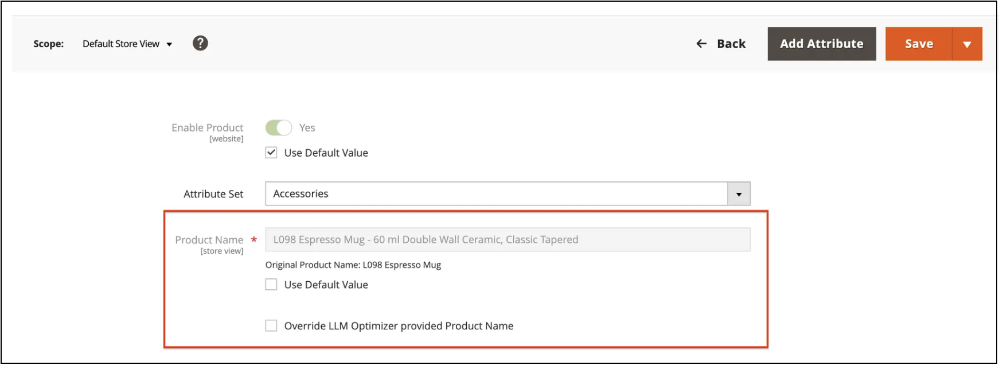

# [!DNL Adobe LLM Optimizer]と[!DNL Adobe Commerce]を使用

>[!IMPORTANT]
>
>この統合へのアクセスは制限されています。 詳しくは、テクニカルアカウントマネージャーにお問い合わせください。

[CommerceをLLM Optimizer](connect-to-llmo.md)に接続した後、主に&#x200B;**[!DNL Adobe LLM Optimizer]** UIで作業し、準備ができたら商談をレビューし、承認済みの変更をカタログにプッシュします。 この記事では、2つのCommerceに焦点を当てた最適化タイプ、**[!UICONTROL Opportunities]**&#x200B;の使用方法、[!DNL Adobe Commerce]でのデプロイアクションの動作、および外部アップデートとLLM Optimizerの提案との相互作用について説明します。 統合の全体像については、[統合の概要](../overview.md)を参照してください。

## LLM OptimizerにおけるCommerceの最適化について {#understand-optimizations}

Commerceに基づくカタログの場合、LLM Optimizerでは&#x200B;**[!UICONTROL Product Detail Page Enrichment]**&#x200B;と&#x200B;**[!UICONTROL Product Catalog Enrichment]**&#x200B;が提供されます。

| 焦点 | What it is for |
| --- | --- |
| **[!UICONTROL Product Detail Page Enrichment]** （PDP エンリッチメント） | ストアフロントのレイアウトを置き換えることなく、AIを活用した発見のために商品ページの読み取り方法を改善する提案。 |
| **[!UICONTROL Product Catalog Enrichment]** | お客様がレビューし、必要に応じて編集し、Commerce カタログに適用できる特定の製品の&#x200B;**製品名**&#x200B;および&#x200B;**製品説明**&#x200B;の更新を提案しました。 |

**[!UICONTROL Opportunities]**&#x200B;を使用して製品またはURLのリストを開き、選択したタイプの候補を操作します。

## Commerceの活用方法 {#navigate-commerce-opportunities}

**Commerce関連の商談を開くには：**

1. 左側のパネルで、**[!UICONTROL Opportunities]**&#x200B;をクリックします。
1. **[!UICONTROL Commerce Opportunity]**&#x200B;をクリックして、[!DNL Adobe Commerce] カタログをターゲットとする最適化タイプを表示します。
1. 作業する内容に応じて、**[!UICONTROL Product Catalog Enrichment]**&#x200B;または&#x200B;**[!UICONTROL Product Detail Page Enrichment]**&#x200B;を選択します。

### 商談指標の理解 {#opportunity-metrics}

各商談のビューでは、影響を要約し、作業の優先順位を決めることができます。

- **製品ページ**&#x200B;または&#x200B;**URL**：その最適化タイプに対して評価されたページまたは製品。
- **エージェンティックトラフィック**:AI エージェントによって開始された訪問とインタラクション。最初に影響の大きい機会を優先するのに役立ちます。

### 提案の状態について {#suggestion-states}

両方のエンリッチメントタイプで同じワークフロービューを使用します。

- **[!UICONTROL Current Suggestions]**：レビューする新しい項目またはアクティブな項目。
- **[!UICONTROL Fixed Suggestions]**：既にデプロイまたは解決済みの項目。
- **[!UICONTROL Ignored Suggestions]**: アクションから意図的に除外した項目。

### PDP エンリッチメントのレビューとデプロイ {#review-deploy-pdp}

PDP エンリッチメントは、AIを活用した発見でより明確な製品ページメッセージを求める一方で、マーチャンダイジング担当者が設計したストアフロント体験を維持したいチームに最適です。

**PDP エンリッチメントのレビューとデプロイ：**

1. **[!UICONTROL Opportunities]**&#x200B;から&#x200B;**[!UICONTROL Product Detail Page Enrichment]**&#x200B;を開きます。
1. **[!UICONTROL URLs with Suggestions]** テーブルで、**[!UICONTROL Current Suggestions]**&#x200B;を選択します。
1. URLまたはSKUの場合は、**[!UICONTROL Preview]**&#x200B;をクリックしてAI分析と提案されたエンリッチメントを確認します。
1. オプション：**[!UICONTROL Copy]**&#x200B;をクリックしてコンテンツを外部エディターに貼り付けるか、**[!UICONTROL Edit suggestion]**&#x200B;をクリックして編集します。
1. オプション：提案が戦略と一致しない場合は、**[!UICONTROL Ignored Suggestions]**&#x200B;に移動します。
1. レビューと承認が完了したら、更新するURLまたはSKUの行を選択し、**[!UICONTROL Deploy optimizations]**&#x200B;をクリックして確認します。

デプロイメント後、推奨事項はLLM Optimizerの最適化ステータスで&#x200B;**[!UICONTROL Fixed Suggestions]**&#x200B;に移動します。

>[!NOTE]
>
>PDP エンリッチメントのデプロイメントを完了するには、LLM OptimizerのEdge **オンボーディングで**&#x200B;最適化を完了する必要があります。 オンボーディングが不完全な場合、UIはデプロイメントの前にセットアップを完了するよう求めるメッセージを表示します。

### 製品カタログのエンリッチメントのレビューと導入 {#review-deploy-catalog}

カタログのエンリッチメントは、Commerceで商品名と長い説明文を直接厳密に定義したいチーム向けであり、何かを保存する前にレビューすることをお勧めします。

**製品カタログのエンリッチメントを確認してデプロイするには：**

1. **[!UICONTROL Opportunities]**&#x200B;から&#x200B;**[!UICONTROL Product Catalog Enrichment]**&#x200B;を開きます。
1. **[!UICONTROL URLs with Suggestions]** テーブルで、**[!UICONTROL Current Suggestions]**&#x200B;を選択します。
1. URLまたはSKU行の展開コントロールをクリックして、提案された&#x200B;**製品名**&#x200B;と&#x200B;**製品説明**&#x200B;の更新を表示します。
1. オプション：デプロイする前に、編集アイコンをクリックして、提案された名前または説明を調整します。
1. オプション：提案が戦略と一致しない場合は、**[!UICONTROL Ignored Suggestions]**&#x200B;に移動します。
1. レビューと承認が完了したら、更新するURLまたはSKUの行を選択し、**[!UICONTROL Deploy optimizations]**&#x200B;をクリックして確認します。

承認された名前と説明の変更は、他の製品の更新と同様に、[!DNL Adobe Commerce] カタログに保存されます。

>[!IMPORTANT]
>
>デプロイを実稼動カタログの変更として扱います。 通常の変更管理、ステージング、QAのプラクティスを使用します。 マーチャンダイジングとSEOの関係者が最終版に同意した後にのみ展開します。

デプロイメント後、提案は&#x200B;**適用済み**&#x200B;のステータスで&#x200B;**[!UICONTROL Fixed Suggestions]**&#x200B;に移動します。

## Commerce Adminで更新を確認する {#verify-in-admin}

**デプロイされたカタログのエンリッチメントを確認するには：**

1. [!DNL Adobe Commerce] **管理者**&#x200B;にログインします。
1. **[!UICONTROL Catalog]** > **[!UICONTROL Products]**&#x200B;に移動します。
1. 必要に応じてフィルターと&#x200B;**ストアビュー** セレクター（例：**[!UICONTROL Default Store View]**）を使用し、**SKU**&#x200B;を検索します。
1. 製品を編集モードで開きます。

   製品フォームには、エンリッチされた&#x200B;**製品名**&#x200B;が表示されます。

   

1. オプション：代わりに手動で入力した名前を保持する場合は、**[!UICONTROL Override LLM Optimizer provided Product Name]**&#x200B;を選択します。

手動による上書きは、商談がカタログとの同期を維持する方法に影響します。管理者](#manual-override-in-the-admin)の[手動による上書きを参照してください。

1. 「**[!UICONTROL Content]**」セクションを展開し、**説明** フィールドを見つけます。

   説明の変更をデプロイすると、強化された説明が表示されます。

   

1. オプション：代わりに手動で入力した説明を保持する場合は、**[!UICONTROL Override LLM Optimizer provided Description]**&#x200B;を選択します。

## ストアフロントで更新を確認する {#verify-storefront}

ストアフロントでSKUを検索し、PDPを開きます。 **name**&#x200B;と、長い&#x200B;**description**&#x200B;が表示されている地域が、承認済みの内容を反映していることを確認します。 ロールアウトに関連する、同じカタログ属性を使用するダウンストリームチャネルも確認します。

<!--
## PDP enrichment rollback {#pdp-rollback}

If your project includes PDP enrichment opportunities, **rollback** behavior may support **bulk** or **per-URL** actions, depending on your LLM Optimizer release. Follow the in-product options for rollback. For **[!UICONTROL Product Catalog Enrichment]**, undoing a name or description in Commerce is effectively a new catalog edit or a follow-up opportunity, not a separate undo control in the Admin unless your team implements one.
-->

## 上書き、取り込み、古い商談 {#overrides-ingestion}

LLM Optimizerが製品の名前や説明を更新すると、REST API呼び出し、CSV読み込み、PIM フィードなどの他の取り込みシステムが、同じフィールドを変更する場合があります。 次の節では、この場合の処理について説明します。

### 取り込みでは、元のカタログ値が再度送信されます

外部プロセスが元の名前または説明（LLM Optimizerのデプロイ前に存在していた値）を書き込んだ場合、Commerceは引き続き、統合ルールに従って、そのフィールドのLLM Optimizer デプロイ値を尊重します。 商談は、その取り込みだけでは自動的に戻らない場合があります。

### 取り込みは新しい値を送信します

外部プロセスで、LLM Optimizer以前のテキストの繰り返しではない新しい値（例えば、「赤い靴」を「象徴的な赤い靴」に変更）が送信された場合、その新しいカタログ値は尊重され、関連するLLM Optimizerの商談は、通常、LLM Optimizerで&#x200B;*古い*&#x200B;とマークされます。これは、ライブカタログが候補コンテキストと一致しないためです。

### 管理者の手動オーバーライド {#manual-override-in-the-admin}

[!DNL Adobe Commerce] *管理者*&#x200B;で製品名または説明を手動で編集する場合：

- *管理者*&#x200B;の値は、その手動変更の記録システムとして勝ちます。
- LLM Optimizerの商談は&#x200B;*古い*&#x200B;とマークされています。
- LLM Optimizerでは、UIがそのオポチュニティの元のステートに戻るので、分析が再度実行された場合は、ベースラインを変更したり、新しい提案を受け入れたりできます。

これらのルールは、複数のチャネルが同じSKUにアクセスする場合に、LLM Optimizer、取り込みフィード、または&#x200B;*管理者*&#x200B;の編集が権限を持つかどうかを判断するのに役立ちます。

## ベストプラクティス

- PIMまたはフィード ジョブが意図せずLLM Optimizerの想定と競合しないように、製品名と説明の&#x200B;**Document system ownership**&#x200B;を使用します。
- **タイトルや説明を一括でデプロイする前に、SEOおよびブランドチーム**&#x200B;と調整します。
- 主要なカタログのインポート後に&#x200B;**再同期**&#x200B;または&#x200B;**再分析**&#x200B;して、商談が現在のカタログ状態を反映するようにします。

## デモでやってみましょう

Frescopaのデモ環境を使用すると、両方のCommerceの商談タイプを実際に確認できます。

- [製品カタログの強化のデモを見る](https://play.llmo.now/org/demo-org/opportunities/commerce-product-catalog-enrichment/e5f2a854-7477-421c-820f-74d5dd595647?siteId=9ae8877a-bbf3-407d-9adb-d6a72ce3c5e3)
- [製品詳細ページの強化のデモを表示](https://play.llmo.now/org/demo-org/opportunities/commerce-product-page-enrichment/4e8b0428-0893-4864-a00e-fc1d77fb3372?siteId=9ae8877a-bbf3-407d-9adb-d6a72ce3c5e3)

## 関連トピック

- [Adobe CommerceとLLM Optimizerの連携](connect-to-llmo.md)
- [統合の概要](../overview.md)
- [統合の制限と境界](../boundaries-limits.md)
