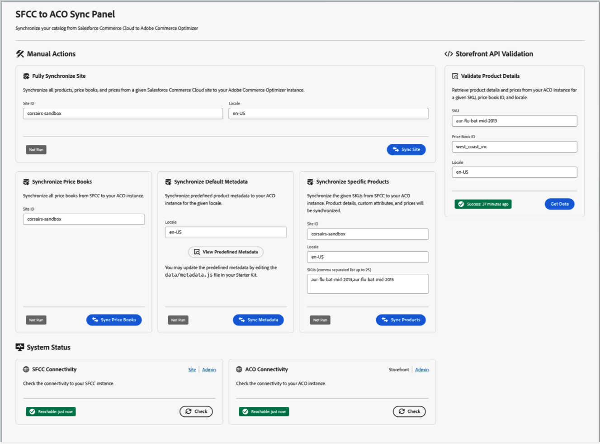

# Adobe Commerce Optimizer用Salesforce Commerce コネクタ

Adobe App Builder テクノロジーに基づいて構築された [!DNL Commerce Optimizer Salesforce Commerce Connector] は、Salesforce Commerce Cloud B2C から [!DNL Adobe Commerce Optimizer] へのカタログデータのシームレスな転送および管理を可能にします。 プラットフォームを再構築することなく、製品情報、価格、更新を同期させて、両方のプラットフォームを橋渡しします。

標準で、信頼性の高いデータ同期機能と、ビジネスニーズに合わせてワークフローをカスタマイズする柔軟性を提供します。

ビデオチュートリアルシリーズのエンドツーエンドについては、[Salesforce Commerce Cloud スターターキットの詳細 &#x200B;](https://experienceleague.adobe.com/ja/docs/commerce-learn/tutorials/adobe-commerce-optimizer/sfcc-starter-kit/overview) を参照してください。

## 主な機能

* **カタログデータの同期：** バリエーション、価格台帳、構造などの製品データをSalesforce Commerce B2C からAdobe Commerce Optimizerにプッシュして、ストアフロントやエクスペリエンス駆動型アプリケーションを最新の状態に保ちます。
* **価格同期：** Salesforce Commerce B2C から価格データを直接読み込んで管理します。
* **複数のデータタイプをサポートします。** 製品、価格およびカタログ構造を同期して、複雑なマーチャンダイジング設定を反映させます。

* **柔軟な同期ワークフロー**
   * **スケジュールされた同期：** Cron ジョブスケジュールを使用して更新を自動化。手動で行う必要はありません。
   * **オンデマンド更新：** 緊急の変更、修正、製品発売に対して、SKU レベルの更新を即座にトリガーします。

* **拡張機能向けに構築**
   * カスタムの [Salesforce Commerce B2C API](https://developer.salesforce.com/docs/commerce/commerce-api/guide/get-started.html) （SCAPI）エンドポイントを使用して互換性を確保し、独自のユースケースや高度なユースケースに簡単に対応できます。
   * カタログおよび価格の同期を使用してビジネスの開始に合わせて拡張してから、ワークフローを拡張して追加の統合やビジネスロジックをサポートします。
   * コア統合を再構築することなく、ワークフローを設定し進化させます。

>[!NOTE]
>
>コネクタは、Salesforce Commerce Cloud B2C 専用に設計されています。 異なるテクノロジースタック上に構築されているSalesforce B2B または D2C 製品はサポートしていません。

## Salesforce Connector のメリットは誰ですか？

[!DNL Salesforce Commerce Connector] は、次の場合に最適です。

* **Salesforce Commerce Cloud B2C の既存のお客様** ストアフロント機能の強化
* **マルチブランド組織** 複数のストアフロントで高度なマーチャンダイジングとパーソナライゼーション機能が必要
* **AdobeのEdge Delivery Servicesを利用してストアフロント体験を高速化し、パフォーマンスの向上を求める企業**
* **複雑な価格体系を持つ企業** 高度な価格台帳と地域固有の価格設定を同期化
* **AEMのお客様** Edge Delivery ServicesでAdobe Commerce ストアフロントを使用しながら、Salesforce Commerce B2C の製品カタログを管理しています
* **マルチロケール要件を持つ小売業者** 市場や言語をまたいでローカライズされた製品情報を同期

## ユースケース

このコネクタは、次のようないくつかの主要なユースケースをサポートしています。

### カタログデータの取り込みとストアフロントの表示

この主な使用例では、Salesforce Commerce B2C からAdobe Commerce ストアフロントへのデータフロー全体を示します。

1. **カタログの初回取り込み：** バリアント付きのシンプルな商品、価格台帳、価格情報を含む、Salesforce Commerce カタログ全体を一括で読み込みます。
1. **差分の自動更新：** 製品の更新をSalesforce Commerce カタログ管理 UI から [!DNL Commerce Optimizer] に自動的に同期します。
1. **ストアフロント統合：** ストアフロント API を使用して、Adobe Commerce Edge Delivery サービスのストアフロントに同期されたカタログデータ [!DNL Commerce Optimizer] 表示します。
1. **リアルタイムの更新：** Salesforceで変更を加えた後、更新された商品情報（名前、価格、説明）をストアフロントですぐに表示します。

### マルチロケール製品の管理

Salesforce Commerce B2C ローカライゼーション機能の活用：

* 様々なロケールに対応する、Salesforce Commerce B2C のローカライズ版の製品テキストフィールド（名前、説明）を同期します。
* Salesforce ロケールの概念 1:1 を [!DNL Commerce Optimizer] ロケールにマッピングします。
* 異なるローカライゼーションに対して複数の製品取り込みサイクルをサポートします。
* グローバル製品カタログ間の一貫性を維持します。

## アーキテクチャとコンポーネント

この [!DNL SFCC Connector] は、Salesforce Commerce B2C インスタンスと [!DNL Commerce Optimizer] の間に堅牢な統合レイヤーを提供します。 コネクタは、カタログデータ、価格台帳、製品情報を転送する一連の同期アクションを通じて動作します。

1. **データ抽出** - Salesforce Commerce B2C インスタンスで認証を行い、カスタム SCAPI API を使用してカタログデータを抽出します。
1. **データ変換** -[!DNL Commerce Optimizer] のデータモデルおよびスキーマ要件に合わせて製品データを変換します。
1. **Data Ingestion** - ACO TypeScript SDKを使用して、変換されたデータを [!DNL Commerce Optimizer] に安全に転送します。
1. **ストアフロント統合** - ストアフロントエクスペリエンスの [!DNL Commerce Optimizer] API を使用して、同期されたデータを使用できるようになります。

次の図は、統合の大まかなデータフローを示しています。

{zoomable="yes"}

### 主要コンポーネント

[!DNL Commerce Optimizer SFCC Connector] は、次のいくつかの主要コンポーネントで構成されます。

* **ACO SFCC スターターキット App Builder アプリケーション** - SFCC とAdobe Commerce Optimizerの間のデータ同期を処理するサーバーレス関数を提供します。
* **カスタム SFCC カートリッジ** - データ抽出に必要な API を使用してSalesforce Commerce Cloud インスタンスを拡張する必要なカートリッジ。
* **管理 UI** – 同期ステータスの監視とコネクタ操作の管理を行う web インターフェイス。

### 同期プロセス

コネクターは複数の同期モードをサポートしています。

| 同期モード | 説明 |
|-----------|-------------|
| **完全なサイト同期** | 設定済みのSalesforce Commerce Cloud サイトとロケールのすべての製品、価格台帳、価格を包括的に同期します。 これには以下が含まれます <ul><li>製品のメタデータと属性</li><li>カタログの構造とカテゴリ</li><li>価格帳簿</li><li>価格情報</li><li>マルチロケール製品データ</li></ul> |
| **差分同期** | 前回の同期以降にSalesforceの商品と価格データに加えられた変更のみを取得して同期し、効率的でタイムリーな更新を確保します。  差分同期は、データの鮮度を維持するために、スケジュールに従って自動的に実行されます（デフォルトは 1 時間ごと）。 |
| **ターゲット同期オプション** | 次のようなきめ細かい同期機能を提供します。 <ul><li>**価格台帳同期** 価格台帳情報のみを同期します</li><li>**メタデータ同期** 製品のメタデータと属性定義を更新</li><li>**特定の製品同期** SKU 別に個々の製品を同期します</li></ul> |

## 重要な考慮事項

実装を計画する際には、次の重要な要因を考慮します。

### データマッピングと属性

* **検索可能な属性：** Salesforce Commerce B2C は、UI を通じて検索可能な属性を設定しますが、これは API では公開されません。 Adobe Commerce Optimizerで検索可能なこれらの属性を手動で設定するには、[[!DNL Catalog Data Ingestion metadata APIs]](https://developer.adobe.com/commerce/services/optimizer/data-ingestion/#metadata) を使用します。
* **属性マッピング：** ビジネス要件に基づいて、Salesforce Commerce B2C 製品属性のマッピングを [!DNL Commerce Optimizer] メタデータに計画します。
* **デフォルトの検索可能なフィールド：** コネクタにより、コア属性（`name`、`description`、`ID`）がデフォルトで自動的に検索可能になります。

### 同期範囲

* **サイトの選択：** Salesforce Commerce B2C には、カタログが接続するサイトの概念があります。 完全同期の際に、同期するSalesforce サイトを選択します。
* **ロケール管理：** Salesforce Commerceの各ロケールが、[!DNL Commerce Optimizer] の個別の製品取り込みサイクルになります。
* **データ量：** 実装を計画する際には、カタログのサイズと同期の頻度を考慮してください。

## 監視と管理

インストールと設定が完了すると、[!DNL Commerce Optimizer SFCC Connector] は [!DNL SFCC to ACO Sync Panel] の機能を使用した包括的な監視および管理機能を提供します。

{width="700" zoomable="yes"}

このインターフェイスの URL は、[!DNL Commerce Optimizer SFCC Connector Starter Kit] をApp Builder プロジェクトにデプロイした後に指定されます。

主な機能は次のとおりです。

* **同期ステータストラッキング：** すべての同期操作のステータスとタイムスタンプを監視します。
* **接続の検証：** Salesforce Commerce CloudとAdobe Commerce Optimizerの両方への接続をテストします。
* **製品データの検証：** 同期された製品データがストアフロントに正しく表示されることを確認します。
* **エラーログとトラブルシューティング：** トラブルシューティングのエラーログには、App Builder CLI からアクセスできます。
* **状態管理：** 同期の進行状況を追跡し、ビルトインの状態管理との競合を防ぎます。

## Sourceのコードと開発のリソース

この [!DNL Commerce Optimizer SFCC Connector] はオープンソースで、カスタマイズできます。 主なリポジトリーには、次のものが含まれます。

* **[ACO SFCC スターターキット &#x200B;](https://github.com/adobe-commerce/aco-sfcc-starter-kit)** - メインコネクタアプリケーションとドキュメント。
* **[ACO SFCC カートリッジ &#x200B;](https://github.com/adobe-commerce/aco-sfcc-cartridges)** - API 統合に必要な SFCC カートリッジ。
* **[ACO TypeScript SDK](https://github.com/adobe-commerce/aco-ts-sdk)** - Adobe Commerce Optimizer統合のSDK。

これらのリポジトリは、完全なソースコード、詳細なドキュメント、およびコネクタの実装とカスタマイズの例を提供します。

## 次の手順

Salesforce Commerce Cloud データをAdobe Commerce Optimizerと統合する準備はできていますか？ まず、[ACO SFCC スターターキットリポジトリ &#x200B;](https://github.com/adobe-commerce/aco-sfcc-starter-kit) の詳細な実装ガイドを確認し、必要な前提条件が整っていることを確認します。
