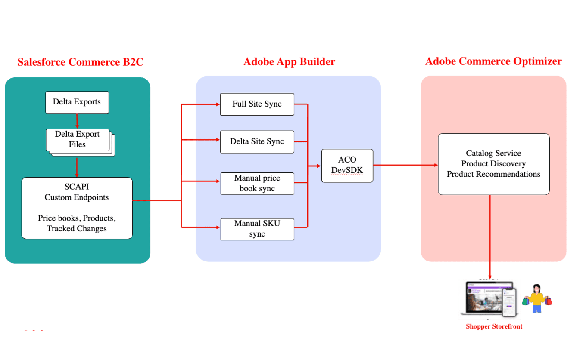
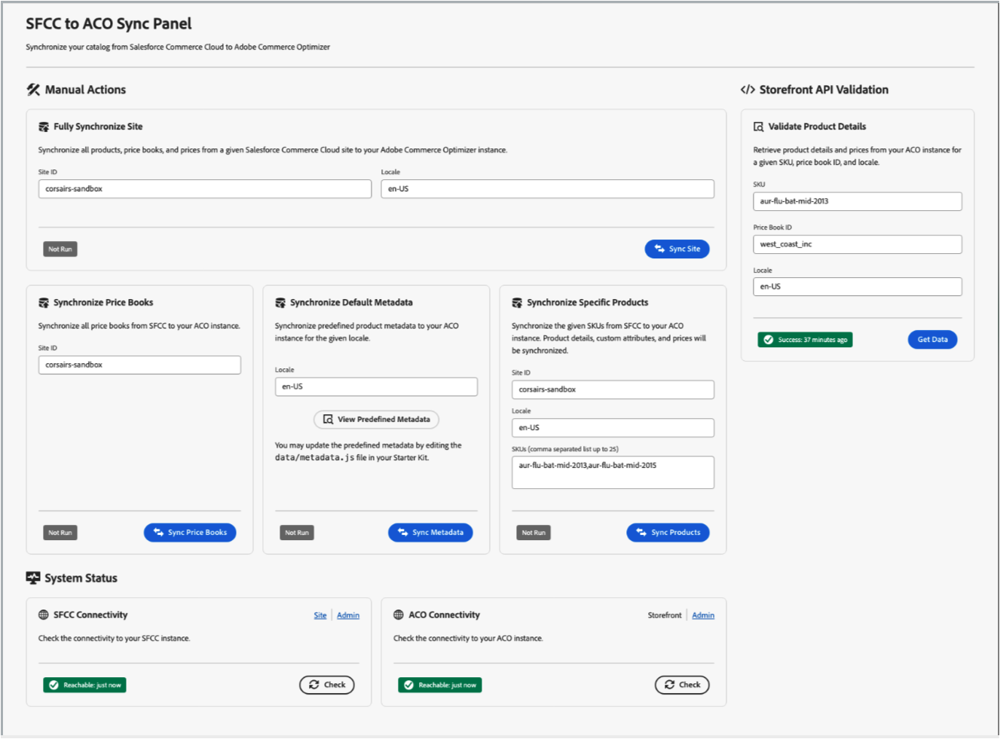

# [!DNL Adobe Commerce Optimizer]用Salesforce Commerce コネクタ

Adobe App Builder テクノロジに基づいて構築された[!DNL Commerce Optimizer Salesforce Commerce Connector]を使用すると、Salesforce Commerce Cloud B2Cから[!DNL Adobe Commerce Optimizer]へのカタログデータのシームレスな転送と管理が可能になります。 リプラットフォームすることなく、両方のプラットフォームを橋渡しし、製品情報、価格設定、アップデートを同期させます。

すぐに使用できるコネクタを使用すれば、信頼性の高いデータ同期機能を実現し、ビジネスニーズに合わせてワークフローを柔軟にカスタマイズできます。

エンドツーエンドのビデオチュートリアルシリーズについては、[Salesforce Commerce Cloud スターターキットについて説明](https://experienceleague.adobe.com/en/docs/commerce-learn/tutorials/adobe-commerce-optimizer/sfcc-starter-kit/overview)を参照してください。

>[!NOTE]
>
>Adobe Commerce Optimizerで利用できるその他の統合機能の概要については、[統合機能](../integrations/integrations-overview.md)を参照してください。

## 主な能力

* **カタログデータの同期：** Salesforce Commerce B2Cから[!DNL Adobe Commerce Optimizer]に商品データ（バリエーション、価格表、構造など）をプッシュして、ストアフロントとエクスペリエンス主導のアプリケーションを最新の状態に保ちます。
* **価格同期：** Salesforce Commerce B2Cから直接価格データを読み込んで管理します。
* **複数のデータ型をサポートしています：**&#x200B;複雑なマーチャンダイジング設定を反映するために、製品、価格設定、カタログ構造を同期します。

* **柔軟な同期ワークフロー**
   * **スケジュールされた同期：** cron ジョブのスケジュールを使用して更新を自動化します。手作業は必要ありません。
   * **オンデマンドの更新：**&#x200B;緊急の変更、修正、または製品の発表に関するSKU レベルの更新を即座にトリガーします。

* **拡張性を重視して構築**
   * カスタム [Salesforce Commerce B2C API](https://developer.salesforce.com/docs/commerce/commerce-api/guide/get-started.html) （SCAPI）エンドポイントを使用して、互換性を確保し、独自または高度なユースケースに簡単に適応できます。
   * カタログと価格同期を利用してビジネスを開始してから、ワークフローを拡張して他の統合やビジネスロジックに対応させることができます。
   * 中核的な統合を再構築することなく、ワークフローを設定、進化できます。

>[!NOTE]
>
>コネクタは、Salesforce Commerce Cloud B2C専用に設計されています。 異なるテクノロジースタック上に構築されたSalesforce B2BまたはD2C製品はサポートしていません。

## Salesforce Connectorのメリットを教えてください。

[!DNL Salesforce Commerce Connector]は次の用途に適しています。

* **既存のSalesforce Commerce Cloud B2Cのお客様**&#x200B;がストアフロント機能を強化
* 複数のストアフロントで高度なマーチャンダイジングとパーソナライゼーション機能を必要とする&#x200B;**マルチブランド組織**
* **パフォーマンスの向上を求める企業**、より高速なストアフロント体験を実現するためにAdobe Edge Delivery Servicesを通じて
* **複雑な価格構造を持つ企業**&#x200B;高度な価格表とロケール固有の価格設定を同期しています
* **AEMのお客様**&#x200B;様は、Edge Delivery ServicesでAdobe Commerce ストアフロントを使用しながら、Salesforce Commerce B2Cから商品カタログを管理しています
* **複数ロケールの要件を持つ小売業者**&#x200B;が、市場や言語をまたいでローカライズされた製品情報を同期しています

## ユースケース

コネクタは、いくつかの重要なユースケースをサポートしています。

### カタログデータの取り込みとストアフロント表示

この主なユースケースは、Salesforce Commerce B2CからAdobe Commerce ストアフロントへのデータフロー全体を示しています。

1. **最初のカタログ取り込み：** バリエーション、価格表、価格情報を含むシンプルな商品を含む、Salesforce commerce カタログ全体を一括で読み込みます。
1. **自動デルタ更新：** Salesforce Commerce カタログ管理UIから[!DNL Commerce Optimizer]に製品の更新を自動的に同期します。
1. **ストアフロント統合：** [!DNL Commerce Optimizer]個のストアフロント APIを使用して、Adobe Commerce Edge Delivery Service ストアフロントに同期カタログデータを表示します。
1. **リアルタイムの更新：** Salesforceで変更を加えた後、更新された製品情報（名前、価格、説明）をストアフロントですぐに確認できます。

### 複数ロケールの製品管理

Salesforce Commerce B2C ローカライズ機能を活用する：

* Salesforce Commerce B2Cの商品テキストフィールド（名前、説明）のローカライズ版を、異なるロケール向けに同期します。
* Salesforce ロケールの概念1:1を[!DNL Commerce Optimizer] ロケールにマップします。
* 様々なローカライゼーションで複数の製品取り込みサイクルをサポートします。
* グローバル製品カタログ全体で一貫性を維持。

## アーキテクチャとコンポーネント

[!DNL SFCC Connector]は、Salesforce Commerce B2C インスタンスと[!DNL Commerce Optimizer]の間に堅牢な統合レイヤーを提供します。 コネクタは、カタログデータ、価格表、製品情報を転送する一連の同期アクションを通じて動作します。

1. **データ抽出**:Salesforce Commerce B2C インスタンスで認証し、カスタム SCAPI APIを使用してカタログデータを抽出します。
1. **データ変換** – 製品データを[!DNL Commerce Optimizer] データモデルとスキーマ要件に一致するように変換します。
1. **Data Ingestion**:ACO TypeScript SDKを使用して、変換されたデータを[!DNL Commerce Optimizer]に安全に転送します。
1. **ストアフロント統合** – 同期データは、[!DNL Commerce Optimizer]のAPIを通じてストアフロントエクスペリエンスで利用できるようになります。

次の図に、統合の概要データフローを示します。

{zoomable="yes"}

### 主要コンポーネント

[!DNL Commerce Optimizer SFCC Connector]は、いくつかの主要なコンポーネントで構成されています。

* **ACO SFCC スターターキット App Builder アプリケーション**-SFCCと[!DNL Adobe Commerce Optimizer]間のデータ同期を処理するサーバーレス関数を提供します。
* **カスタム SFCC カートリッジ** - データ抽出に必要なAPIを使用してSalesforce Commerce Cloud インスタンスを拡張する必要なカートリッジ。
* **管理UI** – 同期ステータスを監視し、コネクタ操作を管理するためのWeb インターフェイス。

### 同期プロセス

コネクタは複数の同期モードをサポートしています。

| 同期モード | 説明 |
|-----------|-------------|
| **完全なサイト同期** | 設定したSalesforce Commerce Cloud サイトとロケールのすべての商品、価格表、価格を包括的に同期します。 これには次が含まれます <ul><li>製品のメタデータと属性</li><li>カタログ構造とカテゴリ</li><li>プライスブック</li><li>価格情報</li><li>マルチロケールの商品データ</li></ul> |
| **デルタ同期** | 前回の同期以降にSalesforceの商品と価格データで行われた変更のみを取得して同期し、効率的でタイムリーな更新を実現します。 Delta同期は、データの鮮度を維持するために、スケジュールに従って自動的に実行されます（デフォルトは毎時間）。 |
| **ターゲット同期オプション** | 詳細な同期機能を提供します。 <ul><li>**価格表同期**&#x200B;は価格表情報のみを同期します</li><li>**メタデータ同期**&#x200B;は、製品メタデータと属性定義を更新します</li><li>**特定の製品同期**&#x200B;は、SKUによって個々の製品を同期します</li></ul> |

## 重要な検討事項

CDPの導入を計画する際には、次の重要な要素を考慮してください。

### データマッピングと属性

* **検索可能な属性：** Salesforce Commerce B2Cは、APIが公開しないUIを使用して検索可能な属性を設定します。 [[!DNL Catalog Data Ingestion metadata APIs]](https://developer.adobe.com/commerce/services/optimizer/data-ingestion/#metadata)を使用して、[!DNL Adobe Commerce Optimizer]でこれらの検索可能な属性を手動で設定します。
* **属性マッピング：** ビジネス要件に基づいて、Salesforce Commerce B2C製品属性を[!DNL Commerce Optimizer] メタデータにマッピングすることを計画します。
* **デフォルトの検索可能フィールド：** コネクタにより、コア属性（`name`、`description`、`ID`）がデフォルトで自動的に検索可能になります。

### 同期範囲

* **サイト選択：** Salesforce Commerce B2Cには、カタログが添付されるサイトのコンセプトがあります。 完全同期中に、同期するSalesforce サイトを選択します。
* **ロケール管理：**&#x200B;各Salesforce Commerce ロケールは、[!DNL Commerce Optimizer]で個別の製品取り込みサイクルになります。
* **データ量：**&#x200B;実装を計画する際に、カタログのサイズと同期頻度を検討します。

## 追跡と管理

インストールおよび設定が完了すると、[!DNL Commerce Optimizer SFCC Connector]は[!DNL SFCC to ACO Sync Panel]から包括的な監視および管理機能を提供します。

{width="700" zoomable="yes"}

このインターフェイスのURLは、[!DNL Commerce Optimizer SFCC Connector Starter Kit]をApp Builder プロジェクトにデプロイした後に提供されます。

主な機能は次のとおりです。

* **同期ステータスの追跡：**&#x200B;すべての同期操作のステータスとタイムスタンプを監視します。
* **接続性の検証：** Salesforce Commerce Cloudと[!DNL Adobe Commerce Optimizer]の両方への接続をテストします。
* **製品データ検証：**&#x200B;同期された製品データがストアフロントに正しく表示されることを確認します。
* **エラーログとトラブルシューティング：** トラブルシューティング用のエラーログには、App Builder CLIからアクセスできます。
* **状態管理：**&#x200B;同期の進行状況を追跡し、組み込みの状態管理との競合を防ぎます。

## Sourceのコードと開発に関するリソース

[!DNL Commerce Optimizer SFCC Connector]はオープンソースで、カスタマイズ可能です。 主要なリポジトリは次のとおりです。

* **[ACO SFCC スターターキット ](https://github.com/adobe-commerce/aco-sfcc-starter-kit)** - メインコネクタ アプリケーションとドキュメント。
* **[ACO SFCC カートリッジ ](https://github.com/adobe-commerce/aco-sfcc-cartridges)** - API統合に必要なSFCC カートリッジ。
* **[ACO TypeScript SDK](https://github.com/adobe-commerce/aco-ts-sdk)** - [!DNL Adobe Commerce Optimizer]統合用SDK。

これらのリポジトリには、完全なソースコード、詳細なドキュメント、コネクタの実装とカスタマイズの例が用意されています。

## 次のステップ

Salesforce Commerce Cloud データを[!DNL Adobe Commerce Optimizer]と統合する準備ができましたか？ まず、[ACO SFCC スターターキット リポジトリ ](https://github.com/adobe-commerce/aco-sfcc-starter-kit)の詳細な実装ガイドを確認し、必要な前提条件が整っていることを確認します。
