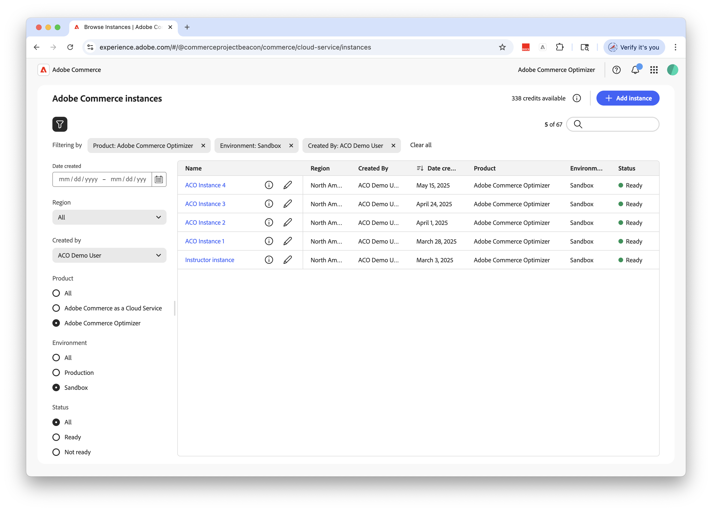

# はじめに

このガイドでは、[!DNL Adobe Commerce Optimizer] の設定を最初から最後まで説明します。 このガイドではすべての役割をカバーしていますが、開発者固有のコンテンツについて詳しくは、[&#x200B; 開発者ドキュメント &#x200B;](https://developer.adobe.com/commerce/services/optimizer/) を参照してください。

## 前提条件

開始する前に、次のことを確認します。

- **Adobe Experience Cloud アカウント** （[!DNL Adobe Commerce Optimizer] 使用権限）
- **組織管理者アクセス**：インスタンスを作成し、ユーザーを管理します。
- サンプルデータおよびストアフロント開発を読み込むための **GitHub アカウント**
- e コマースの概念に関する **基本的な理解**

## クイックスタートガイド

[!DNL Adobe Commerce Optimizer] 環境を実行するには、次の基本的な手順に従います。

### 手順 1. インスタンスの作成

1. [Adobe Experience Cloud](https://experience.adobe.com/) にログインします。
1. **Commerce** / **Commerce Cloud Manager** に移動します。
1. **インスタンスを追加**/**Commerce Optimizer** をクリックします。

   {width="60%" zoomable="yes"}

1. インスタンス設定を指定：
   - **インスタンス名**：わかりやすい名前（「My Company Sandbox」など）
   - **説明**：目的の簡単な説明
   - **環境タイプ**：テスト用の **サンドボックス** 環境から開始
   - **地域**：優先する地域を選択します

1. **インスタンスを追加** をクリックします。

   Cloud Managerが更新され、新しいインスタンスが追加されます。 アクセスと管理について詳しくは、「[&#x200B; インスタンスの管理 &#x200B;](#manage-instances)」を参照してください。

>[!NOTE]
>
>サンドボックス環境を作成できるのは、北米地域のみです。 インスタンスを作成した後は、領域を変更できません。

### 手順 2. 環境の設定

インスタンスの作成後：

1. Commerce Cloud Manager で [&#x200B; インスタンスを管理 &#x200B;](#manage-instances) します。
1. [User Management ガイド &#x200B;](./user-management.md) を使用してユーザーアクセスを設定します。

### 手順 3. サンプルデータを追加（オプション）

テストと学習については、[&#x200B; サンプルデータの読み込み &#x200B;](#add-sample-data) の手順に従ってください。

## 役割ベースのワークフロー

設定と管理 [!DNL Adobe Commerce Optimizer]、次の 3 つの主要な役割に依存しています。 各役割には、次のような特定のタスクと責務があります。

{zoomable="yes"}

### 管理者のタスク

管理者は、インスタンス、ユーザーおよび組織設定を管理します。

| タスク | 説明 | リンク |
|---|---|---|
| **ユーザーの管理** | ユーザー、開発者、管理者を追加 | [&#x200B; ユーザー管理 &#x200B;](./user-management.md) |
| **インスタンスの作成** | サンドボックス環境と実稼動環境のセットアップ | [&#x200B; インスタンスを作成 &#x200B;](#create-an-instance) |
| **インスタンスの管理** | ステータスを確認し、インスタンス名と説明を更新し、アプリケーションおよび API アクセスのキー URL を取得します | [&#x200B; インスタンスの管理 &#x200B;](#manage-instances) |
| **アクセスの設定** | カタログ表示とポリシーの設定 | [&#x200B; カタログ ビュー &#x200B;](./setup/catalog-view.md) |

### 開発者タスク

開発者は、プラットフォームのアーキテクチャタスクなど、技術的な実装とデータ統合を処理します。

| タスク | 説明 | リンク |
|---|---|---|
| **Developer Consoleへのアクセス** | プロジェクトの作成と資格情報の生成 | [Developer Console](https://developer.adobe.com/developer-console/docs/guides/getting-started) |
| **カタログデータの取り込み** | 既存システムからの製品データのインポート | [&#x200B; データ取得 API](https://developer.adobe.com/commerce/services/optimizer/data-ingestion/) |
| **ストアフロントの設定** | Edge Delivery Services ストアフロントの設定 | [&#x200B; ストアフロントの設定 &#x200B;](./storefront.md) |

### マーチャンダイザータスク

マーチャンダイザーは、製品の検出とレコメンデーションを通じて、ショッピングエクスペリエンスを最適化およびパーソナライズします。 また、買い物客のデータと分析を使用して、ストアフロントでの製品の配置、価格、プロモーションに関する戦略的な決定を行います。

| タスク | 説明 | リンク |
|---|---|---|
| **製品の検出** | 検索とフィルタリングの設定 | [&#x200B; マーチャンダイジングの概要 &#x200B;](./merchandising/overview.md) |
| **推奨事項** | AI を活用した製品レコメンデーションの設定 | [&#x200B; 製品の推奨事項 &#x200B;](./merchandising/recommendations/overview.md) |
| **パフォーマンストラッキング** | 成功指標の監視 | [&#x200B; 成功指標 &#x200B;](./manage-results/success-metrics.md) |

## インスタンスの管理

Commerce Cloud Manager からインスタンスを管理します。

>[!NOTE]
>
>すべてのAdobe Commerce Optimizer ユーザーがCloud Managerにアクセスできるわけではありません。 アクセス権は、ユーザーアカウントに割り当てられた役割と権限によって異なります。

1. [Adobe Experience Cloud](https://experience.adobe.com/) にログインします。

1. Commerce Cloud Manager を開きます。

   - **クイックアクセス** で、**Commerce** をクリックします。
   - 使用可能なインスタンスを表示します。

### インスタンスの検索とフィルタリング

ログインすると、組織内で使用可能なすべてのCommerce製品インスタンスがダッシュボードに表示されます。
「製品」列は、インスタンスがプロビジョニングされるCommerce アプリケーションを示します。

{zoomable="yes"}

フィルターツールと検索ツールを使用すると、作成日、地域、作成者、製品タイプ、環境、ステータス別に、特定のインスタンスをすばやく見つけることができます。

### [!DNL Adobe Commerce Optimizer] アプリケーションへのアクセス

アプリを開いたら、サンドボックスや実稼動環境などの環境を簡単に切り替えることで、Commerce Cloud Manager に戻ることなく、それぞれのデータや設定を表示できます。

1. Commerce Cloud Manager で、インスタンス名をクリックして [!DNL Adobe Commerce Optimizer] アプリケーションを開きます。

1. アプリケーションを離れずに [!DNL Adobe Commerce Optimizer] インスタンスを切り替えます。

   「インスタンス」ドロップダウン・リストには、組織で使用可能なすべての Optimizer インスタンスが表示されます。 表示するインスタンスを選択します。

   {zoomable="yes"}

### インスタンスの詳細を取得

インスタンス名の横にある情報アイコンをクリックして、インスタンスの詳細を表示します。

{width="60%" zoomable="yes"}

次の主な情報に注意してください。

- **GraphQL エンドポイント**：マーチャンダイジング API を使用してCommerce カタログデータを取得します
- REST API を使用したデータ取り込みの **カタログサービスエンドポイント**
- **アプリケーションにアクセスするための** Commerce Optimizer URL[!DNL Adobe Commerce Optimizer]
- **インスタンス ID** インスタンスを識別する一意のテナント ID

開発者の場合は、開発環境を設定して [!DNL Adobe Commerce Optimizer] API に接続するために、次の詳細が必要です。

>[!NOTE]
>
>インスタンスの詳細にアクセスするには、Adobe IMS組織で必要な権限を持っている必要があります。 インスタンスの詳細が表示されない場合やアプリケーションにアクセスできない場合は、組織の管理者にお問い合わせください。

### インスタンス名と説明を編集

必要に応じて、インスタンス名と説明を更新します。

1. インスタンス名の横にある **編集** アイコンをクリックします。
1. 必要に応じて **インスタンス名** と **説明** を更新します。
1. **保存** をクリックします。

## サンプルデータを追加

Adobeは、[!DNL Adobe Commerce Optimizer] の機能を学習およびテストするのに役立つサンプルデータとツールを含む GitHub リポジトリを提供します。
サンプルデータは、[Carvelo ビジネスシナリオ &#x200B;](./use-case/admin-use-case.md) に基づいており、次のものが含まれます。

- 自動車部品の製品カタログ
- 複数の価格台帳と価格設定シナリオ
- 異なるディーラー向けのカタログビューとポリシー
- 完全なエンドツーエンドワークフローの例

**サンプルデータを読み込みます。**

1. [Sample Catalog Data Ingestion](https://github.com/adobe-commerce/aco-sample-catalog-data-ingestion) GitHub リポジトリにアクセスします。

1. リポジトリの README ファイルにある設定手順に従って、次のタスクを実行します。

   - 環境の設定
   - データ取り込みプロセスの完了
   - サンプルデータを使用したカタログビューとポリシーの作成
   - [&#x200B; データ同期 &#x200B;](./setup/data-sync.md) ページでカタログサービスデータを確認して、データ取り込みを検証します

## 次の手順

設定が完了したら、次の手順を実行します。

1. ストアフロントの設定：
   - [Edge Delivery Services ストアフロント &#x200B;](./storefront.md) を設定
   - カタログデータへの接続

1. Carvelo のユースケースを見る：
   - [&#x200B; エンドツーエンドのワークフロー &#x200B;](./use-case/admin-use-case.md) に従う
   - 実際のシナリオを使用して練習する

1. マーチャンダイジングを設定：
   - 設定 [&#x200B; 製品検出 &#x200B;](./merchandising/overview.md)
   - 作成 [recommendations](./merchandising/recommendations/overview.md)

1. 監視パフォーマンス：
   - トラック [&#x200B; 成功指標 &#x200B;](./manage-results/success-metrics.md)
   - 分析 [&#x200B; パフォーマンスの検索 &#x200B;](./manage-results/search-performance.md)

## トラブルシューティング

### よくある問題

| 問題 | 解決策 |
|---|---|
| **インスタンスを作成できません** | 使用権限と管理者権限 [!DNL Adobe Commerce Optimizer] あることを確認します。 |
| **インスタンスが表示されません** | Adobe IMSー組織を確認し、ページを更新します。 |
| **インスタンスにアクセスできません** | Admin Consoleでユーザーとして追加されていることを確認します。 |
| **サンプルデータが読み込まれない** | インスタンスの資格情報と API エンドポイントを確認します。 |

### ヘルプを表示

- **開発者向けリソース**: [&#x200B; 開発者向けドキュメント &#x200B;](https://developer.adobe.com/commerce/services/optimizer/)
- **ストアフロントのリソース**:[Commerce ストアフロントのドキュメント &#x200B;](https://experienceleague.adobe.com/developer/commerce/storefront/?lang=ja)
- **チュートリアル**: [Commerce Optimizer チュートリアル &#x200B;](https://experienceleague.adobe.com/ja/docs/commerce-learn/tutorials/adobe-commerce-optimizer/overview)
- **サポート**: [Adobe Commerce サポートリソース &#x200B;](https://experienceleague.adobe.com/ja/docs/commerce-knowledge-base/kb/overview)
