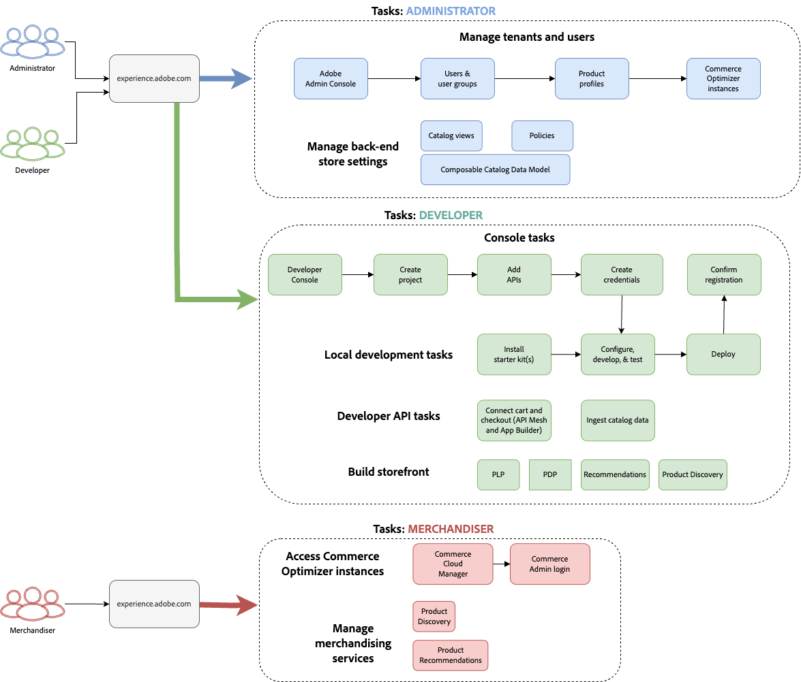
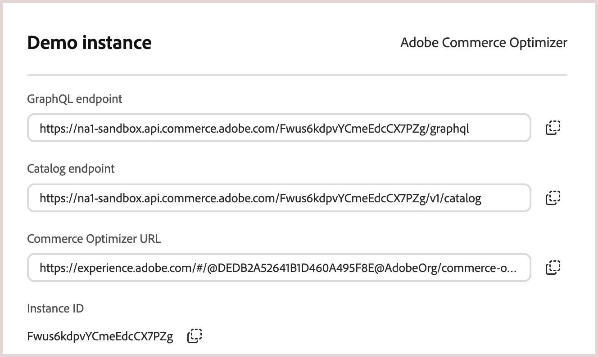

# 詳細を見る

このガイドでは、[!DNL Adobe Commerce Optimizer]を最初から最後まで設定する方法について説明します。 このガイドでは、すべての役割について説明しますが、開発者固有の詳細なコンテンツについては、[開発者ドキュメント &#x200B;](https://developer.adobe.com/commerce/services/optimizer/)を参照してください。

## インスタンスタイプと環境の分離

Adobe Commerce Optimizerでは、**sandbox**&#x200B;や&#x200B;**production**&#x200B;など、異なる環境に対して個別のインスタンスを使用します。 各インスタンスには、独自のインスタンス IDと、カタログビュー、ポリシー、検索設定、製品レコメンデーションなどの独自の分離データがあります。

Adobe Commerce as a Cloud Service、サードパーティのコマースプラットフォーム、Edge Delivery Servicesストアフロントと連携する際は、常に次の環境に対応します。

- **sandbox Optimizer インスタンス**&#x200B;を実稼動以外のコマース環境およびストアフロント環境に接続します。
- **production Optimizer インスタンス**&#x200B;を実稼動コマースおよびストアフロント環境に接続します。

サンドボックス環境と本番環境を混在すると、カタログデータに一貫性がなくなり、予期しない検索やマーチャンダイジングの動作が発生したり、指標の信頼性が低下したりします。 Commerce Cloud Managerのインスタンスタイプとインスタンス IDを、統合を設定する際の信頼できる唯一の情報源として使用します。

## 前提条件

始める前に、次の項目を確認してください。

- [!DNL Adobe Commerce Optimizer]の使用権限を持つ&#x200B;**Adobe Experience Cloud アカウント**
- **組織の管理者アクセス**&#x200B;によるインスタンスの作成とユーザーの管理
- サンプルデータとストアフロント開発を読み込むための&#x200B;**GitHub アカウント**
- e コマースの概念に関する基本的な理解&#x200B;**について**

## クイックスタートガイド

[!DNL Adobe Commerce Optimizer]環境を実行するには、次の重要な手順に従います。

### 手順1: インスタンスの作成

1. [Adobe Experience Cloud](https://experience.adobe.com/)にログインします。
1. **Commerce** > **Commerce Cloud Manager**&#x200B;に移動します。
1. **Add Instance** > **Commerce Optimizer**&#x200B;をクリックします。

   {width="60%" zoomable="yes"}

1. インスタンス設定の設定：
   - **インスタンス名**：わかりやすい名前（例：「My Company Sandbox」）
   - **説明**：目的の簡単な説明
   - **環境タイプ**: テスト用に&#x200B;**サンドボックス**&#x200B;環境から開始します
   - **地域**：お好みの地域を選択してください

1. 「**インスタンスを追加**」をクリックします。

   Cloud Managerが更新され、新しいインスタンスが含まれます。 アクセスと管理の詳細については、[&#x200B; インスタンスの管理](#manage-instances)を参照してください。

>[!NOTE]
>
>サンドボックス環境は北米地域でのみ作成できます。 インスタンスを作成した後は、地域を変更することはできません。

### 手順2: 環境の設定

インスタンスを作成した後：

1. [Commerce Cloud Managerからインスタンスを管理](#manage-instances)。
1. [&#x200B; ユーザー管理ガイド &#x200B;](./user-management.md)を使用してユーザーアクセスを設定します。

### 手順3: サンプルデータの追加（オプション）

テストと学習については、[&#x200B; サンプルデータの読み込み](#add-sample-data)の指示に従ってください。

## 役割ベースのワークフロー

[!DNL Adobe Commerce Optimizer]の設定と管理は、3つの主要な役割に依存しています。 それぞれの役割には、特定のタスクと責任があります。

管理者、開発者、およびユーザータスクを表示する[!DNL Adobe Commerce Optimizer]設定の{zoomable="yes"}

### 管理者タスク

管理者は、インスタンス、ユーザー、組織設定を管理します。

| タスク | 説明 | リンク |
|---|---|---|
| **ユーザーの管理** | ユーザー、開発者、管理者の追加 | [&#x200B; ユーザー管理](./user-management.md) |
| **インスタンスの作成** | サンドボックス環境と本番環境の設定 | [Create Instance](#step-1-create-an-instance) |
| **インスタンスの管理** | ステータスを確認し、インスタンス名と説明を更新し、アプリケーションおよびAPI アクセス用のキーURLを取得します | [&#x200B; インスタンスの管理](#manage-instances) |
| **アクセスの設定** | カタログビューとポリシーの設定 | [&#x200B; カタログ ビュー](./setup/catalog-view.md) |

### 開発者タスク

開発者は、プラットフォームアーキテクチャタスクを含む、技術的な実装とデータ統合に取り組みます。

| タスク | 説明 | リンク |
|---|---|---|
| **Developer Consoleへのアクセス** | プロジェクトの作成と資格情報の生成 | [Developer Console](https://developer.adobe.com/developer-console/docs/guides/getting-started) |
| **カタログデータの取り込み** | 既存システムから製品データをインポートする | Adobe Commerce Optimizerに直接データを取り込む方法については、[Data Ingestion API](https://developer.adobe.com/commerce/services/optimizer/data-ingestion/){target="_blank"}を参照してください。  Commerce オンクラウドまたはオンプレミス環境またはその他のサードパーティシステムからデータを取り込む方法については、[統合](./integrations/integrations-overview.md){target="_blank"}のトピックを参照してください。 |
| **ストアフロントの設定** | Edge Delivery Services ストアフロントの設定 | [&#x200B; ストアフロント設定](./storefront.md) |

### マーチャンダイジスタスク

マーチャンダイザーは、商品の発見とレコメンデーションを通じてショッピング体験を最適化し、パーソナライズします。 また、買い物客のデータと分析を活用して、ストアフロントでの商品配置、価格設定、プロモーションについて、戦略的な意思決定をおこないます。

| タスク | 説明 | リンク |
|---|---|---|
| **製品の検出** | 検索とフィルタリングの設定 | [&#x200B; マーチャンダイジングの概要](./merchandising/overview.md) |
| **推奨事項** | AIを活用した商品レコメンデーションの設定 | [商品レコメンデーション &#x200B;](./merchandising/recommendations/overview.md) |
| **パフォーマンスの追跡** | 成功指標の監視 | [成功指標](./manage-results/success-metrics.md) |

## インスタンスの管理

Commerce Cloud Managerからインスタンスを管理します。

>[!NOTE]
>
>[!DNL Adobe Commerce Optimizer] ユーザー全員がCloud Managerにアクセスできるわけではありません。 アクセスは、ユーザーアカウントに割り当てられた役割と権限によって異なります。

1. [Adobe Experience Cloud](https://experience.adobe.com/)にログインします。

1. Commerce Cloud Managerを開きます。

   - **クイックアクセス**&#x200B;で、**Commerce**&#x200B;をクリックします。
   - 利用可能なインスタンスを表示します。

### インスタンスの検索とフィルター

ログインすると、組織内で使用可能なすべてのCommerce製品インスタンスがダッシュボードに表示されます。
「製品」列には、インスタンスがプロビジョニングされているCommerce アプリケーションが表示されます。

Adobe Commerce Cloud製品インスタンスの検索およびフィルターオプションを表示する{zoomable="yes"}

フィルターツールと検索ツールを使用して、作成日、地域、作成者、製品タイプ、環境、ステータスごとに特定のインスタンスをすばやく検索できます。

### [!DNL Adobe Commerce Optimizer Studio]管理者インターフェイスへのアクセス

アプリを開いたら、Commerce Cloud Managerに戻ることなく、サンドボックスや実稼動環境などの環境を簡単に切り替えて、それぞれのデータや設定を表示できます。

1. Commerce Cloud Managerで、インスタンス名をクリックして[!DNL Adobe Commerce Optimizer Studio]を開きます。

1. アプリケーションを終了せずに[!DNL Adobe Commerce Optimizer] インスタンスを切り替えます。

   - インスタンス ドロップダウンをクリックして、組織で使用可能なすべてのOptimizer インスタンスを表示します。

     [!DNL Adobe Commerce Optimizer]環境を選択するための{zoomable="yes"}

- 表示するインスタンスを選択します。

>[!NOTE]
>
>Commerce Cloud Managerに戻ってインスタンスの詳細を表示したり、インスタンスを管理したりするには、 （アプリ）アイコンを開きます。

### インスタンスの詳細を取得

インスタンス名の横にある情報アイコンをクリックして、インスタンスの詳細を表示します。

エンドポイントとインスタンス ID{width="60%" zoomable="yes"}を示す[!DNL Adobe Commerce Optimizer] インスタンスの詳細パネル

次の重要な情報に注意してください。

- **GraphQL エンドポイント** ストアフロントが[&#x200B; マーチャンダイジングサービス API](https://developer.adobe.com/commerce/services/optimizer/merchandising-services/){target=_blank}を使用して、このインスタンスからカタログおよびマーチャンダイジングデータをクエリするために使用するGraphQL エンドポイント
- **カタログエンドポイント** REST API エンドポイントを使用して、コマースまたはPIM システムからAdobe Commerce Optimizerに商品と価格を取り込みます。 [Data Ingestion API](https://developer.adobe.com/commerce/services/optimizer/data-ingestion/)を参照してください
- **Commerce Optimizer URL** [Adobe Commerce Optimizer Studio](overview.md)の管理UIを開いて、カタログビュー、ポリシー、マーチャンダイジングを設定および管理します。
- **インスタンス ID**：このAdobe Commerce Optimizer インスタンスの一意のID （テナント ID）。ストアフロント、API、およびツールが正しい環境に接続するために使用します。

開発者の場合は、開発環境を設定し、[!DNL Adobe Commerce Optimizer] APIに接続するために、次の詳細が必要です。

>[!NOTE]
>
>インスタンスの詳細にアクセスするには、Adobe IMS組織で必要な権限を持っている必要があります。 インスタンスの詳細が表示されないか、アプリケーションにアクセスできない場合は、組織の管理者にお問い合わせください。

### インスタンス名と説明の編集

必要に応じて、インスタンス名と説明を更新します。

1. インスタンス名の横にある&#x200B;**編集** アイコンをクリックします。
1. 必要に応じて、**インスタンス名**&#x200B;と&#x200B;**説明**&#x200B;を更新します。
1. **保存**&#x200B;をクリックします。

## サンプルデータを追加

Adobeには、[!DNL Adobe Commerce Optimizer]機能の学習とテストに役立つサンプルデータとツールが含まれているGitHub リポジトリが用意されています。
サンプルデータは、[Carvelo ビジネスシナリオ &#x200B;](./use-case/admin-use-case.md)に基づいており、次のものが含まれます。

- 自動車部品を含む製品カタログ
- 複数の価格表と価格シナリオ
- ディーラーごとのカタログビューとポリシー
- エンドツーエンドのワークフロー例

**サンプルデータを読み込む：**

1. [&#x200B; サンプルカタログデータ収集](https://github.com/adobe-commerce/aco-sample-catalog-data-ingestion) GitHub リポジトリにアクセスします。

1. リポジトリのREADME ファイルの設定手順に従って、次のタスクを実行します。

   - 環境の設定
   - データ取り込みプロセスの完了
   - サンプルデータを使用したカタログビューとポリシーの作成
   - [&#x200B; データ同期](./setup/data-sync.md) ページのカタログサービスデータを確認して、データ取り込みを確認します

## 次のステップ

設定の完了後：

1. ストアフロントの設定：
   - [Edge Delivery Services ストアフロント &#x200B;](./storefront.md)の設定
   - カタログデータへの接続

1. Carveloの使用例を確認します。
   - [&#x200B; エンドツーエンドのワークフロー](./use-case/admin-use-case.md)に従う
   - 実際のシナリオで練習

1. マーチャンダイジングの設定：
   - [製品ディスカバリーの設定](./merchandising/overview.md)
   - [推奨事項](./merchandising/recommendations/overview.md)を作成

1. パフォーマンスを監視する：
   - [成功指標の追跡](./manage-results/success-metrics.md)
   - [検索パフォーマンス &#x200B;](./manage-results/search-performance.md)を分析

## トラブルシューティング

### 一般的な問題

| イシュー | Solution |
|---|---|
| **インスタンスを作成できません** | [!DNL Adobe Commerce Optimizer]の使用権限と管理者権限があることを確認してください。 |
| **インスタンスが表示されません** | Adobe IMSの整理を確認して、ページを更新します。 |
| **インスタンスにアクセスできません** | Admin Consoleでユーザーとして追加されていることを確認します。 |
| **サンプルデータが読み込まれません** | インスタンス認証情報とAPI エンドポイントを確認します。 |

### ヘルプを表示

- **開発者リソース**: [開発者ドキュメント &#x200B;](https://developer.adobe.com/commerce/services/optimizer/)
- **ストアフロントのリソース**: [Commerce ストアフロントのドキュメント &#x200B;](https://experienceleague.adobe.com/developer/commerce/storefront/?lang=ja)
- **チュートリアル**: [Commerce Optimizer チュートリアル &#x200B;](https://experienceleague.adobe.com/ja/docs/commerce-learn/tutorials/adobe-commerce-optimizer/overview)
- **サポート**: [Adobe Commerce サポートリソース &#x200B;](https://experienceleague.adobe.com/ja/docs/commerce-knowledge-base/kb/overview)
