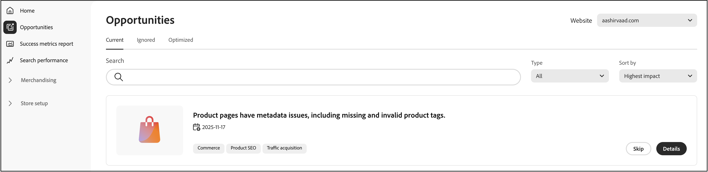
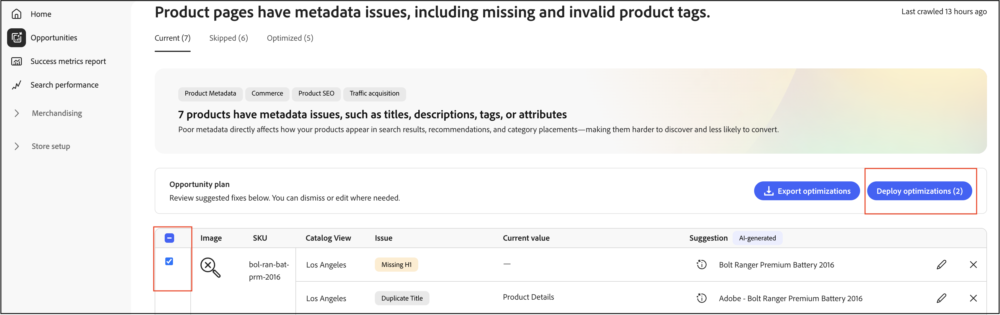

# 機会

**商談** ページは、Adobe Sites Optimizerとの統合を通じて、サイトトラフィック、ユーザーエンゲージメント、コンバージョン率を向上させる最適化を特定し、実装するのに役立ちます。

## オポチュニティとは？

[商談](https://experienceleague.adobe.com/ja/docs/experience-manager-sites-optimizer/content/documentation/opportunities/overview)は、マーチャンダイザーがコマースサイトのパフォーマンスに影響を与える問題を特定して対処するのに役立つ、AIを活用したレコメンデーションです。 これらのレコメンデーションは、web サイトのパフォーマンスを分析および改善するクラウドベースのサービスである[Adobe Experience Manager Sites Optimizer](https://experienceleague.adobe.com/ja/docs/experience-manager-sites-optimizer/content/home)によって提供されます。

## 主な能力

- **問題自動検出**:Sites Optimizerは、商品カタログ、検索ログ、レコメンデーションデータを継続的にスキャンして、発見に影響を与える問題を特定します。
- **AIを活用したレコメンデーション** – 検出された問題を解決するためのインテリジェントな提案を受け取ります。
- **影響の分類** – 問題は、ビジネスへの影響（検索、推奨事項、参照/ナビゲーション、製品データ品質）によって分類されます。
- **ダッシュボードのレポート** – 問題の傾向、影響を受ける上位の製品またはクエリ、および長期的な改善を表示します。

## 基本を学ぶ

[!DNL Adobe Commerce Optimizer]で商談を有効にするには、カスタマーサクセスマネージャー（CSM）にお問い合わせください。 商談は、**Ultima** Adobe Sites Optimizer ライセンスで利用できます。

## クイックツアー

「商談」ページは、最適化レコメンデーションの管理に役立つ3つのタブに分かれています。

- **現在（アクティブ）** – 新しく検出された機会を表示し、レビューとアクションが必要です。 これらは、サイトのパフォーマンスに影響を与える可能性のある、アクティブな問題です。
- **スキップ** – 解約または延期を選択した商談が含まれます。 オポチュニティが現在のビジネス目標と関連していない場合は、ここで移動できます。
- **最適化（完了）** – 自動修正デプロイメントによって正常に対処された商談を表示します。 手動で対処された商談は、このタブには表示されません。 このタブは、自動修正された商談を経時的に追跡するのに役立ちます。

## 自動検出ワークフロー

自動検出ワークフローでは、AIを活用した分析により、商品カタログ全体で最適化の機会を自動的に特定します。 この自動スキャンプロセスでは、商品データ、検索ログ、レコメンデーションのパフォーマンスを継続的に監視し、サイトパフォーマンス、SEO、顧客エンゲージメントに影響を与える可能性のある問題を検出します。

### 仕組み

自動検出では、Adobe Experience Manager Sites Optimizerを次の目的で使用します。

- **製品ページを分析** - システムは、製品詳細ページの上位200 ページとフィルターを調べて、最適化目標を特定します。
- **メタデータを抽出** - Meta タグ（タイトル、説明、H1 ヘッダー）が分析のために各ページから抽出されます。
- **AI レコメンデーションを生成** – 抽出されたデータは、AdobeのAI ワークフローを通じて処理され、実用的な最適化の提案が作成されます。
- **Populate opportunities** – 自動検出された提案は、レビュー用に&#x200B;**現在（アクティブ）** タブに表示されます。

### 前提条件

自動検出でレコメンデーションを生成する前に、カタログデータを同期して最新の状態にしておく必要があります。

### 次のステップ

自動検出によって最適化の機会を特定すると、次のことが可能になります。

- 「**現在（アクティブ）**」タブで、提案された最適化を確認します。
- [自動修正ワークフロー](#auto-fix-workflow) （サポート対象[商談タイプ &#x200B;](#supported-opportunity-types)の場合）を使用して、自動的に修正をデプロイします。
- Commerce管理者で変更を手動で実装します。
- ビジネス目標と合致しない機会は無視しましょう。

## ワークフローの自動修正

この自動修正ワークフローにより、AI生成の最適化をワンクリックですばやくデプロイできます。 自動修正を適用すると、元の製品データを変更せずに特定の製品属性を上書きするカタログ最適化レイヤーが作成されます。 元の製品データは維持され、いつでも安全に最適化を適用して変更を元に戻すことができます。 詳しくは、[&#x200B; カタログレイヤーと自動修正](#how-catalog-layers-work-with-auto-fix)の連携の仕組みを参照してください。

### サポートされている機会タイプ

サポートされている商談タイプを次に示します。

- タイトルが長すぎます
- タイトルが短すぎます
- タイトルを複製
- タイトルがありません
- 空のタイトル
- 説明が長すぎます
- 説明が短すぎます
- 説明がありません
- 説明が空です
- 説明を複製
- H1がありません
- H1を複製
- H1が長すぎます

>[!NOTE]
>
>ページ上の複数のH1は現在サポートされていません。

### 前提条件

自動修正を使用する前に、次の点を確認してください。

- 製品カタログは[!DNL Adobe Commerce Optimizer]に完全に取り込まれています。
- 商談タイプは自動修正をサポートしています（一部の最適化タイプでは手動実装が必要です）。
- カタログレイヤーを作成および管理するための適切な権限があります。

>[!IMPORTANT]
>
>自動修正機能には、完全に取り込まれた製品カタログが必要です。 カタログがまだ取り込まれていない場合でも、提供されたCSV ファイルを使用して商談を表示し、手動で修正を実装できます。 手動による実装は、**最適化（完了）** タブでは追跡されないことに注意してください。

### 自動修正最適化のデプロイ

AIが提案した最適化を実装するには、次の手順に従います。

1. **結果の管理** > **商談**&#x200B;に移動します。

1. 「**現在（アクティブ）**」タブで、使用可能な最適化の提案を確認します。

1. 機会の選択：

   

   >[!NOTE]
   >
   >「**最適化をデプロイ**」ボタンは、[&#x200B; サポートされている提案タイプ &#x200B;](#supported-opportunity-types)でのみ使用できます。 サポートされていないタイプの場合、チェックボックスは無効になっており、カタログで手動で修正を適用する必要があります。

1. 「**Deploy optimization**」をクリックし、「**Deploy**」をクリックして、自動修正プロセスをトリガーします。

   

   システムはバックグラウンドで次のアクションを実行します。

   - 製品の新しいカタログレイヤーを作成します（まだ存在しない場合）。
   - AIのレコメンデーションに基づいて、関連属性（メタタイトル、説明、H1など）を更新します。
   - 新しいレイヤーをカタログ ビューで最も優先度の高い（高い番号）として割り当てます。
   - カタログストアフロントサービスを通じて変更を検証します。

1. デプロイメントステータスを監視します。 検証が完了すると、システムは提案ステータスを自動的に更新します。

1. 最適化が完了すると、候補はステータスインジケーター付きの&#x200B;**最適化（完了）** タブに移動します。

   - **緑のチェックマーク** – 最適化レイヤーが最優先事項として設定され、ストアフロントに積極的に適用されます。
   - **警告アイコン** - レイヤーは存在しますが、最優先度ではありません。つまり、別のレイヤーによって上書きされる可能性があります。

   

>[!NOTE]
>
>自動修正は、あらゆる言語のサイトに対するメタデータの最適化をサポートしています。 Sites Optimizerは、製品詳細ページを元の言語で分析し、ローカライズされたAI レコメンデーションを生成します。また、カタログビューで設定されたソースロケールにもとづいてカタログレイヤーを作成します。

### カタログレイヤーの自動修正の仕組み

Adobe Sites Optimizer レイヤーがカタログビューに存在しない場合、自動修正によって自動的にレイヤーが作成され、最優先度（最上位）として割り当てられます。 このレイヤーを削除すると、次に自動修正が実行されるときに再作成され、既存のレイヤーが下位の番号にシフトされます。 Adobe Sites Optimizer レイヤーが別の注文番号に既に存在する場合、自動修正は優先度を変えません。 自動修正レイヤーを保持したいが、すぐに使用しない場合は、レイヤーを無効にすることができます。 [&#x200B; カタログレイヤー](../setup/catalog-layer.md#activate-deactivate-or-delete-layers)の管理方法について詳しくは、こちらを参照してください。

この図は、**ASO Optimization**&#x200B;という1行を示しています。 このエントリは、自動修正を選択したすべての商談を表します。 1つの商談または複数の商談を自動修正するかどうかにかかわらず、それらはすべて、この1つの&#x200B;**ASO最適化**&#x200B;行に表示されます。 レイヤーは各カタログビューに固有であるため、ここに示す&#x200B;**ロサンゼルス** カタログビューは、そのビューがアクティブな場合にのみ&#x200B;**ASO最適化** レイヤーを適用します。

### 重要な検討事項

自動修正を使用する場合は、次の点に注意してください。

- 提案ごとに表示されるステータスは、自動修正ワーカーが実行された時点の状態を反映します。 後でカタログレイヤーを手動で並べ替えた場合、ステータスは動的には更新されません。

- 最適化を確実にアクティブにするには、自動修正レコメンデーションをデプロイした後にカタログレイヤーの優先順位を手動で変更しないようにします。

### トラブルシューティング

最適化がストアフロントに適用されていないように見える場合は、次の手順に従います。

1. 「**最適化（完了）**」タブでステータスインジケーターを確認します。
1. 警告アイコンが表示された場合は、カタログレイヤーの優先度設定を確認します。
1. 最適化レイヤーがカタログビューで最も高い優先度（最も高い番号）に設定されていることを確認します。
1. カタログデータの同期がアクティブで最新であることを確認します。
1. 変更を反映する時間を確保します。 最も高い注文番号で適切に設定されたレイヤーを使用しても、新製品の公開時と同様に、ストアフロントに変更が表示されるまでに時間がかかる場合があります。

## Sites Optimizerと成功指標の連携

成功指標は、商品の発見やカタログの業務効率などの主要業績評価指標（KPI）をモニタリングします。一方、Sites Optimizerのオポチュニティでは、SEO、読み込み速度、アクセシビリティ、エンゲージメントを向上させる方法を把握できます。 マーチャンダイザーとマーケターが連携することで、業務効率を高め、エンドツーエンドのパフォーマンスとコンバージョンを向上させ、IT部門によるサポートを最小限に抑えることができます。 これらの2つのテクノロジーを活用してストアフロントのパフォーマンスとエクスペリエンスを向上させる方法については、[成功指標とSites Optimizerの併用](./success-metrics.md#using-success-metrics-and-sites-optimizer-together)を参照してください。

## Sites Optimizerについて詳しく見る

Sites Optimizerの機能と機能について詳しくは、[Adobe Experience Manager Sites Optimizer ドキュメント &#x200B;](https://experienceleague.adobe.com/ja/docs/experience-manager-sites-optimizer/content/home)を参照してください。

関連トピックス：

- [商談タイプ &#x200B;](https://experienceleague.adobe.com/en/docs/experience-manager-sites-optimizer/content/opportunities) – 使用可能な最適化商談について説明します。
- [Sites Optimizerの機能](https://experienceleague.adobe.com/en/docs/experience-manager-sites-optimizer/content/capabilities) - Sites Optimizerの機能について説明します。

## その他

- [成功指標](success-metrics.md) – 主要業績評価指標を監視します。
- [検索パフォーマンス &#x200B;](search-performance.md) – 検索語を分析し、関連性を最適化します。
- [&#x200B; レコメンデーション パフォーマンス &#x200B;](recommendation-performance.md) - レコメンデーションの有効性を監視します。
