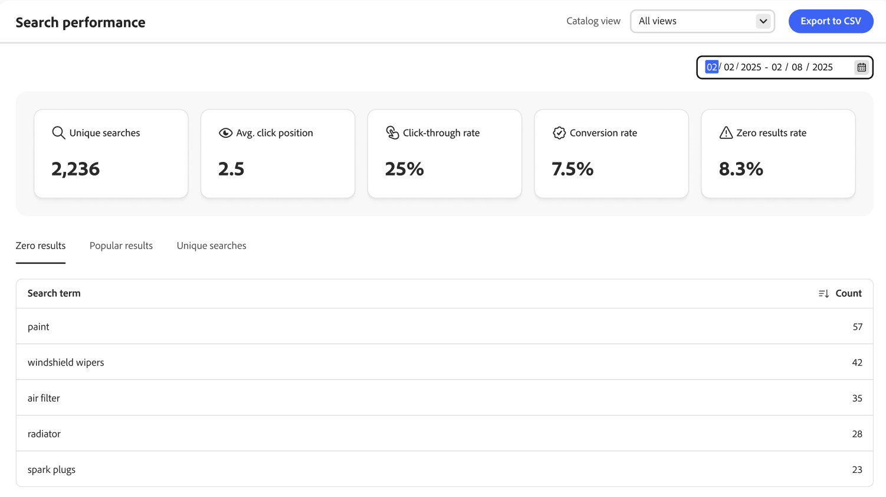
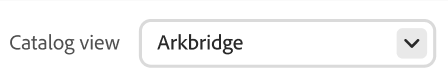

# 検索パフォーマンス

*検索パフォーマンス* ページでは、買い物客が使用する検索語にinsightが表示されます。 この情報は、トレンドの特定、クリック率の向上、コンバージョン率の向上に役立ちます。 検索パフォーマンス ページには、特定の日付範囲の検索指標のスナップショットが表示され、次のレポートが含まれます。

- 一意の検索
- 平均クリック位置
- クリックスルー率
- コンバージョン率
- 成果率ゼロ

{zoomable="yes"}

>[!IMPORTANT]
>
>検索パフォーマンス指標が表示されない場合は、検索イベントデータが[収集されていることを確認してください](../setup/events/overview.md)。

## **カタログビュー**&#x200B;を選択

[ カタログビュー](../setup/catalog-view.md)を選択して、特定の検索結果を表示します。

## レポートを読む

カレンダーをクリックし、次のいずれかの操作を行います。

- 1つの日付を指定するには、カレンダーの日付をダブルクリックします。
- 日付の範囲を指定するには、カレンダーの最初と最後の日付をクリックします。

>[!NOTE]
>
>日付の範囲は1年を超えることはできません。

**[!UICONTROL Export to CSV]**&#x200B;をクリックして、検索パフォーマンスのCSV ファイルを生成します。

## 検索パフォーマンスの改善方法

ここでは、サイト検索機能を強化し、シームレスかつ効率的なショッピング体験を実現して、コンバージョン率を最大化するための戦略を解説します。

検索結果の関連性と効果を決定する重要な要素がいくつかあります。

- 適切に構造化された商品データにより、検索アルゴリズムが商品とクエリを効果的に一致させることができます。 商品データが少ないと、関連性の低い検索結果につながります。 マーチャンダイジング戦略の成功に直接影響を与えるには：
   - 検索可能な](https://developer.adobe.com/commerce/services/reference/rest/#operation/createProductMetadata)として、対応する重みで正しい[属性を設定します。
   - これらの属性内のデータが適切であることを確認します。
- 適切に設計された検索体験は、顧客との信頼関係を構築し、顧客が必要な商品を確実に見つけるという安心感をもたらします。
- 検索ルールは、人気度、新規到達率、プロモーション基準など、ビジネス要件を満たす他のマーチャンダイジング戦略にもとづいて、特定の商品の認知度を高めることができる上で、非常に重要です。
- 多面的ナビゲーションにより、買い物客は検索を絞り込み、関連性の高い結果を迅速に得ることができます。

### 検索結果を監視する

[!DNL Adobe Commerce Optimizer]で検索結果を最適化するには、一意のクエリ、平均クリック数、クリックスルー率、コンバージョン率、検索結果のゼロ率などの関連するKPI （重要業績評価指標）を監視して、買い物客が検索機能をどのように利用しているかを把握します。 このデータをもとに、検索ルールを定期的に更新し、調整できます。

- **ユニーク検索** - [!DNL Adobe Commerce Optimizer] サイトで実行された個別の検索クエリの数。 ユニーク検索は、同じ買い物客や異なる買い物客が複数回繰り返した場合でも、1回だけカウントされます。 この指標は、顧客が使用する検索語の多様性を把握し、買い物客が何を求めている製品や情報なのかを把握するのに役立ちます。 ユニーク検索を追跡すると、次のことが可能になります。

   - 人気の高い検索トレンドと頻繁に検索される商品を特定する。
   - 製品カタログやコンテンツの潜在的なギャップを検出する。
   - [類義語](../merchandising/synonyms/overview.md)を追加するか、[検索ルール ](../merchandising/rules/overview.md)を作成または更新することで、検索機能を最適化します。

- **平均クリック位置** – 買い物客がサイトで検索クエリを実行した後にクリックした検索結果の平均位置を示します。 この指標は、検索結果の関連性と効果に関するインサイトを提供します。

  クリック数の平均値が低い（1に近い）場合、検索結果が迅速に表示され、検索戦略が効果的であることを示唆しています。 これにより、買い物客の行動と、スクロールして欲しい商品を見つけようとする可能性を把握できます。 平均クリック率が高い場合は、最も関連性の高い検索結果が上部に表示されていないことを示している可能性があるため、検索戦略を見直して最適化する必要があります。

- **クリック率（CTR）** – 検索クエリの実行後に検索結果をクリックした買い物客の割合を測定します。 CTRが高い場合、検索結果が関連性が高く、見つけた結果をクリックしてアピールできることを示します。 CTRを監視することで、改善すべき領域を特定することができます。 CTRが低い場合、検索結果が買い物客の意図と一致していないことが示唆される可能性があります。そのため、検索ルールを絞り込む、商品データを強化する、検索結果の表示を改善するなど、さまざまなニーズに対応する必要があります。

- **コンバージョン率** – 販売促進とビジネス目標の達成に関する検索機能の有効性を示します。 これは、買い物客のニーズに対応し、スムーズなショッピング体験を促進するための検索機能の全体的な効果を反映しています。 コンバージョン率が高い場合、検索結果が非常に関連性が高く、説得力のあるものであることを示すことで、買い物客の購入完了につながります。 コンバージョン率が低い場合は、検索の関連性、商品の在庫状況、検索から購入までのカスタマージャーニー全体に関する問題を示唆している可能性があります。

- **検索結果がゼロ率** – 検索結果が返されない[!DNL Adobe Commerce Optimizer] サイトの検索クエリの割合を測定します。 この指標は、買い物客の検索がどれくらいの頻度で失敗するかを把握するために非常に重要であり、商品カタログや検索設定の潜在的なギャップについてインサイトを提供します。 成果率がゼロだと、買い物客を不快にさせ、ショッピング体験の質が低下し、顧客を失う可能性があります。 これにより、買い物客がカタログ内で探している商品やカテゴリーを特定し、在庫と商品リストに関する意思決定を下すことができます。

  検索結果ゼロ率を減らすには、次の操作を行います。

   - 正確な一致が見つからない場合は、[類義語](../merchandising/synonyms/overview.md)などの代替または関連する検索語を提供します。
   - 結果がゼロのクエリを定期的に確認してパターンを特定し、商品カタログと検索設定を必要に応じて調整します。

この指標データを使用して、次の方法で検索機能を最適化できます。

- ルールを実装して、検索結果で人気のある商品の上位に表示されるようにします。 頻繁にクリックまたは購入する製品は、上部に表示されるように優先できます。 特定の検索クエリ用に人気のある商品のリストを手動で作成し、これらの商品が目立つように表示されるようにします。
- 現在流行している商品や、最近人気が急上昇している商品をハイライトできます。 これは、季節のイベント、休日、またはプロモーション期間中に特に効果的です。 これを実現するには、検索ルールを設定する際に、ユースケースやビジネスニーズにより適したインテリジェントなランキングを使用します。
- 人気のあるフィルターやファセットをハイライトする：買い物客が特定のブランドや価格帯で頻繁にフィルターを適用する場合は、ファセットを固定して、それに応じて並べ替えることで、目立つ選択肢を作成します。
- 検索結果がゼロの場合、一般的な検索結果データを利用して、買い物客のエンゲージメントが高い代替商品や関連カテゴリーを提案します。
- 人気の検索語や商品データを分析して、重要なキーワードを特定します。 次のキーワードを使用して、製品の検索可能な属性を最適化し、検索の関連性を向上させます。
- 結果データを定期的に分析して、変化するトレンドや買い物客の嗜好と行動を把握し、上位の検索語を特定して、問題を検出します。 このフィードバックループを利用して、検索ルールと商品提供を継続的に改善することで

## 検索機能の最適化

検索機能を最適化するには、[類義語とスペル ](../merchandising/synonyms/overview.md)を使用して、買い物客が異なる単語を使用する場合でも商品を見つけられるようにし、買い物客が検索結果を絞り込めるようにするために[ ファセット ](../merchandising/facets/overview.md)を使用します。

## 検索結果の関連性の向上

検索結果の関連性を向上させるには、効果的な[検索ルール ](../merchandising/rules/overview.md)を実装し、商品メタデータを使用して、正確で詳細な[属性を検索可能](https://developer.adobe.com/commerce/services/reference/rest/#operation/createProductMetadata)にします。

### 画像

設定可能な製品の子製品に、正しい役割を持つ画像が含まれていることを確認します。 親商品または子商品がある場合、検索結果に画像が表示されないことがあります。

>[!NOTE]
>
>検索結果の画像は、検索語によって異なる場合があります。 検索語句で子製品の方が関連性が高いと判断された場合、子製品の画像が親製品の画像の代わりに使用されます。

### 製品メタデータの活用

正確で詳細な製品[属性が検索可能として設定され、重みが割り当てられていることを確認します](https://developer.adobe.com/commerce/services/reference/rest/#operation/createProductMetadata)。 SKU、名前、カテゴリ属性はデフォルトで検索可能であり、検索から除外することはできません。 最適な結果を得るには、SKUにスペースを使用しないでください。

検索の関連性を高めるには、検索可能な各属性に重み付けを割り当てます。 重みが大きい属性は、検索結果で高く表示されます。 関連性による並べ替えは、検索重みなどの複数の基準の影響を受けます。 そのため、検索重みが小さい属性の方が、検索重みが大きい属性よりも関連性が高い場合があります。 その他の基準には、任意の属性の一致数、検索キーワードの位置、検索キーワードの前後の全体的なテキスト構造が含まれます。

各製品の検索可能な属性内に、関連するコンテンツが含まれていることを確認しましょう。 検索結果の関連性を下げることができるようにコンテンツ量が多い属性を検索可能として設定することはお勧めしません。

## フィールドの説明

| スナップショットデータ | 説明 |
|--- |--- |
| 一意の検索 | 指定された日付範囲に対する一意の検索の合計数。 同じ買い物客が同じクエリを複数検索した場合でも、1時間以上離れて送信した場合は一意とみなされます。 |
| クリックスルー率 | 買い物客が商品をクリックして終了した検索の割合。 例えば、買い物客が「パンツ」や「シャツ」と検索してから「シャツ」と検索した結果を1つクリックした場合、クリック率は50%になります。 |
| コンバージョン率 | 買い物客が購入した商品の割合と、指定した日付範囲で買い物客がクリックした商品の数。 例えば、顧客がポップオーバーで6つの商品を閲覧し、1つをクリックして購入した場合、インタラクションのコンバージョン率は100%になります。    コンバージョン率は、特定の製品の閲覧数の影響を受けません。 例えば、買い物客が検索を使用したものの、商品をクリックしなかった場合、コンバージョン率は変わりません。 |
| 成果率ゼロ | 指定された日付範囲の結果を返さない一意の検索の割合。 例えば、買い物客が「fjjajfjfjf」を2回（結果なし）検索し、「pants」を1回（結果あり）検索した場合、検索結果ゼロ率は66.67%です。 |
| 平均。 クリックの位置 | 指定された日付範囲の一意の検索に基づく平均クリックスルー率の相対的な位置。 |

| レポート | 説明 |
|--- |--- |
| 結果ゼロ | 結果を返さない検索クエリと、指定した日付範囲で使用された回数が一覧表示されます。 レポート上限数：上位500件 |
| 注目の検索結果 | 指定した日付範囲内に最も多くのビューを受け取った製品の名前を一覧表示します。 人気の高い検索結果はインプレッションにもとづいて計算されるため、クリック数や生成された収益の影響を受けません。 レポート上限数：上位500件 |
| 一意の検索 | 指定した日付範囲で使用される一意の検索クエリを一覧表示します。 レポートデータは、一意の検索スナップショットデータと同じように計算されます。 買い物客が同じ検索クエリを2回入力し、1時間以上離れた場合、検索は2つのユニーク検索と見なされます。 レポート上限数：上位500件 |

## デフォルトのシステム以外の属性プロパティ

次の表に、システム以外の属性のデフォルトの検索およびフィルター可能なプロパティを示します。 *検索で使用*&#x200B;属性プロパティを`Yes`に設定すると、属性は[!DNL Adobe Commerce Optimizer]で検索可能になります。

| 属性コード | 検索可能 |
|--- |--- |
| アクティビティ | はい |
| attributes_brand | はい |
| ブランド | はい |
| 気候 | はい |
| カラー | はい |
| カラー | はい |
| コスト | はい |
| eco_collection |  |
| 性別 | はい |
| メーカー | はい |
| 素材 | はい |
| 目的 | はい |
| strap_bags | はい |
| style_general | はい |

## デフォルトのシステム属性プロパティ

次の表に、システム属性のデフォルトの検索およびフィルター可能なプロパティを示します。

| 属性コード | 検索可能 |
|--- |--- |
| allow_open_amount | はい |
| description | はい |
| name | はい |
| 価格 | はい |
| short_description | はい |
| sku | はい |
| ステータス | はい |
| tax_class_id | はい |
| url_key | はい |
| 線幅 | はい |
