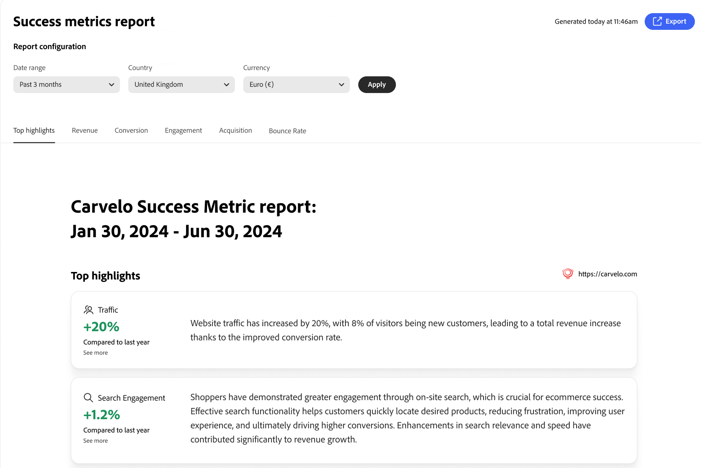
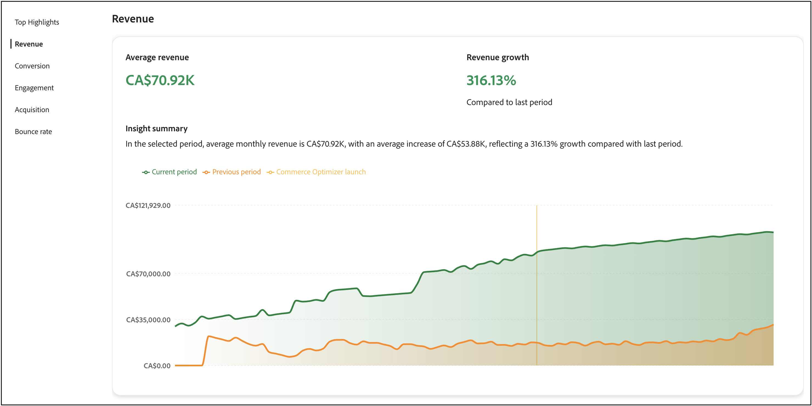
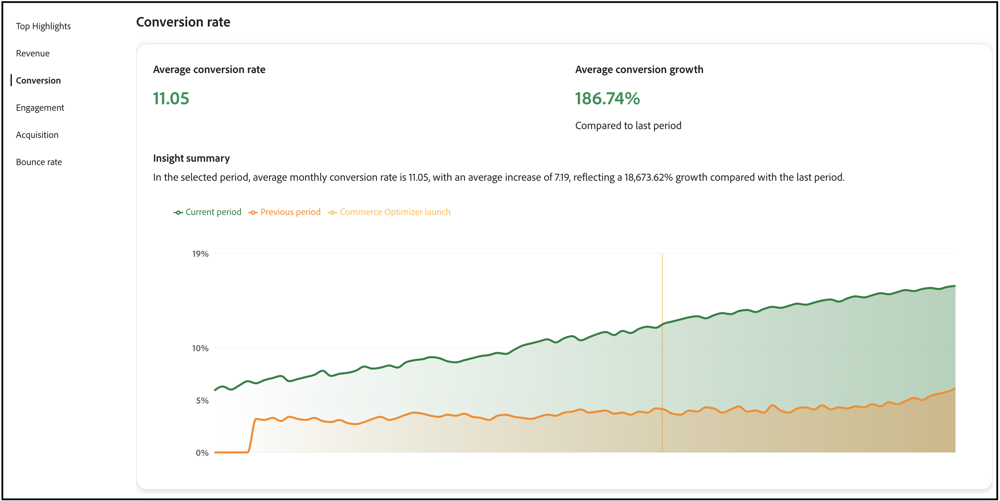
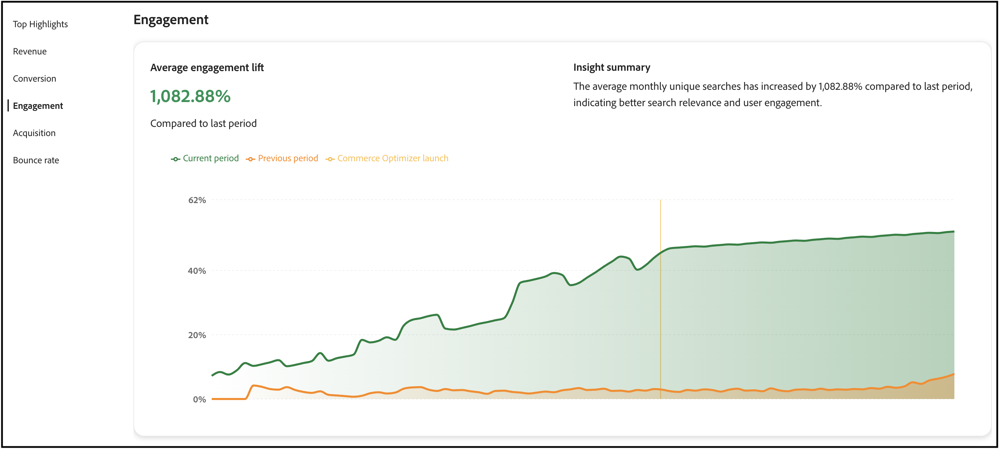
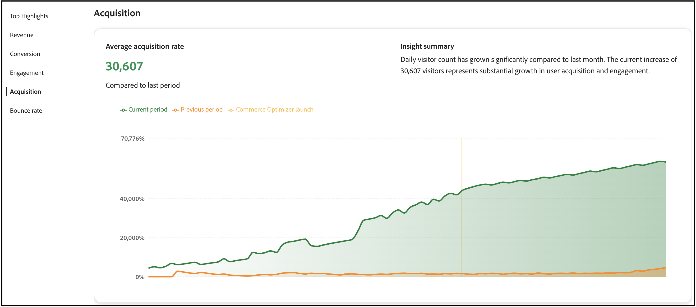
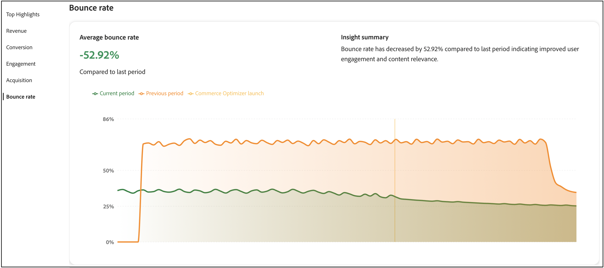

# 成功指標

このページでは、[!DNL Adobe Commerce Optimizer] ストアの主要パフォーマンス指標の概要を説明します。 目標は、[!DNL Adobe Commerce Optimizer]を実装した結果をすばやく把握し、成長の機会を特定し、最適化すべき領域を強調することにあります。



レポート内の指標は、ストアフロントイベントデータから取得されます。 収集されたイベントデータについて[詳細情報](../setup/events/overview.md)を表示します。

## 指標の理解

成功指標レポートは、ビジネス成果に直接影響を与える5つの重要なパフォーマンス分野について、実践的なインサイトを提供します。 各指標は、顧客行動のパターンと店舗のパフォーマンスを明らかにし、機会を発見して課題に対処するのに役立ちます。 これらのインサイトを活用して、よりスマートな意思決定を推進し、コマース体験を最適化しましょう。

**上位ハイライト**&#x200B;は、各パフォーマンス領域の主要指標をまとめたものです。 このセクションでは、改善点をすばやく特定するための方法を解説します。

主要業績評価指標は次のとおりです。

- **収益** – 総売上パフォーマンスを示す主要な財務指標。
- **コンバージョン** – 購入を完了した訪問者の割合。
- **エンゲージメント**：ユーザーがサイトを積極的に操作する様子。
- **獲得** – 顧客獲得の取り組みの効果。
- **直帰率** - 1つのページのみを表示した後に離脱した訪問者の割合。

### データの鮮度と正確性

**更新頻度：**&#x200B;成功指標データは、ストアフロントイベントが収集および処理されると、定期的に処理および更新されます。

**指標を確認するタイミング：**&#x200B;最も正確なトレンド分析を行うには、有意義なデータを収集するのに十分な時間が経過した後で指標を確認します。 日々の変動は正常です。戦略的意思決定では、週単位または月単位のトレンドに焦点を当てます。

**データの正確性：**&#x200B;指標は、ストアフロントイベントを通じて獲得した実際の顧客インタラクションから計算されます。 正確なレポートを行うために、ストアに適切な[&#x200B; イベントトラッキングが設定されていることを確認します](../setup/events/overview.md)。

## レポートの生成

1. 左側のパネルから、「**成功指標**」を選択します。
1. **レポート設定**&#x200B;で、ロケール設定に基づいて&#x200B;**日付範囲**、**カタログソース**、および&#x200B;**通貨**&#x200B;を指定します。
1. **[!UICONTROL Apply]**&#x200B;をクリックします。

   **上位ハイライト**、**収益**、**コンバージョン**、**エンゲージメント**、**獲得**&#x200B;および&#x200B;**直帰率**&#x200B;はすべて、レポート設定に基づいて更新されます。

1. レポートをPDFとして保存するには、**[!UICONTROL Export]**&#x200B;をクリックします。

## 成功指標とSites Optimizerの連携

成功指標とSites Optimizer （[Opportunities](opportunities.md)）は、コマースサイトのパフォーマンスを向上させるために設計された補完的なツールです。 これらの機能の違いを理解することで、より優れた意思決定をおこない、測定可能な結果を達成することができます。

### 主な違い

| 縦横 | 成功指標 | Sites Optimizer（オポチュニティ） |
|---|---|---|
| **目的** | パフォーマンスと成果の測定 | 問題を特定し、推奨事項を提示 |
| **種類** | 分析ダッシュボード | 先見的な問題検出 |
| **表示される内容** | 主要業績評価指標（収益、コンバージョン、エンゲージメント、獲得、直帰率） | サイトパフォーマンスに影響を与える問題に対する、AIを活用したレコメンデーション |
| **データソース** | ストアフロントのイベントデータ | 商品カタログ、検索ログ、レコメンデーションデータ |
| **使用日時** | 結果を継続的に追跡し | 特定の課題を特定し、修正したい |

### これらの機能の活用方法

最も効果的なアプローチでは、両方のツールを継続的な改善サイクルに組み合わせます。

1. **成功指標を使用した測定**：まず、成功指標ダッシュボードを確認して、現在のパフォーマンスを把握します。 改善が必要なKPI （コンバージョン率の低下や直帰率の高さなど）を特定します。

1. **商談の診断**:「商談」ページに移動して、パフォーマンスが低下する原因となる特定の問題を見つけます。 Sites Optimizerは、商品カタログ、検索ログ、レコメンデーションデータをスキャンし、商品データの欠落、検索関連性の低下、ナビゲーションの問題などの問題を特定します。

1. **推奨事項を実装**：検出された問題に対処するには、「商談」で提供されているAI主導の推奨事項に従ってください。 これには、商品データの品質問題の修正、SEOの改善、検索と発見の最適化などが含まれます。

1. **改善点を追跡**：成功指標に戻り、変更がKPIに与える影響を経時的に監視します。 日付範囲セレクターを使用して、レコメンデーションの実行前と実行後のパフォーマンスを比較します。

1. **反復と最適化**：このサイクルを継続し、商談を使用して新しい問題を特定し、成功指標を使用して最適化の影響を測定します。

### ワークフローの例

成功指標が低下していることに気づくマーチャント。 その両方の機能を活用する方法は、次のとおりです。

1. **問題の特定**：成功指標ダッシュボードでは、過去1か月間にコンバージョン率が15%低下しました。

1. **原因を見つける**：商談ページでは、いくつかの問題が表示されます。
   - 検索の関連性に影響を与える主要属性が欠落している複数の製品。
   - 人気のある検索クエリの検索結果が低い。
   - カテゴリーページのページ読み込み時間が遅い。

1. **アクション**:Sites Optimizerでは、検索とレコメンデーションに影響を与えるインパクトの大きい商談として分類されているため、マーチャントは最初に商品データ品質の問題を修正することを優先します。

1. **結果を測定**：製品属性を更新し、推奨される変更を実装した後、マーチャントは成功指標を毎週監視します。 翌月にはコンバージョン率が12%向上し、検索エンゲージメント指標も大幅に向上しました。

1. **最適化を続ける**: コンバージョン率が向上すると、マーチャントはオポチュニティに表示される次の優先事項、つまりページ読み込み速度の最適化によって直帰率を減らします。

### 各機能を利用するケース

**次の操作を行う場合は、成功指標を使用します：**

- ビジネス全体のパフォーマンスを把握。
- 変化の影響を長期的に測定。
- 注意が必要な分野を特定。
- 関係者とパフォーマンスレポートを共有する。
- 顧客行動の傾向を把握。

**次の操作を行う場合は、Sites Optimizer（商談）を使用します。**

- パフォーマンスに影響を与える特定の問題を特定。
- 問題を修正するための実用的なアドバイスを受け取る。
- 特定の指標の低下の原因を把握。
- 最初に取り組むべき最適化を特定する。
- AIを活用して、手作業で見落としがちな問題を特定します。

これらの機能を組み合わせることで、完全な解決策を提供します。成功指標は&#x200B;*何が*&#x200B;起こっているかを示し、Sites Optimizerは&#x200B;*なぜ*&#x200B;と&#x200B;*それを修正する方法*&#x200B;を示します。

## 次のステップと最適化戦略

成功指標データを利用して、改善機会を特定し、ターゲットを絞った最適化戦略を実施できます。 以下のセクションでは、各指標領域に関する、具体的で実用的なガイダンスを提供します。

>[!BEGINTABS]

>[!TAB 収益の最適化]

売上に関しては、総売上と平均注文額を増加させることが目標となります。



### 収益指標の理解

**それが測定するもの：**&#x200B;選択した期間中にストアが生成した合計収入。

**計算方法：**&#x200B;収益は、レポート期間中に販売されたすべての製品に対する、完了したすべての注文（基準価格×数量）の合計です。 計算には、ストアフロントに取り込まれた`place-order`件のイベントのデータが使用されます。

>[!IMPORTANT]
>
>収益計算では、`place-order` イベントがキャプチャされなかったキャンセルされた注文、返品、注文が除外されます。 同意設定、ブラウザーの問題（広告ブロッカー、スクリプトの失敗）、技術的な処理エラーなどにより、イベントが見つからない場合があります。

**式：**

```
Total Revenue = Sum of (Product Base Price × Quantity) for all completed orders
```

**データソース：** ストアフロントイベント（特に`place-order` イベント）

**含まれているもの：**

- 選択した日付範囲内に完了したすべての注文。
- 基本製品価格に購入数量を掛けた値。
- [!DNL Adobe Commerce Optimizer]様が追跡したすべての販売チャネルからの収益。

**重要なメモ：**

- 売上は、ストアフロントイベントで獲得した基本価格にもとづいて計算されます。
- レポート期間は、レポート設定で選択した日付範囲によって決まります。
- 新しい注文イベントが処理されると、収益指標が更新されます。

### 策定

- **AIを活用したレコメンデーションの実装**：オプティマイザーのレコメンデーションエンジンを使用して、コンバージョン率の向上につながる関連製品を表示します。 *これを閲覧したお客様が*&#x200B;および&#x200B;*これを購入し、それを購入した*&#x200B;件のレコメンデーションタイプをデプロイして、クロスセルの機会を増やします。

- **マーチャンダイジングルールを作成**: [&#x200B; マーチャンダイジングルール &#x200B;](../merchandising/rules/overview.md)を使用して、検索結果で利益率の高い商品を増やします。 トラフィックの多いクエリのために、売れ筋商品を検索結果の上位にピン留めします。

- **商品の発見を最適化**: [&#x200B; インテリジェントファセット &#x200B;](../merchandising/facets/overview.md)を使用して、顧客がより効率的に商品を見つけられるようにすることで、コンバージョン率の向上と売上の増加につながります。

- **季節ごとの機会を活用**：時間ベースのマーチャンダイジングルールを作成して、繁忙期に季節ごとの商品やプロモーション商品をプロモーションします。

>[!TAB  コンバージョン率の向上]

コンバージョン率を向上させるためには、より多くの訪問者を顧客に変えることが目標となります。



### コンバージョン率指標の概要

**測定値：**&#x200B;商品を閲覧してから購入を完了した訪問者の割合。ストアが閲覧者を購入者にどの程度効果的に転換しているかを示します。

**計算方法：** コンバージョン率は、製品を購入したユニーク訪問者の数と、製品を閲覧したユニーク訪問者の数を比較します。

**式：**

```
Conversion Rate = (Total Number of Orders ÷ Total Unique Visitors) × 100
```

**データソース：** ストアフロントイベント。

**仕組み：**

- **製品ビュー**&#x200B;は、訪問者が製品ページを表示する際（`product-view` イベントを使用）に追跡されます。
- **購入**&#x200B;は、注文が完了したときに追跡されます（`place-order` イベントを使用）。
- 計算は、特定の製品を閲覧したユーザーと購入したユーザーを一致させます。

**重要なメモ：**

- 複数の商品を閲覧したが、1回の購入をした訪問者は1回のコンバージョンとしてカウントされます。
- この指標は、ブラウザーベースの識別子を使用して、ユニーク訪問者を追跡します。
- 製品ビューイベントには常にクリックが含まれるため、ビューはユーザーの関心を表します。

### 策定

- **検索関連を最適化**: [類義語](../merchandising/synonyms/overview.md)を実装して、様々な検索語を使用する場合でも、顧客が探しているものを見つけられるようにします。 動的ファセットを使用して、関連するフィルターオプションを提供します。

- **戦略的レコメンデーションの配置**：商品詳細ページやカテゴリーページなど、トラフィックの多いページにレコメンデーションユニットをデプロイします。 *最も閲覧された*&#x200B;件と&#x200B;*最も購入された*&#x200B;件のレコメンデーションを使用して、信頼と緊急性を高めます。

- **商品の見つけやすさの向上**: マーチャンダイジングルールを使用すると、ベストセラー商品やコンバージョン率の高い商品が検索結果で目立つように表示されます。

- **A/B テストのレコメンデーションタイプ**：様々なレコメンデーションタイプとプレースメントを試して、オーディエンスにとって最適なものを見つけます。

>[!TAB  エンゲージメントの強化]

エンゲージメントを高めるには、顧客とのインタラクションを増やし、サイト滞在時間を増やすことが目標となります。



### エンゲージメント指標の理解

**何を測定するのか：** チェックアウトプロセスを通じて、初回の閲覧から有意義なアクションを追跡しながら、ユーザーがストアとどの程度積極的に関わっているかを示します。

**計算方法：** エンゲージメントは、商品の閲覧、ショッピングカートのアクティビティ、チェックアウトアクションなど、ストアへのアクティブな参加を示すあらゆるインタラクションを追跡します。

**データソース：** ストアフロント イベント

**エンゲージメントとしてカウントされるもの：**

エンゲージメントには、次のイベントカテゴリとアクションが含まれます。

- **製品インタラクション：**&#x200B;製品ビュー、製品クリック、製品の比較。
- **買い物かごのアクティビティ：**&#x200B;買い物かごに商品を追加、数量を更新、商品を削除します。
- **チェックアウトアクション：** チェックアウトを開始し、チェックアウト手順を完了しています。
- **カテゴリ参照：** カテゴリーページを表示し、ファセットで絞り込みます。
- **ウィッシュリスト アクティビティ：** ウィッシュリストに追加すると、ウィッシュリスト項目が表示されます。

**イベント追跡の詳細：**

このシステムは、イベントに次のイベントがある場合にエンゲージメントを追跡します。

- カテゴリー：`product`、`shopper`、`shopping-cart`、または`checkout`。
- プロパティ：`Product`、`Checkout`、`Cart`、`Category`または`Wishlist`。

**重要なメモ：**

- エンゲージメントの向上は、通常、コンバージョン率の向上と相関関係にあります。
- エンゲージメント指標は、利用者がジャーニーのどこで最も積極的に行動しているかを特定するのに役立ちます。
- エンゲージメントデータを活用して、トラフィックの多いページを最適化し、ユーザーエクスペリエンスを向上させます。

### 策定

- **レコメンデーションタイプを多様化**：同じレコメンデーションを繰り返し表示しないようにします。 *おすすめ*、*トレンド*、*最近閲覧*&#x200B;の組み合わせを使用して、コンテンツを新鮮で魅力的なものにしましょう。

- **インテリジェント検索の実装**: AIを活用した動的ファセット処理と結果の再ランキングを使用して、買い物客の行動にもとづいて検索結果をリアルタイムに適応させます。

- **パーソナライズされたエクスペリエンスを作成**: ホームページおよびカスタマージャーニー全体に「おすすめ」ユニットを展開して、パーソナライズされた製品の提案を提供します。

- **検索エクスペリエンスを最適化**：類義語を使用して検索の関連性を向上させ、顧客が探しているものをすばやく見つけられるようにします。

>[!TAB 顧客獲得の増加]

より多くの成長を獲得するためには、より多くの新規顧客を獲得し、獲得の効率を高めることが目標となります。



### 獲得指標について

**それが測定するもの：** ストアにアクセスする新規のユニーク訪問者の数。マーケティングと顧客獲得の取り組みの効果を把握するのに役立ちます。

**計算方法：**&#x200B;獲得は、ストアへの初回訪問時に割り当てられたブラウザーIDに基づいて、ユニーク訪問者をカウントします。

**データソース：** ストアフロントイベント。

**仕組み：**

- 各訪問者のブラウザーは、ファーストパーティ Cookieを介して一意の識別子（`domain_userid`）を受け取ります。
- 新しい訪問者は、セッションインデックスが1 （初回訪問）に等しい場合に識別されます。
- システムはこれらの識別子を追跡し、新規訪問者と再訪問者を区別します。

**重要なメモ：**

このトラッキング方法には、いくつかの既知の制限があります。

- **クロスデバイスユーザー：**&#x200B;異なるデバイス（デスクトップ、モバイル、タブレット）またはブラウザーから同じユーザーが訪問した場合、各デバイスとブラウザーは異なる識別子を受け取るため、同じユーザーが複数のユニーク訪問者としてカウントされます。
- **Cookieの消去：** ブラウザーのCookieを消去したユーザーには、新しいIDが割り当てられ、再度新しい訪問者としてカウントされます。
- **プライバシー設定：**&#x200B;厳格なプライバシー設定またはCookie ブロッカーを持つユーザーは追跡されない可能性があります。

**最適：**

- 新規訪問者のトレンドを長期的に追跡。
- マーケティングキャンペーンの効果の分析。
- トラフィックの増加パターンを把握。

**解釈のヒント：**&#x200B;上記の制限により、完全に正確とは言えませんが、取得指標は、ほとんどのユーザーが同じデバイスを閲覧し、Cookieを頻繁にクリアしない場合のトレンドの特定や期間の比較に役立ちます。

### 策定

- **検索パフォーマンスデータを活用**: [検索パフォーマンス &#x200B;](../manage-results/search-performance.md) レポートを使用して、トレンド商品や人気の検索語を特定します。 マーチャンダイジングルールを作成して、これらのアイテムを強調する：

- **レコメンデーションパフォーマンスを最適化**: [&#x200B; レコメンデーションパフォーマンス &#x200B;](../manage-results/recommendation-performance.md)指標を監視して、どのレコメンデーションタイプが最もトラフィックとコンバージョンを促進しているかを特定します。

- **新しい商品とプロモーション商品をハイライト表示**: マーチャンダイジングルールを使用して、検索結果で新商品やプロモーション商品を宣伝し、新規訪問者の注目を集めます。

- **トラフィックソースを追跡**: イベントデータを使用して、どのチャネルが最も価値のあるトラフィックをもたらすかを把握し、それにもとづいてマーケティング活動を最適化します。

>[!TAB 直帰率の減少]

直帰率を下げるには、訪問者の関心を維持し、単一ページへの訪問を減らすことが目標となります。



### バウンス率メトリックについて

**何を測定するか：** ユーザーエクスペリエンス、ページの関連性、またはサイトエンゲージメントに関する潜在的な問題を示す、1 ページのみを表示した後にサイトを離れる訪問者の割合。

**計算方法：**&#x200B;直帰率は、単一ページのセッションと合計セッションを比較して、それ以上のインタラクションを行わずに離脱する訪問者の割合を決定します。

**式：**

```
Bounce Rate = (Number of Bounced Sessions ÷ Total Sessions) × 100
```

**データソース：** ストアフロントイベント。

**仕組み：**

- **バウンス済みセッション**&#x200B;は、訪問者が訪問中に1 ページのみを閲覧した場合にカウントされます。
- システムは各セッション内のページビューを追跡し、シングルページ訪問を識別します。
- セッションは、ユーザーのアクティビティとインタラクション間の時間によって決まります。

**バウンスの原因：**

- 無関係なページに訪問者がランディングする（検索順位や広告のターゲティングが低い）。
- ページの読み込み速度が遅い。
- ユーザーエクスペリエンスの低下やわかりにくいナビゲーション：
- 情報をすばやく見つけることができ、その後さらに調査する必要はありません。
- 技術的な問題やエラー：

**重要なメモ：**

- 直帰率が高いとは、必ずしもマイナスであるとは限りません。一部のページ（連絡先情報や特定の製品仕様など）では、直帰率が高いことは自然です。
- 様々なページタイプとトラフィックソースの直帰率を比較して、問題点を特定します。
- 直帰率が急激に増加した場合、技術的な課題やキャンペーンのターゲティングが不十分であることを示している場合が多くあります。

**優れた直帰率とは何ですか？** 業種やページの種類によって異なりますが、一般的には：

- 40～60%：コマースサイトの平均
- 40%未満：優れたエンゲージメント。
- 70%以上：調査が必要な問題を示している可能性があります。

### 策定

- **検索の関連性を向上**：類義語とインテリジェント ファセットを使用して、顧客が関連性の高い商品をすばやく見つけられるようにします。 低品質な検索結果は、バウンス率が高い主な原因です。

- **レコメンデーションユニットの実装**: カテゴリおよび検索結果ページにレコメンデーションユニットをデプロイして、追加の製品オプションを提供し、訪問者の関心を維持します。

- **商品の見つけやすさを最適化**: マーチャンダイジングルールを使用して、最も関連性が高く人気のある商品を検索結果で最初に表示します。

- **魅力的なホームページエクスペリエンスを作成**: ホームページで「おすすめ」と「トレンド」のレコメンデーションタイプを使用して、訪問者に関連性の高いコンテンツを即座に提供します。

>[!ENDTABS]

## トラブルシューティングと最適化

### 指標が低下している場合

**売上減少**:

- レコメンデーション単位が引き続き有効で、パフォーマンスが高いかどうかを確認します。
- マーチャンダイジングルールを見直し、利益率の高い商品をプロモーションする。
- 検索パフォーマンスを分析して、人気商品が依然として上位に表示されているかどうかを特定します。

**コンバージョン率の低下**:

- 検索の関連性が維持されていることを確認します（類義語とファセットを確認）。
- レコメンデーション単位が正しく表示されていることを確認する。
- 対立や問題について、マーチャンダイジングルールを確認します。

**バウンス率が高い**:

- 検索結果の関連性を確認し、必要に応じて類義語を実装します。
- レコメンデーション単位が適切に読み込まれていることを確認します。
- 製品データの品質と可用性の確認。

**エンゲージメントが少ない**:

- 顧客の疲労を防ぐためにレコメンデーションタイプを多様化する。
- よりパーソナライズされたレコメンデーション戦略の実施。
- 優れたファセットと類義語により、検索体験を最適化。

## フィールドの説明

### レポート設定

| フィールド | 説明 |
|---|---|
| 日付範囲 | オプションには、**過去3か月**、**過去7日間**、**過去30日間**、**過去6か月**、**過去12か月**、**年から日付**&#x200B;が含まれます。 短期的な最適化インサイトには短期的な範囲を使用し、トレンド分析には長期的な範囲を使用します。 |
| 国 | [&#x200B; カタログ ビュー](../setup/catalog-view.md)に指定されたカタログ ソースに基づきます。 正確なパフォーマンス分析のために適切な市場を選択します。 |
| 通貨 | カタログビューに指定された通貨。 正確な売上レポートのために、これがターゲット市場と一致することを確認します。 |
| 書き出し | レポートをPDFとして保存し、関係者と共有したり、オフライン分析を行ったりできます。 |

## その他

- [検索パフォーマンス &#x200B;](../manage-results/search-performance.md) – 検索語を分析し、検索関連性を最適化します。
- [&#x200B; レコメンデーション パフォーマンス &#x200B;](../manage-results/recommendation-performance.md) - レコメンデーションの有効性を監視して最適化します。
- [&#x200B; レコメンデーションの概要](../merchandising/recommendations/overview.md) - AIを活用した商品レコメンデーションについて説明します。
- [&#x200B; マーチャンダイジングルール &#x200B;](../merchandising/rules/overview.md) – 検索結果で商品をブースト、埋め込み、ピン留め、非表示にする。
- [&#x200B; ファセット &#x200B;](../merchandising/facets/overview.md) - インテリジェントフィルタリングで検索を強化します。
- [類義語](../merchandising/synonyms/overview.md) – 検索の関連性と顧客体験を向上させます。
- [&#x200B; イベントの概要](../setup/events/overview.md) – 指標を強化するデータについて理解します。
