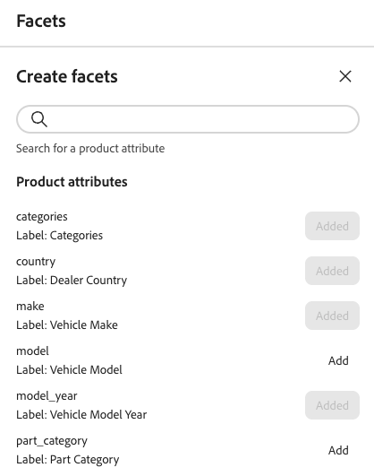

# ファセットの作成と管理

フィルター可能な製品属性は、ファセットとして使用できます。 ファセットは、顧客がストア内の商品を容易に絞り込み、見つけるのに役立ちます。 この記事では、ストアフロントでファセットを追加、管理、設定する方法について説明します。

## ファセットの作成

1. 左側のパネルで、_マーチャンダイジング_ > **ファセット**&#x200B;を選択し、**ファセットの作成**&#x200B;をクリックします。
1. *ファセットの作成* リストでは、使用可能な各属性に個別のがあります。 次のいずれかの操作を行います。

   - *ファセット属性* リストで、ファセットとして使用する製品属性を選択し、**追加**&#x200B;をクリックします。
   - 特定の製品属性を検索するには、*検索* ボックスに属性名の最初の数文字を入力します。 次に、**追加**&#x200B;をクリックします。

   ファセットが&#x200B;*動的ファセット* リストの下部に追加され、*変更を公開* ボタンが使用可能になります。

1. 追加するファセットが見つからない場合は、[&#x200B; メタデータ API](https://developer.adobe.com/commerce/services/reference/rest/#tag/Metadata)を使用して`filterable` パラメーターを設定します。

   `"filterable": true`

   ファセットは、次回カタログが[!DNL Adobe Commerce Optimizer]と同期されるときに、ストアフロントで使用できるようになります。 2時間後にファセットが利用できない場合は、[&#x200B; データ同期](../../setup/data-sync.md)を参照してください。

## ファセットプロパティの編集（オプション）

1. 編集したいファセットを見つけます。
1. その他のセレクター（）をクリックします。
1. メニューで、**編集**&#x200B;をクリックします。 次に、必要に応じて次のプロパティを調整します。

   - ラベル – 使用するファセットラベルを入力します。
   - 並べ替えタイプ – 次のいずれかを選択します。
      - アルファベット順 – ファセットをアルファベット順に並べ替え
      - カウント – 見つかった一致の数に基づいてファセットを並べ替えます
   - 最大値 – ストアフロントに表示されるファセット値の最大数を入力します。 有効なエントリ：0 ～ 100、デフォルト：8。

1. 完了したら、**保存**&#x200B;をクリックします。

## ファセットのピン留め/ピン留めを解除

ピンはクリックすると色が変わり、ファセットを&#x200B;*ピン留めファセット*&#x200B;または&#x200B;*動的ファセット* セクションのいずれかに移動するために使用されます。

1. ファセットを&#x200B;*フィルター* リストの先頭にピン留めするには、*動的ファセット* リストでファセットを見つけ、グレーのピン （）をクリックします。

   ピンが青になり、ファセットが&#x200B;*ピン留めファセット* セクションに移動します。

1. ファセットのピン留めを解除するには、*ピン留めファセット* リストでファセットを見つけ、青いピン （）をクリックします。

   ピンがグレーになり、ファセットが&#x200B;*動的ファセット* セクションに移動します。

>[!NOTE]
>
>同じ名前を持つ2つのラベルがある場合、ピン留めされたファセットの順序に一貫性がない可能性があります。

## ファセットの削除

1. リスト内のファセットを見つけ、その他のセレクター（）をクリックします。
1. 「**削除**」をクリックします。
1. 確認を求められたら、**ファセットを削除**&#x200B;をクリックします。
変更が公開されると、ファセットはストアフロントから削除されます。

## 変更を公開

1. 変更を加えてストアフロントを更新するには、**[!UICONTROL Publish]**&#x200B;をクリックします。
1. 更新がストアに表示されるまで約15分待ちます。

## 追加情報

- 価格ファセットの間隔とグループ化を設定するには、[設定](../../settings.md)を参照してください。
- ファセットの[types](type.md)について詳しく説明します。
