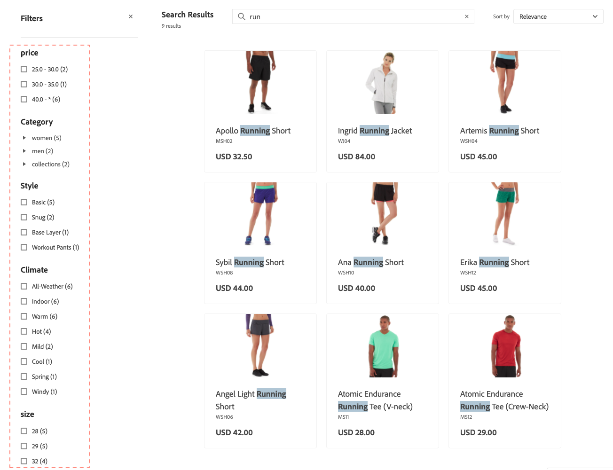

# ファセット

ファセットは、属性値の複数の次元を検索条件として使用する高性能フィルタリングの方法です。

買い物客は、ファセット内で「スタイル」の下の「基本」や「スナップ」など、複数のオプションを選択でき、検索結果はそれらのスタイルのみを表示するように更新されます。 同様に、買い物客が「スタイル」の「基本」や「気候」の「屋内」など、複数のファセットにまたがるオプションを選択した場合、検索結果は選択したスタイルと選択した気候を表示するように更新されます。

定義されたファセットはURL パラメーターとして使用でき、結果はパラメーター値`http://yourstore.com?brand=acme&color=red`に基づいてフィルタリングされます。

## ファセット集計

ファセットの集計は次のように実行されます。ストアフロントが3つのファセット（カテゴリ、色、価格）を持ち、買い物客が3つすべてのファセットにフィルターを適用した場合（色=青、価格は$10.00～50.00、カテゴリ= `promotions`）。

- `categories`集計 – `categories`を集計し、`color`および`price` フィルターを適用しますが、`categories` フィルターは適用しません。
- `color`集計 – `color`を集計し、`price`および`categories` フィルターを適用しますが、`color` フィルターは適用しません。
- `price`集計 – `price`を集計し、`color`および`categories` フィルターを適用しますが、`price` フィルターは適用しません。

## デフォルトの属性値

次の製品属性は[!DNL Adobe Commerce Optimizer]によって使用され、デフォルトで有効になっています。

| プロパティ | 説明 | 属性 |
|---|---|---|
| 並べ替え | 製品リストでの並べ替えに使用されます | `price` |
| 検索可能 | 検索で使用 | `price`  `sku` `name` |

製品属性とそのプロパティについて詳しくは、[Data Ingestion Metadata API](https://developer.adobe.com/commerce/services/optimizer/data-ingestion/#metadata)を参照してください。

## 階層検索と検索タイプの拡張

階層検索（検索内の検索）とは、従来の検索機能を拡張して追加の検索パラメーターを含める、属性ベースのフィルタリングシステムです。 こうした検索パラメーターの追加により、より正確で柔軟な商品検索が可能になります。

階層検索を使用すると、次のことができます。

- 買い物客が検索結果から検索できるようにします。
- レイヤー検索の2番目のレイヤーで`startsWith`と`contains`の検索インデックスを使用して、結果をさらに絞り込みます。

高度な検索機能は、特定の演算子を使用して、[`productSearch` クエリ &#x200B;](https://developer.adobe.com/commerce/webapi/graphql/schema/live-search/queries/product-search/)の`filter` パラメーターを通じて実装されます。

- **階層検索** – 別の検索コンテキスト内の検索 – この機能を使用すると、検索クエリに対して最大2つの検索レイヤーを実行できます。 例：

   - **レイヤー1検索** - `product_attribute_1`で「motor」を検索します。
   - **レイヤー2検索** - `product_attribute_2`で「パーツ番号123」を検索します。 次の使用例は、&quot;motor&quot;の検索結果から&quot;part number 123&quot;を検索します。

  階層検索は、次の説明に従って、階層検索の2番目のレイヤーの`startsWith`検索インデックスと`contains`検索インデックスの両方で使用できます。

- **startsWith検索インデックス** - `startsWith`個のインデックスを使用して検索します。 この機能により、次のことが可能になります。

   - 属性値が指定された文字列で始まる製品を検索します。
   - 「で終わる」検索を設定して、買い物客が属性値が特定の文字列で終わる商品を検索できるようにします。
      - 「end with」検索を有効にするには、product属性を逆に取り込む必要があり、API呼び出しも逆の文字列にする必要があります。 例えば、「パンツ」で終わる商品名を検索する場合は、これを「スタンプ」として送信する必要があります。

- **には検索インデックスが含まれています** - 「含まれている」インデックスを使用して属性を検索します。 この新しい機能により、次のことが可能になります。

   - 大きな文字列内のクエリを検索しています。 例えば、買い物客が「HAPE-123」という文字列で「PE-123」という商品番号を検索した場合です。

      - 注意：この検索タイプは、オートコンプリート検索を実行する既存の[語句検索](https://developer.adobe.com/commerce/webapi/graphql/schema/live-search/queries/product-search/#phrase)とは異なります。 たとえば、product属性値が「outdoor pants」の場合、語句検索は「out pan」の応答を返しますが、「or ants」の応答は返しません。 Aは検索を含んでいますが、「or ants」に対する応答を返しません。

これらの新しい条件は、検索クエリフィルタリングメカニズムを強化して、検索結果を絞り込みます。 これらの新しい条件は、メインの検索クエリには影響しません。

### 導入

1. [属性を検索可能に設定](https://developer.adobe.com/commerce/services/reference/rest/#tag/Metadata)。

1. その属性の検索機能を指定します（**Contains** （デフォルト）または&#x200B;**Starts with**&#x200B;など）。 **Contains**&#x200B;に対して有効にする属性を最大6つ、および&#x200B;**に対して有効にする属性を最大6つ指定できます。最初は**&#x200B;です。 さらに、**Contains**&#x200B;の索引の場合、文字列の長さは50文字以下に制限されます。

1. 新しい`contains`および`startsWith`検索機能を使用して[!DNL Commerce Optimizer] API呼び出しを更新する方法の例については、[開発者ドキュメント &#x200B;](https://developer.adobe.com/commerce/webapi/graphql/schema/live-search/queries/product-search/#filtering-using-search-capability)を参照してください。

   これらの新しい条件を検索結果ページに実装できます。 例えば、ページに新しいセクションを追加し、検索結果をさらに絞り込むことができます。 買い物客が「製造元」、「部品番号」、「説明」など、特定の製品属性を選択できるようにします。 そこから、`contains`または`startsWith`条件を使用して、これらの属性内を検索します。

### ファセットではなくレイヤー検索を使用する場合

階層検索とファセットは、商品の検索において異なる目的を果たします。目的は、特定のユースケースによって異なります。

**階層検索を使用して次の操作を行います：**

- 複数の条件を使用した検索結果の検索
- ユーザーが部分的な情報を把握している部品番号、SKU、技術仕様を使用する
- ネストされた基準を使用して、ステップバイステップで結果を絞り込むことができます
- 単一のクエリで複数の検索条件を組み合わせることで、API呼び出しの数を削減します
- 標準的なファセットナビゲーションを超えた、ビジネスに特化した検索パターンを実装したい

**ファセットを使用：**

- 一般的なカテゴリ、価格、ブランド、属性のフィルタリングを提供する
- ユーザーが理解しやすく、選択しやすい直感的なフィルターオプションを提供します
- 現在の検索結果に基づいて利用可能なオプションを表示
- フィルターの数と範囲を表示して、ユーザーが使用可能なオプションを理解できるようにします
- 色、サイズ、素材など、一般的な製品特性を活用

**ベストプラクティス：** ユーザーが特定の条件を持つ複雑な技術的な検索には階層検索を使用し、ユーザーがオプションを視覚的に検索して絞り込みたい標準e コマース フィルタリングにはファセットを使用します。
