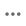

# レコメンデーションの作成と管理

レコメンデーションを作成する場合、推奨製品&#x200B;_品目_&#x200B;を含む&#x200B;_レコメンデーションユニット_、またはウィジェットを作成します。

_レコメンデーションユニット_

レコメンデーションユニットをアクティブ化すると、Adobe Commerceはインプレッション数、閲覧数、クリック数などを測定するために[ データの収集](../../manage-results/recommendation-performance.md)を開始します。 Recommendations テーブルには、ビジネス上の意思決定に役立つ各レコメンデーションユニットの指標が表示されます。

1. _[!DNL Adobe Commerce Optimizer]_サイドバーで、_ マーチャンダイジング _>**Recommendations**に移動して、_ Recommendations _ワークスペースを表示します。

1. **カタログ ビュー** フィールドで、レコメンデーションを使用するカタログ ビューを選択します。 レコメンデーションにカタログビューを使用する[の詳細](../../manage-results/recommendation-performance.md#select-catalog-view)。

   >[!IMPORTANT]
   >
   >この機能は現在[ ベータ版](https://experienceleague.adobe.com/en/docs/commerce-operations/release/beta#merchandising-rules-globally-and-per-catalog-view-public-beta)です。 Betaの参加者は、新しいカタログビュースコープを活用するために、既存のレコメンデーションユニットを再作成する必要があります。

1. 「**レコメンデーションを作成**」をクリックします。

   作成したレコメンデーションは、以前に選択したカタログビューで使用できます。

1. 「_推奨事項に名前を付ける_」セクションに、`Home page most popular`など、内部参照用にわかりやすい名前を入力します。

1. 「_レコメンデーションタイプを選択_」セクションで、戦略に基づいて必要なレコメンデーションの[ タイプ ](types.md)を指定します。

1. _ストアフロントの表示ラベル_ セクションに、「トップセラー」など、買い物客に表示される[ ラベル ](best-practice.md#recommendation-labels)を入力します。

1. _製品数を選択_ セクションで、レコメンデーションユニットに表示する製品数をスライダーで指定します。

   デフォルトは`5`で、最大`20`です。

1. （オプション）「_フィルター_」セクションで、[ フィルターを適用](filters.md)して、レコメンデーションユニットに表示される製品を制御します。

1. _おすすめ商品プレビュー_ パネルを使用すると、フィルターがレコメンデーションユニットに表示される商品にどのように影響するかをより詳細に把握できます。 レコメンデーションを[ プレビュー](#preview-recommendations)する方法について詳しく説明します。

1. 完了したら、次のいずれかをクリックします。

   - **ドラフトとして保存**&#x200B;して、後でレコメンデーションユニットを編集します。 ドラフト状態のレコメンデーションユニットのレコメンデーションタイプは変更できません。

   - **有効化**&#x200B;して、ストアフロントでレコメンデーションユニットを有効にします。

   レコメンデーションがRecommendations ワークスペースに表示されます。 ストアフロントでレコメンデーションを使用するには、[ レコメンデーション ID](#get-recommendation-id)を見つける必要があります。

>[!NOTE]
>
>最大50個のアクティブなレコメンデーションユニットを作成できます。 詳しくは、[制限と境界](../../boundaries-limits.md)を参照してください。

>[!IMPORTANT]
>
>一部のブラウザーでは、Recommendationsが期待どおりに動作しないクリティカルなスクリプトがブロックされる場合があります。

## レコメンデーションをプレビュー

_おすすめ商品プレビュー_ パネルは、ストアフロントにデプロイされたときにレコメンデーションユニットに表示される商品のサンプル選択とともに常に使用できます。

実稼動以外の環境で作業する際にレコメンデーションをテストするには、別のソースからレコメンデーションデータを取得します。 これにより、マーチャントは本番環境にデプロイする前に、ルールを試し、レコメンデーションをプレビューすることができます。

| フィールド | 説明 |
|---|---|
| カタログビュー |  |
| 名前 | 製品の名前。 |
| SKU | 製品に割り当てられた在庫保管単位 |
| 価格 | 製品の価格。 |
| 結果タイプ | プライマリ- レコメンデーションを表示するのに十分なトレーニングデータが収集されていることを示します。  バックアップ – 収集されたトレーニング データが不足しているため、スロットにバックアップの推奨事項を入力するために使用されます。 マシンラーニングモデルとバックアップの推奨事項について詳しくは、[行動データ ](../../setup/events/overview.md)にアクセスしてください。 |

レコメンデーションユニットを作成する際は、レコメンデーションタイプとフィルターを試して、含まれる製品に関するリアルタイムのフィードバックをすぐに得ることができます。 どの製品が表示されるかを把握し始めたら、ビジネスニーズに合わせてレコメンデーションユニットを設定できます。

単一ページに複数のレコメンデーションユニットがデプロイされている場合に、重複する製品を表示しないように、[!DNL Adobe Commerce Optimizer] [ フィルター](filters.md)のレコメンデーションを行います。 その結果、プレビューパネルに表示される製品とストアフロントに表示される製品が異なる場合があります。

マルチストアフロント、多言語、またはマルチブランドの設定の場合、各レコメンデーションをすべてのカタログビュー（グローバル）に適用するか、単一の[ カタログビュー](../../setup/catalog-view.md)に適用するかを設定できます。 レコメンデーションを操作する際に[ カタログビュー](../../manage-results/recommendation-performance.md#select-catalog-view)を設定する方法について詳しくは、こちらを参照してください。

## レコメンデーション IDを取得

レコメンデーションを作成したら、ストアフロントにレコメンデーションユニットを実装するために、そのIDを取得する必要があります。

1. **Recommendations** ページで、推奨事項を選択します。

1. レコメンデーション名の横にある情報アイコン（）をクリックします。

   **Recommendation Unitの詳細** ページが表示されます。

   

1. **Recommendation ID** セクションで、IDをコピーします。

1. このIDを使用して、Edge Delivery Services ストアフロントで[ レコメンデーションドロップイン ](https://experienceleague.adobe.com/developer/commerce/storefront/merchants/blocks/product-recommendations/)を設定します。

## 既存のレコメンデーションの管理

既存のレコメンデーションを編集、非アクティブ化、または削除できます。

1. _[!DNL Adobe Commerce Optimizer]_サイドバーで、_ マーチャンダイジング _>**Recommendations**に移動します。

1. 修正するレコメンデーションを選択します。

1. その他のセレクター（）をクリックします。

1. メニューでは、レコメンデーションを&#x200B;**非アクティブ化**、**削除**、または&#x200B;**編集**&#x200B;できます。 **編集**&#x200B;を選択すると、必要に応じて次の設定を調整できます。

   - 推奨事項の名前
   - ストアフロントラベル
   - 製品数
   - 商品を絞り込む

   レコメンデーションタイプやカタログビューは変更できません。 レコメンデーションの作成時にカタログビューが設定されます。 詳しくは、[ カタログ ビューの選択](../../manage-results/recommendation-performance.md#select-catalog-view)を参照してください。

1. 完了したら、**変更を保存**&#x200B;をクリックします。

## 準備状況インジケーター

準備状況の指標は、利用可能なカタログと行動データにもとづいて、最もパフォーマンスの高いレコメンデーションタイプを示します。 また、[ イベント収集](../../setup/events/overview.md)に関する潜在的な問題を特定したり、レコメンデーションタイプが結果を生成するのに十分なトラフィックを受信していないかどうかを判断したりするのにも役立ちます。

準備状況インジケーターは、[静的ベース ](#static-based)または[動的ベース ](#dynamic-based)のいずれかに分類されます。 静的ベースはカタログデータのみを使用し、動的ベースは買い物客の行動データを使用します。 その行動データを使用して、[機械学習モデルをトレーニング ](../../setup/events/overview.md)し、パーソナライズされたレコメンデーションを作成し、その準備状況スコアを計算します。

### 準備状況インジケーターの計算方法

準備状況インジケーターは、モデルがどの程度トレーニングされているかを示します。 指標は、収集されたイベントの種類、インタラクションした製品の幅広さ、カタログのサイズに依存します。

準備状況インジケーターの割合は、レコメンデーションタイプに応じて推奨される製品数を示す計算から得られます。 統計は、カタログの全体的なサイズ、インタラクションの量（ビュー、クリック、カートへの追加など）、特定の時間枠内にそれらのイベントを登録するSKUの割合に基づいて製品に適用されます。 例えば、ホリデーシーズンのピーク時のトラフィックでは、準備状況インジケーターの値が通常のボリューム時よりも高くなる場合があります。

これらの変数の結果として、準備状況インジケーターのパーセントが変動する可能性があります。 この変動は、レコメンデーションタイプが「デプロイの準備が整っている」ことと確認される理由を説明します。

準備状況の指標は、次のような要素にもとづいて計算されます。

- 十分な結果セットのサイズ：[ バックアップの推奨事項](../../setup/events/overview.md#backup-recommendations)の使用を避けるために、ほとんどのシナリオで十分な結果が返されますか？
- 十分な結果セットの種類：返品される商品は、カタログの様々な商品を表していますか？ この要素の目標は、サイト全体で推奨される商品が少数であることを避けることです。

上記の要因に基づいて、準備状況の値が計算され、次のように表示されます。

- 75%以上とは、そのレコメンデーションタイプに提案されたレコメンデーションが非常に関連性が高いことを意味します。
- 50%以上の場合、そのレコメンデーションタイプで提案されたレコメンデーションが関連性が低いことを意味します。
- 50%未満とは、そのレコメンデーションタイプで提案されたレコメンデーションが関連性がない可能性があることを意味します。 この場合、[ バックアップの推奨事項](../../setup/events/overview.md#backup-recommendations)が使用されます。

準備状況インジケーターが低い理由[の詳細を説明します](#what-to-do-if-the-readiness-indicator-is-low)。

### 静的ベース

次のレコメンデーションタイプは、カタログデータのみを必要とするため、静的ベースです。 行動データは使用されません。

- _その他_

### ダイナミックベース

次のレコメンデーションタイプは、ストアフロントの行動データを使用するため、動的ベースです。

過去6 ヶ月間のストアフロント行動データ：

- _閲覧、閲覧_
- _閲覧、購入_
- _これを購入し、それを購入しました_
- _あなたにおすすめ_

過去7日間のストアフロント行動データ：

- _閲覧数_
- _購入回数_
- _最もカートに追加された商品_
- _トレンド_
- _購入のコンバージョンを表示_
- _カートへのコンバージョンを表示_

最新の買い物客の行動データ（ビューのみ）:

- _最近表示した_

### 進捗の可視化

各レコメンデーションタイプのトレーニングの進捗状況を視覚化するために、_レコメンデーションタイプを選択_ セクションには、各タイプの準備状況の指標が表示されます。

_レコメンデーションタイプ_

>[!NOTE]
>
>指標は100%に達することはありません。

カタログデータに依存するレコメンデーションタイプの準備状況インジケーターは、マーチャントのカタログがほとんど変更されないため、あまり変化しません。 しかし、買い物客の行動データにもとづくレコメンデーションタイプの準備状況インジケーターは、買い物客の日々のアクティビティによって異なる場合があります。

#### 準備状況インジケーターが低い場合の対処方法

準備率が低い場合は、このレコメンデーションタイプのレコメンデーションに含める資格のあるカタログの商品が多くないことを示します。 つまり、このレコメンデーションタイプをデプロイすると、[ バックアップのレコメンデーション ](../../setup/events/overview.md#backup-recommendations)が返される可能性が高くなります。

>[!IMPORTANT]
>
>_バンドル_、_グループ化_、カスタム製品タイプはサポートされていません。 カタログにこれらの製品タイプが多数含まれている場合、低い準備状況スコアが期待できます。 さらに、スペースを含むSKUは、レコメンデーションの関連性を低下させる可能性があるため、使用を避ける必要があります。

一般的な低い準備状況スコアに対して考えられる理由と解決策を次に示します。

- **静的ベース** – これらの指標の低い割合は、表示可能な製品のカタログデータが見つからないことが原因で発生する可能性があります。 想定よりも低い場合は、完全同期によってこの問題を修正できます。
- **動的ベース** – 動的ベースの指標に対する低い割合は、次の原因で発生する可能性があります。

   - それぞれのレコメンデーションタイプ（requestId、製品コンテキストなど）の必須[ ストアフロントイベント ](../../setup/events/overview.md)にフィールドがありません。
   - ストアへのトラフィックが少ないため、受信する行動イベントの量が少ない。
   - ストア内のさまざまな商品をまたいで、ストアフロントの行動イベントの種類が少ない。 例えば、製品の10%しか頻繁に閲覧または購入されていない場合、それぞれの準備状況インジケーターは低くなります。
