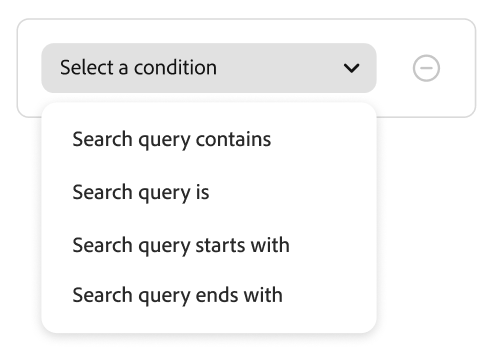
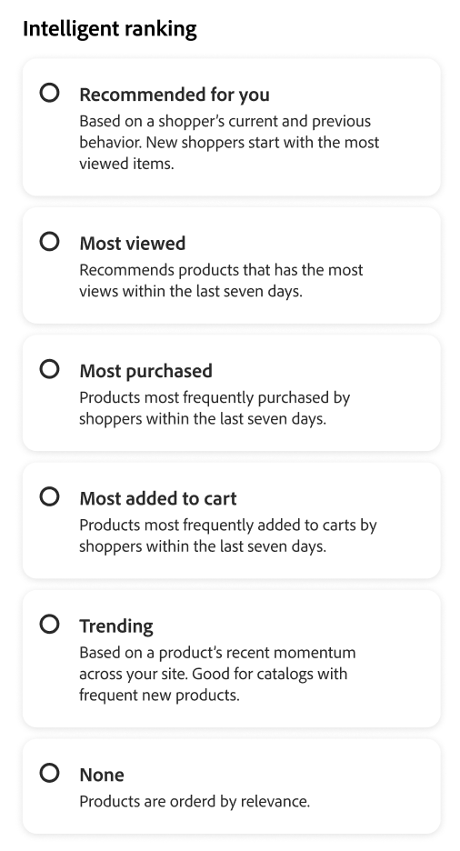

# ルールの作成と管理

ルールを作成するには、まずルールエディターを使用して、関連するイベントをトリガーにする買い物客のクエリテキストの条件を定義します。 次に、ルールの詳細を完了し、結果をテストして、ルールを公開します。

## ルールの作成

1. 左パネルで、_マーチャンダイジング_/**マーチャンダイジングルール** に移動します。
1. 「**ルールを作成**」をクリックして、ルールエディターを起動します。

「**ルールを作成**」セクションでは、特定の検索条件、条件、ランキングタイプを定義します。

1. 「**[!UICONTROL Name]**」フィールドに、ルールの名前を入力します。 すべてのルール名は一意である必要があります。
1. **[!UICONTROL Description]** フィールドに、ルールの説明を入力します。
1. **[!UICONTROL Date range]** フィールドで、ルールをアクティブにする日付または日付の範囲を指定します。
1. 「**[!UICONTROL Rule applies to]**」セクションには、**[!UICONTROL All product listings]** と **[!UICONTROL Specific conditions]** の 2 つのオプションがあります。

   - **すべての製品リスト** – 基本的にデフォルトのルールであり、より具体的な検索クエリが定義されていない限り、すべての検索クエリに適用されます。 作成できるデフォルトルールは 1 つだけで、条件を含めることはできません。 インテリジェントランキングタイプと、すべてのデフォルト検索に適用する手動ランキングを選択します。
   - **特定の条件** - ルールに設定できる条件のタイプについては、次の節を参照してください。

### 条件

条件は、イベントをトリガーするための要件です。 1 つのルールには、最大 10 個の条件と 25 個のイベントを含めることができます。 既定のルールには条件を設定できません。

#### 単一条件

1. *ルールを作成* の下で、満たす **条件** を選択し、指示に従って文を完成させます。

   - 検索クエリに次を含める – 買い物客のクエリに含める必要があるテキストの文字列を入力します。 「一致」設定では、買い物客のクエリがカタログと一致する度合いを決定します。 オプション：  すべて – 買い物客のクエリテキストのどの部分も条件に一致する可能性があります。  すべて – 買い物客のすべてのクエリが条件に一致する必要があります。
   - 検索クエリは – 買い物客のクエリと完全に一致するテキスト文字列を入力します。 例：「ヨガパンツ」。 `Search query is` と Match `All` を持つルールには、条件を 1 つだけ指定できます。
   - 検索クエリの先頭の文字 – 買い物客のクエリの先頭にする必要がある文字またはテキスト文字列を入力します。
   - 検索クエリが次で終わる – 買い物客のクエリの最後にする必要がある文字またはテキスト文字列を入力します。

   結果は、「*ルールをテスト*」ペインにすぐに表示され、優先度別に番号が付けられます。 右上の *1 行あたりの結果* スライダーを使用して、各行の製品数を変更できます。

1. 他のクエリをテストするには、「*ルールをテスト*」検索ボックスのクエリテキストを変更し、**Return** キーを押します。
最初、テストペインでは条件検索ボックスからクエリがレンダリングされます。 ただし、現在は、テストクエリボックスからクエリをレンダリングしています。 テストペインでは、一度に 1 つのクエリのみがレンダリングされます。
1. 結果が気に入ったら、「*条件*」検索ボックスのテキストを更新します。 次に、ページ上の任意の場所をクリックして、テストペインの結果を更新します。

#### 複数の条件

1. 複数の条件を持つルールを作成するには、「**条件を追加**」をクリックします。
ルールには、最大 10 個の条件を指定できます。 2 つの条件を結合する論理演算子は、現在の *一致* 設定に基づいています。 デフォルトでは、*Match* は `All` で、論理演算子は `AND` です。

1. 2 番目の条件を選択し、必要なクエリテキストを入力します。

1. ルールのロジックを変更するには、「**一致**」設定を変更して、買い物客の検索条件がクエリ条件にどの程度一致する必要があるかを決定します。 **一致** を次のいずれかに設定します。

   - 任意 – （デフォルト）ルール内のすべての論理演算子は `OR` に設定され、結果がテストペインに表示されます。
   - すべて – ルール内のすべての論理演算子が `AND` に設定され、結果がテストペインに表示されます。

   *Match* 値は、複数の条件の結合に使用される論理演算子を決定します。 *一致* 設定を変更すると、ルール内のすべての論理演算子が変更されます。 `AND` と `OR` を同じルールに組み合わせることはできません。

   この例では、「yoga pants」ではなく、「yoga」または「pants」を検索する 2 つの異なるクエリがあります。 このルールは特異性が低く、他のルールよりもストアフロントでトリガーされる頻度が高くなります。

1. 別の条件を追加するには、「**条件を追加**」をクリックしてプロセスを繰り返します。

### インテリジェントランキング

インテリジェントランキングは、ユーザーの行動とサイト統計を組み合わせて、製品ランキングを決定します。
ストアの所有者は、次のタイプのランキング戦略を設定できます。

- 最も多く購入された：これにより、過去 7 日間の SKU あたりの合計購入数で製品がランク付けされます。
- 買い物かごに最も追加された – 過去 7 日間の合計「買い物かごに追加」アクティビティの順にランク付けされます。
- 最も多く閲覧された：過去 7 日間の SKU ごとの合計閲覧回数をランク付けします。
- あなたにお勧め – この SKU を表示した買い物客も、`viewed-viewed` の他の SKU を見ています。
- トレンド：過去 72 時間のページビューイベントをバックグラウンドイベントで、24 時間のフォアグラウンドイベントで振り返ります。
- なし：製品は関連度で並べ替えられます。

ルールの戦略のタイプを選択します。 **ルールをテスト** ウィンドウに、期待される結果が表示されます。

#### インテリジェントなランキングスコアリングの仕組み

インテリジェントランキングは、**テキスト上の関連性** と **行動信号** の 2 つの主要な要因を組み合わせて、最終的な製品順序を決定します。 これらの要因がどのように相互作用するかを理解することで、検索結果に対する現実的な期待を設定するのに役立ちます。

**スコアリングコンポーネント：**

- **テキストの関連性**：スコアリングの主要な要因。 これは、製品の名前、説明および属性が検索クエリにどの程度一致するかを測定します。 テキストの関連性スコアは境界なし（具体的な上限はありません）で、次のような要因の影響を受けます。

   - 一致する単語の発生頻度。
   - 製品名/説明の長さ（単語単位）。

- **行動シグナル**：テキストの関連性スコアの上に適用される制限付きブースト。 「最も多く閲覧された」や「最も購入された」などのインテリジェントなランキング戦略を選択すると、行動シグナルの高い製品はスコアが固定ブーストされます。 ただし、このブーストには定義された制限があります。

**最も多く閲覧された製品が最初に表示されない可能性がある理由：**

通常、テキストの関連性がランキングを支配するのは、行動のブーストが固定される一方で、スコアに境界がないからです。 その結果、強いテキスト一致を持つ製品は、より高いエンゲージメントシグナルを持つ製品を上回ることがよくあります。 行動ブーストだけでは、テキストの関連性の大きなギャップを補うことができない場合があります。 インテリジェントランキングでは、マッチ品質と買い物客のインタラクションの両方を考慮に入れることで、全体的な関連性を向上させ、この問題に対処します。 ただし、テキストの一致の品質は、引き続きランキングのプライマリドライバーです。

**例：**

販売者は、「最も多く閲覧された」インテリジェントなランキング戦略を使用して、「キャンドル」を検索します。 製品 SKU YAN-K-E-512 は表示数が最も多いので、結果の上部に表示されると予想されます。 ただし、次の製品ほど順位が高くなります。

- **テキサスキャンドル** （1 番目の位置）：短くて明確な製品名で、テキストの関連性スコアが非常に高くなります。 YAN-K-E-512 よりもビュー数は少ないものの、その優れたテキスト一致は行動の後押しを上回ります。

- **YAN-K-E-512** （下段）:「最も多く閲覧された」行動データでは最も高い表示百分率であるにもかかわらず、SKU ベースの複雑な名前によってテキスト関連性スコアが低くなります。 固定された行動ブーストでは、このテキストの関連性のギャップを克服するのに十分ではありません。

ルールを使用して製品の検索性を向上させる方法については、[&#x200B; 検索ルール &#x200B;](./best-practice.md#tips-to-optimize-search-rules) を参照してください。

#### 注意事項

- クエリでのアポストロフィと引用符は、一部の言語で、ランキングと関連性に関するいくつかの小さな問題を引き起こす可能性があります。
- インテリジェントランキングが正しく機能するように、検索またはフィルタリング **ファセット）に使用する属性の** 検索の重み付け）が `5` 以下であることを確認します。

検索の重み付けの設定について詳しくは、[Metadata API](https://developer.adobe.com/commerce/services/reference/rest/) を参照してください。

### 手動ランキング

**手動ランキング** とは、定義された条件が満たされた場合に検索結果を変更するアクションです。 1 つのルールには、最大 25 個のイベントを含めることができます。

- ブースト – 検索結果で製品を上に移動します。
- Bury – 検索結果で SKU を下に移動します。
- 製品をピン留め – 製品は、ページ上の選択した「位置」に表示されます。
- 製品を非表示 – 検索結果から SKU を除外します。

製品をピン留めする最も簡単な方法は、ドラッグ&amp;ドロップです。

1. テストペインで製品をクリックしてドラッグします。 目的の位置にドラッグ&amp;ドロップします。 「製品」および「位置」フィールドは、イベント ペインに自動的に入力されます。

ピン アイコンをクリックして、製品を現在の場所にピン留めすることもできます。 省略記号コンテキストメニューを使用して、「上にピン留め」または「下にピン留め」を使用します。

>[!NOTE]
>
>ピン留めできるのは、クエリで返された製品のみです。

または、イベントは手動で設定できます。

1. *イベント* で、関連する条件が満たされた場合に実行される **イベント** を選択します。

   例えば、「`Hide a product`」を選択します。 次に、非表示にする製品の名前を入力します。 製品は入力時に推奨されます。

1. 複数のイベントの場合、条件が満たされた場合にトリガーにしたい他のイベントを選択します。

### ルールの最終処理

1. テストペインでルールの結果を調べます。
1. ルールに複数のクエリがある場合は、ルールの影響を受ける可能性のあるクエリをそれぞれテストします。
1. 完了したら、「**保存して公開**」をクリックします。

   ルールが *ルール* ワークスペースのリストに追加されます。

1. アクティブなルールはすぐに有効になりますが、ストアフロントでキャッシュされたクエリ結果が更新されるまで、最大 15 分待つ必要がある場合があります。

>[!NOTE]
>
>デフォルトの並べ替え順「並べ替え基準：最も関連性の高い」が選択されている場合、ルールと手動でランク付けされた製品が検索結果に適用されます。 買い物客が並べ替え順を「名前で並べ替え」や「価格で並べ替え」などに変更すると、ルールと手動のランキングは無効になります。

## ルールの編集、表示、削除

既存のルールのプロパティを更新するには、次の手順に従います。

### ルールを編集

1. *マーチャンダイジングルール* ワークスペースで、編集するルールをグリッドで見つけ、「**その他** （...）」オプションをクリックします。
1. 「**編集**」をクリックして、ルールエディターにアクセスします。
1. 必要に応じて、条件、演算子、イベントを更新します。
1. 必要に応じて、名前、開始日と終了日、説明の各フィールドを更新します。 すべてのルール名は一意である必要があります。
1. ルールをテストします。
1. 変更内容を公開します。
ルールが *ルール* ワークスペースのリストに追加されます。 アクティブなルールはすぐに有効になりますが、ストアフロントでキャッシュされたクエリ結果が更新されるまで最大 15 分かかる場合があります。

### 詳細を表示

このオプションを使用すると、「ルール *テーブルに留まりながら、すべてのルールパラメーターを簡単に* 認できます。

1. *マーチャンダイジングルール* ワークスペースで、編集するグリッドでルールを見つけ、「**その他**」（...）オプションをクリックします。
1. 「**詳細を表示**」をクリックして、ルールパラメーターを表示します。
1. **編集** または **削除** を選択するか、「X」をクリックしてパネルを閉じます。

### ルールを削除

1. *ルール* ワークスペースで、編集するグリッド内のルールを見つけ、「**その他** （...）」オプションをクリックします。
1. **削除** をクリックします。

## フィールドの説明

### 条件（if）

| 条件 | 説明 |
|--- |--- |
| 検索クエリに次を含む | 買い物客のクエリに含まれる文字またはテキスト文字列。 この条件を満たすには、買い物客のクエリが 1 文字のみに一致する必要があります。 |
| 検索クエリは | 買い物客のクエリと完全に一致する文字またはテキスト文字列。 この条件を使用する場合、複数の条件を持つ複雑なクエリを構成することはできません。 |
| 検索クエリが次の語句で始まる | 買い物客のクエリは、この文字またはテキスト文字列で始まります。 |
| 検索クエリが次で終わる | 買い物客のクエリが、この文字またはテキスト文字列で終わる。 |

### 論理演算子

| 演算子 | 説明 |
|--- |--- |
| または | （デフォルト）論理演算子 `OR` は、2 つの条件を比較し、少なくとも 1 つの条件が true の場合にイベントをトリガーするための要件を満たしています。 |
| および | 論理演算子 `AND` は、2 つの条件を比較し、両方の条件が true の場合にイベントをトリガー化するための要件を満たします。 |

### 演算子に一致

| 演算子 | 説明 |
|--- |--- |
| 任意 | ルール内のすべての論理演算子を `OR` に変更し、一致する製品セットを返します。 |
| すべて | ルール内のすべての論理演算子を `AND` に変更し、一致する製品セットを返します。 |

### 手動ランキング

| イベント | 説明 |
|--- |--- |
| ブースト | 検索結果で SKU または SKU の範囲を上に移動します。 各には、テスト検索結果で「ブースト済み」プレビューバッジが付きます。 |
| 埋める | 検索結果で SKU または SKU の範囲を下に移動します。 各には、テスト検索結果の「埋め込み」プレビューバッジが付きます。 |
| 製品をピン留め | 検索結果の特定の位置に 1 つの SKU を添付します。 製品は、テスト検索結果に「ピン留め」プレビューバッジでマークされます。 |
| 製品を非表示 | 検索結果から SKU または SKU の範囲を除外します。 |

### 詳細

| フィールド | 説明 |
|--- |--- |
| 名前 | ルールの名前。 ルール名は一意である必要があります。 |
| ルールタイプ | デフォルトまたはクエリ。 より具体的なクエリルールが定義されていない限り、デフォルトはすべてのルールに適用されます。 |
| 開始日 | ルールの開始日（予定されている場合）。 |
| 終了日 | ルールの終了日（予定されている場合）。 |
| 説明 | ルールの簡単な説明。 |
