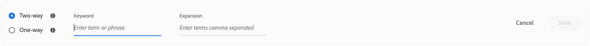

# シノニムの作成

独自にキュレートされた [!DNL Adobe Commerce Optimizer] 同義語のリストを追加して、顧客エンゲージメントを向上させます。 ストアごとに最大 200 個の同義語を追加できます。

## 手順 1：シノニムの追加

1. 左パネルから、_マーチャンダイジング_/**シノニム** に移動します。
1. **[!UICONTROL Add synonyms]** ボタンをクリックします。

## 手順 2：タイプによるシノニムの定義

作成する [&#x200B; シノニムのタイプ &#x200B;](type.md) の手順に従います。

### 双方向類義語

1. デフォルトの **双方向** オプションを受け入れます。

   

1. 照合する **キーワード** 用語または語句を入力します。
1. キーワードの同義語として追加する **拡張** 用語を入力します。 複数の用語はコンマで区切ります。
この例では、一致させるキーワードは「pants」で、展開用語のセットは「trousers, slacks」です。

   

1. 完了したら、「**保存**」をクリックします。

   同義語のセットがリストに表示され、各用語の間に双方向矢印が表示されます。これは、用語が交換可能であることを意味します。

   

### 一方向のシノニム

1. **一方向** シノニム タイプをクリックします。

   

1. **キーワード** と **拡張** の用語を入力します。 複数の用語はコンマで区切ります。

   

   この例では、キーワードが「pants」で、一方向の拡張用語「capris, peddle-pushers」はそれぞれ「pants」のサブセットですが、特定の意味を持ちます。

1. 完了したら、「**保存**」をクリックします。

   同義語のセットがリストに表示され、展開用語からキーワードを指す一方向矢印が表示されます。この矢印は、キーワードのサブセットであることを示します。 各拡張語句はプラス記号で区切られます。

   

## 手順 3：変更を公開する

1. シノニムが完成したら、「**公開**」をクリックします。
1. 更新がストアフロントで利用できるようになるまで、最大 2 時間待ちます。

## フィールドの説明

| フィールド | 説明 |
|--- |--- |
| [&#x200B; タイプ &#x200B;](type.md) | シノニムがキーワードと同じ意味を持つか、キーワードのサブセットであるかを判断します。 オプション：  双方向（デフォルト） – キーワードと同じ意味を持ち、同じ検索結果を返す用語   一方向 – キーワードのサブセットである用語。 一方向の同義語は、特定の製品のより狭いリストを返します。 |
| キーワード | カタログ内の商品の選択に一般的に関連付けられている単語。 |
| 展開 | キーワードと同じ、または類似の意味を持つ追加の用語。 |

## シノニムの管理

既存の [!DNL Adobe Commerce Optimizer] ード [&#x200B; シノニム &#x200B;](overview.md) を管理するには、次の手順に従います。

## シノニムの検索

同義語を見つけやすくするために、タイプでリストをフィルタリングし、キーワードまたは拡張用語で検索できます。 これらの方法は、個別に使用することも、同時に使用することもできます。

1. リストをフィルタリングするには、**タイプ** を次のいずれかに設定します。

   - すべて
   - 一方向
   - 双方向

1. キーワードまたは展開用語を検索するには、**[!UICONTROL Search]** のボックスに少なくとも 3 文字を入力します。

## シノニムの編集

1. 編集するシノニムを検索し、「**その他** （...）」オプションをクリックします。

1. **編集** をクリックします。
キーワードはリストの最初の用語で、各用語はコンマで区切られています。 キーワードと展開用語は更新できますが、シノニムのタイプは変更できません。
1. 編集する項目をクリックします。 次に、必要に応じてテキストを更新します。

1. 完了したら、「**保存**」をクリックします。

## シノニムの削除

1. 削除するシノニムをリストで見つけ、**その他** （...） オプションをクリックします。
1. **削除** をクリックします。
1. プロンプトが表示されたら、「**シノニムの削除**」をクリックして確定します。

## 変更を公開

プロセスを完了するには、保存した変更をストアフロントに公開する必要があります。 更新が有効になるまで、最大 2 時間かかる場合があります。

1. **公開** をクリックします。
1. ページ上部で、変更が公開されたことを確認するメッセージを探します。
