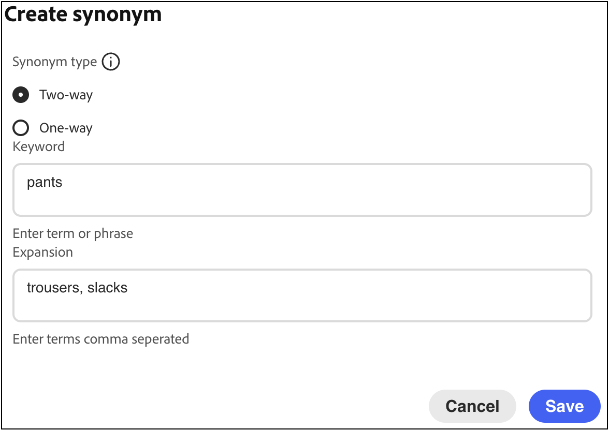

# 同義語の作成

厳選された[!DNL Adobe Commerce Optimizer]個の類義語リストを独自に追加して、顧客エンゲージメントを向上させましょう。 カタログソースごとに最大200個の類義語を追加できます。

## 手順1：同義語の追加

1. 左側のパネルから、_マーチャンダイジング_ > **類義語**&#x200B;に移動します。
1. 「**[!UICONTROL Create synonyms]**」ボタンをクリックします。

## 手順2：類義語をタイプ別に定義する

作成する[類義語の種類](type.md)の手順に従います。

### 双方向の同義語

1. 一致させる&#x200B;**キーワード**&#x200B;の語句またはフレーズを入力します。
1. キーワードの類義語として追加する&#x200B;**拡張**&#x200B;語句を入力します。 複数の用語はコンマで区切ります。
この例では、一致するキーワードは「パンツ」で、拡張用語のセットは「ズボン、スラックス」です。

   

1. 完了したら、**保存**&#x200B;をクリックします。

   類義語のセットは、各用語の間に双方向矢印が表示され、用語が交換可能であることを意味します。

   

### 一方向の類義語

1. **One-way**&#x200B;類義語タイプをクリックします。

1. **キーワード**&#x200B;と&#x200B;**拡張**&#x200B;の用語を入力します。 複数の用語はコンマで区切ります。

   

   この例では、キーワードは「パンツ」で、「capris, peddle-pushers」という一方向の拡張語は、それぞれ「パンツ」のサブセットですが、特定の意味を持ちます。

1. 完了したら、**保存**&#x200B;をクリックします。

   類義語のセットがリストに表示され、拡張語からキーワードを指す一方向の矢印が表示され、その用語がキーワードのサブセットであることを示します。 プラス記号は、各拡張語句を区切ります。

   

## 手順3：変更を公開する

1. 類義語が完成したら、**公開**&#x200B;をクリックします。
1. 更新がストアフロントで利用可能になるまで、最大2時間待ちます。

## フィールドの説明

| フィールド | 説明 |
|--- |--- |
| [種類](type.md) | 類義語がキーワードと同じ意味を持つか、キーワードのサブセットであるかを指定します。 オプション： 双方向（デフォルト） – キーワードと同じ意味を持ち、同じ検索結果を返す用語 一方向 – キーワードのサブセットである用語。 一方向の類義語は、特定の製品のより狭いリストを返します。 |
| キーワード | カタログ内の商品の選択に一般的に関連付けられている単語。 |
| 拡張 | キーワードと同じまたは類似する意味を持つ追加用語。 |

## 類義語の管理

次の手順に従って、既存の[!DNL Adobe Commerce Optimizer] [類義語](overview.md)を管理します。

## 同義語を見つける

類義語を見つけやすくするために、タイプ別にリストをフィルタリングし、キーワードまたは拡張語句で検索できます。 これらの方法は、個別に使用することも、一緒に使用することもできます。

1. リストをフィルタリングするには、**Type**&#x200B;を次のいずれかに設定します。

   - すべて
   - 一方向
   - 双方向

1. キーワードまたは拡張キーワードを検索するには、**[!UICONTROL Search]** ボックスに少なくとも3文字を入力します。

## 同義語を編集

1. 編集する同義語を見つけて、**詳細** （。..）をクリックします。 オプション：

1. **編集**&#x200B;をクリックします。
キーワードはリストの最初の用語で、各用語はコンマで区切られます。 キーワードと拡張の用語は更新できますが、類義語のタイプを変更することはできません。
1. 編集する項目をクリックします。 次に、必要に応じてテキストを更新します。

1. 完了したら、**保存**&#x200B;をクリックします。

## 同義語を削除

1. リストから削除する同義語を見つけ、**詳細** （。..）をクリックします。 オプション：
1. 「**削除**」をクリックします。
1. プロンプトが表示されたら、**同義語を削除**&#x200B;をクリックして確認します。

## 変更を公開

プロセスを完了するには、保存した変更をストアフロントに公開する必要があります。 更新が公開されるまでに最大2時間かかる場合があります。

1. 「**公開**」をクリックします。
1. ページ上部で、変更が公開されたことを確認するメッセージを探します。
