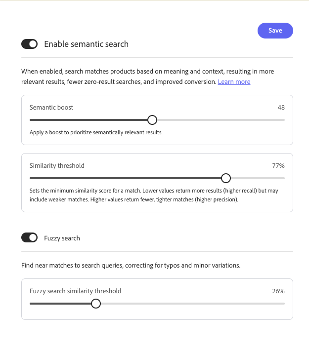

# 設定

*設定* ワークスペースを使用して、ストアフロントの検索と製品の検出を設定します。 次のタブを使用できます。

- **価格ファセット** – 検索フィルターとして使用する価格帯グループと間隔を設定します。
- **言語** — インデックス作成と検索に使用するカタログ言語を設定します。
- **詳細検索** — セマンティック検索とファジー検索を有効にし、セマンティック ブーストと類似性のしきい値を調整します。

>[!BEGINTABS]

>[!TAB 価格ファセット ]

## 価格ファセット {#price-facets}

価格帯グループの数と価格値の分布方法を指定できます。 各価格帯は、前のグループと1つ重なります。 例えば、間隔が20の5つのグループを使用すると、0 ～ 20、20 ～ 40、40 ～ 60、60 ～ 80、および>80などの価格範囲が得られます。 カタログ内に定義されているすべての範囲を満たすのに十分な商品がない場合は、使用可能なグループの表示が調整されます。 例：0-20、60-80、>80

**価格ファセットを設定するには：**

1. **設定** ワークスペースで、**[!UICONTROL Facets]**&#x200B;を選択します。
1. **価格ファセット** セクションで、次の操作を行います。
   - 使用できる&#x200B;**[!UICONTROL Number of selections]**&#x200B;または価格グループを入力してください。 最大100個の価格グループを定義できます。
   - 各グループの&#x200B;**[!UICONTROL Interval value]**、または価格帯を入力してください。 最大値は40,000,000です。
1. **[!UICONTROL Save]**&#x200B;をクリックします。

   更新された設定がストアフロントで利用できるようになるまでに約15分かかります。

### フィールドの説明

| フィールド | 説明 |
| --- | --- |
| 選択範囲の数 | ストアフロントで検索フィルターとして使用できる価格範囲グループ化の数を指定します。 デフォルト値：8、最大値：100 |
| 間隔の値 | 各グループの価格範囲間隔を指定します。 例えば、間隔の値が20の5つの選択項目で、0～20、20～40、40～60、60～80、および80を超える値が設定されています。 デフォルト値：5、最大値：40,000,000 |

>[!TAB 言語]

## 言語 {#language}

言語設定は、カタログを読み取り、インデックスを書き込むときに期待する言語を[!DNL Adobe Commerce Optimizer]に伝えます。

言語には文法に関する様々なルールがあります。例えば、単語の区切り方法、動詞の語形、単語の形などです。
「言語」設定を使用すると、適切なルールのセットがインデックスメカニズムに適用されます。

「言語」設定をカタログの主要言語に設定します。 インデックスの言語を変更する場合、カタログのサイズと複雑さによっては、ストアフロントに変更が表示されるまでに5分から60分かかる場合があります。

| 言語 | コード |
|----|----|
| アラビア語 | ar |
| アルメニア語 | hy |
| バスク語 | eu |
| ベンガル語 | bn |
| ブラジル語 | pt-br |
| ブルガリア語 | bg |
| カタラン | ca |
| 中国語（簡体字） | zh-cn |
| 中国語（繁体字） | zh-tw |
| チェコ語 | cs |
| デンマーク語 | da |
| ダッチ | nl |
| 英語 | en |
| エストニア語 | et |
| フィンランド語 | fi |
| フランス語 | fr |
| ガリシア語 | gl |
| ドイツ語 | de |
| ギリシャ語 | el |
| ヒンディー語 | こんにちは |
| ハンガリー語 | 胡書記 |
| インドネシア語 | id |
| アイルランド語 | ga |
| イタリアン | it |
| 日本語（カタカナ） | ja |
| 韓国語 | ko |
| ラトビア語 | lv |
| リトアニア | lt |
| ノルウェー語 | いいえ |
| ペルシャ語 | fa |
| ポルトガル語 | pt |
| ルーマニア語 | ro |
| ロシア語 | ru |
| ソラーニ | ku |
| スペイン語 | es |
| スウェーデン語 | sv |
| トルコ語 | tr |
| タイ語 | th |

>[!TAB 詳細検索]

## 高度な検索 {#advanced-search}

検索を1か所で管理するには、**[!UICONTROL Advanced search]** タブを使用します。 [!DNL Adobe Commerce Optimizer]は、ストアフロントで統一された検索エクスペリエンスを提供します。買い物客に対してキーワード検索とセマンティック検索を別々に設定しないでください。 **[!UICONTROL Enable semantic search]**&#x200B;は、適格な英語カタログに対して、デフォルトで&#x200B;**有効になっています**。 セマンティック検索は、既存の設定と並行して機能します。[&#x200B; マーチャンダイジングルール &#x200B;](./merchandising/rules/overview.md)、[類義語](./merchandising/synonyms/overview.md)、[&#x200B; ファセット &#x200B;](./merchandising/facets/overview.md)、ブースト、フィルターは引き続き適用されます。 システムは、事前定義済みのカタログ属性を自動的に使用します。管理者は、属性を選択したり優先順位付けしたりしません。 ストアフロントや開発者の変更は必要ありません。

**セマンティック検索を管理するには：**

1. **設定** ワークスペースで、「**[!UICONTROL Advanced search]**」タブを選択します。
1. **[!UICONTROL Enable semantic search]**&#x200B;で、セマンティック検索が有効になっていることを確認するか、セマンティック検索が無効になっていない場合は無効にします。
1. 切り替えコントロールまたはチューニングコントロールを変更する場合は、**[!UICONTROL Save]**&#x200B;をクリックします。

   インデックス作成完了後に検索結果が更新されます。 中規模のカタログの場合、インデックス作成には最大で30時間かかる場合があります。 数百万の商品を持つ大規模なカタログの場合、数時間かかることがあります。

### オプションの調整

セマンティック検索を有効にすると、同じタブで次の項目を調整できます。

- **[!UICONTROL Semantic boost]** — ランキングで意味的に関連する結果を優先するブーストを適用します。 セマンティック一致が結果セットの重みを増やす必要がある場合は値を上げます。結果が広すぎると感じる場合は値を下げます。
- **[!UICONTROL Similarity threshold]** — セマンティック一致の最小類似度スコア （パーセント）を設定します。 値が低い場合は、より多くの結果が返されます（リコール率が高くなります）。ただし、一致する可能性が低い場合もあります。 値を大きくすると、一致するサイズが小さくなり、よりタイトになります（精度が高くなります）。

  >[!NOTE]
  >
  > セマンティック検索は、**英語** カタログでのみサポートされています。 「**[言語](#language)**」タブで別の言語を選択すると、**[!UICONTROL Enable semantic search]**&#x200B;が無効になります。

- **[!UICONTROL Fuzzy search]** — **on**&#x200B;を有効にして、検索クエリに近い一致を見つけます。これは、タイプミスや小さなバリエーションの修正に役立ちます。
- **[!UICONTROL Fuzzy search similarity threshold]** — ファジィ一致が表示されるために必要な最小類似度（パーセント）を設定します。 しきい値を小さくすると、より類似した一致が返されます。ファジーな結果が広すぎると感じる場合は、しきい値を上げます。

利点、検証ガイダンス、ベストプラクティス、トラブルシューティング、制限事項については、[&#x200B; セマンティック検索](setup/semantic-search.md)を参照してください。

### フィールドの説明

| 制御 | 説明 |
| --- | --- |
| セマンティック検索を有効にする | 有効にすると、検索はキーワードマッチングと一緒に意味とコンテキストを使用します。 定義済みのカタログ属性は自動的に使用されます。管理者に属性の設定は必要ありません。 [!DNL Adobe Commerce Optimizer]人のお客様に対して、デフォルトで有効になっています。 |
| セマンティックブースト | ランキングで意味的に関連性の高い結果を優先するために適用されるブースト。 |
| 類似度のしきい値 | セマンティックマッチの最小類似度スコア（パーセント）。 値が低い場合は呼び出し優先、値が高い場合は精度を優先します。 |
| ファジー検索 | **on**&#x200B;の場合、検索はクエリに近い一致（マイナーなバリエーションなど）を見つけます。 |
| ファジィ検索類似度しきい値 | ファジー一致の最小類似度（パーセント）が一致すると、結果が表示されます。 |

>[!ENDTABS]
