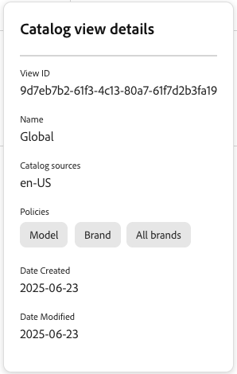

# マーチャンダイジングサービスのカタログ表示

カタログ表示は、Adobe Commerce Optimizer マーチャンダイジングサービスの基盤であり、ビジネス構造、ポリシー、価格ごとに商品カタログを整理できます。 この柔軟なデータモデルは、運用効率を維持しながら、マルチブランド、マルチビジネスユニット、多言語シナリオをサポートします。

## カタログビューとは

カタログ表示は、製品カタログを整理および表示する方法を定義します。 これらは、以下を決定するフィルターとして機能します。

- **表示する製品は** ブランド、地域、販売店などの事業構造による）
- リンクされた価格台帳を使用した **表示される価格設定**
- **ポリシー** ブランド、モデル、カテゴリなどの属性）を使用した製品のフィルタリング方法
- **使用されるカタログソース** ロケールなどの属性に基づく

カタログビューは、顧客がカタログを表示する様々な「レンズ」と考えてください。 例：

- ディーラーのカタログ ビューには、その特定のディーラーが利用できる製品のみが表示される場合があります
- 地域カタログ ビューには、地域に固有の製品と価格が表示される場合があります
- ブランドカタログビューには、特定のブランドの製品のみが表示される場合があります

## カタログビューの作成

このセクションでは、カタログビューを作成し、[&#x200B; ポリシー &#x200B;](policies.md) と [&#x200B; 価格台帳 &#x200B;](pricebooks.md) を選択します。

カタログビューを作成する前に、次のことを確認します。

- 製品フィルターを定義する [&#x200B; 作成されたポリシー &#x200B;](policies.md)

- [&#x200B; 取り込まれた価格台帳 &#x200B;](pricebooks.md) 価格設定

1. 左側のメニューから _ストア設定_ に移動し、「**[!UICONTROL Catalog views]**」をクリックします。

1. 「**[!UICONTROL Create catalog view]**」をクリックします。&#x200B;

1. カタログ表示の詳細を設定します。

   - **名前** - カタログビューの名前（例：`Celport`）を入力します。&#x200B;
   - **カタログソース** - カタログソース（ロケール）を選択します（例：`en-US`）。
   - **ポリシー** - ドロップダウンを使用して、関連するポリシーを選択します。 例えば、「ブランド」、「モデル」などです。&#x200B;既に [&#x200B; ポリシーを作成 &#x200B;](policies.md) していることを確認します。

1. カタログ表示にリンクする価格台帳を選択します。

   - **使用可能なすべての価格台帳を使用** – このオプションは、使用可能なすべての価格台帳から価格データを取り込みます。
   - **選択した価格台帳のみ許可** – このオプションを選択すると、「**許可された価格台帳の追加**」ダイアログが表示されます。このダイアログで、カタログ表示に使用する特定の価格台帳を選択できます。
   - **価格を無効にする** – このオプションは、現時点では使用できません。

1. 「**[!UICONTROL Add]**」をクリックして、リンクされた価格台帳とポリシーを含むカタログ・ビューを作成します。

[ カタログ ビュー ] ページが更新され、新しいカタログ ビューが表示されます。&#x200B;

これらの手順を完了すると、選択したソースとポリシーに基づいて製品と価格を表示するようにカタログ表示が設定されます。

## カタログ表示の管理

既存のカタログ ビューのプロパティを更新または表示するには、次の手順に従います。

### カタログビューを編集

1. *カタログビュー* ワークスペースで、編集するグリッド内のカタログビューを見つけ、「**...**」をクリックしてアクションメニューを開きます。
1. **編集** をクリックして、カタログ ビューエディタにアクセスします。
1. 必要に応じて、名前、カタログソース、ポリシーおよび価格台帳情報を更新します。
1. 変更を保存します。

### カタログビューを削除

1. *カタログビュー* ワークスペースで、編集するグリッド内のカタログビューを見つけ、「**...**」をクリックしてアクションメニューを開きます。
1. **削除** をクリックします。

   確認ダイアログが表示されたら、「**[!UICONTROL Delete]**」をクリックします。

### 詳細を表示

このオプションを使用すると、*カタログビュー* テーブルを表示したまま、すべてのカタログビューパラメーターをすばやく確認できます。

*カタログビュー* ワークスペースで、編集するグリッドでカタログビューを見つけ、 をクリックします。

ここから、次のようなカタログビューの設定の詳細を確認できます。

- ビュー ID
- 名前
- カタログソース
- ポリシー
- 作成日
- 変更されたデータ

これらの設定の一部は、ストアフロントを設定する際や、データ取り込み API を使用する際に必要になります。

## アーキテクチャの概要

カタログビューは、マーチャンダイジングサービスフレームワークの一部であり、Adobe Commerceの基盤で使用される web サイト、ストア、レビューのフレームワークをより柔軟なモデルに置き換えます。

![[!DNL Merchandising Services] アーキテクチャ &#x200B;](../assets/merchandising-svcs-architecture.png)

### 仕組み

**1.データ取得**
PIM、ERP、その他のシステムからのカタログデータは、マーチャンダイジングサービスフレームワークに取り込まれます。 各 SKU には、カタログビュー、ポリシー、ロケールにマッピングされるロケール情報と製品属性が含まれます。 データ取り込みについて詳しくは、[&#x200B; 開発者向けドキュメント &#x200B;](https://developer.adobe.com/commerce/services/optimizer/) を参照してください。

**2。 統合基本カタログ**
取り込まれたデータにより、Catalog Service データパイプライン内に統合ベースカタログが作成されます。 この単一のソースにより、ビジネス・ユニット間でのデータ重複を排除できます。

**3。 カタログビュー**
複数のカタログビューは、異なるビジネスユニットを表します（例：「Texas Retail」、「Texas Retail Seasonary」）。 ロケール、ポリシー、価格台帳をカタログビュー間で共有して、柔軟性を確保できます。

**4。 マルチチャネル配信**
フィルタリングされたカタログデータは、Edge Delivery Services ストアフロント、マーケットプレイス、広告プラットフォーム、カスタムマイクロストアフロントなど、様々な宛先に配信されます。 カタログデータ配信について詳しくは、[&#x200B; 開発者向けドキュメント &#x200B;](https://developer.adobe.com/commerce/services/optimizer/) を参照してください。

### 主要コンポーネント

| コンポーネント | 目的 | 例 |
|---|---|---|
| **カタログ ビュー** | ビジネスユニットまたは配布チャネル | ディーラーネットワーク、地域店舗 |
| **ポリシー** | 属性に基づく製品フィルター | ブランド，モデル，カテゴリ |
| **ロケール** | 言語/地域設定 | en-US, fr-CA, es-MX |
| **価格台帳** | 価格構造 | 小売、卸売、従業員 |

### データフロー

1. **取り込み** - PIM/ERP システムからの製品データ
2. **プロセス**：カタログ・ビュー、ポリシー、価格を適用
3. **配信** - フィルタリングされたカタログをストアフロントやマーケットプレイスなどに提供します。

## 主な機能

| 機能 | 便益 |
|---|---|
| **単一の基本カタログ** | ビジネス・ユニット間でのデータ重複を排除 |
| **柔軟な価格設定** | 様々な顧客セグメントの SKU ごとに複数の価格台帳 |
| **拡張性** | 200M 以上の SKU を効率的に管理 |
| **マルチチャネル** | カタログをストアフロント、マーケットプレイス、広告プラットフォームに提供する |
| **リアルタイムの更新** | プロモーションとキャンペーンのカタログデータをすばやく更新します |

## ユースケース

### マルチブランド複合企業

**課題**：複数のブランド、国、言語を管理する  
**解決策**：ブランド/地域の組み合わせごとにカタログビューを使用した単一のカタログ

### 自動車部品ディーラー

**課題**：同じ製品でも価格が異なる 3,000 のディーラー  
**解決策**：ディーラー固有のカタログビューと価格台帳を備えた 1 つのカタログ

### マルチロケーションretailer

**課題**：場所ごとに異なる価格と在庫  
**解決策**：地域固有のポリシーを使用した場所ベースのカタログビュー

>[!INFO]
>
>カタログデータの取り込みと配信について詳しくは、[&#x200B; 開発者ドキュメント &#x200B;](https://developer.adobe.com/commerce/services/optimizer/) を参照してください。
