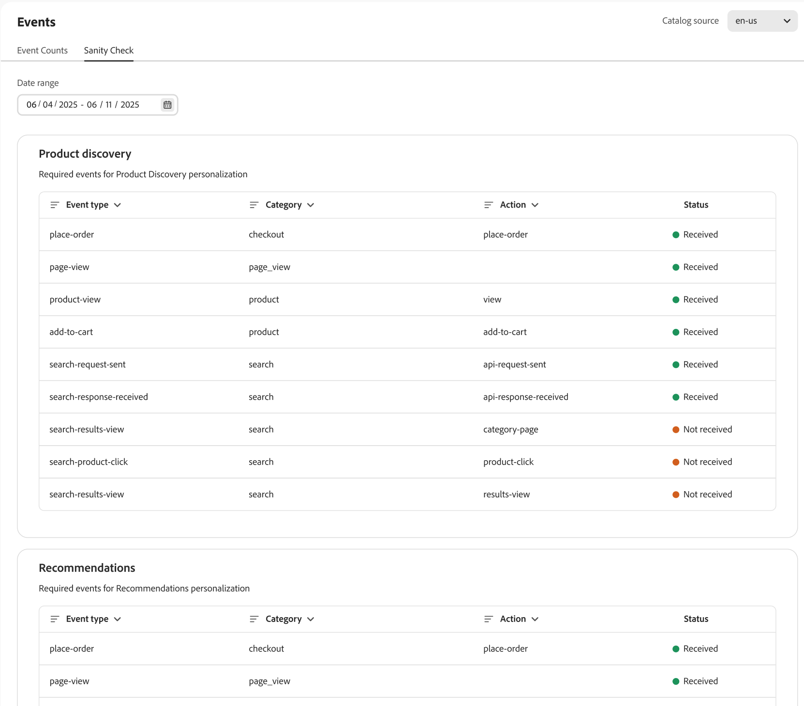

# イベント

イベントは、リアルタイムのデータインサイトを活用してショッピングエクスペリエンスを強化し、コンバージョンを促進する重要なツールです。

[!DNL Adobe Commerce Optimizer] は、ストアフロントイベントを自動的にサイトにデプロイします。 これらのイベントは、サイトでの買い物客のインタラクションからデータをキャプチャします。 この匿名データにより、[recommendations](../../manage-results/recommendation-performance.md)、[ 製品検出 ](../../manage-results/search-performance.md) および [ 成功指標 ](../../manage-results/success-metrics.md) が強化されます。

>[!NOTE]
>
>データ収集には、個人を特定できる情報（PII）は含まれません。 Cookie ID や IP アドレスなどのすべてのユーザー識別子は、厳密に匿名化されます。 [学習を増やす](https://www.adobe.com/privacy/experience-cloud.html)。

**イベント** ページでは、ストアフロントイベントデータが収集されるのを監視できます。 イベントデータ収集を表示することで、マーチャントは、ストアフロントイベントを正しく実装したことと、イベントが正常にキャプチャされていることを確認できます。 マーチャントはこのページを使用して、潜在的な問題を特定し、イベントの問題を解決する手順を実行できます。

## イベント数

「**イベント数** タブでは、検索、クリック数、購入など、買い物客のインタラクションを追跡し、トレンドの分析と買い物体験の向上に役立ちます。

{zoomable="yes"}

| フィールド | 説明 |
|---|---|
| **日付範囲** | データの特定のサブセットを表示する日付範囲を指定します。 |
| **1 時間あたりのストアフロントイベント数** | ストアフロントでトリガーされたイベントの数を示すグラフを表示します。 |
| **ストアフロントイベント合計** | ストアフロントでトリガーされたすべてのイベントの詳細を表示する、フィルタリング可能なテーブル。 |

## 健全性チェック

**健全性チェック** タブでは、各行動イベントの正常性に関するインサイトを提供し、正確なデータ収集と機能を確保します。&#x200B;

{zoomable="yes"}

| フィールド | 説明 |
|---|---|
| **日付範囲** | データの特定のサブセットを表示する日付範囲を指定します。 |
| **製品の検出** | 製品の検索結果をパーソナライズするために必要なイベントを表示します。 **ステータス** 列は、イベントが受信されたかどうかを示します。 |
| **推奨事項** | 製品レコメンデーションをパーソナライズするために必要なイベントを表示します。 **ステータス** 列は、イベントが受信されたかどうかを示します。 |

以降の節では、[ 製品検出 ](#product-discovery) と [ 推奨事項 ](#recommendations) のイベントの詳細について説明します。

### 製品の検出

製品検出では、イベントを使用して、「最も多く閲覧された」、「これを閲覧し、それを閲覧した」などの検索アルゴリズムを強化します。

次の表に、製品検出で使用されるイベント [ ランキング戦略 ](../../merchandising/rules/add.md#intelligent-ranking) を示します。

| ランキング戦略 | イベント | ページ |
| --- | --- | --- |
| 最も頻繁に閲覧された | `page-view` `product-view` | 製品詳細ページ |
| 最も多く購入された | `page-view` `place-order` | 買い物かご/チェックアウト |
| 買い物かごに追加済み | `page-view` `add-to-cart` | 製品詳細ページ   製品一覧ページ   買い物かご   お気に入りリスト |
| がこれを表示し、が表示されました | `page-view` `product-view` | 製品詳細ページ |

### 必須のダッシュボードイベント

一部のイベントは、[ 検索パフォーマンスダッシュボード ](../../manage-results/search-performance.md) に入力する必要があります

| ダッシュボード領域 | イベント | 結合フィールド |
| ------------------- | ------------- | ---------- |
| ユニーク検索 | `page-view`、`search-request-sent`、`search-response-received` | `searchRequestId` |
| ゼロ結果検索 | `page-view`、`search-request-sent`、`search-response-received` | `searchRequestId` |

### 推奨事項

Recommendations で使用されるデータには、次の 2 種類があります。

- **行動** – 製品表示、買い物かごに追加された項目、購入など、サイトに対する買い物客のエンゲージメントからのデータ。
- **カタログ** – 製品メタデータ（名前、価格、在庫状況など）。

Adobe Senseiは、行動データとカタログデータを集計し、レコメンデーションタイプごとにレコメンデーションを作成します。 次に、Recommendations サービスは、推奨される製品 _項目_ を含むウィジェットの形式で、レコメンデーションをストアフロントにデプロイします。

一部のレコメンデーションタイプでは、買い物客の行動データを使用して機械学習モデルをトレーニングし、パーソナライズされたレコメンデーションを作成します。 その他のレコメンデーションタイプでは、カタログデータのみを使用し、行動データは使用しません。 サイトですばやくレコメンデーションの使用を開始する場合は、`More like this` のレコメンデーションタイプを使用できます。

#### コールドスタート

行動データを使用するレコメンデーションタイプの使用を開始できるのはいつですか？ 場合によります。 これは、「コールドスタート _問題と呼ば_ ます。

_コールドスタート_ の問題は、モデルがトレーニングを受けて実効を発揮するまでにかかる時間を表します。 お勧めの場合、Adobe Senseiが機械学習モデルをトレーニングするために十分なデータを収集するのを待ってから、レコメンデーションユニットをサイトにデプロイすることを意味します。 モデルのデータが多いほど、レコメンデーションはより正確で有用になります。 データ収集はライブサイトで行われるので、このプロセスは早めに開始することをお勧めします。

次の表に、各レコメンデーションタイプで十分なデータの収集に要する時間に関する一般的なガイダンスを示します。

| レコメンデーションタイプ | トレーニング時間 | 備考 |
|---|---|---|
| 人気度ベース（`Most viewed`、`Most purchased`、`Most added to cart`） | 可変 | イベントの量に依存 – 表示は最も一般的なので、より迅速に学習されます。その後、買い物かごに追加され、購入されます |
| `Viewed this, viewed that` | さらにトレーニングが必要 | 製品表示の量が急激に多い |
| `Viewed this, bought that`, `Bought this, bought that` | 最も多くのトレーニングが必要 | 購入イベントは、特に製品表示と比較して、コマースサイトで最もまれなイベントです |
| `Trending` | 人気度のベースラインを確立するために 3 日間のデータが必要です | トレンド分析は、製品の人気ベースラインと比較した、製品の人気の最近の勢いの指標です。 製品のトレンドスコアは、フォアグラウンドセット（24 時間にわたる最近の人気度）とバックグラウンドセット（72 時間にわたる人気度のベースライン）を使用して計算されます。 24 時間以内にアイテムの人気度がベースラインの人気度と比較して大幅に上昇した場合、高いトレンドスコアが得られます。 すべての製品にこのスコアがあり、スコアが最も高い項目はいつでも、上位のトレンド製品のセットで構成されます。 |

トレーニングに要する時間に影響を与える可能性があるその他の変数を次に示します。

- トラフィック量が多いほど、学習が速くなります
- 一部のレコメンデーションタイプは、他のタイプよりも高速にトレーニングされます
- [!DNL Adobe Commerce Optimizer] は 4 時間ごとに行動データを再計算します。 レコメンデーションは、サイトで使用されるほど正確になります。

各推奨タイプのトレーニングの進行状況を視覚化できるように、「[ 推奨を作成 ](../../merchandising/recommendations/create.md#readiness-indicators)」ページに準備状況インジケーターが表示されます。

ライブサイトでデータが収集され、機械学習モデルがトレーニングされている間に、レコメンデーションを設定するために必要な他のテストおよび設定タスクを完了できます。 この作業が完了するまでに、モデルには便利なレコメンデーションを作成するのに十分なデータが含まれており、ストアフロントにモデルをデプロイできます。

ほとんどの製品 SKU でサイトに十分なトラフィック（表示、購入、トレンド）が届かない場合は、学習プロセスを完了するのに十分なデータがない可能性があります。 これにより、Recommendations ワークスペースの準備インジケーターが動かなくなったように見える場合があります。 準備状況の指標は、店舗にとって優れたレコメンデーションタイプを選択する際に、マーチャントに別のデータポイントを提供することを目的としています。 数値は目安であり、100% に達することはありません。 準備状況インジケーターについて &rbrack;(../../merchandising/recommendations/create.md#readiness-indicators) 詳しくは、[ こちら ] を参照してください。

#### バックアップの推奨事項

入力データが不十分で、要求されたすべてのレコメンデーション項目をユニットで提供できない場合、[!DNL Adobe Commerce Optimizer] はレコメンデーションユニットにデータを入力するための代替レコメンデーションを提供します。 例えば、ホームページに `Recommended for you` のレコメンデーションのタイプをデプロイした場合、サイト上で初めて買い物をする人は、パーソナライズされた製品を正確に推奨するのに十分な行動データを生成していません。 この場合、[!DNL Adobe Commerce Optimizer] は、この買い物客に `Most viewed` のレコメンデーションタイプに基づいて項目を表示します。

入力データの収集が不十分な場合、次のレコメンデーションタイプが `Most viewed` のレコメンデーションタイプにフォールバックします。

- `Recommended for you`
- `Viewed this, viewed that`
- `Viewed this, bought that`
- `Bought this, bought that`
- `Trending`
- `Conversion (view to purchase)`
- `Conversion (view to cart)`

#### レコメンデーション固有のイベント

次の表に、買い物客がストアフロントのレコメンデーションユニットとやり取りしたときにトリガーされるイベントを示します。 収集されたイベントデータにより、[ 指標 ](../../manage-results/recommendation-performance.md) が強化され、レコメンデーションのパフォーマンスを分析できます。

| イベント | 説明 |
| --- | --- |
| `impression-render` | レコメンデーションユニットがページでレンダリングされる際に送信されます。 ページに 2 つのレコメンデーションユニット（購入済み、表示ビュー）がある場合、2 つの `impression-render` イベントが送信されます。 このイベントは、インプレッション数の指標を追跡するために使用されます。 |
| `rec-add-to-cart-click` | 買い物客は、レコメンデーションユニット内の項目の **買い物かごに追加** ボタンをクリックします。 |
| `rec-click` | 買い物客は、レコメンデーションユニット内の製品をクリックします。 |
| `view` | ページを下にスクロールするなど、レコメンデーションユニットが 50% 以上の表示できるようになると送信されます。 例えば、レコメンデーションユニットに 2 行がある場合、1 行に 2 行目の 1 ピクセルを加えた `view` イプイベントが買い物客に表示されると送信されます。 買い物客がページを上下に複数回スクロールした場合、買い物客がレコメンデーションユニット全体をページ上で再度表示すると、`view` のイベントが何度も送信されます。 |

#### 必須のダッシュボードイベント

[Recommendations パフォーマンスダッシュボード ](../../manage-results/recommendation-performance.md) に入力するには、次のイベントが必要です。

| ダッシュボード列 | イベント | 結合フィールド |
| ---------------- | --------- | ----------- |
| インプレッション | `page-view`, `recs-request-sent`, `recs-response-received`, `recs-unit-render` | `unitId` |
| ビュー | `page-view`, `recs-request-sent`, `recs-response-received`, `recs-unit-render`, `recs-unit-view` | `unitId` |
| クリック数 | `page-view`, `recs-request-sent`, `recs-response-received`, `recs-item-click`, `recs-add-to-cart-click` | `unitId` |
| 収益 | `page-view`, `recs-request-sent`, `recs-response-received`, `recs-item-click`, `recs-add-to-cart-click`, `place-order` | `unitId`、`sku`、`parentSku` |
| 長期収益 | `page-view`, `recs-request-sent`, `recs-response-received`, `recs-item-click`, `recs-add-to-cart-click`, `place-order` | `unitId`、`sku`、`parentSku` |
| CTR | `page-view`, `recs-request-sent`, `recs-response-received`, `recs-unit-render`, `recs-item-click`, `recs-add-to-cart-click` | `unitId`、`sku`、`parentSku` |
| vCTR | `page-view`, `recs-request-sent`, `recs-response-received`, `recs-unit-render`, `recs-unit-view`, `recs-item-click`, `recs-add-to-cart-click` | `unitId`、`sku`、`parentSku` |

次のイベントは Recommendations に固有ではありませんが、Adobe Senseiが買い物客データを正しく解釈するために必要です。

- `view`
- `add-to-cart`
- `place-order`

#### レコメンデーションタイプ

次の表に、各レコメンデーションタイプで使用されるイベントを示します。

| レコメンデーションタイプ | イベント | ページ |
| --- | --- | --- |
| 最も頻繁に閲覧された | `page-view` `product-view` | 製品詳細ページ |
| 最も多く購入された | `page-view` `place-order` | 買い物かご/チェックアウト |
| 買い物かごに追加済み | `page-view` `add-to-cart` | 製品詳細ページ   製品一覧ページ   買い物かご   お気に入りリスト |
| がこれを表示し、が表示されました | `page-view` `product-view` | 製品詳細ページ |
| これを閲覧し、次を購入 | `page-view` `product-view` | 製品詳細ページ   買い物かご/チェックアウト |
| これを購入し、それを購入しました | `page-view` `product-view` | 製品詳細ページ |
| トレンド | `page-view` `product-view` | 製品詳細ページ |
| コンバージョン：表示から購入 | `page-view` `product-view` | 製品詳細ページ |
| コンバージョン：表示から購入 | `page-view` `place-order` | 買い物かご/チェックアウト |
| コンバージョン：買い物かごに表示 | `page-view` `product-view` | 製品詳細ページ |
| コンバージョン：買い物かごに表示 | `page-view` `add-to-cart` | 製品詳細ページ   製品リストページ   買い物かご   ウィッシュリスト |

## サポート

データの不一致に気付いた場合、またはレコメンデーションと検索結果が期待どおりに動作しない場合は、[ サポートチケットを送信 ](https://experienceleague.adobe.com/en/docs/commerce-knowledge-base/kb/help-center-guide/magento-help-center-user-guide) してください。
