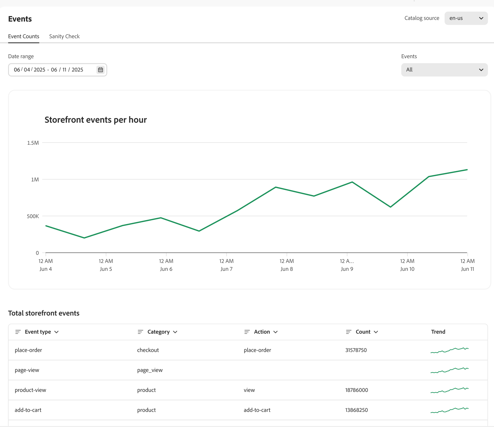
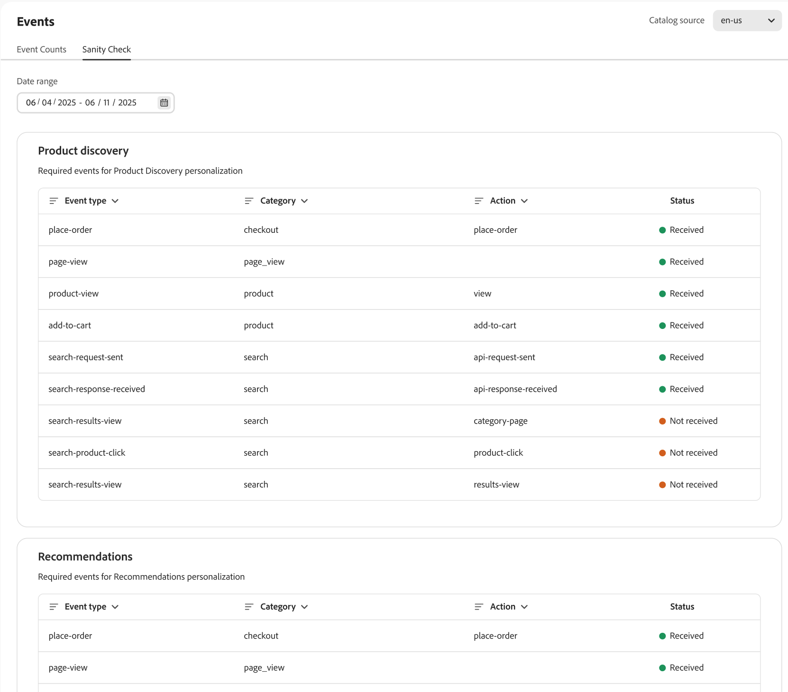

# イベント

イベントは、リアルタイムのデータインサイトを活用して、ショッピング体験を向上させ、コンバージョンを促進するための重要なツールです。

[!DNL Adobe Commerce Optimizer]は、ストアフロントイベントをサイトに自動的にデプロイします。 これらのイベントは、サイトでの買い物客のインタラクションからデータを取得します。 この匿名化されたデータは、[おすすめ](../../manage-results/recommendation-performance.md)、[製品の検出](../../manage-results/search-performance.md)、[成功指標](../../manage-results/success-metrics.md)に活用されます。

>[!NOTE]
>
>データ収集には、個人情報（PII）は含まれません。 Cookie IDやIP アドレスなど、あらゆるユーザーIDは厳密に匿名化されます。 [学習を増やす](https://www.adobe.com/privacy/experience-cloud.html)。

**イベント** ページでは、収集されるストアフロントイベントデータを確認できます。 イベントデータ収集を把握することで、マーチャントはストアフロントイベントを正しく実装し、イベントのキャプチャが成功していることを確認できます。 このページでは、潜在的な問題を特定し、イベントの問題を解決するための手順を実行できます。

## イベント数

「**イベント数**」タブでは、検索、クリック、購入などの買い物客のインタラクションを追跡して、トレンドを分析し、ショッピング体験を向上させることができます。

{zoomable="yes"}

| フィールド | 説明 |
|---|---|
| **日付範囲** | 日付範囲を指定して、特定のデータサブセットを表示します。 |
| **1時間あたりのストアフロントイベント** | ストアフロントでトリガーされたイベント数を示すグラフを表示します。 |
| **合計ストアフロントイベント** | ストアフロントでトリガーされたすべてのイベントの詳細を表示するフィルター可能なテーブル。 |

## 健全性チェック

「**健全性チェック**」タブでは、各行動イベントの健全性に関するインサイトが提供され、正確なデータ収集と機能が保証されます。 &#x200B;

{zoomable="yes"}

| フィールド | 説明 |
|---|---|
| **日付範囲** | 日付範囲を指定して、特定のデータサブセットを表示します。 |
| **製品の検出** | 商品検索結果をパーソナライズするために必要なイベントを表示します。 **ステータス**&#x200B;列は、イベントが受信されたかどうかを示します。 |
| **推奨事項** | 商品レコメンデーションをパーソナライズするために必要なイベントを表示します。 **ステータス**&#x200B;列は、イベントが受信されたかどうかを示します。 |

次の節では、[製品の検出](#product-discovery)および[推奨事項](#recommendations)に関するイベントの詳細について説明します。

### 製品の発見

製品ディスカバリーでは、「Most Viewed （最も閲覧された製品）」や「Viewed This, Viewed That （最も閲覧された製品）」などの検索アルゴリズムを強化するためにイベントを使用します。

この表は、製品検出[&#x200B; ランキング戦略](../../merchandising/rules/add.md#intelligent-ranking)で使用されるイベントを示しています。

| ランキング戦略 | イベント | ページ |
| --- | --- | --- |
| 閲覧数 | `page-view` `product-view` | 商品詳細ページ |
| 購入数 | `page-view` `place-order` | カート/チェックアウト |
| 買い物かごに追加された回数 | `page-view` `add-to-cart` | 商品詳細ページ  商品リストページ  買い物かご 欲しい商品リスト |
| 閲覧したページ | `page-view` `product-view` | 商品詳細ページ |

#### 必須ダッシュボードイベント

一部のイベントは、[検索パフォーマンス ダッシュボード &#x200B;](../../manage-results/search-performance.md)に入力するために必要です

| ダッシュボード領域 | イベント | 連結フィールド |
| ------------------- | ------------- | ---------- |
| 一意の検索 | `page-view`, `search-request-sent`, `search-response-received` | `searchRequestId` |
| 検索結果ゼロ | `page-view`, `search-request-sent`,  `search-response-received` | `searchRequestId` |

### 推奨事項

レコメンデーションには、次の2種類のデータが使用されます。

- **行動** – 商品ビュー、カートに追加された商品、購入など、サイトでの買い物客のエンゲージメントに関するデータ。
- **カタログ** – 商品メタデータ（名前、価格、在庫状況など）。

Adobe AIは、行動データとカタログデータを集計し、レコメンデーションタイプごとにレコメンデーションを作成します。 Recommendations サービスは、推奨製品&#x200B;_項目_&#x200B;を含むウィジェットの形式で、これらの推奨事項をストアフロントにデプロイします。

レコメンデーションタイプによっては、買い物客の行動データを活用してマシンラーニングモデルをトレーニングし、パーソナライズされたレコメンデーションを作成するものもあります。 その他のレコメンデーションタイプでは、カタログデータのみを使用し、行動データは使用しません。 サイトでレコメンデーションを素早く開始する場合は、`More like this`のレコメンデーションタイプを使用できます。

#### コールドスタート

行動データを活用したレコメンデーションタイプを、いつ頃から使うことができますか？ それは企業によって異なります。 これは&#x200B;_コールドスタート_&#x200B;問題と呼ばれます。

_Cold Start_&#x200B;の問題は、モデルのトレーニングと効果の実現にかかる時間を指します。 レコメンデーションを実行するためには、Adobe AIがマシンラーニングモデルのトレーニングに十分なデータを収集するのを待ってから、レコメンデーションユニットをサイトにデプロイする必要があります。 モデルに含まれるデータが多ければ多いほど、レコメンデーションはより正確で有用になります。 データ収集はライブサイトで行われるため、このプロセスは早い段階で開始することをお勧めします。

次の表に、各レコメンデーションタイプに十分なデータを収集するのにかかる時間に関する一般的なガイダンスを示します。

| レコメンデーションタイプ | トレーニング時間 | メモ |
|---|---|---|
| 人気ベース （`Most viewed`、`Most purchased`、`Most added to cart`） | Varies | イベントの量に依存します – ビューは最も一般的であり、したがって迅速に学習します。次にカートに追加してから購入します |
| `Viewed this, viewed that` | より多くのトレーニングが必要 | 製品ビューは適度に多くなっています |
| `Viewed this, bought that`, `Bought this, bought that` | 最もトレーニングが必要 | 購入イベントは、コマースサイトで最もまれなイベントです。特に、商品ビューと比較すると重要です |
| `Trending` | 人気のベースラインを確立するには3日間のデータが必要です | トレンドとは、製品の人気が、自社の人気ベースラインと比較した際の最近の勢いを示す指標です。 製品のトレンドスコアは、前景セット（最近の人気度が24時間を超える）と背景セット（人気度のベースラインが72時間を超える）を使用して計算されます。 ベースラインの人気度と比較して、24時間以内に商品の人気度が大幅に増加すると、高いトレンドスコアが得られます。 あらゆる商品にこのスコアがあり、いつでも最もスコアの高い商品は、最もトレンドの商品のセットで構成されています。 |

トレーニングに必要な時間に影響を与える可能性があるその他の変数：

- トラフィック量の増加が学習の高速化に貢献
- レコメンデーションタイプによっては、他のタイプよりも学習が速いものもあります
- [!DNL Adobe Commerce Optimizer]は4時間ごとに行動データを再計算します。 レコメンデーションは、サイトで長く使用するにつれて精度が向上します。

各レコメンデーションタイプのトレーニングの進捗状況を視覚化するために、[&#x200B; レコメンデーションの作成](../../merchandising/recommendations/create.md#readiness-indicators) ページには準備状況インジケーターが表示されます。

ライブサイトでデータを収集し、マシンラーニングモデルをトレーニングしている間に、レコメンデーションの設定に必要なその他のテストや設定タスクを完了できます。 この作業が完了する頃には、モデルには有用なレコメンデーションを作成するのに十分なデータが揃っており、ストアフロントに展開することができます。

多くの商品SKUで十分なトラフィック（閲覧数、購入数、トレンド）をサイトで獲得できなければ、学習プロセスを完了するのに十分なデータがない可能性があります。 これにより、Recommendations ワークスペースの準備状況インジケーターが停止しているように見える場合があります。 準備状況インジケーターは、店舗に適したレコメンデーションタイプを選択するためのデータポイントを加盟店に提供することを目的としています。 数字はガイドであり、100%に達することはありません。 準備状況インジケーターについて[詳細情報](../../merchandising/recommendations/create.md#readiness-indicators)を表示します。

#### バックアップの推奨事項

入力データがユニット内のすべての要求されたレコメンデーション項目を提供するのに不十分な場合、[!DNL Adobe Commerce Optimizer]はレコメンデーション ユニットに入力するためのバックアップ レコメンデーションを提供します。 例えば、`Recommended for you`のレコメンデーションタイプをホームページにデプロイした場合、サイトで初めて購入する顧客は、パーソナライズされた商品を正確にレコメンデーションするのに十分な行動データを生成できていません。 この場合、[!DNL Adobe Commerce Optimizer]は`Most viewed`のレコメンデーションタイプに基づいて、この買い物客に商品を表示します。

入力データ収集が不十分な場合、次のレコメンデーションタイプは`Most viewed`個のレコメンデーションタイプにフォールバックします。

- `Recommended for you`
- `Viewed this, viewed that`
- `Viewed this, bought that`
- `Bought this, bought that`
- `Trending`
- `Conversion (view to purchase)`
- `Conversion (view to cart)`

#### レコメンデーション固有のイベント

次の表に、買い物客がストアフロントのレコメンデーションユニットとやり取りする際にトリガーされるイベントを示します。 収集されたイベントデータは、[指標](../../manage-results/recommendation-performance.md)を強化して、レコメンデーションのパフォーマンスを分析します。

| イベント | 説明 |
| --- | --- |
| `impression-render` | レコメンデーション単位がページ上でレンダリングされたときに送信されます。 ページに2つのレコメンデーションユニット （購入済み、ビュービュー）がある場合、2つの`impression-render` イベントが送信されます。 このイベントは、インプレッションの指標を追跡するために使用されます。 |
| `rec-add-to-cart-click` | 買い物客は、レコメンデーションユニット内の商品の「**カートに追加**」ボタンをクリックします。 |
| `rec-click` | 買い物客はレコメンデーションユニット内の商品をクリックします。 |
| `view` | ページを下にスクロールするなど、レコメンデーションユニットが50%以上表示できるようになった場合に送信されます。 例えば、レコメンデーションユニットに2行がある場合、1行に2行目の1 ピクセルを加えた行が買い物客に表示されると、`view` イベントが送信されます。 買い物客がページを上下に数回スクロールすると、買い物客がページ上でレコメンデーションユニット全体を再び見るたびに、`view` イベントが何度も送信されます。 |

#### 必須ダッシュボードイベント

次のイベントは、[Recommendations Performance ダッシュボード &#x200B;](../../manage-results/recommendation-performance.md)に入力するために必要です

| ダッシュボード列 | イベント | 連結フィールド |
| ---------------- | --------- | ----------- |
| インプレッション | `page-view`, `recs-request-sent`, `recs-response-received`, `recs-unit-render` | `unitId` |
| ビュー | `page-view`, `recs-request-sent`, `recs-response-received`, `recs-unit-render`, `recs-unit-view` | `unitId` |
| クリック数 | `page-view`, `recs-request-sent`, `recs-response-received`, `recs-item-click`, `recs-add-to-cart-click` | `unitId` |
| 収益 | `page-view`, `recs-request-sent`, `recs-response-received`, `recs-item-click`, `recs-add-to-cart-click`, `place-order` | `unitId`, `sku`, `parentSku` |
| LT収益 | `page-view`, `recs-request-sent`, `recs-response-received`, `recs-item-click`, `recs-add-to-cart-click`, `place-order` | `unitId`, `sku`, `parentSku` |
| CTR | `page-view`, `recs-request-sent`, `recs-response-received`, `recs-unit-render`, `recs-item-click`, `recs-add-to-cart-click` | `unitId`, `sku`, `parentSku` |
| vCTR | `page-view`, `recs-request-sent`, `recs-response-received`, `recs-unit-render`, `recs-unit-view`, `recs-item-click`, `recs-add-to-cart-click` | `unitId`, `sku`, `parentSku` |

次のイベントは、Recommendationsに固有のものではありませんが、Adobe AIで買い物客データを正しく解釈するために必要です。

- `view`
- `add-to-cart`
- `place-order`

#### レコメンデーションタイプ

この表は、各レコメンデーションタイプで使用されるイベントを示しています。

| レコメンデーションタイプ | イベント | ページ |
| --- | --- | --- |
| 閲覧数 | `page-view` `product-view` | 商品詳細ページ |
| 購入数 | `page-view` `place-order` | カート/チェックアウト |
| 買い物かごに追加された回数 | `page-view` `add-to-cart` | 商品詳細ページ  商品リストページ  買い物かご 欲しい商品リスト |
| 閲覧したページ | `page-view` `product-view` | 商品詳細ページ |
| 閲覧、購入 | `page-view` `product-view` | 商品詳細ページ   カート/チェックアウト |
| 買った、買った | `page-view` `product-view` | 商品詳細ページ |
| トレンド | `page-view` `product-view` | 商品詳細ページ |
| コンバージョン：購入を確認 | `page-view` `product-view` | 商品詳細ページ |
| コンバージョン：購入を確認 | `page-view` `place-order` | カート/チェックアウト |
| コンバージョン：カートに表示 | `page-view` `product-view` | 商品詳細ページ |
| コンバージョン：カートに表示 | `page-view` `add-to-cart` | 商品詳細ページ  商品リストページ  買い物かご  ウィッシュリスト |

## サポート

データの不一致に気づく場合、または推奨事項と検索結果が期待どおりに機能しない場合は、[&#x200B; サポートチケットを送信します](https://experienceleague.adobe.com/ja/docs/commerce-knowledge-base/kb/help-center-guide/magento-help-center-user-guide)。
