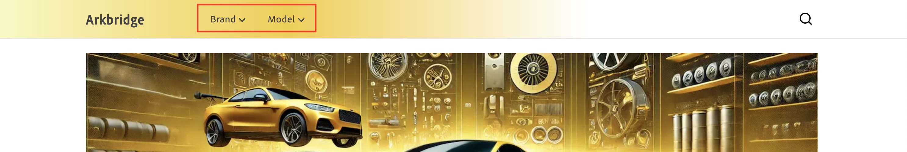

# ポリシー

ポリシーは、各カタログビューに配信されるデータをさらに絞り込む、カタログビュー内に含まれるデータアクセスフィルターです。 ポリシーにより、適切なコンテンツが適切な宛先に送信されます。 たとえば、販売時点実店舗、マーケットプレイス、広告パイプライン（Google、Facebook、Instagram）などです。

ポリシーは、ブランド、モデル、部品カテゴリなどの製品属性に基づいて作成され、特定のビジネス要件に合わせてカタログデータをカスタマイズするために使用されます。 &#x200B;

## フィルター

フィルターは、カタログセグメンテーションを適用するポリシー内のメカニズムです。 フィルターを使用すると、業務ニーズに基づいて特定の製品セットに合わせてストアフロントとカタログビューをカスタマイズできます。 製品属性、演算子、値などの条件を使用して、カタログビューまたはストアフロントに含める製品または除外する製品を示すルールまたは条件を定義します。

### フィルターの一部

フィルターは、次の部分で構成されます。

| パート | 説明 | 例 |
|---|---|---|
| **属性** | フィルタリングに使用されるproduct属性。 | `part_category` |
| **演算子** | 属性に適用される条件。 | `IN`, `EQUALS`, `CONTAINS` |
| **値ソース** | 値が`STATIC`か`TRIGGER`かを指定します。 | `STATIC` [詳細情報](#value-source-types) |
| **値** | 条件を満たす特定の値。 | `brakes, suspension` |

### 例

属性`part_category`、演算子`IN`、値`brakes, suspension`を持つフィルターは、値`brake`または`suspension`を持つ属性`part_category`を持つ製品のみがポリシーによってフィルタリングされ、表示されることを保証します。

### 値のソースタイプ

値ソースには、**STATIC**&#x200B;と&#x200B;**トリガー**&#x200B;の2種類があります。

**STATIC**&#x200B;の&#x200B;**値ソース**&#x200B;を持つポリシーは、ユニバーサルポリシーとみなされます。 ユニバーサルポリシーは、web サイト全体の体験を定義するものです。 つまり、カタログビューはそのポリシーを常に実行します。 つまり、そのポリシーの実行は、ストアフロントでのユーザーとのやり取りに基づいていません。

**ポリシー**&#x200B;のうち&#x200B;**バリューソース**&#x200B;を持つトリガーは、排他的なポリシーと呼ばれます。 つまり、カタログビューは、API呼び出しのヘッダーでトリガーが指定された場合にのみ、そのポリシーを実行します。 ストアフロントでは、買い物客の選択内容に応じて情報が表示されます。 例えば、次の画像では、2つのドロップダウンメニューがあります：**ブランド**&#x200B;と&#x200B;**モデル**。

**ブランド**&#x200B;と&#x200B;**モデル**&#x200B;は定義されたトリガーです：

- `AC-Policy-Brand`
- `AC-Policy-Model`

買い物客が&#x200B;**ブランド** ドロップダウンをクリックすると、API呼び出しのヘッダーに`AC-Policy-Brand`が含まれ、`AC-Policy-Brand` ポリシーに固有の製品のみを表示するように設定されます。

## ポリシーの作成

このセクションでは、新しいポリシーを作成します。 ポリシーは、**静的**&#x200B;または&#x200B;**トリガー**&#x200B;のいずれかです。

### 静的ポリシーの作成

1. 左側のメニューで「**[!UICONTROL Catalog]**」セクションを開き、「**[!UICONTROL Policies]**」をクリックします。

1. 「**[!UICONTROL Add Policy]**」ボタンをクリックします。

   新しいページが開き、ポリシーの詳細を入力できます。 &#x200B;

1. ポリシーの名前（例：「Celport Part Categories」）を入力します。

1. 「**[!UICONTROL Add Filter]**」ボタンをクリックします。

   フィルターの詳細を追加するためのダイアログが開きます。

1. フィルターの詳細を追加します。 例：

   1. **属性** - カタログから属性を入力します。 例えば、「part_category」のように指定します。 この名前は、カタログ内の属性の名前と完全に一致する必要があります。
   1. **演算子** – 演算子を選択します。 例：**IN**。 &#x200B;
   1. **値Source** - **静的**&#x200B;を選択します。 &#x200B;
   1. **値** – 以前に指定した属性定義の値を入力します。 例えば、「ブレーキ」と入力して、ブレーキ部品のフィルターを作成します。
   1. 値を保存するには、**Enter**&#x200B;を押します。

      ポリシーが複数の値でフィルタリングするように設計されている場合は、各値を個別に入力します。

1. フィルターの詳細ダイアログで「**[!UICONTROL Save]**」ボタンをクリックします。 &#x200B;

1. アクションドット（。..）をクリックします 作成したフィルターの横にある「**有効にする**」を選択します。 ここから、フィルターを&#x200B;**編集**、**無効化**、**削除**&#x200B;することもできます。

   **ステータス**&#x200B;列には、緑色のアイコンと「有効」という単語が表示されます。

1. 「**[!UICONTROL Save]**」ボタンをクリックして、新しいポリシーを保存します。「**新しいポリシー**」の横にある鉛筆アイコンをクリックして&#x200B;ボタンがアクティブでない場合は、ポリシー名が追加されていることを確認します。

1. 新しいポリシーを確認するには、戻る矢印をクリックして、ポリシーのリストに戻ります。 &#x200B;新しいポリシーが一覧表示されます。

### トリガーポリシーの作成

1. 左側のメニューで「**[!UICONTROL Catalog]**」セクションを開き、「**[!UICONTROL Policies]**」をクリックします。

1. 「**[!UICONTROL Add Policy]**」ボタンをクリックします。

   新しいページが開き、ポリシーの詳細を入力できます。 &#x200B;

1. ポリシーの名前（例：「Celport Part Categories」）を入力します。

1. 「**[!UICONTROL Add Trigger]**」ボタンをクリックします。

   **トリガーの詳細** ダイアログが表示されます。

1. トリガーの名前（**AC-Policy-Brand**&#x200B;など）を入力します。

1. **トランスポートの種類**&#x200B;を選択します。 現在、サポートされているタイプは&#x200B;**HTTP_HEADER**&#x200B;のみです。

1. 「**[!UICONTROL Save]**」ボタンをクリックして、トリガーを保存します。

1. 「**[!UICONTROL Add Filter]**」ボタンをクリックします。

   フィルターの詳細を追加するためのダイアログが開きます。

1. フィルターの詳細を追加します。 例：

   1. **属性** - カタログから属性を入力します。 例えば、「part_category」のように指定します。 この名前は、カタログ内の属性の名前と完全に一致する必要があります。
   1. **演算子** – 演算子を選択します。 例：**IN**。 &#x200B;
   1. **値Source** - **トリガー**&#x200B;を選択します。 &#x200B;
   1. **値** – 以前に作成したトリガー名（**AC-Policy-Brand**）を入力します。

1. フィルターの詳細ダイアログで「**[!UICONTROL Save]**」ボタンをクリックします。 &#x200B;

1. アクションドット（。..）をクリックします 作成したフィルターの横にある「**有効にする**」を選択します。 ここから、フィルターを&#x200B;**編集**、**無効化**、**削除**&#x200B;することもできます。

   **ステータス**&#x200B;列には、緑色のアイコンと「有効」という単語が表示されます。

1. 「**[!UICONTROL Save]**」ボタンをクリックして、新しいポリシーを保存します。「**新しいポリシー**」の横にある鉛筆アイコンをクリックして&#x200B;ボタンがアクティブでない場合は、ポリシー名が追加されていることを確認します。

1. 新しいポリシーを確認するには、戻る矢印をクリックして、ポリシーのリストに戻ります。 &#x200B;新しいポリシーが一覧表示されます。

次の手順に従うと、ポリシーが作成され、カタログビューにリンクして製品の表示を制御する準備が整います。
