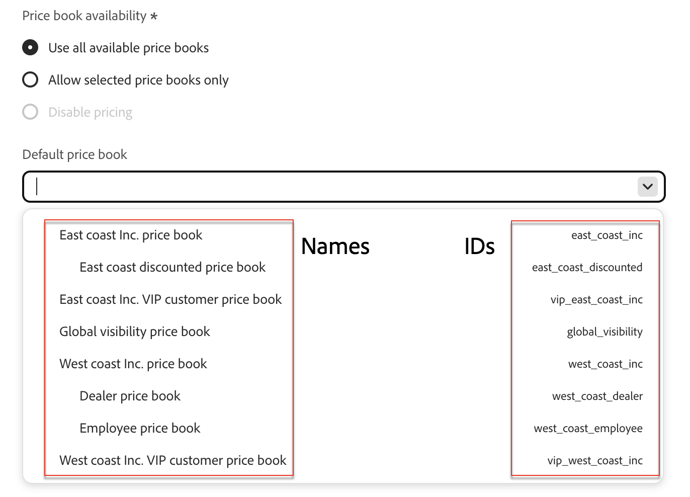

# プライスブック

価格表：様々な顧客層や市場をまたいで、カタログソースの製品価格を定義できます。 プライスブックは階層モデルをサポートしており、各ベースプライスブックの下にネストされた子プライスブックを最大3つのレベルで表示できます。 各価格表は親価格表を参照し、価格表カタログ ソースのツリー構造を形成できます。

基本価格表は、それ自体とそのすべての子価格表の通貨を定義します。 子価格表はこの通貨を継承し、上書きできません。

## 価格表を[!DNL Adobe Commerce Optimizer]に追加

価格表APIを使用して[!DNL Adobe Commerce Optimizer]に価格表を追加します。 [!DNL Adobe Commerce Optimizer]の価格表を作成、更新、削除する方法については、[開発者ドキュメント &#x200B;](https://developer.adobe.com/commerce/services/reference/rest/)を参照してください。

## [!DNL Adobe Commerce Optimizer]の価格表を表示

価格表を[!DNL Adobe Commerce Optimizer]に取り込むと、**カタログ ビュー** ページに価格表のリストと対応するIDが表示されます。

1. _ストア設定_&#x200B;に移動し、**[!UICONTROL Catalog views]**&#x200B;をクリックします。

1. **[!UICONTROL Create catalog view]**&#x200B;をクリックします。 &#x200B;

   カタログビューの詳細を設定で、使用可能な価格表のいずれかを選択します。

   

## 主要な概念

| 条件 | 説明 |
|------|-------------|
| **価格表** | カタログソースの価格を定義する論理グループ（特定の地域や顧客層など）。製品価格の管理に使用されます。 |
| **フォールバック価格表** | 階層の最上位の価格表。 親は持たず、*のみ*&#x200B;の価格表で、それ自体とそのすべての子孫の価格表の通貨を定義します。  価格表の作成中に（APIを介して）親が定義されていない場合、新しいフォールバック価格表が作成されます。 |
| **親価格表** | 子で明示的に設定されていない場合に、子の価格表が価格を継承できる、より上位レベルの価格表。 |
| **階層の深さ** | 最大3つのレベル（フォールバック/子/孫）   取り込み時に適用されません。 |
| **通貨** | フォールバック価格表にのみ定義されます。 すべての児童価格本に継承されます。   フォールバック価格表の作成中に（APIを介して）通貨が指定されていない場合、通貨はデフォルトでUSDになります。 |
| **製品価格** | 特定の価格表の中の製品（SKU）に割り当てられた特定の価格。 |
| **割引** | 割引は商品価格で定義されています。 継承しない。 |
