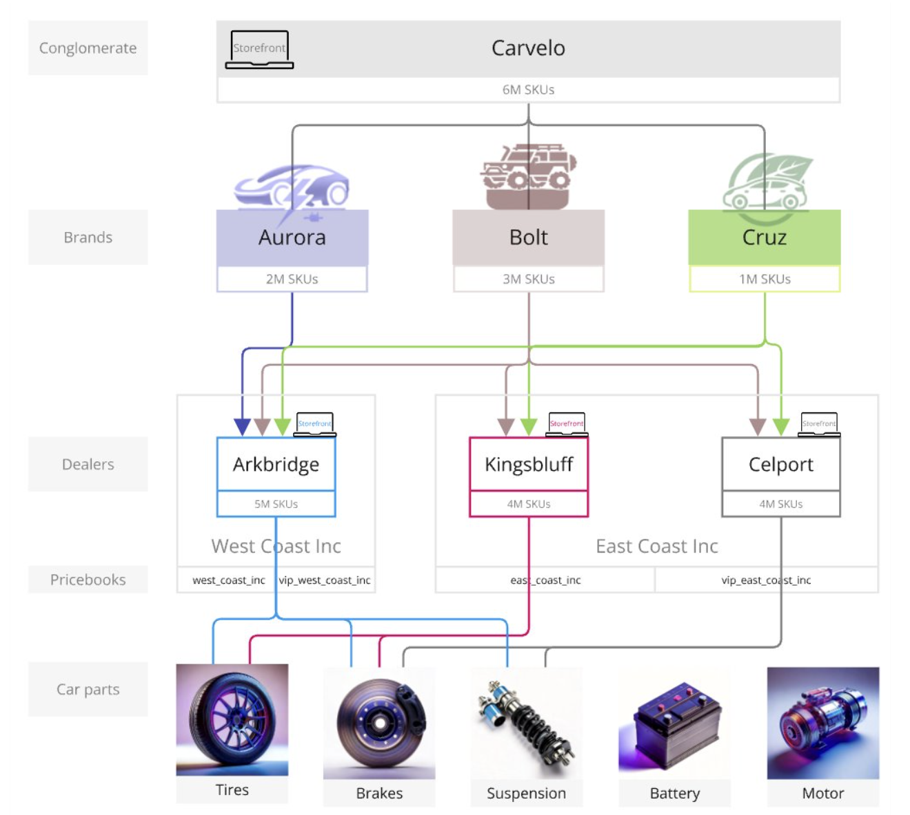
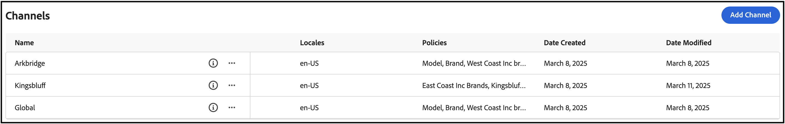
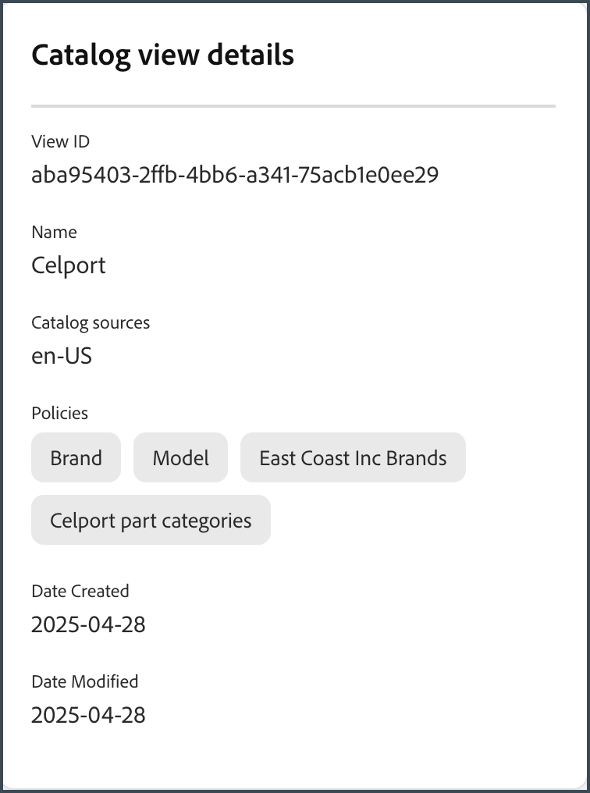
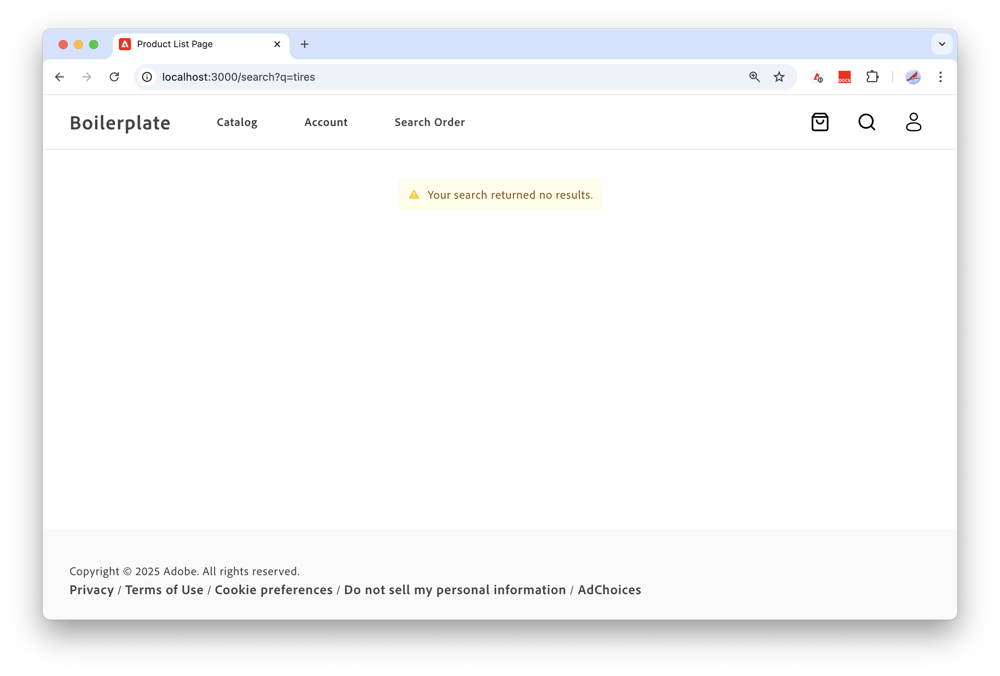

# ストアフロントとカタログ管理者のエンドツーエンドのユースケース

このユースケースは、複雑な経営体制を持つCarvelo Automobileと呼ばれる架空の自動車コングロマリットに基づいています。 [!DNL Adobe Commerce Optimizer]を使用して、カスタマイズされたストアフロント体験を提供しながら、複数のブランド、ディーラー、価格表をサポートするカタログを管理する方法を示します。

## 前提条件

このユースケースは、[!DNL Adobe Commerce Optimizer]を使用してストアフロントを設定し、カタログを管理する方法を学びたい管理者と開発者のために設計されています。 [!DNL Adobe Commerce Optimizer]とその機能に関する基本的な理解があることが前提です。

**完了までの推定時間：** 45 ～ 60分

### 必要な設定

このチュートリアルを開始する前に、次の前提条件を満たしていることを確認してください。

- **[!DNL Adobe Commerce Optimizer]インスタンス**
   - Cloud Managerのテストインスタンスへのアクセス
   - セットアップ手順については、[基本を学ぶ](../get-started.md)を参照してください

- **ユーザー権限**
   - Adobe Admin Consoleへの管理者アクセス
   - アカウント設定については、[&#x200B; ユーザー管理](../user-management.md)を参照してください
   - アクセス権をお持ちでない場合は、Adobeの担当者にお問い合わせください。

- **サンプルデータ**
   - インスタンスに読み込まれたCarvelo Automobile カタログデータ
   - [&#x200B; サンプルカタログデータ取り込みリポジトリ &#x200B;](https://github.com/adobe-commerce/aco-sample-catalog-data-ingestion)の手順に従います
   - 含まれている`reset.js` スクリプトを使用して、完了後にサンプルデータを削除できます

- **ストアフロント環境**
   - Node.jsによるローカル開発環境
   - 複製および設定されたストアフロントボイラープレートプロジェクト
   - 詳しい手順については、[Storefront setup](../storefront.md)を参照してください

## では始めましょう

このユースケースでは、次の操作を行います。

1. [!DNL Adobe Commerce Optimizer] UI - Carvelo ユースケースの複雑なカタログ運用設定を管理するために、カタログ ビューとポリシーを設定します。

1. Commerce Storefront - [!DNL Adobe Commerce Optimizer] インスタンスに読み込まれたサンプルカタログデータと、Commerce Storefront設定ファイル（`fstab.yaml`および`config.json`）を使用して、ストアフロントをレンダリングします。

>[!NOTE]
>
> Adobe Commerce Storefront ドキュメントの「[&#x200B; ボイラープレートの検索](https://experienceleague.adobe.com/developer/commerce/storefront/get-started/boilerplate-project/?lang=ja)」トピックを確認して、ストアフロント設定ファイルについて説明します。

### 重要なポイント

この記事の最後までに、次のことをおこないます。

- パフォーマンスと拡張性に優れたカタログデータモデルで[!DNL Adobe Commerce Optimizer]の基本を学びましょう。
- カタログデータモデルを、Adobeで構築されたプラットフォームに依存しないストアフロントコンポーネントと統合する方法をご確認ください。
- [!DNL Adobe Commerce Optimizer]個のカタログビューとポリシーを使用して、カスタムカタログビューとデータアクセスフィルターを作成し、Edge Deliveryを搭載したAdobe Commerce ストアフロントにデータを送信する方法を説明します。

## ビジネスシナリオ - Carvelo Automobile

Carvelo Automobileは、複雑な運用設定を持つ架空の自動車コングロマリットです。



この図では、Carveloが3つのブランドの自動車製品を販売していることがわかります。 各ブランドは異なる子企業です。

- オーロラ（電気自動車）
- ボルト（SUV）
- クルーズ（ハイブリッド）

同社は、次の3つのディーラーを通じて自社を販売しています。

- アークブリッジ
- キングスブラフ
- セルポート

これらのディーラーは、次の2つの異なる親ディーラー会社に属しています。

- West Coast Inc.（アークブリッジ）
- イーストコースト社（Kingsbluff, Celport）

各企業には、異なる買い物客（ベース、VIP）に対して特定の価格で商品を販売するために使用される2つの価格表があります。

- `west_coast_inc`と`vip_west_coast_inc`
- `east_coast_inc`と`vip_east_coast_inc`

ご覧のとおり、これは非常に複雑なビジネスのユースケースです。 [!DNL Adobe Commerce Optimizer]を使用すると、1つの基本カタログを使用して複雑なビジネス構造をサポートし、カタログの重複のないデータをシンジケートし、価格表（30,000個以上の価格表）を拡張し、これらのデータをすべてEdge Delivery Services ストアフロントに配信することができます。

ビジネスのユースケースの概要を理解したところで、このチュートリアルを進める際の目的を次に示します。

>[!BEGINSHADEBOX]

Carveloは、3つのブランド（Aurora、Bolt、Cruz）の部品を、異なるディーラー（Arkbridge、Kingsbluff、Celport）を通じて販売したいと考えています。 Carveloは、ディーラーがそれぞれのライセンス契約に従って正しい部品と価格のみにアクセスできるようにしたいと考えています。

最終的に、Carveloには2つの大きな目標があります。

1. 3つのブランドすべてのすべてのSKUを持つ「グローバル」 web サイトを維持します。
1. ディーラーが独自のSKU表示と各ディーラーの各SKUの価格に基づいて、独自のストアフロントを設定するためのパスを提供します。 また、単一のベースカタログを使用することで、カタログの重複を排除できます。

>[!ENDSHADEBOX]

## &#x200B;1. [!DNL Adobe Commerce Optimizer] インスタンスへのアクセス

サンプルデータで事前設定されたCommerce Optimizer アプリケーションのURLに移動します。 Commerce Optimizer プロジェクトのインスタンスの詳細からCommerce Cloud ManagerのURLを見つけるか、システム管理者から取得できます。 （[&#x200B; インスタンスへのアクセス &#x200B;](../get-started.md#access-the-adobe-commerce-optimizer-application)を参照）。

[!DNL Adobe Commerce Optimizer]を起動すると、次の表示が表示されます。

![[!DNL Adobe Commerce Optimizer] UI](../assets/user-interface.png)

>[!NOTE]
>
>[!DNL Adobe Commerce Optimizer] UIの主要なコンポーネントについて詳しくは、[概要](../overview.md)の記事を参照してください。

左側のナビゲーションで、_ストア設定_ セクションを展開し、**[!UICONTROL Catalog views]**&#x200B;をクリックします。 ArkbridgeおよびKingsbluff ディーラーには、既にカタログ ビューが作成されていることに注意してください。



>[!NOTE]
>
>**すべてのビュー**&#x200B;のカタログ ビューを今のところ無視できます。

情報アイコンをクリックして、カタログビューの詳細を確認します。

Arkbridgeには次のポリシーがあります。

- ブランド
- モデル
- West Coast Inc.のブランド
- Arkbridge パーツ カテゴリ

Kingsbluffには次のポリシーがあります。

- ブランド
- モデル
- East Coast Inc.のブランド
- Kingsbluff パーツ カテゴリ

次のセクションでは、Celport ディーラーのカタログビューとポリシーを作成します。

## &#x200B;2. ポリシーとカタログビューの作成

Carveloのコマースマネージャーは、*イーストコースト社*&#x200B;に属する&#x200B;*Celport*&#x200B;というディーラーの新しいストアフロントを設定する必要があります。 セルポートは、BoltとCruz ブランドのブレーキとサスペンションを販売する予定です。


[!DNL Adobe Commerce Optimizer]を使用すると、コマースマネージャーは次の操作を行います。

1. Celportの新しいポリシー&#x200B;*Celport part categories*&#x200B;を作成して、ブレーキとサスペンションの部品のみを販売します。
1. Celport ストアフロント用に新しいカタログビューを作成します。

   このカタログ ビューでは、新しく作成したポリシー&#x200B;*Celport part categories*&#x200B;と既存の&#x200B;*East Coast Inc Brands*&#x200B;を使用して、CelportがEast Coast Inc.との契約の一環としてBoltおよびCruz ブランドのみを販売できるようにします。Celport カタログ ビューでは、`east_coast_inc`の価格表を使用して、ブランドのライセンス契約に沿った製品価格スケジュールをサポートしています。
1. 作成したCelport カタログビューのデータを使用するように、コマースストアフロント設定を更新します。

このセクションの最後に、セルポートはカルベロの製品を販売する準備ができて稼働します。

### ポリシーの作成

*Celport part categories*&#x200B;という名前の新しいポリシーを作成して、Celport ディーラーが販売するSKU （ブレーキとサスペンションの部品を含む）をフィルタリングしてみましょう。

1. 左側のパネルで、_ストア設定_ セクションを展開し、**[!UICONTROL Policies]**&#x200B;をクリックします。

1. **[!UICONTROL Create Policy]**&#x200B;をクリックします。

   新しいページが表示され、ポリシーの詳細が追加されます。

1. 必要な詳細を追加します。

   **名前** = *セルポート パーツ カテゴリ*

1. **[!UICONTROL Add Filter]**&#x200B;をクリックします。

   フィルターの詳細を追加するダイアログが表示されます。

1. フィルターの詳細を追加します。

   - **属性** = *part_category*
   - **演算子** = **IN**
   - **値Source** = **静的**
   - **値** = *ブレーキ*
   - **値** = *停止*

   >[!IMPORTANT]
   >
   >各属性値は個別に入力する必要があります。 値を入力した後、**Enter**&#x200B;を押して、フィルター設定に追加します。 次に、次の値を入力します。 すべての値は、カタログ内のSKU属性名と正確に一致する必要があります。

   静的な値ソースとトリガーな値ソースの違いについて詳しくは、[値ソースの種類](../setup/policies.md#value-source-types)を参照してください。

1. **[!UICONTROL Filter details]** ダイアログで、**[!UICONTROL Save]**&#x200B;をクリックします。

1. 作成したフィルターを有効にするには、アクションドット（。..）をクリックします。 「**有効にする**」を選択します。

1. **[!UICONTROL Save]**&#x200B;をクリックします。

   >[!NOTE]
   >
   >**[!UICONTROL Save]** ボタンがアクティブでない（青）場合、ポリシー名が見つからない可能性があります。 *新しいポリシー*&#x200B;の横にある鉛筆アイコンをクリックして追加します。

1. 戻る矢印をクリックして、ポリシーのリストに戻ります。

   新しい&#x200B;*Celport パーツ カテゴリ* ポリシーがリストに表示されます。

**この手順が正しく完了したことを確認するには：**

- ポリシーがポリシーリストに表示されます
- ポリシーのステータスが「有効」と表示される（緑色のインジケーター）
- フィルターの詳細に「part_category IN （brakes, suspension）」と表示されます。
- ポリシー名は「Celport Part Categories」

### カタログビューの作成

*Celport* ディーラーの新しいカタログ ビューを作成し、次のポリシーをリンクします：*East Coast Incのブランド*&#x200B;と&#x200B;*Celport パーツ カテゴリ*。

1. 左側のパネルで、_ストア設定_ セクションを展開し、**[!UICONTROL Catalog views]**&#x200B;をクリックします。

   既存のカタログビューに注意してください：*Arkbridge*、*Kingsbluff*、*すべてのビュー*。

   

1. **[!UICONTROL Add catalog view]**&#x200B;をクリックします。

1. カタログビューの詳細を入力：

   - **名前** = *Celport*
   - **カタログソース** = *en-US*
   - **ポリシー** （使用ドロップダウン） = *East Coast Inc Brands*; *部品カテゴリをチェック*; *ブランド*; *モデル*
                         
1. **[!UICONTROL Add]**&#x200B;をクリックしてカタログ ビューを作成します。

   カタログビューページが更新され、新しいカタログビューが表示されます。

   

1. Celport カタログビューIDを取得します。

   **カタログビュー** ページのCelport カタログビューの情報アイコンをクリックします。

   

   カタログビューIDをコピーして保存します。 このIDは、新しいCelport カタログにデータを配信するためにストアフロント設定を更新する際に必要です。

   **この手順が正しく完了したことを確認するには：**
   - カタログビュー名は「Celport」
   - カタログビューには、4つの関連ポリシーが表示されます
   - カタログビューIDが表示され、コピーできます
   - カタログソースに「en-US」と表示される

After you create the Celport catalog view and associated policies, the next step is to configure the storefront to use your new Celport catalog.

## 3. Update your storefront

The final piece of this tutorial involves updating the storefront that [you already created](#prerequisites) to deliver data to the new Celport catalog. In this section, you replace the catalog view ID in your storefront configuration file with the catalog view ID for Celport.

1. In your local development environment, open the folder where you cloned the GitHub repository with your storefront boilerplate configuration files.

1. In the root directory of the folder, open the `config.json` file.

   +++config.json code

   ```json
   {
    "public": {
      "default": {
      "commerce-core-endpoint": "https://www.aemshop.net/graphql",
      "commerce-endpoint": "https://na1-sandbox.api.commerce.adobe.com/Fwus6kdpvYCmeEdcCX7PZg/graphql",
      "headers": {
         "cs": {
            "ac-view-id": "9ced53d7-35a6-40c5-830e-8288c00985ad",
            "ac-price-book-id": "west_coast_inc",
            "ac-source-locale": "en-US"
           }
         },
         "analytics": {
            "base-currency-code": "USD",
            "environment": "Production",
            "store-id": 1,
            "store-name": "ACO Demo",
            "store-url": "https://www.aemshop.net",
            "store-view-id": 1,
            "store-view-name": "Default Store View",
            "website-id": 1,
            "website-name": "Main Website"
          }
       }
      }
   }
   ```

   +++

   Notice that the catalog view header includes the following values:

   - `commerce-endpoint`: `"https://na1-sandbox.api.commerce.adobe.com/Fwus6kdpvYCmeEdcCX7PZg/graphql"`
   - `ac-view-id`:`"9ced53d7-35a6-40c5-830e-8288c00985ad"`
   - `ac-price-book-id`: `"west_coast_inc"`
   - `ac-source-locale`: `"en-US"`

1. In the `commerce-endpoint` value, replace the tenant ID in the URL with the URL for your [!DNL Adobe Commerce Optimizer] instance.

   You can find the tenant ID in the URL for the Commerce Optimizer UI. For example, in the following URL, the tenant ID is `XDevkG9W6UbwgQmPn995r3`.

   ```text
   https://experience.adobe.com/#/@commerceprojectbeacon/in:XDevkG9W6UbwgQmPn995r3/commerce-optimizer-studio/catalog
   ```

1. Replace the `ac-view-id` value with Celport catalog view ID that you copied previously.

1. Replace the `ac-price-book-id` value with `"east_coast_inc"`.

   After you make these changes, your `config.json` file should look similar to the following, with the `ACO-tenant-id` and `celport-catalog-view-id` placeholders replaced with your values:

   ```json
   {
     "public": {
        "default": {
        "commerce-core-endpoint": "https://www.aemshop.net/graphql",
        "commerce-endpoint": "https://na1-sandbox.api.commerce.adobe.com/{{ACO-tenant-id}}/graphql",
        "headers": {
            "cs": {
                "ac-view-id": "{{celport-catalog-view-id}}",
                "ac-price-book-id": "east_coast_inc",
                "ac-source-locale": "en-US"
              }
            },
            "analytics": {
                "base-currency-code": "USD",
                "environment": "Production",
                "store-id": 1,
                "store-name": "ACO Demo",
                "store-url": "https://www.aemshop.net",
                "store-view-id": 1,
                "store-view-name": "Default Store View",
                "website-id": 1,
                "website-name": "Main Website"
             }
         }
     }
   }
   ```

1. Save the file.

   When you save the changes, you update the catalog configuration to use the Carvelo catalog view which has been configured to sell only brake and suspension parts.

## 4. Preview the storefront

Now that you have updated the storefront configuration to use the Celport catalog view, you can preview the storefront to see how it renders the catalog data.

1. Launch the storefront to view the Celport-specific catalog experience created by your storefront configuration.

   1. From the terminal window in your IDE, start your local storefront preview.

      ```shell
      npm start
      ```

      ブラウザーが開き、`http://localhost:3000`にローカル開発のプレビューが表示されます。

      コマンドが失敗するか、ブラウザーが開かない場合は、ストアフロントの設定トピックの[ローカル開発の手順](../storefront.md)を確認してください。

1. ブラウザーで`brakes`を検索し、**Enter**&#x200B;を押します。

   ストアフロントが更新され、ブレーキ部品が表示された製品リストページが表示されます。

   

   ブレーキ部品画像をクリックして、価格情報を含む製品の詳細を表示し、製品価格情報を記録します。

1. `tires`を検索します。これは、[!DNL Adobe Commerce Optimizer] インスタンスのユースケースデータで使用可能な別の部分カテゴリです。

   

   結果が返されないことに注意してください。 これは、Celportのカタログビューが、ブレーキとサスペンションの部品のみを販売するように構成されているためです。

1. ストアフロント設定ファイル （`config.json`）の更新を試してください。

   1. `ac-view-id`と`ac-price-book`の値を変更します。

   例えば、カタログビューIDをKingsbluff カタログビューに、価格表IDを`east_coast_inc`に変更できます。 Kingsbluffで使用可能な部品カテゴリは、*Kingsbluff部品カテゴリ* ポリシーを確認することで確認できます。

   1. ファイルを保存します。

      ファイルを保存すると、ローカルのストアフロントのプレビューが自動的に更新されます。

   1. 検索機能を使用してブラウザーの変更をプレビューし、タイヤ部品を検索します。

      使用可能な様々な部品タイプと、Kingsbluff カタログビューに割り当てられた価格に注目してください。

   これらの実験は、[!DNL Adobe Commerce Optimizer]の柔軟性を示しています。カタログデータを複製することなく、様々なカタログビューと価格表をすばやく切り替えて、様々なオーディエンスに合わせてカスタマイズされたショッピング体験を作成できます。

## トラブルシューティング

このチュートリアルで問題が発生した場合は、次の解決策を試してください。

### ポリシー作成の問題

**問題：**&#x200B;保存ボタンがアクティブではありません

- **解決策：** ポリシー名が入力され、すべての必須フィールドが入力されていることを確認します

**問題：** フィルターが期待どおりに機能しません

- **解決策：**&#x200B;属性名がカタログ内のSKU属性と完全に一致することを確認します

### Catalog view issues

**Problem:** Catalog view not appearing in the list

- **Solution:** Verify that all associated policies are enabled and properly configured

### Storefront Configuration Issues

**Problem:** Storefront not loading

- **Solution:** Check that your tenant ID and catalog view ID are correctly entered in the config.json file

**Problem:** No products displaying

- **Solution:** Verify that the price book ID matches the one available in your [!DNL Adobe Commerce Optimizer] instance

**Problem:** Search returning no results

- **Solution:** Confirm that the catalog view policies allow the searched product category

For additional help, see the [[!DNL Adobe Commerce Optimizer] documentation](../overview.md) or contact Adobe support.

## 概要

In this tutorial, you successfully:

- Created a new policy to filter product categories for the Celport dealership
- Set up a catalog view with multiple policies to control product visibility
- Configured a storefront to use the new catalog view
- Verified the configuration by testing product visibility and pricing

## 次のステップ

To continue learning about [!DNL Adobe Commerce Optimizer]:

- Explore [merchandising features](../merchandising/overview.md) to personalize the shopping experience
- Learn about [advanced policy configurations](../setup/policies.md)
- Set up [additional catalog views](../setup/catalog-view.md) for other dealerships
- Review the [API documentation](https://developer.adobe.com/commerce/services/optimizer/) for programmatic catalog management
- Learn how to configure drop-in components for your Edge Delivery Services storefront to create custom storefront experiences for product discovery, recommendations, and other storefront capabilities. See the [Storefront documentation](https://experienceleague.adobe.com/developer/commerce/storefront/dropins/all/introduction/?lang=ja)
