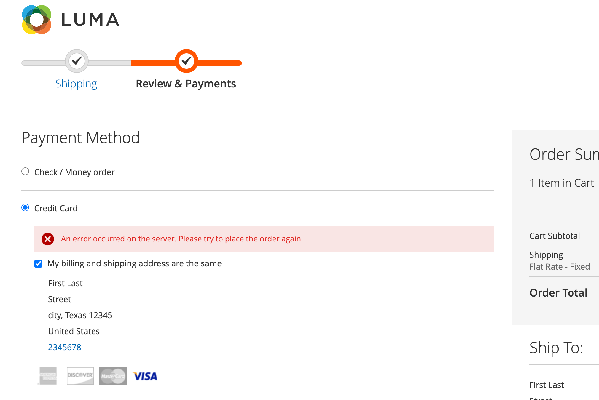
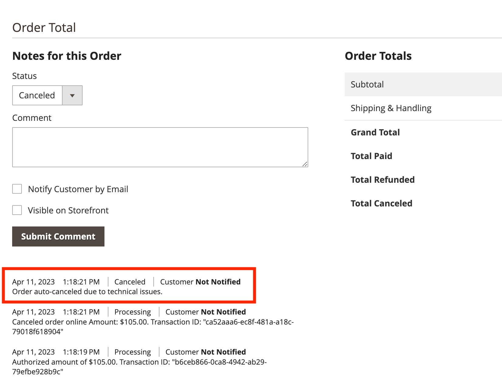

# [!DNL Payment Services]でのチェックアウト

買い物客に最適なAdobe Commerce [!DNL Payment Services]のチェックアウトを設定できます。 [注文自動無効化](#order-auto-voided-if-error)や[&#x200B; クレジットカードの保管](#credit-card-vaulting)などの機能により、買い物客にスムーズなユーザーエクスペリエンスを提供できます。

## エラーが発生した場合は自動的に無効化される注文

チェックアウト中にエラーが発生した場合、[!DNL Payment Services]は注文を自動的に無効/キャンセルします。

買い物客のチェックアウトページにエラーメッセージが表示されます。 メッセージは異なる場合があります。

チェックアウト中に{width="600" zoomable="yes"}が発生しました

キャンセルされた注文に関するコメントは、特定の[注文](https://experienceleague.adobe.com/ja/docs/commerce-admin/stores-sales/order-management/orders/orders?lang=en)の管理画面にも表示されます。

{width="600" zoomable="yes"}

買い物客が注文の認証を受けたが、注文が作成されず`Capture`に変換された場合、注文は自動的に無効化されます。 このプロセスにより、買い物客のクレジットカードにクレジットが予約されないようにし、標準の29日間の期間の終了時に承認が失効したときに発生する支払いプロバイダーの手数料を回避することができます。

>[!NOTE]
>
>注文の自動無効化は、お客様が`Authorize and Capture` モードではなく`Authorize` モードに設定された支払い方法を使用している場合にのみ発生します。

## 製品ページからのチェックアウト

顧客がPayPalまたは[!DNL Pay Later] ボタンを使用して商品ページから直接チェックアウトすると、現在の商品ページに表示されている商品のみが購入されます。 顧客のカートに既に入っている商品は、チェックアウトフローに追加されないため、購入されません。

この機能により、顧客は現在表示している商品をすばやく購入し、カートに追加した商品を保持できます。
顧客が注文をキャンセルすると、現在の商品ページの商品が顧客のカートに追加されます。

顧客が商品ページからチェックアウトフローに入ると、チェックアウトページが簡素化され、注文関連のデータとオプションのみが表示されます。

## クレジットカードの保管

買い物客は、web サイトレベル（同じ加盟店アカウント内の任意の店舗）で今後の購入のためにクレジットカード情報を保管（または「保存」）できます。

詳しくは、[&#x200B; クレジットカードの保管](vaulting.md)を参照してください
