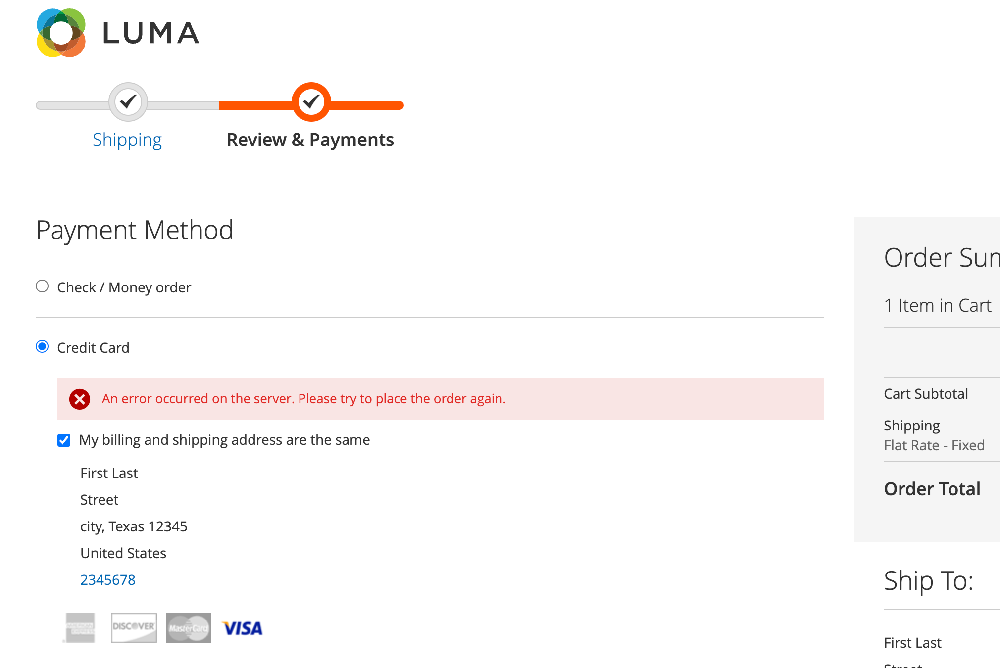

# [!DNL Payment Services] でのチェックアウト

買い物客に最適なAdobe Commerce [!DNL Payment Services] のチェックアウトを設定できます。 [ 注文の自動無効化 ](#order-auto-voided-if-error) および [ クレジットカードの保管 ](#credit-card-vaulting) などの機能により、買い物客はスムーズにユーザーエクスペリエンスを得ることができます。

## エラーの場合に注文を自動無効にする

チェックアウト中にエラーが発生した場合、[!DNL Payment Services] は自動的に注文をキャンセルします。

買い物客のチェックアウトページにエラーメッセージが表示されます。 メッセージは異なる場合があります。

{width="600" zoomable="yes"}

キャンセルされた注文に関するコメントも、特定の [ 注文 ](https://experienceleague.adobe.com/docs/commerce-admin/stores-sales/order-management/orders/orders.html?lang=ja) の管理者に表示されます。

{width="600" zoomable="yes"}

買い物客が注文の認証を取得しても、注文が作成されず、`Capture` に変換されなかった場合、注文は自動無効になります。 このプロセスにより、買い物客のクレジットカードに予約されるクレジットがなくなり、標準の 29 日間の期間の終了時に認証が無効になった場合に発生する支払いプロバイダーの手数料を回避できます。

>[!NOTE]
>
>注文の自動無効化は、顧客が `Authorize and Capture` モードではなく、`Authorize` モードに設定された支払い方法を使用している場合にのみ発生します。

## 製品ページからのチェックアウト

顧客が PayPal または [!DNL Pay Later] のボタンを使用して製品ページから直接チェックアウトすると、現在の製品ページに表示されている項目のみが購入されます。 顧客の買い物かごに既に存在する商品は、チェックアウトフローに追加されず、購入もされません。

この機能を使用すると、お客様は、以前に買い物かごに追加した商品を保持しながら、現在表示中の商品をすばやく購入できます。
顧客が注文をキャンセルすると、現在の製品ページの項目が顧客の買い物かごに追加されます。

顧客が製品ページからチェックアウトフローに入ると、チェックアウトページが簡略化され、注文に関連するデータとオプションのみが表示されます。

## クレジットカードの保管

買い物客は、クレジットカード情報をヴォールティング（保存）して、Web サイト・レベル（同じマーチャントのアカウント内のあらゆる店舗）で今後の購入に利用できます。

詳しくは、[ クレジットカードボルト ](vaulting.md) を参照してください
