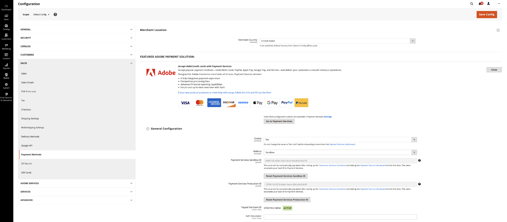

# 従来の [!DNL Payment Services] 設定

管理者の役に立つ設定オプションを使用して、ニーズに合わせて [!DNL Payment Services] をカスタマイズできます。

管理者で [!DNL Adobe Commerce] と [!DNL Magento Open Source] に対して [!DNL Payment Services] を設定する場合、これらの設定は、_[!UICONTROL General Configuration]_の_[!UICONTROL Method]_ フィールドに設定された環境にのみ適用されます。 設定フィールドで行う変更は、_[!UICONTROL Method]_の選択の切り替えとは無関係です。メソッドを切り替えても、選択はリセットされません。

## 一般設定

ストアと _[!UICONTROL Merchant Location]_ージに対して [!DNL Payment Services] を有効にし、「_[!UICONTROL General Configuration]_」セクションでサンドボックステストまたはライブ支払いを有効にできます。

1. _管理者_ サイドバーで、**[!UICONTROL Stores]**/_[!UICONTROL Settings]_/**[!UICONTROL Configuration]**に移動します。
1. 左側のパネルで「**[!UICONTROL Sales]**」を展開し、「**[!UICONTROL Payment Methods]**」を選択します。
1. _[!UICONTROL Merchant Location]_で「_[!UICONTROL Merchant Country]_」フィールドを設定します。 _[!UICONTROL Merchant Country]_を指定しない場合は、一般設定の_[!UICONTROL Default Country]_ が使用されます。
1. 「_[!UICONTROL FEATURED ADOBE PAYMENT SOLUTION]_」セクションを展開して、「_[!UICONTROL [!DNL Payment Services]]_」セクションにアクセスします。
1. 「_[!UICONTROL [!DNL Payment Services]]_」セクションで、「_[!UICONTROL General Configuration]_」セクションを展開します。
1. **有効** の場合は、`Yes` に設定して、ストアに対して [!DNL Payment Services] を有効にします。
1. **メソッド** については、ストアで [!DNL Payment Services] をテストしている場合は `Sandbox` に、ライブ支払いを有効にする準備ができている場合は `Production` に設定します。
1. **[!UICONTROL Payment Services Sandbox ID]** と **[!UICONTROL Payment Services Production ID]** の値は、[Commerce サービスコネクタを設定し ](https://experienceleague.adobe.com/en/docs/commerce/user-guides/integration-services/saas){target=_blank} 初めて [!DNL Payment Services] ダッシュボードにアクセスすると自動入力されます。 サンドボックス環境や実稼動環境のオンボーディングを完了するには、これを行います。 これらの値は、SaaS ID を [!DNL Payment Services] に関連付けます。

   >[!WARNING]
   >
   > Commerce サービスコネクタでデータスペース ID を変更する必要がある場合は、[!DNL Payment Services] ID をリセットする必要があります。 「**支払いサービス ID をリセット**」をクリックして、サンドボックスまたは実稼動 ID をリセットします。 [!DNL Payment Services] ID をリセットした場合は、再度オンボーディングする必要があります。

1. **[!UICONTROL PayPal Merchant ID]** と **[!UICONTROL PayPal Merchant Status]** の値は、[!DNL Payment Services] ダッシュボードに初めてアクセスすると、PayPal によって自動的に提供されます。
1. **ソフト記述子** （顧客トランザクションの銀行取引明細書に表示されてストア/ブランド/カタログ間を区別するカスタム値）の場合は、カスタムテキスト（最大 22 文字）をテキストフィールドに追加して、`Soft descriptor` または既存の値に置き換えます。
1. 「**[!UICONTROL Save Config]**」をクリックして変更を保存します。
1. **[!UICONTROL System]** / **[!UICONTROL Cache Management]** に移動し、**[!UICONTROL Flush Cache]** をクリックして、無効なキャッシュをすべて更新します。

{width="700" zoomable="yes"}

### 設定オプション

| フィールド | 対象範囲 | 説明 |
|---|---|---|
| [!UICONTROL Enable] | web サイト | Web サイトの [!DNL Payment Services] を有効または無効にします。 オプション：`[!UICONTROL Yes]` / `[!UICONTROL No]` |
| [!UICONTROL Method] | ストア表示 | ストアのメソッド（環境）を設定します。 オプション：[!UICONTROL Sandbox] / [!UICONTROL Production] |
| [!UICONTROL Payment Services Sandbox ID] | ストア表示 | サンドボックスオンボーディング中に自動生成されるサンドボックスマーチャント ID。 |
| [!UICONTROL Payment Services Production ID] | ストア表示 | 実稼動（ライブ）オンボーディング中に自動生成される実稼動マーチャント ID。 |
| [!UICONTROL PayPal Merchant ID] | ストア表示 | PayPal アカウントの作成時に生成される、一意の PayPal マーチャントアカウント ID。 |
| [!UICONTROL PayPal Merchant Status] | ストア表示 | PayPal マーチャント ID のステータス。 |
| [!UICONTROL Soft Descriptor] | web サイトまたはストア表示 | Web サイトおよびストアビューにソフト記述子を追加して、ブランド、ストアまたは製品ラインを区別する顧客トランザクションに情報を追加します。 |

## [!UICONTROL Credit Card Fields]

[!UICONTROL Credit Card Fields] の支払いオプションは、クレジットカードまたはデビットカードの支払い方法のためのシンプルで安全なチェックアウトを提供します。

詳しくは、[ 支払いオプション ](payments-options.md#paypal-smart-buttons) を参照してください。

1. _管理者_ サイドバーで、**[!UICONTROL Stores]**/_[!UICONTROL Settings]_/**[!UICONTROL Configuration]**に移動します。
1. 左側のパネルで「**[!UICONTROL Sales]**」を展開し、「**[!UICONTROL Payment Methods]**」を選択します。
1. 「_[!UICONTROL FEATURED ADOBE PAYMENT SOLUTION]_」セクションを展開します。
1. 「_[!UICONTROL Payment Services]_」セクションで、「_[!UICONTROL Credit Card Fields]_」セクションを展開します。
1. **[!UICONTROL Title]**：必要に応じてテキストを入力し、チェックアウト時に表示される支払い方法の名前を変更します。
1. [ 支払い処理の設定 ](production.md#set-payment-services-as-payment-method) を行うには、「**[!UICONTROL Authorize]**」または **「承認して取得** を選択します。
1. チェックアウトページで支払い方法に優先順位を付けるには、「**[!UICONTROL Sort order]**」フィールドに `Numeric Only` 値を入力します。
1. **[!UICONTROL Show on checkout page]** しくは、「`Yes`」を選択して、チェックアウトページでクレジットカードフィールドを有効にします。
1. **[!UICONTROL Vault Enabled]**: チェックアウト時にクレジット・カードのヴォールティングを有効にする場合は、「`Yes`」を選択します。
1. **[!UICONTROL Vault Enabled in Admin]** に、加盟店がボールトに登録されたクレジット カードを使用して顧客の注文を作成できるようにする `Yes` を選択します。
1. **[!UICONTROL 3D Secure authentication]** を有効にするには（デフォルトでは `Off`）、「`Always`」または「`When required`」を選択します。
1. **[!UICONTROL Debug Mode]**: デバッグモードを有効にするには `Yes` を選択し、無効にするには `No` を選択します。
1. 「**[!UICONTROL Save Config]**」をクリックして変更を保存します。
1. **[!UICONTROL System]** / **[!UICONTROL Cache Management]** に移動し、**[!UICONTROL Flush Cache]** をクリックして、無効なキャッシュをすべて更新します。

### 設定オプション

| フィールド | 対象範囲 | 説明 |
|---|---|---|
| [!UICONTROL Title] | ストア表示 | チェックアウト時に支払い方法ビューでこの支払いオプションのタイトルとして表示するテキストを追加します。 オプション：[!UICONTROL text field] |
| [!UICONTROL Payment Action] | web サイト | 指定した支払方法の [ 支払アクション ](https://experienceleague.adobe.com/docs/commerce-admin/config/sales/payment-methods/payment-methods.html)。 オプション：[!UICONTROL Authorize] / [!UICONTROL Authorize and Capture] |
| [!UICONTROL Sort order] | ストア表示 | チェックアウトページでの指定した支払い方法の並べ替え順。 `Numeric Only` 値 |
| [!UICONTROL Show on checkout page] | web サイト | チェックアウトページのクレジットカードフィールドを有効または無効にします。 オプション：[!UICONTROL Yes] / [!UICONTROL No] |
| [!UICONTROL Vault enabled] | ストア表示 | [ クレジット カードの保管 ](vaulting.md) を有効または無効にします。 オプション：[!UICONTROL Yes] / [!UICONTROL No] |
| [!UICONTROL Vault enabled in Admin] | ストア表示 | [ マーチャントが管理でボルト付き支払い方法を使用して顧客の注文を完了する ](vaulting.md) 機能を有効または無効にします。 オプション：[!UICONTROL Yes] / [!UICONTROL No] |
| [!UICONTROL 3D Secure authentication] | web サイト | [3DS セキュア認証 ](security.md#3ds) を有効または無効にします。 オプション：[!UICONTROL Always]/[!UICONTROL When Required]/[!UICONTROL Off] |
| [!UICONTROL Debug Mode] | web サイト | デバッグモードを有効または無効にします。 オプション：`[!UICONTROL Yes]` / `[!UICONTROL No]` |

## [!UICONTROL Apple Pay]

[!UICONTROL Apple Pay] 支払いオプションを使用すると、マーチャントは買い物客にApple Pay を提供できます。買い物客はデバイスでタッチ ID を使用して、Safari ブラウザーから購入できます。 マーチャントは、マーチャントアカウント 1 件につき最大 99 個のドメインを追加できます。

詳しくは、[ 支払いオプション ](payments-options.md#apple-pay-button) を参照してください。

1. _管理者_ サイドバーで、**[!UICONTROL Stores]**/_[!UICONTROL Settings]_/**[!UICONTROL Configuration]**に移動します。
1. 左側のパネルで「**[!UICONTROL Sales]**」を展開し、「**[!UICONTROL Payment Methods]**」を選択します。
1. 「_[!UICONTROL FEATURED ADOBE PAYMENT SOLUTION]_」セクションを展開します。
1. 「_[!UICONTROL Payment Services]_」セクションで、「_[!UICONTROL Apple Pay]_」セクションを展開します。
1. **[!UICONTROL Title]**：必要に応じてテキストを入力し、チェックアウト時に表示される支払い方法の名前を変更します。
1. [ 支払いアクションを設定 ](production.md#set-payment-services-as-payment-method) するには、「**[!UICONTROL Authorize]**」または「**[!UICONTROL Authorize and Capture]**」を選択します。
1. 必要に応じて次のオプションの「[!DNL Apple Pay]」を選択して、Adobe Commerceで `Yes` オプションを有効にする場所を指定します。
   * **[!UICONTROL Show Apple Pay on checkout page]**
   * **[!UICONTROL Show Apple Pay on product detail page]**
   * **[!UICONTROL Show Apple Pay in mini cart preview]**
   * **[!UICONTROL Show Apple Pay on cart page]**
1. デバッグモードを有効にするには、**[!UICONTROL Debug Mode]** の `Yes` を選択します（`No` は無効にします）。
1. 変更を保存するには、「**[!UICONTROL Save Config]**」をクリックします。
1. **[!UICONTROL System]** / **[!UICONTROL Cache Management]** に移動し、**[!UICONTROL Flush Cache]** をクリックして、無効なキャッシュをすべて更新します。

### 設定オプション

| フィールド | 対象範囲 | 説明 |
|---|---|---|
| [!UICONTROL Title] | ストア表示 | チェックアウト時に支払い方法ビューでこの支払いオプションのタイトルとして表示するテキストを追加します。 オプション：[!UICONTROL text field] |
| [!UICONTROL Payment Action] | web サイト | 指定した支払方法の [ 支払アクション ](https://experienceleague.adobe.com/docs/commerce-admin/config/sales/payment-methods/payment-methods.html)。 オプション：[!UICONTROL Authorize] / [!UICONTROL Authorize and Capture] |
| [!UICONTROL Show on checkout page] | web サイト | チェックアウトページで [!DNL Apple Pay] を有効または無効にします。 オプション：`[!UICONTROL Yes]` / `[!UICONTROL No]` |
| [!UICONTROL Sort order] | ストア表示 | チェックアウトページでの指定した支払い方法の並べ替え順。 `Numeric Only` 値 |
| [!UICONTROL Show buttons on product detail page] | ストア表示 | 製品の詳細ページで [!DNL Apple Pay] を有効または無効にします。 オプション：`[!UICONTROL Yes]` / `[!UICONTROL No]` |
| [!UICONTROL Show buttons in mini-cart preview] | ストア表示 | ミニ買い物かごのプレビューで [!DNL Apple Pay] を有効または無効にします。 オプション：`[!UICONTROL Yes]` / `[!UICONTROL No]` |
| [!UICONTROL Show buttons on cart page] | ストア表示 | 買い物かごページの [!DNL Apple Pay] のチェックインを有効または無効にします。 オプション：`[!UICONTROL Yes]` / `[!UICONTROL No]` |
| [!UICONTROL Debug Mode] | web サイト | デバッグモードを有効または無効にします。 オプション：`[!UICONTROL Yes]` / `[!UICONTROL No]` |

## [!UICONTROL Google Pay]

[!UICONTROL Google Pay] 支払いオプションを使用すると、マーチャントは買い物客にGoogle Pay を提供でき、買い物客はデバイスでGoogle Wallet を使用して購入できます。

詳しくは、[ 支払いオプション ](payments-options.md#google-pay-button) を参照してください。

1. _管理者_ サイドバーで、**[!UICONTROL Stores]**/_[!UICONTROL Settings]_/**[!UICONTROL Configuration]**に移動します。
1. 左側のパネルで「**[!UICONTROL Sales]**」を展開し、「**[!UICONTROL Payment Methods]**」を選択します。
1. 「_[!UICONTROL FEATURED ADOBE PAYMENT SOLUTION]_」セクションを展開します。
1. 「_[!UICONTROL Payment Services]_」セクションで、「_[!UICONTROL Google Pay]_」セクションを展開します。
1. （オプション） **[!UICONTROL Title]** フィールドに新しい名前を入力して、チェックアウト時に表示される支払い方法の名前を変更します。
1. [ 支払いアクションを設定 ](production.md#set-payment-services-as-payment-method) するには、**[!UICONTROL Authorize]** または **[!UICONTROL Authorize and Capture]** を選択します。
1. 必要に応じて次のオプションの「[!DNL Google Pay]」を選択して、Adobe Commerceで `Yes` オプションを有効にする場所を指定します。
   * **[!UICONTROL Show Google Pay on checkout page]**
   * **[!UICONTROL Show Google Pay on product detail page]**
   * **[!UICONTROL Show Google Pay in mini cart preview]**
   * **[!UICONTROL Show Google Pay on cart page]**
1. **[!UICONTROL 3D Secure authentication]** を有効にするには（デフォルトでは `Off`）、「`Always`」または「`When required`」を選択します。
1. デバッグモードを有効にするには、**[!UICONTROL Debug Mode]** の `Yes` を選択します（`No` は無効にします）。
1. 必要に応じて **[!UICONTROL Button Color]**、**[!UICONTROL Button Type]**、**[!UICONTROL Button Style]** を選択して、「_[!UICONTROL Google Pay]_」ボタンの外観を設定します。
1. 高さを設定するには、**[!UICONTROL Button Style]** で定義された高さの既定値を使用します。
1. 変更を保存するには、「**[!UICONTROL Save Config]**」をクリックします。
1. **[!UICONTROL System]** / **[!UICONTROL Cache Management]** に移動し、**[!UICONTROL Flush Cache]** をクリックして、無効なキャッシュをすべて更新します。

### 設定オプション

| フィールド | 対象範囲 | 説明 |
|---|---|---|
| [!UICONTROL Title] | ストア表示 | チェックアウト時に支払い方法ビューでこの支払いオプションに表示されるテキスト ラベルを指定します。 オプション：`[!UICONTROL text field]` |
| [!UICONTROL Payment Action] | web サイト | 指定した支払方法の [ 支払アクション ](https://experienceleague.adobe.com/docs/commerce-admin/config/sales/payment-methods/payment-methods.html)。 オプション：`[!UICONTROL Authorize]` / `[!UICONTROL Authorize and Capture]` |
| [!UICONTROL Show on checkout page] | web サイト | チェックアウトページで [!DNL Google Pay] を有効または無効にします。 オプション：`[!UICONTROL Yes]` / `[!UICONTROL No]` |
| [!UICONTROL Sort order] | ストア表示 | チェックアウトページでの指定した支払い方法の並べ替え順。 `Numeric Only` 値 |
| [!UICONTROL Show buttons on product detail page] | ストア表示 | 製品の詳細ページで [!DNL Google Pay] を有効または無効にします。 オプション：`[!UICONTROL Yes]` / `[!UICONTROL No]` |
| [!UICONTROL Show buttons in mini-cart preview] | ストア表示 | ミニ買い物かごのプレビューで [!DNL Google Pay] を有効または無効にします。 オプション：`[!UICONTROL Yes]` / `[!UICONTROL No]` |
| [!UICONTROL Show buttons on cart page] | ストア表示 | 買い物かごページの [!DNL Google Pay] を有効または無効にします。 オプション：`[!UICONTROL Yes]` / `[!UICONTROL No]` |
| [!UICONTROL 3D Secure authentication] | ストア表示 | [3D セキュア認証 ](security.md#3ds) を有効または無効にします。 オプション：[!UICONTROL Always]/[!UICONTROL When Required]/[!UICONTROL Off] |
| [!UICONTROL Debug Mode] | web サイト | デバッグモードを有効または無効にします。 オプション：`[!UICONTROL Yes]` / `[!UICONTROL No]` |
| [!UICONTROL Button Color] | ストア表示 | 「[!DNL Google Pay]」ボタンの色を定義します。 オプション：`[!UICONTROL Default]`/`[!UICONTROL Black]`/`[!UICONTROL White]` |
| [!UICONTROL Button Type] | ストア表示 | 「[!DNL Google Pay]」ボタンのタイプを定義します。 オプション：`[!UICONTROL buy]` / `[!UICONTROL checkout]` / `[!UICONTROL order]` / `[!UICONTROL pay]` / `[!UICONTROL plain]` |

詳しくは、[Google Pay API リクエストオブジェクトオプション ](https://developers.google.com/pay/api/web/reference/request-objects) ドキュメントを参照してください。

## [!DNL PayPal Payment Buttons]

[!DNL PayPal payment buttons] の支払いオプションは、顧客にシンプルで迅速かつ安全なチェックアウトプロセスを提供します。

詳しくは、[ 支払いオプション ](payments-options.md#paypal-smart-buttons) を参照してください。

[!DNL PayPal payment buttons] の設定

PayPal 支払いボタンの支払いオプションを管理内で有効にして設定できます。

1. _管理者_ サイドバーで、**[!UICONTROL Stores]**/_[!UICONTROL Settings]_/**[!UICONTROL Configuration]**に移動します。
1. 左側のパネルで「**[!UICONTROL Sales]**」を展開し、「**[!UICONTROL Payment Methods]**」を選択します。
1. 「_[!UICONTROL FEATURED ADOBE PAYMENT SOLUTION]_」セクションを展開します。
1. 「_[!UICONTROL Payment Services]_」セクションで、「_[!UICONTROL PayPal payment buttons]_」セクションを展開します。
1. チェックアウト時に表示される支払い方法の名前を変更するには、「_[!UICONTROL Title]_」フィールドを編集します。
1. [ 支払いアクションを設定 ](production.md#set-payment-services-as-payment-method) するには、「**[!UICONTROL Authorize]**」または「**[!UICONTROL Authorize and Capture]**」を選択します。
1. チェックアウトページで支払い方法に優先順位を付けるには、「**[!UICONTROL Sort order]**」フィールドに `Numeric Only` 値を入力します。
1. [ 後で支払うメッセージ ](payments-options.md#pay-later-button) を有効/無効にするには、**[!UICONTROL Display Pay Later Message]** で `Yes`/`No` を選択します。
1. 必要に応じて次のオプションの `Yes` を選択して、Adobe Commerceで PayPal 支払いボタンを有効にする場所を指定します。
   * **[!UICONTROL Show buttons on checkout page]**
   * **[!UICONTROL Show buttons on product detail page]**
   * **[!UICONTROL Show buttons in mini cart preview]**
   * **[!UICONTROL Show buttons on cart page]**
1. Venmo を支払いオプションとして有効にするには、**[!UICONTROL Venmo Enabled]** に「`Yes`」を選択します。
1. クレジットカードとデビットカードを支払いオプションとして有効にするには（PayPal スマートボタン）、「**[!UICONTROL Credit and Debit Card Enabled]**」で「`Yes`」を選択します。
1. [PayPal Pay Later](payments-options.md#pay-later-button) 支払いオプションを有効/無効にするには、**[!UICONTROL PayPal Pay Later Enabled]** の `Yes`/`No` を選択します。
1. デバッグモードを有効にするには、**[!UICONTROL Debug Mode]** の `Yes` を選択します（`No` は無効にします）。
1. 変更を保存するには、「**[!UICONTROL Save Config]**」をクリックします。
1. **[!UICONTROL System]** / **[!UICONTROL Cache Management]** に移動し、**[!UICONTROL Flush Cache]** をクリックして、無効なキャッシュをすべて更新します。

### 設定オプション

| フィールド | 対象範囲 | 説明 |
|---|---|---|
| [!UICONTROL Title] | ストア表示 | チェックアウト時に支払い方法ビューでこの支払いオプションのタイトルとして表示するテキストを追加します。 オプション：テキストフィールド |
| [!UICONTROL Payment Action] | web サイト | 指定した支払方法の [ 支払アクション ](https://experienceleague.adobe.com/en/docs/commerce-admin/config/sales/payment-methods/payment-methods#payment-actions){target="_blank"}。 オプション：[!UICONTROL Authorize] / [!UICONTROL Authorize and Capture] |
| [!UICONTROL Display Pay Later Message] | web サイト | 買い物かご、製品ページ、ミニカート、およびチェックアウトフロー中の「後で支払う」メッセージを有効または無効にします。 オプション：`[!UICONTROL Yes]` / `[!UICONTROL No]` |
| [!UICONTROL Show buttons on checkout page] | ストア表示 | チェックアウトページで [!DNL PayPal payment buttons] を有効または無効にします。 オプション：`[!UICONTROL Yes]` / `[!UICONTROL No]` |
| [!UICONTROL Show buttons on product detail page] | ストア表示 | 製品の詳細ページで [!DNL PayPal payment buttons] を有効または無効にします。 オプション：`[!UICONTROL Yes]` / `[!UICONTROL No]` |
| [!UICONTROL Show buttons in mini-cart preview] | ストア表示 | ミニ買い物かごのプレビューで [!DNL PayPal payment buttons] を有効または無効にします。 オプション：`[!UICONTROL Yes]` / `[!UICONTROL No]` |
| [!UICONTROL Show buttons on cart page] | ストア表示 | 買い物かごページの [!DNL PayPal payment buttons] のチェックインを有効または無効にします。 オプション：`[!UICONTROL Yes]` / `[!UICONTROL No]` |
| [!UICONTROL Venmo Enabled] | ストア表示 | 支払ボタンが表示される Venmo 支払オプションを有効または無効にします。 オプション：`[!UICONTROL Yes]` / `[!UICONTROL No]` |
| [!UICONTROL Credit and Debit Card Enabled] | ストア表示 | 支払いボタンが表示されるクレジット カードおよびデビット カード オプションを有効または無効にします。 オプション：`[!UICONTROL Yes]` / `[!UICONTROL No]` |
| [!UICONTROL PayPal Pay Later Enabled] | ストア表示 | 支払いボタンが表示される PayPal Pay Later 支払いオプションの外観を有効または無効にします。 オプション：`[!UICONTROL Yes]` / `[!UICONTROL No]` |
| [!UICONTROL Debug Mode] | web サイト | デバッグモードを有効または無効にします。 オプション：`[!UICONTROL Yes]` / `[!UICONTROL No]` |

## ボタンのスタイル

また、支払いボタンの _[!UICONTROL Button style]_のオプションを設定することもできます。

1. _管理者_ サイドバーで、**[!UICONTROL Stores]**/_[!UICONTROL Settings]_/**[!UICONTROL Configuration]**に移動します。
1. 左側のパネルで「**[!UICONTROL Sales]**」を展開し、「**[!UICONTROL Payment Methods]**」を選択します。
1. 「_[!UICONTROL FEATURED ADOBE PAYMENT SOLUTION]_」セクションを展開します。
1. 「_[!UICONTROL [!DNL Payment Services]]_」セクションで、「_[!UICONTROL PayPal Smart Button Styling]_」セクションを展開します。
1. レイアウトを設定するには、**[!UICONTROL Layout]** に `Vertical` または `Horizontal` を選択します
1. 色を設定するには、**[!UICONTROL Color]** で使用可能な色から選択します。
1. 形状を設定するには、**[!UICONTROL Shape]** に `Rectangular` または `Pill` を選択します。
1. デフォルトの高さを使用するには、**[!UICONTROL Use Default Height]** に `Yes` または `No` を選択します。
1. カスタムの高さを設定するには、**[!UICONTROL Height]** に希望のピクセル高さを追加します。
1. タグラインを設定するには、「**[!UICONTROL Tagline]**」で「`Yes`」または「`No`」を選択します。
1. 変更を保存するには、「**[!UICONTROL Save Config]**」をクリックします。
1. **[!UICONTROL System]** / **[!UICONTROL Cache Management]** に移動し、**[!UICONTROL Flush Cache]** をクリックして、無効なキャッシュをすべて更新します。

支払いサービスのホームから支払いボタンのスタイル設定 [ 設定 ](settings.md#button-style) を行うこともできます。

### 設定オプション

| フィールド | 対象範囲 | 説明 |
|--- |--- |--- |
| [!UICONTROL Layout] | ストア表示 | Paypal 支払いボタンのレイアウトのスタイルを定義します。 オプション：`[!UICONTROL Vertical]` / `[!UICONTROL Horizontal]` |
| [!UICONTROL Color] | ストア表示 | Paypal 支払いボタンの色を定義します。 オプション：[!UICONTROL Blue] / `[!UICONTROL Gold]` / `[!UICONTROL Silver]` / `[!UICONTROL White]` / `[!UICONTROL Black]` |
| [!UICONTROL Shape] | ストア表示 | Paypal 支払いボタンの形状を定義します。 オプション：`[!UICONTROL Rectangular]` / `[!UICONTROL Pill]` |
| [!UICONTROL Use Default Height] | ストア表示 | PayPal 支払いボタンでデフォルトの高さを使用するかどうかを定義します。 オプション：`[!UICONTROL Yes]` / `[!UICONTROL No]` |
| [!UICONTROL Height] | ストア表示 | PayPal 支払いボタンの高さを定義します。 デフォルト値：なし |
| [!UICONTROL Label] | ストア表示 | PayPal 支払いボタンに表示されるラベルを定義します。 オプション：`[!UICONTROL PayPal]` / `[!UICONTROL Checkout]` / `[!UICONTROL Buynow]` / `[!UICONTROL Pay]` / `[!UICONTROL Installment]` |
| [!UICONTROL Tagline] | ストア表示 | タグラインを有効にします。 オプション：`[!UICONTROL Yes]` / `[!UICONTROL No]` |

## キャッシュをフラッシュします

設定を変更する場合は、[ 手動でキャッシュをフラッシュ ](/help/payment-services/settings.md#flush-the-cache) して、ストアに最新の設定が表示されるようにします。
