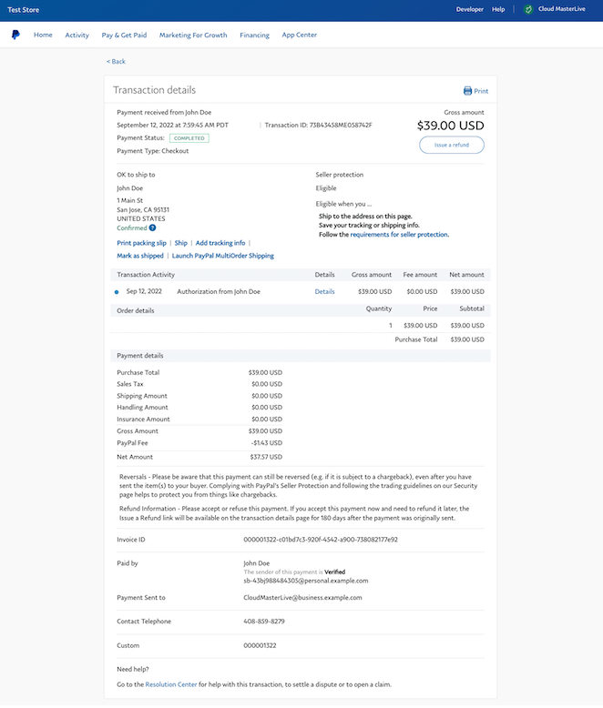

# 利用可能なデータ

一部の注文データと支払いデータを使用して、外部システム間でAdobe Commerce financial reportingを調整できます。

## ERPとの連携

特定の注文に関連付けられた増分IDを使用して、Adobe Commerce財務報告をAdobe以外のERP （エンタープライズリソースプランニング）システムと照合できます。

Payment ServicesがCommerce注文をPayPalに送信すると、増分IDは`custom_id` _および_&#x200B;として`invoice_id`に含まれます（これには`increment_id`の後のランダムな文字列も含まれます）。

IDは、支払いの加盟店アクティビティの詳細とPayPalのWebhookの両方から簡単にアクセスできます。

`invoice_id`と`custom_id`は、支払いの加盟店アクティビティの詳細の下部に表示されます。

加盟店アクティビティの詳細{width="600" zoomable="yes"}の`custom_id`

PayPalのWebhookの詳細の`custom_id`と`invoice_id`:

```json
   ...
   {
    "id": "4E855005GK253170H",
    "intent": "AUTHORIZE",
    "status": "COMPLETED",
    "payment_source": {
        ...
    },
    "purchase_units": [
        {
            ...
            "custom_id": "000001322",
            "invoice_id": "000001322-c01bd7c3-920f-4542-a900-738082177e92",
            ...
            "payments": {
                "authorizations": [
                    {
                       ...
                        "invoice_id": "000001322-c01bd7c3-920f-4542-a900-738082177e92",
                        "custom_id": "000001322",
                        ...
                    }
                ],
                "captures": [
                    {
                        ...
                        "invoice_id": "000001322-c01bd7c3-920f-4542-a900-738082177e92",
                        "custom_id": "000001322",
                        ...
                    }
                ]
            }
        }
    ],
    "payer": {
        ...
    },
    "create_time": "2022-09-12T14:59:01Z",
    "update_time": "2022-09-12T14:59:45Z",
    "links": [
        ...
    ]
}
   ...
```

詳しくは、PayPalのREST API ドキュメントを参照してください。

* [`purchase_unit` （`custom_id`および`invoice_id`が格納）](https://developer.paypal.com/docs/api/orders/v2/#definition-purchase_unit)
* [注文の詳細を表示](https://developer.paypal.com/docs/api/orders/v2/#orders_get)
