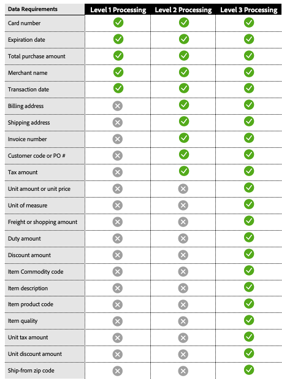
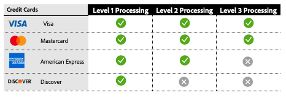

# レベル 2およびレベル 3の処理

[!DNL Payment Services]は、加盟店が支払い取引を最適化し、交換手数料を下げるのを支援する高度なカード処理機能を提供しています。 利用可能なカード処理には3つのレベルがあり、それぞれに異なるトランザクションデータ要件があります。

>[!CAUTION]
>
> [Fastlane](payments-options.md#fastlane-button)注文には、レベル 2/レベル 3 データ、行項目、金額の内訳は含まれません。

## 処理レベルごとのデータ要件

{width="500" zoomable="yes"}

[!DNL Payment Services]はこのデータを収集し、支払いトランザクションの詳細レポートを提供します。

## 利用可能な処理レベル （カードネットワーク別）

{width="500" zoomable="yes"}

詳しくは、PayPal デベロッパーのドキュメントの[決済処理](https://developer.paypal.com/docs/checkout/advanced/processing/){target=_blank}を参照してください。

### レベル 1

レベル 1は最も一般的で、必要な情報が少ないため、一般的に、レベル 2またはレベル 3のデータで処理された取引と比較して、交換手数料が高くなります。これは、通常、企業と購入のクレジットカードに関連しています。

### レベル 2とレベル 3

インターチェンジプラス プラス （IC++）の[!DNL Payment Services]人の販売者は、追加の取引詳細をカードネットワークに提供し、特定の適格化条件を満たす場合、レベル 2/レベル 3の処理の対象となる場合があります。 これらのレベルは、多額の購入や法人カードの量を扱うマーチャントにとって特に有益であり、大幅なコスト削減につながります。 詳細なレベル 2またはレベル 3のデータを提供すると、次のことが可能になります。

* 処理費の低減と全体的なコストの最適化
* 不正行為を防止し、プロセッサーのリスクを低減
* トランザクションセキュリティの強化

[ICとは++?](https://www.paypal.com/us/brc/article/what-is-interchange-plus-plus){target=_blank}を参照 詳しくは、PayPal開発者ドキュメントを参照してください。

## [!DNL Payment Services]のレベル 2およびレベル 3のカード支払いトランザクション

レベル 2またはレベル 3の処理の対象となるには、以前の情報を送信する必要がありますが、トランザクションを処理する際に最終的に対象となるレベルを決定するのはカードネットワークです。

詳しくは、PayPal開発者ドキュメントの[決済処理に関するFAQ](https://www.paypal.com/us/cshelp/article/ts2278?_ga=1.131773126.875104296.1712843492){target=_blank}を参照してください。

レベル 2およびレベル 3の処理は、店舗レベルの[!DNL Payment Services]人のマーチャントに対して、デフォルトで無効になっています。

IC++の価格を既に使用している場合は、レベル 2およびレベル 3の処理を利用できます。 この機能を有効にするには、[ コマンドラインインターフェイス（CLI](configure-cli.md)を使用します。

>[!IMPORTANT]
>
>ご不明な点がある場合は、[!DNL Payment Services] アカウントマネージャーにお問い合わせください。
