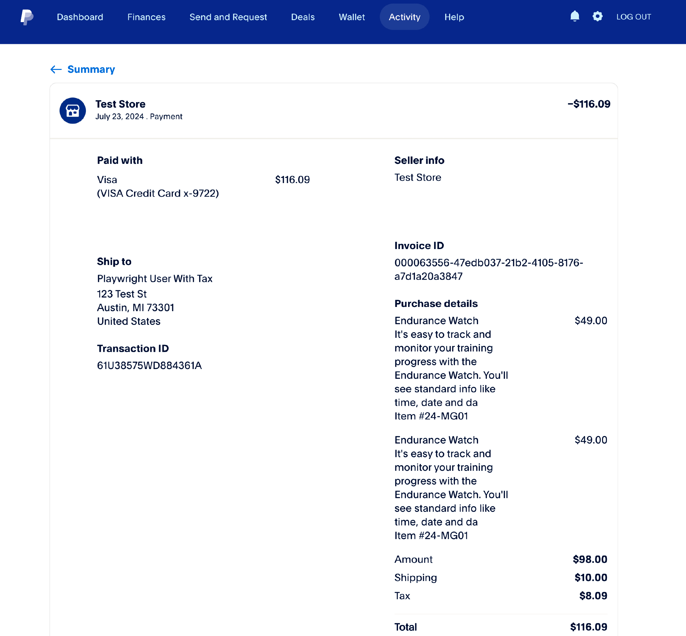
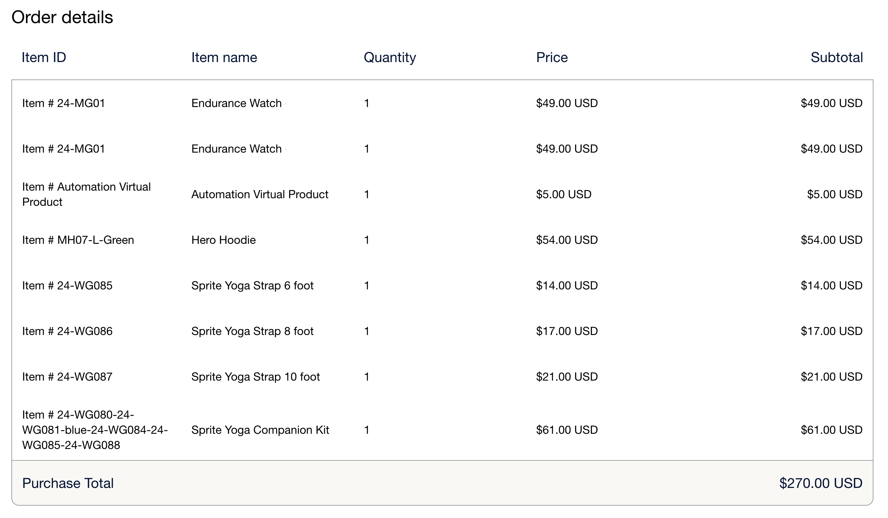

# [!DNL Payment Services]の行項目

[!DNL Payment Services]の行項目は、注文に含まれる項目です。 これらの行項目は、次のような情報を提供します。

* 製品の詳細
* 量
* 価格（税金、割引、その他の関連情報を含む）

この情報は、カスタマーサービス、注文管理、適切な請求に役立ちます。

## 行項目の設定

[!DNL Payment Services]の行項目は既定で有効になっています。 設定するには：

1. _管理者_ サイドバーで、**[!UICONTROL Stores]** > _[!UICONTROL Settings]_>**[!UICONTROL Configuration]**&#x200B;に移動します。

1. **[!UICONTROL Sales]**&#x200B;に移動し、**[!UICONTROL Payment Methods]**&#x200B;を選択します。

1. _[!UICONTROL FEATURED ADOBE PAYMENT SOLUTION]_&#x200B;セクションを展開します。

1. _[!UICONTROL Payment Services]_&#x200B;セクションで、_[!UICONTROL Line Items]_ セクションを展開します。

1. **[!UICONTROL Line Items Enabled]**&#x200B;の場合、`Yes`を選択して有効（デフォルト）にするか、`No`を選択して行項目を無効にします。

1. **[!UICONTROL Save Config]**&#x200B;をクリックして変更を保存します。

>[!IMPORTANT]
>
> 注文にカスタム手数料（処理手数料など）を追加するサードパーティの拡張機能がある場合は、行項目を無効にする必要がある場合があります。 [!DNL Payment Services]は、Commerceの標準の注文コンポーネント （品目、税務、配送、割引）に基づいて行項目を計算します。 [!DNL Payment Services]が認識しないサードパーティの手数料は、行項目の合計と注文合計の間に不一致が生じる可能性があり、チェックアウトが完了しない可能性があります。

## 行項目の表示

行項目を表示するには：

1. [PayPal マーチャントダッシュボード &#x200B;](https://www.paypal.com/merchant/){target=_blank}に移動します。

1. **アクティビティ**/**すべてのトランザクション**&#x200B;をクリックします。

1. 目的の順序を選択し、その行項目を表示します。

   > 買い物客ダッシュボードビューの行項目の例

   {width="500" zoomable="yes"}

## 行項目の属性

Adobe Commerceを通じて注文が行われ、情報がPayPalに送信されると、以下の属性を持つ行項目が生成されます。

| 属性 | データタイプ | 説明 |
| --- | --- | --- |
| `name` | ストリング！ | 項目名。 複数の数量または税額控除の問題により品目に複数の明細がある場合、すべての明細に対して品目名は同じままですが、端数処理により表示される価格が若干異なる場合があります。 |
| `unit_amount` | オブジェクト！ | 単位当たりの品目価格またはレート。 次の属性が含まれます：`currency_code`と`value`。 |
| `tax` | オブジェクト | 各単位の品目税。 次の属性が含まれます：`currency_code`と`value`。 |
| `quantity` | ストリング！ | 品目数量。 整数になります。 |
| `description` | 文字列 | 詳細な項目の説明。 |
| `sku` | 文字列 | 商品の在庫保管単位（SKU）。 |
| `url` | 文字列 | 購入中の項目の`URL`です。 購入者にとって表示され、購入者の体験で利用されます。 |
| `upc` | オブジェクト | 商品のユニバーサルプロダクトコード（またはUPC）。 |
| `category` | 文字列 | 品目カテゴリのタイプ。 |

### `unit_amount`属性

`unit_amount` オブジェクトには、次の属性が含まれています。

| 属性 | データタイプ | 説明 |
| --- | --- | --- |
| `currency_code` | ストリング！ | 通貨を識別する[3文字のISO-4217通貨コード &#x200B;](https://developer.paypal.com/api/rest/reference/currency-codes/)。 |
| `value` | ストリング！ | 項目の値を示します。 `currency_code`は、必要な小数点以下桁を指定します（必要な場合）。 |

### `tax`属性

`tax` オブジェクトには、次の属性が含まれています。

| 属性 | データタイプ | 説明 |
| --- | --- | --- |
| `currency_code` | ストリング！ | 通貨を識別する[3文字のISO-4217通貨コード &#x200B;](https://developer.paypal.com/api/rest/reference/currency-codes/)。 |
| `value` | ストリング！ | 項目の値を示します。 必要な小数点以下桁の数は、各`currency_code`によって異なります。 |

### `upc`属性

`upc` オブジェクトには、次の属性が含まれています。

| 属性 | データタイプ | 説明 |
| --- | --- | --- |
| `type` | 文字列！ | UPC タイプ。 |
| `code` | 文字列！ | アイテムのUPC製品コード。 |

+++行項目の例

```json
{
    "name": "Crown Summit Backpack - 1",
    "unit_amount": {
        "currency_code": "USD",
        "value": "38.50"
    },
    "tax": {
        "currency_code": "USD"
        "value": "3.13"
    },
    "quantity": "1",
    "description": "The Crown Summit Backpack is equally at home in a gym locker, study cube or a pup tent, so be sure yours is packed with books,",
    "sku": "24-MB03",
    "url": "https://magento.test/crown-summit-backpack.html",
    "upc": {
        "type": "UPC-A",
        "code": "000003"
    },
    "category": "PHYSICAL_GOODS"
},
{
    "name": "Crown Summit Backpack - 2",
    "unit_amount": {
        "currency_code": "USD",
        "value": "38.50"
    },
    "tax": {
        "currency_code": "USD",
        "value": "3.14"
    },
    "quantity": "1",
    "description": "The Crown Summit Backpack is equally at home in a gym locker, study cube or a pup tent, so be sure yours is packed with books,",
    "sku": "24-MB03",
    "url": "https://magento.test/crown-summit-backpack.html",
    "upc": {
        "type": "UPC-A",
        "code": "000003"
    },
    "category": "PHYSICAL_GOODS"
}
```

+++

これらのフィールドとその制限について詳しくは、[PayPal開発者ドキュメント &#x200B;](https://developer.paypal.com/docs/api/orders/v2/#definition-line_item){target=_blank}を参照してください。

## 行項目の管理

Adobe Commerce [では、各行の合計金額に基づいて税金が計算されます](https://experienceleague.adobe.com/ja/docs/commerce-admin/stores-sales/site-store/taxes/taxes#warning-messages){target=_blank}。これは、同じ項目の複数の数量が注文された場合、または税込み価格がカタログに表示された場合に、丸め問題が発生する可能性があります。 この場合、合計数量は2行に分けることができますが、数量は注文された合計品目に等しくなります。

> マーチャントダッシュボードビューでの丸め問題を含む行項目の例

{width="600" zoomable="yes"}

+++Adobe Commerceで行項目の丸め問題を計算する方法

[!DNL Payment Services]の行項目は、この丸め問題とバランスをとるため、`unit_amount`または`unit_tax`の値は注文の合計金額と一致します。 アイテムは、この丸め問題を解決するために2行に分割できます。

* 丸め問題が`unit_amount`に表示された場合、この追加行の価格に違いが表示されます。
* 丸め問題が`unit_tax`に表示された場合、`tax`はグリッドに表示されず、下部の合計としてのみ表示されるため、個々の行項目に違いは見られません。

+++
