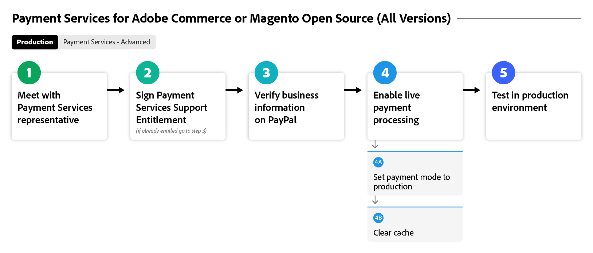
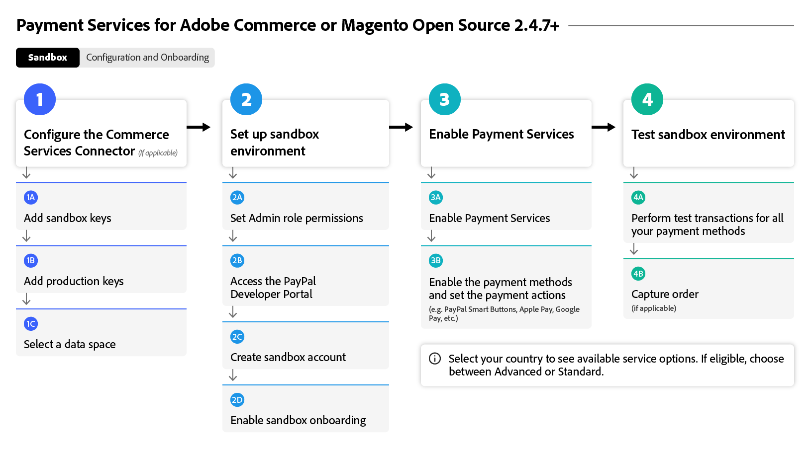
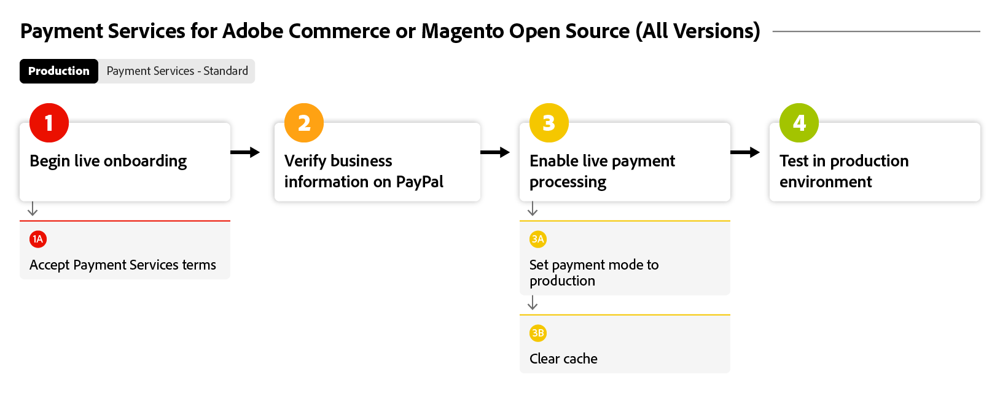
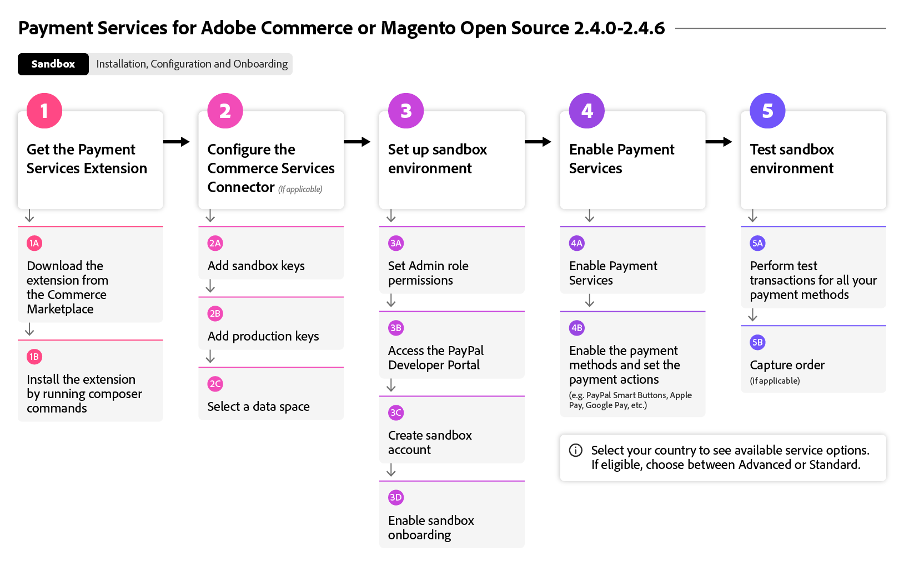

# [!DNL Payment Services] フローのオンボーディング

[!DNL Payment Services]の使用を開始するには、いくつかのオンボーディング手順を完了する必要があります。 正確なガイダンスについては、組織のインスタンスとバージョンに最も適した以下のAdobe Commerce オプションを選択してください。

このフロー図は、すべてのバージョンで[!DNL Payment Services]をオンボーディングするための一般的なプロセスを示しています。

{width="700" zoomable="yes"}

[!DNL Payment Services]のオンボーディングに使用するAdobe Commerceのバージョンについては、以下を参照してください。

## インスタンスとバージョンの検索を支援する

### Adobe CommerceまたはMagento Open Source | v2.4.7以降

これらのフロー図は、v2.4.7より新しいAdobe CommerceまたはMagento Open Sourceを使用して[!DNL Payment Services]をオンボーディングする一般的なプロセスを示しています。

>[!BEGINTABS]

>[!TAB  サンドボックス ]

このフロー図は、v2.4.7より新しいAdobe CommerceまたはMagento Open Sourceを使用したオンボーディングサンドボックスプロセスを示しています。ここでは、[!DNL Payment Services]はAdobe Commerceですぐに使用できます。

{width="700" zoomable="yes"}

バージョン v2.4.7以降の&#x200B;**オンボーディング手順パート 1: サンドボックス**

1. [ インスタンスを](connect.md#configure-commerce-services)Commerce サービスに接続します。 この接続は、Commerce インスタンスごとに1回のみ完了する必要があります。 [!BADGE PaaSのみ]{type=Informative tooltip="Cloud プロジェクト上のAdobe Commerce（Adobeで管理されるPaaS インフラストラクチャ）にのみ適用されます。"}
1. [サンドボックスサービスの設定](sandbox.md#sandbox-onboarding)
1. [ サンドボックス ](sandbox.md#test-in-sandbox-environment)環境で支払いをテストします。

>[!TAB 本番]

このフロー図は、[!DNL Payment Services]を有効にするために必要な実稼動ステップを示しています。

{width="700" zoomable="yes"}

バージョン v2.4.7以降の&#x200B;**オンボーディング手順パート 2：実稼動**

1. [ サンドボックスモードで [!DNL Payment Services] をお支払い方法](production.md#set-payment-services-as-payment-method)として設定し、テスト決済の処理を開始します。
1. ライブオンボーディングを有効にするには、[支払い資格](production.md#request-payments-entitlement-from-adobe)をリクエストします。
1. Commerce Web サイトのライブ決済を有効にするには、[ マーチャントのオンボーディング ](production.md#complete-merchant-onboarding)を完了してください。
1. [加盟店ID [!DNL Payment Services] を取得し、セールス部門に渡して、適切な価格帯を設定します。](production.md#configure-pricing-tier)
1. [ ライブモード  [!DNL Payment Services] で](production.md#enable-live-payments)を有効にして、ライブ決済の処理を開始します。
1. [ サンドボックス ](sandbox.md#test-in-sandbox-environment)環境と[実稼動環境](production.md#test-in-production)環境の両方で支払いをテストします。

>[!ENDTABS]

### Adobe CommerceまたはMagento Open Source | v2.4.0-2.4.6 [!BADGE PaaSのみ]{type=Informative tooltip="Cloud プロジェクト上のAdobe Commerce（Adobeで管理されるPaaS インフラストラクチャ）にのみ適用されます。"}

これらのフロー図は、Adobe CommerceまたはMagento Open Source バージョン 2.4.0から2.4.6への[!DNL Payment Services]のオンボーディングの一般的なプロセスを示しています。オンボーディングを開始するには、[!DNL Payment Services]をダウンロードしてインストールする必要があります。

>[!BEGINTABS]

>[!TAB  サンドボックス ]

このフロー図は、Adobe CommerceまたはMagento Open Source バージョン 2.4.0から2.4.6への[!DNL Payment Services]のオンボーディングに必要なサンドボックス手順を示しています。

{width="700" zoomable="yes"}

**バージョン v2.4.0-2.4.6 パート 1：サンドボックス**&#x200B;のオンボーディング手順

1. [必要に応じて [!DNL Payment Services] 拡張機能](install.md#get-payment-services)をインストールします。
1. [API資格情報を取得](connect.md#obtain-api-credentials)。
1. [ インスタンスを](connect.md#configure-commerce-services)Commerce サービスに接続します。 この接続は、Commerce インスタンスごとに1回のみ完了する必要があります。
1. [サンドボックスサービスの設定](sandbox.md#sandbox-onboarding)
1. [ サンドボックス ](sandbox.md#test-in-sandbox-environment)環境で支払いをテストします。

>[!TAB 本番]

このフロー図は、Adobe CommerceまたはMagento Open Source バージョン 2.4.0 ～ 2.4.6を使用して実稼動環境で[!DNL Payment Services]を有効にする一般的なプロセスを示しています。

{width="700" zoomable="yes"}

**バージョン v2.4.0-2.4.6 パート 2：実稼動**&#x200B;のオンボーディング手順

1. [ サンドボックスモードで [!DNL Payment Services] をお支払い方法](production.md#set-payment-services-as-payment-method)として設定し、テスト決済の処理を開始します。
1. ライブオンボーディングを有効にするには、[支払い資格](production.md#request-payments-entitlement-from-adobe)をリクエストします。
1. Commerce Web サイトのライブ決済を有効にするには、[ マーチャントのオンボーディング ](production.md#complete-merchant-onboarding)を完了してください。
1. [加盟店ID [!DNL Payment Services] を取得し、セールス部門に渡して、適切な価格帯を設定します。](production.md#configure-pricing-tier)
1. [ ライブモード  [!DNL Payment Services] で](production.md#enable-live-payments)を有効にして、ライブ決済の処理を開始します。
1. [ サンドボックス ](sandbox.md#test-in-sandbox-environment)環境と[実稼動環境](production.md#test-in-production)環境の両方で支払いをテストします。

>[!ENDTABS]

>[!NOTE]
>
>管理者（パート 1）でCommerce サービスを設定しない場合は、サンドボックスまたはライブ支払いを設定できません。

>[!MORELIKETHIS]
>
> * [ トラブルシューティング  [!DNL Payment Services]  インストール ](https://experienceleague.adobe.com/docs/commerce-knowledge-base/kb/troubleshooting/payments/payservices-install.html?lang=en)
> * [PayPal サンドボックスアカウントが確認されていません](https://experienceleague.adobe.com/docs/commerce-knowledge-base/kb/troubleshooting/payments/payservices-paypal-acct.html)
> * [遅延 [!DNL Payment Services]  レポートデータ ](https://experienceleague.adobe.com/docs/commerce-knowledge-base/kb/troubleshooting/payments/payservices-report-info-delayed.html)
> * [ サンドボックス環境で支払いを処理する際に、PayPalでクレジットカードのテストが失敗する](https://experienceleague.adobe.com/docs/commerce-knowledge-base/kb/troubleshooting/payments/payservices-cc-sandbox-failure.html?lang=en)
> * [拡張機能 [!DNL Payment Services] を無効にする](https://experienceleague.adobe.com/en/docs/commerce-on-cloud/user-guide/configure-store/extensions#manage-extensions-1)