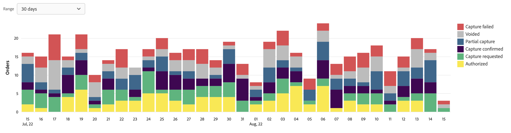
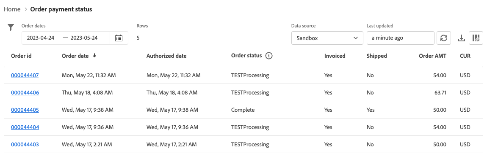

# 注文支払いステータス レポート

[!DNL Payment Services]と[!DNL Adobe Commerce]の[!DNL Magento Open Source]では、ストアの[ トランザクション ](reporting.md)、注文、支払いを明確に把握できるように、包括的なレポートが提供されます。

ご注文の支払い状況を素早く確認できる注文支払い状況レポートビューは2つあります。

* **[注文支払い状況のビジュアライゼーションビュー](#order-payment-status-data-visualization-view)** – 注文の支払い状況レポートビューから1日あたりの合計支払い状況を視覚的に表す、支払いサービスホームで使用できるチャート
* **[注文支払い状況レポート表示](#order-payment-status-report-view)** – すべての取引に関する詳細な支払い、請求済み、出荷、返金、および問い合わせ状況を表示する注文支払い状況で使用できるレポート

注文の支払い状況ビューを使用すると、特定の注文が注文からキャッシュへの処理フローの中のどこにあるかを簡単に把握できます。 これらのレポートにより、支払い状況や支払い日にもとづいて注文をすばやく確認し、潜在的な問題を特定できます。

既存の会計または注文管理ソフトウェアで使用するために、.csv ファイル形式で[注文支払いステータス ](#download-order-payment-statuses)をダウンロードできます。

>[!NOTE]
>
>[ オンボーディングして](production.md#enable-live-payments)のライブモード [!DNL Payment Services]をアクティブ化していない場合、財務報告書を表示することはできません。

## 注文支払い状況データのビジュアライゼーションビュー

注文支払い状況データのビジュアライゼーションビューは、支払いサービスホームで使用できます。 詳細な表[注文支払い状況レポート表示](#order-payment-status-report-view)から、1日あたりの合計支払い状況を視覚的に表します。

_管理者_ サイドバーで、**販売** > **決済サービス** > _注文_&#x200B;に移動して、データの可視化[支払い状況のチャート ](#statuses-information)を確認します。

{width="800" zoomable="yes"}での支払いデータのビジュアライゼーション

**[!UICONTROL View Report]**&#x200B;をクリックして、詳細な表[注文支払い状況レポート表示](#order-payment-status-report-view)に移動します。

### ステータス期間のカスタマイズ

デフォルトでは、30日間の支払いステータスが表示されます。

注文支払いステータスのビジュアライゼーションビューで、日付範囲を選択して、表示する支払いステータスの期間をカスタマイズできます。

1. _管理者_ サイドバーで、**[!UICONTROL Sales]** > **[!UICONTROL Payment Services]**&#x200B;に移動します。 注文支払い状況データのビジュアライゼーションビューは、_注文_ セクションに表示されます。
1. **[!UICONTROL Range]** セレクターフィルターをクリックします。
1. 該当する日付範囲（30日、15日、7日）を選択します。
1. 指定した日付のステータス情報を表示します。

### ステータス情報

選択した日付範囲の支払いステータスは、注文支払い状況データビジュアライゼーションビューの左側に表示されます。 選択した日付範囲の日付は、ビューの下部に表示されます。 特定の日付に注文がない場合、その日付は表示されません。

注文支払い状況データのビジュアライゼーションビューには、次の情報が含まれます。

| データ | 説明 |
| ------------ | -------------------- |
| [!UICONTROL Orders] | 指定した時間枠での注文の金額範囲。Y軸のデータ（左） |
| 日付範囲 | 指定された時間枠の日付範囲。X軸のデータ（下） |
| 認証済み | 注文承認済み |
| キャプチャが要求されました | 注文のキャプチャが要求されました |
| キャプチャが確認されました | 注文キャプチャ完了 |
| 部分キャプチャ | 注文の一部がキャプチャされました |
| キャプチャに失敗しました | 注文キャプチャに失敗しました |
| 無効 | 注文は無効です |

## 注文支払い状況レポート表示

注文支払い状況レポート表示は、支払いサービスの「ホーム」ビューで利用できます。 すべての取引の支払い、請求、発送、返金、紛争など、詳細なステータスが含まれます。

_管理者_ サイドバーで、**[!UICONTROL Sales]** > **[!UICONTROL Payment Services]** > _[!UICONTROL Orders]_>**[!UICONTROL View Report]**に移動して、詳細な注文支払い状況レポートを表示します。

{width="800" zoomable="yes"}

このトピックのセクションに従って、表示するデータを最適に表示するように、このビューを設定できます。

既存の会計または注文管理ソフトウェアで使用するために、.csv ファイル形式で[支払いトランザクション ](#download-order-payment-statuses)をダウンロードできます。

>[!NOTE]
>
>このテーブルに表示されるデータは、デフォルトで`DESC`を使用して降順（`TRANS DATE`）で並べ替えられます。 `TRANS DATE`は、トランザクションが開始された日時です。

### 支払い状況の更新

特定の支払い方法では、支払いを受け取るために一定の期間が必要です。 [!DNL Payment Services]は、次の方法で注文の支払いトランザクションの保留中ステータスを検出するようになりました：

* `pending capture`件のトランザクションを同期検出しています
* `pending capture` トランザクションを非同期で監視しています

>[!NOTE]
>
>注文で支払いトランザクションの保留中のステータスを検出すると、支払いがまだ受け取られていない場合に、誤って注文を発送するのを防ぐことができます。 これは、電子チェックとPayPalの取引に対して発生する可能性があります。

#### 保留中の取得トランザクションの同期検出

`Pending` ステータスのキャプチャトランザクションを自動的に検出し、そのようなトランザクションが検出されたときに注文が`Processing` ステータスに入るのを防ぎます。

顧客のチェックアウト中、または管理者が以前に承認された支払いに対する請求書を作成すると、[!DNL Payment Services]は自動的に`Pending` ステータスのキャプチャトランザクションを検出し、対応する注文を`Payment Review` ステータスに移行します。

#### 保留中の取得トランザクションの非同期監視

保留中のキャプチャトランザクションが`Completed` ステータスに入ったときに検出し、影響を受けた注文の処理を再開できるようにします。

このプロセスが期待どおりに機能することを確認するには、マーチャントは新しいcron ジョブを設定する必要があります。 ジョブが自動的に実行されるように設定されると、他の介入はマーチャントから期待されません。

[cron ジョブの設定](https://experienceleague.adobe.com/docs/commerce-operations/configuration-guide/cli/configure-cron-jobs.html)を参照してください。 設定が完了すると、新しいジョブは30分ごとに実行され、`Payment Review` ステータスの注文の更新を取得します。

加盟店は、注文支払い状況レポートビューで更新された支払い状況を確認できます。

### レポートで使用されるデータ

[!DNL Payment Services]は注文データを使用し、他の情報源（PayPalを含む）から集約された支払いデータと組み合わせて、有意義で非常に便利なレポートを提供します。

注文データはエクスポートされ、支払いサービスに保持されます。 注文ステータス [または](https://experienceleague.adobe.com/en/docs/commerce-admin/stores-sales/order-management/orders/order-status#custom-order-status) ストアビュー[、](https://experienceleague.adobe.com/en/docs/commerce-admin/stores-sales/site-store/store-views#edit-a-store-view) ストア [、またはweb サイト名を](https://experienceleague.adobe.com/en/docs/commerce-admin/start/setup/store-details#store-information)変更または追加すると、そのデータが支払いデータと組み合わされ、注文支払い状況レポートに組み合わせ情報が入力されます。

このプロセスには2つのステップがあります。

1. インデックスは、管理者の`ON SAVE` インデックス管理`BY SCHEDULE`での設定方法に応じて、[ （注文情報またはストア情報が変更されるたびに）または](https://experienceleague.adobe.com/en/docs/commerce-admin/systems/tools/index-management) （事前設定済みのcron スケジュール上）のいずれかにデータが変更されます。

   デフォルトでは、データのインデックス作成が行われます`ON SAVE`。つまり、注文、注文ステータス、ストアビュー、ストア、またはweb サイトが変更されると、インデックス再作成プロセスが直ちに実行されます。

1. インデックス化されたデータは支払いサービスに送信され、その後、注文支払い状況レポートに入力されます。

レポート目的でエクスポートおよび照合されるデータは、注文支払い状況レポートで使用されるデータのみです。

>[!NOTE]
>
>このテーブルに表示されるデータは、デフォルトで`DESC`を使用して降順（`ORDER DATE`）で並べ替えられます。 `ORDER DATE`は、注文が作成された日付タイムスタンプです。

#### データ書き出しの設定

デフォルトでは、インデックス再作成は`ON SAVE` モードで行われますが、`BY SCHEDULE` モードでインデックスを作成することをお勧めします。 `BY SCHEDULE` インデックスは1分のcron スケジュールで実行され、変更されたデータは、データ変更の2分以内に注文ステータス レポートに表示されます。 このスケジュールされたインデックス再作成は、特に大量の受注がある場合に、注文が発生するたびにスケジュールどおりに行われるため、ストアへの負担を軽減するのに役立ちます。

Admin`ON SAVE`で、インデックスモード（`BY SCHEDULE`または[—](https://experienceleague.adobe.com/en/docs/commerce-admin/systems/tools/index-management#change-the-index-mode)）を変更できます。

データ書き出しの設定方法については、[ コマンドライン設定](configure-cli.md#configure-data-export)を参照してください。

### データソースを選択

注文支払い状況レポートビューで、レポート結果を表示するデータソース（**[!UICONTROL Live]** _または&#x200B;**[!UICONTROL Sandbox]**）を選択できます。

{width="300" zoomable="yes"}

_[!UICONTROL Live]_が選択したデータソースである場合は、実稼動モードで[!DNL Payment Services]を使用するストアのレポート情報を表示できます。_[!UICONTROL Sandbox]_&#x200B;が選択したデータソースである場合は、サンドボックスモードのレポート情報を確認できます。

データソースの選択は次のように機能します。

* ライブモードで[!DNL Payment Services]を使用するストアがない場合、データソースの選択はデフォルトで&#x200B;_[!UICONTROL Sandbox]_になります。
* ライブモードで[!DNL Payment Services]を使用するストア （1つまたは複数）がある場合、データソースの選択はデフォルトで&#x200B;_[!UICONTROL Live]_になります。
* レポートの書き出しは、常にデータソースの選択を尊重します。

[!UICONTROL Order Payment Status] レポートのデータソースを選択するには：

1. _管理者_ サイドバーで、**[!UICONTROL Sales]** > **[!UICONTROL [!DNL Payment Services]]** > **[!UICONTROL Orders]** > **[!UICONTROL View Report]**&#x200B;に移動します。
1. _[!UICONTROL Data source]_セレクターフィルターをクリックし、**[!UICONTROL Live]**または&#x200B;**[!UICONTROL Sandbox]**を選択します。

   選択したデータソースに基づいて、レポート結果が再生成されます。

### 注文日の期間をカスタマイズ

注文支払い状況レポート ビューでは、特定の日付を選択して、表示するステータス結果の期間をカスタマイズできます。 デフォルトでは、30日間の注文支払いステータスがグリッドに表示されます。

1. _管理者_ サイドバーで、**[!UICONTROL Sales]** > **[!UICONTROL [!DNL Payment Services]]** > _[!UICONTROL Orders]_>**[!UICONTROL View Report]**に移動します。
1. _[!UICONTROL Order dates]_カレンダーセレクターフィルターをクリックします。
1. 該当する日付範囲を選択します。
1. グリッドで指定した日付の注文支払いステータスを表示します。

### レポート情報をフィルター

注文支払い状況レポート ビューで、フィルター条件を選択して、表示するステータスの結果をフィルタリングできます。

1. _管理者_ サイドバーで、**[!UICONTROL Sales]** > **[!UICONTROL [!DNL Payment Services]]** > _[!UICONTROL Orders]_>**[!UICONTROL View Report]**に移動します。
1. **[!UICONTROL Filter]** セレクターをクリックします。
1. _支払い状況_ オプションを切り替えて、選択した注文支払い状況のみのレポート結果を表示します。
1. _[!UICONTROL Min Order Amount]_または_[!UICONTROL Max Order Amount_]を入力して、注文金額の範囲内でレポート結果を表示します。
1. **[!UICONTROL Hide filters]**&#x200B;をクリックしてフィルターを非表示にします。

### 列の表示と非表示

注文支払い状況レポートには、デフォルトで使用可能なすべての情報の列が表示されます。 ただし、レポートに表示する列はカスタマイズできます。

1. _管理者_ サイドバーで、**[!UICONTROL Sales]** > **[!UICONTROL [!DNL Payment Services]]** > _[!UICONTROL Orders]_>**[!UICONTROL View Report]**に移動します。
1. _列設定_ アイコン （{width="20" zoomable="yes"}）をクリックします。
1. レポートに表示する列をカスタマイズするには、リストの列をオンまたはオフにします。

   注文支払い状況レポートには、列の設定メニューで行った変更がすぐに表示されます。 列の環境設定は保存され、レポートビューから移動しても有効のままになります。

### ステータスの表示

注文支払い状況レポートビューには、各注文の包括的な支払い状況の情報が表示されます。

デフォルトでは、30日間の注文支払いステータスがグリッドに表示されます。

左右にスクロールして、注文日、承認日、請求日、発送済み、支払い状況など、[注文支払い状況の情報](#column-descriptions)を表示します。

検索で返される行数、またはデフォルトの30日間の注文支払いステータスに表示される行数は、注文支払いステータス表示グリッドの上に、注文日カレンダーセレクターフィルターと共に表示されます。

#### 支払いステータス

「支払いステータス」列には、任意の支払いの現在のステータスが表示されます。 `Capture failed`支払いには赤いアラートステータスが表示され、`Voided`支払いには灰色のアラートステータスが表示されます。

#### 返金状況

「返金ステータス」列には、返金の現在のステータスが表示されます。 `Capture failed`支払いには赤いアラートステータスが表示され、`Voided`支払いには灰色のアラートステータスが表示されます。

### レポートデータの更新

注文支払い状況レポート ビューには、レポート情報が最後に更新された時刻を示す&#x200B;_[!UICONTROL Last updated]_タイムスタンプが表示されます。 デフォルトでは、注文支払い状況レポートのデータは3時間ごとに自動更新されます。

また、注文支払い状況レポートデータを手動で更新して、最新のレポート情報を表示することもできます。

1. _管理者_ サイドバーで、**[!UICONTROL Sales]** > **[!UICONTROL [!DNL Payment Services]]** > _[!UICONTROL Orders]_>**[!UICONTROL View Report]**に移動します。
1. _更新_ アイコン （{width="20" zoomable="yes"}）をクリックします。

   注文支払い状況レポートのデータが更新され、*[!UICONTROL Update complete]*&#x200B;件の確認が表示され、最新の情報がグリッドに表示されます。

### 紛争の表示

ストアの注文に関する紛争を確認し、PayPal解決センターに移動して、注文支払い状況レポート内からアクションを実行できます。

1. _管理者_ サイドバーで、**[!UICONTROL Sales]** > **[!UICONTROL [!DNL Payment Services]]** > _[!UICONTROL Orders]_>**[!UICONTROL View Report]**に移動します。
1. **[!UICONTROL Disputes column]**&#x200B;に移動します。
1. 特定の注文に関する紛争を表示し、[紛争の状況](#statuses-information)を確認します。
1. [PP-D-](https://www.paypal.com/us/cshelp/article/what-is-the-resolution-center-help246)で始まる紛争ID リンクをクリックして、_PayPal解決センター_&#x200B;の紛争の詳細を確認します。
1. 必要に応じて適切な措置を講じる。

   注文紛争をステータス別に並べ替えるには、[!UICONTROL Disputes]列ヘッダーをクリックします。

### 注文支払い状況のダウンロード

デフォルトの30日間のステータスを表示している場合でも、カスタマイズされた期間を表示している場合でも、注文支払いステータス表示グリッドに表示されているすべてのステータスを含む.csv ファイルをダウンロードできます。

1. _管理者_ サイドバーで、**[!UICONTROL Sales]** > **[!UICONTROL [!DNL Payment Services]]** > _[!UICONTROL Orders]_>**[!UICONTROL View Report]**に移動します。
1. 過去30日以外の期間のステータスを表示する場合は、[ ステータスの日付範囲の期間をカスタマイズ ](#customize-order-dates-timeframe)します。
1. _ダウンロード_ （{width="20" zoomable="yes"}）アイコンをクリックします。

注文の支払い状況は.csv形式でダウンロードされます。

### 列の説明

注文支払い状況レポートには、次の情報が含まれます。

| 列 | 説明 |
| ------------ | -------------------- |
| [!UICONTROL Order ID] | Commerce注文ID   関連する[注文情報](https://experienceleague.adobe.com/en/docs/commerce-admin/stores-sales/order-management/orders/orders){target="_blank"}を表示するには、IDをクリックします。 |
| [!UICONTROL Order Date] | 注文日のタイムスタンプ |
| [!UICONTROL Authorized Date] | 支払い承認の日付タイムスタンプ |
| [!UICONTROL Order Status] | 現在のCommerce [注文状況](https://experienceleague.adobe.com/en/docs/commerce-admin/stores-sales/order-management/orders/order-status){target="_blank"} |
| [!UICONTROL Invoiced] | 注文の請求書ステータス —*[!UICONTROL No]*、*[!UICONTROL Partial]*、または&#x200B;*[!UICONTROL Yes]* |
| [!UICONTROL Shipped] | 注文の配送状況 – *[!UICONTROL No]*、*[!UICONTROL Partial]*、または&#x200B;*[!UICONTROL Yes]* |
| [!UICONTROL Order Amt] | 注文の合計金額 |
| [!UICONTROL Cur] | 注文の通貨タイプ |
| [!UICONTROL Pay Status] | 特定の注文の支払い状況 |
| [!UICONTROL Paid Amt] | 注文に対して支払われた金額 |
| [!UICONTROL Cur] | 注文で支払われた金額の通貨タイプ |
| [!UICONTROL Refund Status] | 注文の払い戻しのステータス（返品、RMA、クレジットメモからの情報など）   *[!UICONTROL Requires refund]*、*[!UICONTROL Refund requested]*、*[!UICONTROL Refunded]*、*[!UICONTROL Refund failed]*&#x200B;または&#x200B;*[!UICONTROL Voided]* |
| [!UICONTROL Refund Amount] | 注文の払い戻し金額の合計 |
| [!UICONTROL Cur] | 注文に対して返金される金額の通貨タイプ |
| [!UICONTROL Disputes] | 注文に関する紛争の状況（紛争とチャージバックからの情報） – *[!UICONTROL Open]*、*[!UICONTROL Waiting for buyer response]*、*[!UICONTROL Waiting for seller response]*、*[!UICONTROL Under review]*、*[!UICONTROL Resolved]*、または&#x200B;*[!UICONTROL Other]* |
| [!UICONTROL Payment Method] | 注文のCommerce トランザクションで使用される支払い方法 |
| [!UICONTROL Website] | 注文が行われたWeb サイト |
| [!UICONTROL Store] | 注文が行われた店舗 |
| [!UICONTROL Store View] | 注文が配置されたストアビュー |
