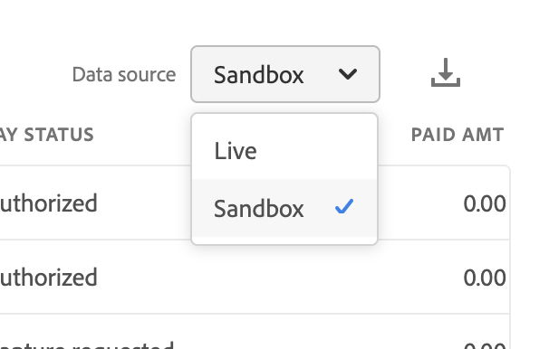

# 注文支払いステータスレポート

[!DNL Payment Services] for [!DNL Adobe Commerce] and [!DNL Magento Open Source] は、ストアの [ トランザクション ](transactions.md)、注文、支払いを明確に把握できる包括的なレポートを提供します。

注文の支払いステータスをすばやく確認できる、2 つの利用可能な注文の支払いステータスレポートビューがあります。

* **[注文の支払いステータスのビジュアライゼーションビュー](#order-payment-status-data-visualization-view)** - Payment Services ホームで使用できるグラフ。注文の支払いステータスのレポートビューから 1 日あたりの集計された支払いステータスを視覚的に表現します
* **[受注支払ステータス・レポート・ビュー](#order-payment-status-report-view)** – すべての取引に関する詳細な支払、請求済、出荷済、払戻および係争ステータスを示す受注支払ステータスのレポート

注文の支払いステータス ビューを使用すると、特定の注文が注文からキャッシュ プロセス フロー内のどこにあるかを簡単に理解できます。 これらのレポートを使用すると、支払いステータスと支払い日に基づいて注文をすばやく確認し、潜在的な問題を特定できます。

.csv ファイル形式で [ 注文の支払いステータスをダウンロード ](#download-order-payment-statuses) して、既存の会計または注文管理ソフトウェアで使用できます。

>[!NOTE]
>
>[!DNL Payment Services] に対して [ オンボーディングおよびアクティブ化されたライブモード ](production.md#enable-live-payments) を持っていない場合は、財務報告書を表示できません。

## 注文の支払いステータスデータのビジュアライゼーションビュー

注文の支払いステータスデータビジュアライゼーションビューは、支払いサービスホームで使用できます。 詳細な表形式 [ 注文の支払いステータス レポート表示 ](#order-payment-status-report-view) から、1 日あたりの集計された支払いステータスを視覚的に表現したものです。

_管理者_ サイドバーで、**営業**/**支払いサービス**/_注文_ に移動して、データビジュアライゼーション [ 支払いステータスのグラフ ](#statuses-information) を表示します。

{width="800" zoomable="yes"}

「**[!UICONTROL View Report]**」をクリックして、詳細な表形式 [ 注文支払いステータスレポート表示 ](#order-payment-status-report-view) に移動します。

### ステータスのカスタマイズ期間

デフォルトでは、30 日間の支払いステータスが表示されます。

注文支払いステータスビジュアライゼーションビューで、日付範囲を選択して、表示する支払いステータスの期間をカスタマイズできます。

1. _管理者_ サイドバーで、**[!UICONTROL Sales]**/**[!UICONTROL Payment Services]** に移動します。 注文支払いステータスデータビジュアライゼーションビューは、「_注文_ セクションに表示されます。
1. **[!UICONTROL Range]** セレクターフィルターをクリックします。
1. 適用可能な日付範囲（30 日、15 日または 7 日）を選択します。
1. 指定した日付のステータス情報を表示します。

### ステータス情報

選択した日付範囲の支払いステータスが、注文支払いステータスデータビジュアライゼーション ビューの左側に表示されます。 選択した日付範囲の日付がビューの下部に表示されます。 特定の日付に注文がなかった場合は、その日付は表示されません。

注文支払いステータスデータビジュアライゼーション表示には、次の情報が含まれます。

| データ | 説明 |
| ------------ | -------------------- |
| [!UICONTROL Orders] | 指定した時間枠での注文の金額範囲。Y 軸のデータ（左） |
| 日付範囲 | 指定した時間枠の日付範囲（X 軸のデータ）（下） |
| Authorized | 注文を許可しました |
| キャプチャが要求されました | 注文をリクエストされたキャプチャ |
| キャプチャ確認済み | 注文のキャプチャ完了 |
| 部分的捕捉 | 注文が部分的にキャプチャされました |
| キャプチャできませんでした | 注文のキャプチャに失敗しました |
| 無効 | 注文が無効になりました |

## 注文支払ステータスレポートの表示

注文支払いステータスレポート ビューは、支払いサービスのホーム ビューで使用できます。 すべての取引に関する詳細なステータス（支払い、請求、発送済み、払い戻し、係争など）が含まれます。

_管理者_ サイドバーで、**[!UICONTROL Sales]**/**[!UICONTROL Payment Services]**/_[!UICONTROL Orders]_/**[!UICONTROL View Report]**&#x200B;に移動して、詳細な表形式の注文支払ステータスレポート表示を表示します。

{width="800" zoomable="yes"}

このトピックのセクションに従って、表示するデータを最も適切に表示するように、このビューを設定できます。

.csv ファイル形式で [ 支払いトランザクションをダウンロード ](#download-order-payment-statuses) して、既存の会計または注文管理ソフトウェアで使用できます。

>[!NOTE]
>
>デフォルトでは、`TRANS DATE` を使用して、この表に示すデータが降順（`DESC`）で並べ替えられています。 `TRANS DATE` は、トランザクションが開始された日時です。

### 支払いステータスの更新

特定の支払い方法では、支払いをキャプチャするための期間が必要です。 [!DNL Payment Services] は、次の方法で、支払いトランザクションの保留中ステータスを順番に検出するようになりました。

* `pending capture` トランザクションの同期検出
* `pending capture` トランザクションの非同期モニタリング

>[!NOTE]
>
>注文の支払いトランザクションの保留ステータスを検出すると、支払いがまだ受領されていない場合に誤って注文が出荷されるのを防ぐことができます。 これは、電子チェックと PayPal のトランザクションで発生する可能性があります。

#### 保留中の取得トランザクションの同期検出

`Pending` ステータスのキャプチャ トランザクションを自動的に検出し、そのようなトランザクションが検出された場合に注文が `Processing` ステータスに入るのを防ぎます。

顧客のチェックアウト時、または管理者が以前に承認された支払に対する請求書を作成する際に、[!DNL Payment Services] は自動的に `Pending` ステータスの取引のキャプチャを検出し、対応する注文を `Payment Review` ステータスにシフトします。

#### 保留中の取得トランザクションの非同期監視

保留中の取得トランザクションが `Completed` のステータスになった場合に検出します。これにより、マーチャントは影響を受ける注文の処理を再開できます。

このプロセスが期待どおりに動作することを確認するために、マーチャントは新しい cron ジョブを設定する必要があります。 ジョブが自動的に実行されるように設定された後は、マーチャントからの他の介入は期待されません。

[cron ジョブの設定 ](https://experienceleague.adobe.com/docs/commerce-operations/configuration-guide/cli/configure-cron-jobs.html) を参照してください。 設定が完了すると、新しいジョブが 30 分ごとに実行され、ステータスが `Payment Review` の注文の更新を取得します。

マーチャントは、注文の支払いステータスレポート表示から、更新された支払いステータスを確認できます。

### レポートで使用されるデータ

[!DNL Payment Services] は、注文データを使用し、他のソース（PayPal など）からの集計支払いデータと組み合わせて、意味のある非常に役に立つレポートを提供します。

注文データが書き出され、支払いサービスに保持されます。 [ 注文ステータスの変更または追加 ](https://experienceleague.adobe.com/en/docs/commerce-admin/stores-sales/order-management/orders/order-status#custom-order-status) または [ ストア表示の編集 ](https://experienceleague.adobe.com/en/docs/commerce-admin/stores-sales/site-store/store-views#edit-a-store-view)、[ ストア ](https://experienceleague.adobe.com/en/docs/commerce-admin/start/setup/store-details#store-information)、web サイト名を行うと、そのデータは支払いデータと組み合わされ、組み合わされた情報が注文支払いステータスレポートに入力されます。

このプロセスには次の 2 つのステップがあります。

1. インデックスは、管理者の [ インデックス管理 ](https://experienceleague.adobe.com/en/docs/commerce-admin/systems/tools/index-management) での設定に応じて、`ON SAVE` （注文情報またはストア情報が変更されるたびに）または `BY SCHEDULE` （事前設定された cron スケジュールに基づいて）のデータで変更されます。

   デフォルトでは、データのインデックス作成は `ON SAVE` で行われます。つまり、注文、注文のステータス、ストア表示、ストア、web サイトで何らかの変更が行われると、インデックス再作成プロセスが直ちに実行されます。

1. インデックス付きのデータが支払いサービスに送信され、注文の支払いステータスレポートに入力されます。

レポート目的でエクスポートおよび照合されるデータは、注文支払ステータス レポートで使用されるデータのみです。

>[!NOTE]
>
>デフォルトでは、`ORDER DATE` を使用して、この表に示すデータが降順（`DESC`）で並べ替えられています。 `ORDER DATE` は、注文が作成された際の日付タイムスタンプです。

#### データの書き出しの設定

デフォルトではインデックス再作成は `ON SAVE` モードで行われますが、`BY SCHEDULE` モードでインデックスを作成することをお勧めします。 `BY SCHEDULE` インデックスは 1 分の cron スケジュールで実行され、変更されたデータは、データの変更から 2 分以内に注文ステータスレポートに表示されます。 このスケジュールされたインデックス再作成は、（各注文が行われるときではなく）スケジュールに従って行われるため、特に大量の注文を受信する場合に、ストアの負担を軽減するのに役立ちます。

インデックスモード（`ON SAVE` または `BY SCHEDULE`）は [ 管理 ](https://experienceleague.adobe.com/en/docs/commerce-admin/systems/tools/index-management#change-the-index-mode) で変更できます。

データの書き出しを設定する方法については、[ コマンドライン設定 ](configure-cli.md#configure-data-export) を参照してください。

### データソースを選択

注文支払いステータスレポート表示では、レポート結果を表示するデータソース（**[!UICONTROL Live]** _または **[!UICONTROL Sandbox]**）を選択できます。

{width="300" zoomable="yes"}

_[!UICONTROL Live]_&#x200B;が選択されているデータソースの場合、実稼動モードで [!DNL Payment Services] を使用しているストアのレポート情報を表示できます。_[!UICONTROL Sandbox]_ が選択されているデータソースの場合は、サンドボックスモードのレポート情報を表示できます。

データソースを選択すると、次のように機能します。

* ライブモードで [!DNL Payment Services] を使用するストアがない場合、データソースの選択はデフォルトで _[!UICONTROL Sandbox]_&#x200B;になります。
* ライブモードで [!DNL Payment Services] を使用するストア（1 つまたは複数）がある場合、データソースの選択はデフォルトで _[!UICONTROL Live]_&#x200B;になります。
* レポートの書き出しでは、常にデータソースの選択に従います。

[!UICONTROL Order Payment Status] レポートのデータソースを選択するには：

1. _管理者_ サイドバーで、**[!UICONTROL Sales]**/**[!UICONTROL [!DNL Payment Services]]**/**[!UICONTROL Orders]**/**[!UICONTROL View Report]** に移動します。
1. _[!UICONTROL Data source]_&#x200B;セレクターフィルターをクリックし、「**[!UICONTROL Live]**」または「**[!UICONTROL Sandbox]**」を選択します。

   レポート結果は、選択したデータソースに基づいて再生成されます。

### 注文日の期間のカスタマイズ

注文支払いステータスレポート表示では、特定の日付を選択して、表示するステータス結果の期間をカスタマイズできます。 デフォルトでは、30 日間の注文の支払いステータスがグリッドに表示されます。

1. _管理者_ サイドバーで、**[!UICONTROL Sales]**/**[!UICONTROL [!DNL Payment Services]]**/_[!UICONTROL Orders]_/**[!UICONTROL View Report]**&#x200B;に移動します。
1. _[!UICONTROL Order dates]_&#x200B;カレンダーセレクターフィルターをクリックします。
1. 該当する日付範囲を選択します。
1. グリッドで、指定した日付の注文の支払いステータスを表示します。

### レポート情報をフィルター

注文支払ステータスレポート表示では、フィルター条件を選択して、表示するステータス結果をフィルターできます。

1. _管理者_ サイドバーで、**[!UICONTROL Sales]**/**[!UICONTROL [!DNL Payment Services]]**/_[!UICONTROL Orders]_/**[!UICONTROL View Report]**&#x200B;に移動します。
1. **[!UICONTROL Filter]** セレクターをクリックします。
1. _支払ステータス_ オプションを切り替えて、選択した注文の支払いステータスのみのレポート結果を表示します。
1. _[!UICONTROL Min Order Amount]_&#x200B;または_[!UICONTROL Max Order Amount_] を入力して、受注金額範囲内のレポート結果を表示します。
1. 「**[!UICONTROL Hide filters]**」をクリックすると、フィルターが非表示になります。

### 列の表示/非表示

Order Payment Status レポートには、デフォルトで使用可能なすべての情報列が表示されます。 ただし、レポートに表示する列をカスタマイズすることはできます。

1. _管理者_ サイドバーで、**[!UICONTROL Sales]**/**[!UICONTROL [!DNL Payment Services]]**/_[!UICONTROL Orders]_/**[!UICONTROL View Report]**&#x200B;に移動します。
1. _列設定_ アイコン（{width="20" zoomable="yes"}）をクリックします。
1. レポートに表示される列をカスタマイズするには、リストの列をチェックまたはチェック解除します。

   注文支払いステータスレポートには、「列設定」メニューで行った変更が直ちに表示されます。 レポートビューから移動すると、列の環境設定は保存され、有効なままになります。

### ステータスを表示

注文支払ステータスレポート表示には、各注文の包括的な支払ステータス情報が表示されます。

デフォルトでは、30 日間の注文の支払いステータスがグリッドに表示されます。

左右にスクロールして、注文日、認証日、請求、発送済み、支払いステータスなど、[ 注文の支払いステータス情報 ](#column-descriptions) を表示します。

検索で返される行数、またはデフォルトの注文支払ステータスの 30 日間に表示される行数は、注文日付カレンダーセレクターフィルターと共に、注文支払ステータス ビューグリッドの上に表示されます。

#### 支払いステータス

支払ステータス列には、支払の現在のステータスが表示されます。 `Capture failed` の支払いは赤いアラートステータスを示し、`Voided` の支払いはグレーのアラートステータスを示します。

#### 払い戻しステータス

「払戻ステータス」列には、払戻に関する現在のステータスが表示されます。 `Capture failed` の支払いは赤いアラートステータスを示し、`Voided` の支払いはグレーのアラートステータスを示します。

### レポートデータを更新

注文支払ステータスレポート表示には、レポート情報が最後に更新された時刻を示す _[!UICONTROL Last updated]_&#x200B;タイムスタンプが表示されます。 デフォルトでは、注文支払いステータスレポートデータは 3 時間ごとに自動更新されます。

また、注文の支払いステータスレポートデータを手動で更新して、最新のレポート情報を表示することもできます。

1. _管理者_ サイドバーで、**[!UICONTROL Sales]**/**[!UICONTROL [!DNL Payment Services]]**/_[!UICONTROL Orders]_/**[!UICONTROL View Report]**&#x200B;に移動します。
1. _更新_ アイコン（{width="20" zoomable="yes"}）をクリックします。

   注文の支払いステータスレポートデータが更新され、確認 *[!UICONTROL Update complete]* が表示され、最新の情報がグリッドに表示されます。

### 争議の表示

ストアの注文に関する紛争を確認し、PayPal 解決センターに移動して、注文の支払い状況レポート内から処理を実行できます。

1. _管理者_ サイドバーで、**[!UICONTROL Sales]**/**[!UICONTROL [!DNL Payment Services]]**/_[!UICONTROL Orders]_/**[!UICONTROL View Report]**&#x200B;に移動します。
1. **[!UICONTROL Disputes column]** に移動します。
1. 特定の注文に関する争議を表示し、[ 争議ステータス ](#order-payment-status-information) を確認します。
1. _PP-D-_ で始まる紛争 ID リンクをクリックして、[PayPal 解決センター ](https://www.paypal.com/us/cshelp/article/what-is-the-resolution-center-help246) から紛争詳細を確認します。
1. 必要に応じて、紛争に対する適切な措置を講じる。

   順序の争議をステータスで並べ替えるには、「[!UICONTROL Disputes]」列ヘッダーをクリックします。

### 注文支払ステータスのダウンロード

デフォルトの 30 日間のステータスまたはカスタマイズされた期間のどちらを表示している場合でも、注文支払いステータス表示グリッドに表示されるすべてのステータスを含む.csv ファイルをダウンロードできます。

1. _管理者_ サイドバーで、**[!UICONTROL Sales]**/**[!UICONTROL [!DNL Payment Services]]**/_[!UICONTROL Orders]_/**[!UICONTROL View Report]**&#x200B;に移動します。
1. 過去 30 日以外の期間のステータスを表示したい場合は、[ ステータスの日付範囲の期間をカスタマイズ ](#customize-dates-timeframe) します。
1. _ダウンロード_ （{width="20" zoomable="yes"}）アイコンをクリックします。

注文の支払いステータスが.csv 形式でダウンロードされます。

### 列の説明

注文支払いステータスレポートには、次の情報が含まれます。

| 列 | 説明 |
| ------------ | -------------------- |
| [!UICONTROL Order ID] | Commerce注文 ID    関連する [ 注文情報 ](https://experienceleague.adobe.com/en/docs/commerce-admin/stores-sales/order-management/orders/orders){target="_blank"} を表示するには、ID をクリックします。 |
| [!UICONTROL Order Date] | 注文日タイムスタンプ |
| [!UICONTROL Authorized Date] | 支払認証の日付タイムスタンプ |
| [!UICONTROL Order Status] | 現在のCommerce[ 注文ステータス ](https://experienceleague.adobe.com/en/docs/commerce-admin/stores-sales/order-management/orders/order-status){target="_blank"} |
| [!UICONTROL Invoiced] | 注文の請求書ステータス - *[!UICONTROL No]*、*[!UICONTROL Partial]* または *[!UICONTROL Yes]* |
| [!UICONTROL Shipped] | 注文の配送ステータス（*[!UICONTROL No]*、*[!UICONTROL Partial]*、*[!UICONTROL Yes]*） |
| [!UICONTROL Order Amt] | 注文の合計金額 |
| [!UICONTROL Cur] | 注文の通貨タイプ |
| [!UICONTROL Pay Status] | 特定の注文の支払いステータス |
| [!UICONTROL Paid Amt] | 注文に対して支払われる金額 |
| [!UICONTROL Cur] | 注文に対して支払われる金額の通貨タイプ |
| [!UICONTROL Refund Status] | 注文に対する払い戻しのステータス（返品、RMA、クレジットカードからの情報など）   *[!UICONTROL Requires refund]*、*[!UICONTROL Refund requested]*、*[!UICONTROL Refunded]*、*[!UICONTROL Refund failed]* または *[!UICONTROL Voided]* |
| [!UICONTROL Refund Amount] | 注文の払い戻し金額の合計 |
| [!UICONTROL Cur] | 注文に対して払い戻された金額の通貨タイプ |
| [!UICONTROL Disputes] | オーダーに関する紛争のステータス（紛争およびチャージバックからの情報）:*[!UICONTROL Open]*、*[!UICONTROL Waiting for buyer response]*、*[!UICONTROL Waiting for seller response]*、*[!UICONTROL Under review]*、*[!UICONTROL Resolved]*、*[!UICONTROL Other]* |
| [!UICONTROL Payment Method] | 注文のCommerce トランザクションで使用される支払方法 |
| [!UICONTROL Website] | 注文元の web サイト |
| [!UICONTROL Store] | 注文元の店舗 |
| [!UICONTROL Store View] | 注文元のストア表示 |
