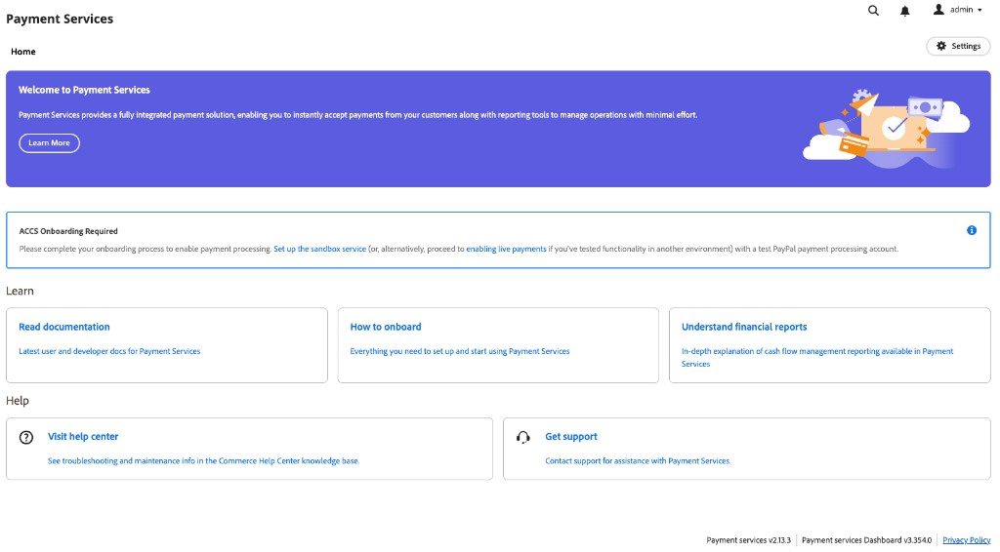
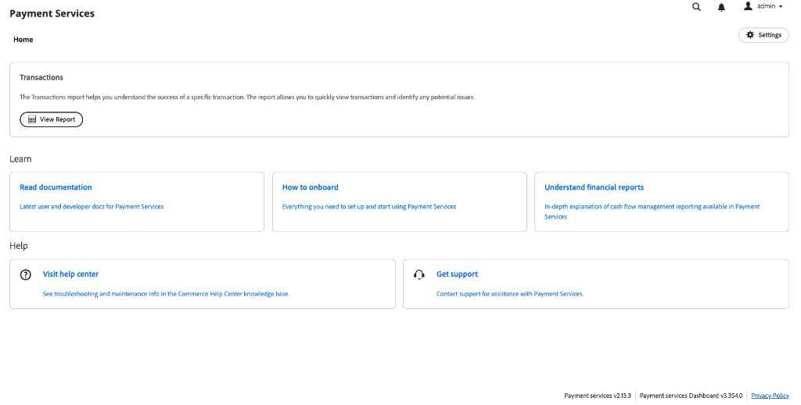

# [!DNL Payment Services] ホーム

Adobe CommerceおよびMagento Open Sourceの[!DNL Payment Services]には、拡張機能を設定して使用するために必要な情報がホーム ビューに表示されます。 ホームの上部にあるオプションは、クラウド上またはオンプレミス（PaaS）上のAdobe Commerce、または[!DNL Adobe Commerce as a Cloud Service]または[!DNL Adobe Commerce Optimizer] （SaaS）のデプロイメントによって異なります。

_管理者_ サイドバーで、**[!UICONTROL Sales]** > **[!UICONTROL [!DNL Payment Services]]**&#x200B;に移動します。

>[!BEGINTABS]

>[!TAB  クラウドおよびオンプレミスでのAdobe Commerce]

{width="700" zoomable="yes"}

>[!TAB Adobe Commerce as a Cloud ServiceとCommerce Optimizer]

オンボーディングが完了するまで、**[!UICONTROL Home]**&#x200B;には&#x200B;**[!UICONTROL ACCS Onboarding Required]**&#x200B;が表示されます。 この通知は、[&#x200B; サンドボックスサービスを設定](sandbox.md#sandbox-onboarding) （テスト PayPal処理アカウントを使用）するか、別の環境で既にテストしている場合は[&#x200B; ライブ決済を有効にする](production.md#enable-live-payments)にリンクしています。

{width="700" zoomable="yes"}

オンボーディングが完了した後（または既に設定されているインスタンスで）、**[!UICONTROL Home]**&#x200B;には、表形式のレポートの&#x200B;**[!UICONTROL Transactions]**&#x200B;に&#x200B;**[!UICONTROL View Report]**&#x200B;が表示され、さらに&#x200B;**[!UICONTROL Learn]**&#x200B;と&#x200B;**[!UICONTROL Help]**&#x200B;の領域が表示されます。

{width="700" zoomable="yes"}

>[!ENDTABS]

このホームビューでは、_ホーム_、_学習_&#x200B;に[!DNL Payment Services]についてアクセスしたり、拡張機能&#x200B;_設定_&#x200B;を設定したり、_ヘルプ_&#x200B;を取得したりできます。 レポートを開くには、**[!UICONTROL View Report]** （SaaS）または&#x200B;**[!UICONTROL Orders]**&#x200B;および&#x200B;**[!UICONTROL Payouts]**&#x200B;のエントリポイント （クラウドおよびオンプレミスのAdobe Commerce）を使用します。[&#x200B; レポート &#x200B;](reporting.md)を参照してください。

## ホーム

[!BADGE PaaSのみ]{type=Informative url="https://experienceleague.adobe.com/en/docs/commerce/user-guides/product-solutions" tooltip="Adobe Commerce on Cloud プロジェクト（Adobeで管理されるPaaS インフラストラクチャ）とオンプレミス プロジェクトにのみ適用されます。"}

| フィールド | 説明 |
|---|---|
| [!UICONTROL Orders] | これらのレポートにより、注文の支払い状況をすばやく確認し、潜在的な問題を特定できます。 |
| [!UICONTROL Payouts] | 支払いレポートには、包括的な支払い情報が一目で表示され、支払い金額、処理済み数量、財務の調整のためのトランザクションレベルに関する詳細なレポートの透明性を完全に確保できます。 |

[!BADGE SaaSのみ]{type=Positive url="https://experienceleague.adobe.com/en/docs/commerce/user-guides/product-solutions" tooltip="Adobe Commerce as a Cloud ServiceおよびAdobe Commerce Optimizer プロジェクト（Adobeが管理するSaaS インフラストラクチャ）にのみ適用されます。"}

| フィールド | 説明 |
|---|---|
| [!UICONTROL Transactions] | 特定のトランザクションの結果を把握するのに役立つトランザクション レポートを要約します。 「**[!UICONTROL View Report]**」をクリックして、トランザクションのグリッド（注文とPayPalのトランザクション ID、支払い方法、結果、応答コードなど）を開きます。 [&#x200B; トランザクション レポート ビュー](reporting.md#transactions-report-view)を参照してください。 |

## 学ぶ

| フィールド | 説明 |
|---|---|
| [!UICONTROL Read documentation] | [!DNL Payment Services]の最新のユーザーおよび開発者ドキュメントを参照してください。 |
| [!UICONTROL How to onboard] | [!DNL Payment Services]機能のセットアップと使用の開始に必要なすべての情報を検索します。 |
| [!UICONTROL Understand financial reports] | [!DNL Payment Services]のキャッシュ フロー管理レポートの詳細な説明。 |

## ヘルプ

| フィールド | 説明 |
|---|---|
| [!UICONTROL Visit help center] | [!DNL Adobe Commerce] ヘルプセンターには、[!DNL Payment Services]に関するナレッジベース記事があります。 |
| [!UICONTROL Get support] | [!DNL Adobe Commerce]のサポートについては、[!DNL Payment Services] サポートポータルにアクセスしてください。 |

## 設定

ホーム ビューで、**[!UICONTROL Settings]**&#x200B;をクリックします。 詳しくは、[[!DNL Payment Services] 設定](configure-admin.md)を参照してください。

支払いサービス エリアのフッターには、**支払いサービス**&#x200B;および&#x200B;**支払いサービス ダッシュボード**&#x200B;のバージョン ラベルが表示されます。例えば、サポートの詳細を収集する場合などです。
