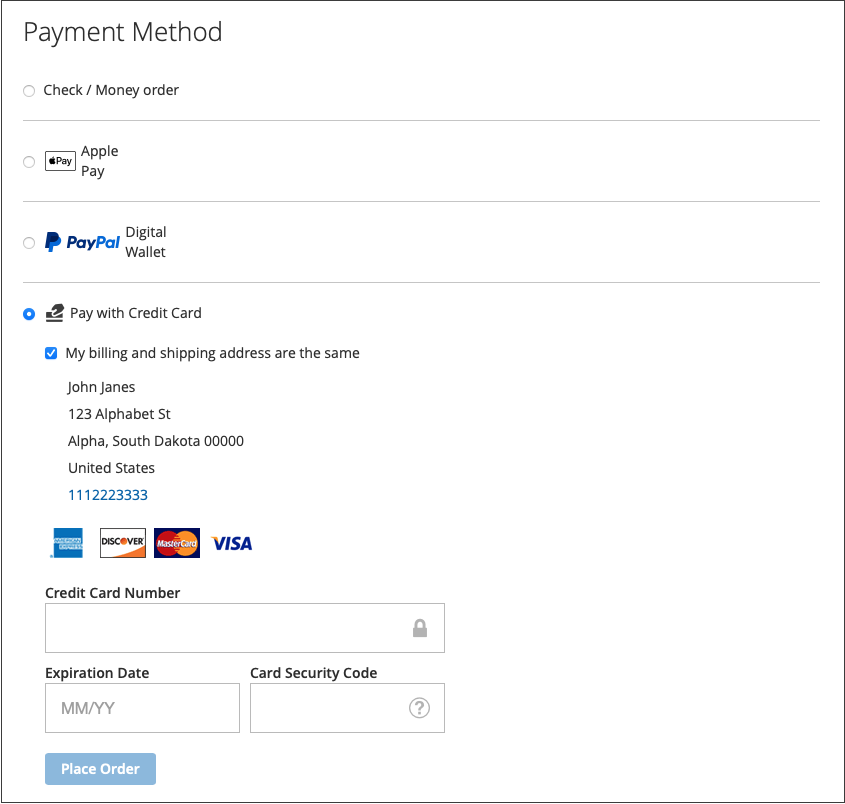
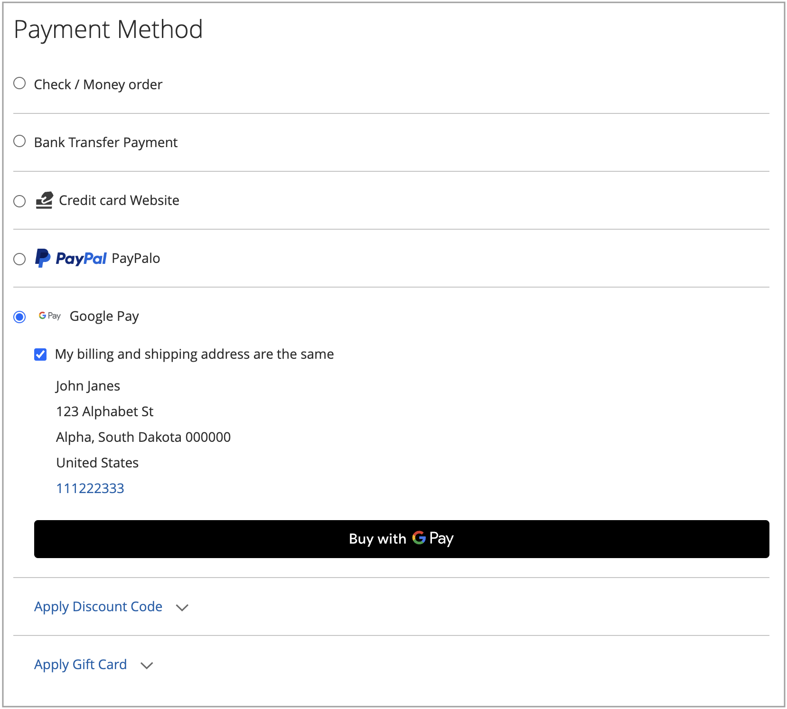
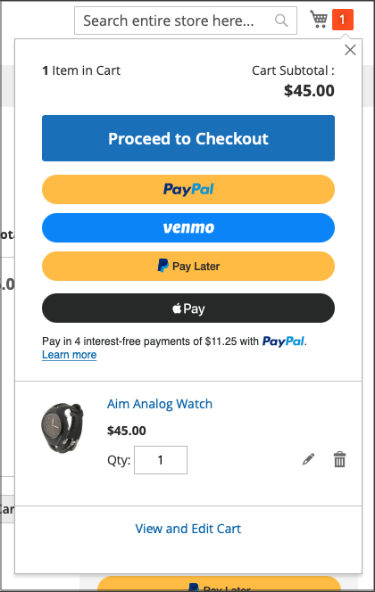
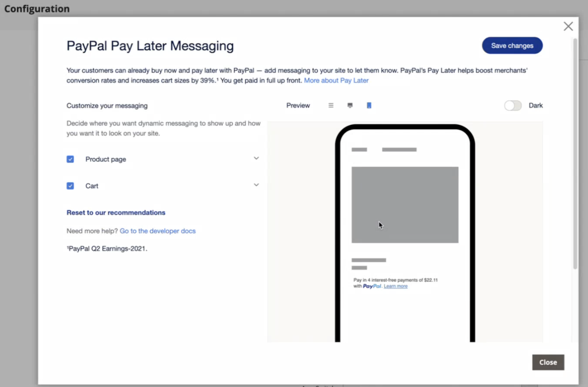

# 支払い方法

[!DNL Adobe Commerce]と[!DNL Magento Open Source] [!DNL Payment Services]では、複数の支払いオプションを利用できます。

これらの支払いオプションは、[ ホーム設定](payments-home.md)または[ ストア設定](configure-admin.md)で設定できます（従来の支払いオプションまたはマルチストア設定に推奨）。

決済方法は、決済プロセスのどの段階にあるかによって異なります。

* 製品ページ – 品目の製品ページ
* ミニカート：商品がカートに追加された際に、カートアイコンをクリックすると利用できます
* 買い物かご – _ミニカートからカートを表示して編集_&#x200B;をクリックすると利用できます
* チェックアウトビュー – _ミニカートまたはショッピングカートからチェックアウト_&#x200B;に進むと、クリック時に表示されます

>[!IMPORTANT]
>
>支払いを処理するには、[!DNL Payment Services] オンボーディングを完了する必要があります。

## 標準と高度な支払い体験

[!DNL Payment Services]では、お客様が事業を展開している国に応じて、**Advanced** （完全サポート）および&#x200B;**Standard** （Express Checkout）の支払いオプションとオンボーディングフローを提供しています。

* **詳細** – 現在の[完全にサポートされている国](../payment-services/payments-options.md)では、利用可能なすべての[支払いオプション ](compatibility.md#standard-vs-advanced-payment-services-experience)を利用できます。 ライブ決済を有効にするオンボーディング中に、[高度なオンボーディングオプション ](../payment-services/production.md#advanced-onboarding)を選択します。

* **Standard** – 支払いオプションのサブセット（Express Checkout）（PayPal クレジットカードおよびデビットカード）は、サポートされている他の国で利用可能です。 [ クレジットカードのフィールド ](#credit-card-fields)と[Apple Pay](#apple-pay-button)は、このオンボーディングオプションでは使用できません。 ライブ決済を有効にするオンボーディング中に、[標準オンボーディングオプション ](../payment-services/production.md#standard-onboarding)を選択します。

高度なオンボーディングと標準オンボーディングの完了については、実稼動環境[の [!DNL Payment Services] 有効](../payment-services/production.md#complete-merchant-onboarding)を参照してください。

## [!UICONTROL Credit Card Fields]

[!UICONTROL Credit Card Fields]は、クレジットカードまたはデビットカードの支払い方法にシンプルで安全なチェックアウトを提供します。 買い物客がクレジットカードのフィールドを使用してチェックアウトする場合、名前、請求先住所、クレジットカードまたはデビットカードの情報を入力して注文します。 購入セッション中に顧客データを安全に使用し、チェックアウトフローをスムーズに誘導できます。

{width="500" zoomable="yes"}

## [!UICONTROL Digital Wallets]

### [!DNL Fastlane] ボタン

[!DNL Fastlane]では、迅速、安全、手間のかからないオンライン支払い方法を提供しています。 **ゲストチェックアウト**&#x200B;中に、今後さらに迅速に購入できるように、カードと配送情報を安全に保存できます。

* **検証済みの買い物客にすばやくアクセス**：数百万人のリピーターを特定し、数秒でシームレスな支払いを実現します。
* **売上を増加**：より多くの購入が完了したので、コンバージョン率と承認率を向上させます。
* **チェックアウトを高速化**：安全でパスワードのないログイン体験で顧客の摩擦を減らします。

[!DNL Fastlane]が有効になっている場合、[!UICONTROL Credit Card Fields] オプションはデフォルトで無効になっています。

>[!NOTE]
>
> サンドボックスインスタンスでは、Fastlane トランザクションはトランザクションアクティビティビューに配送先住所を表示しません。

詳しくは、「[Fastlane by PayPal](https://www.paypal.com/us/fastlane){target=_blank}」のトピックを参照してください。

### [!DNL Apple Pay] ボタン

[!DNL Apple Pay]では、加盟店はSafariで安全で合理的なチェックアウト体験を提供でき（加盟店アカウントごとに最大99 ドメイン）、コンバージョンを向上させることができます。 [!DNL Apple Pay] ボタンを使用すると、お客様のiOSまたはmacOSのデバイスから支払い、連絡先、配送の詳細を自動入力できるので、ワンタップで簡単なチェックアウト体験を実現できます。

{width="500" zoomable="yes"}

有効にすると、商品ページ、ミニカート、ショッピングカート、チェックアウトビューから[!DNL Apple Pay] ボタンが表示されます。 ストア設定または拡張機能のホームで[!DNL Apple Pay]を設定できます。

>[!NOTE]
>
>  Apple Payのドメイン認証証明書は、決済サービスコードに既に含まれています。 パス `/.well-known/apple-developer-merchantid-domain-association`が200の応答コードを返すことを確認します。 [Apple Pay Domain verification](https://developer.paypal.com/docs/checkout/apm/apple-pay/#download-and-host-sandbox-domain-association-file)証明書について詳しくは、**Apple Pay**&#x200B;との統合に関するPayPal開発者ドキュメントを参照してください。

詳しくは、[設定](configure-admin.md#apple-pay)を参照してください。

### [!DNL Google Pay] ボタン

[!DNL Google Pay]をチェックアウト体験に組み込むことで、加盟店は買い物客のGoogle アカウントから保存された支払い、連絡先、配送情報を収集でき、サポートされているブラウザーとアプリをまたいで、便利で合理的なチェックアウトを提供します。

[!DNL Google Pay]は、特定の国または地域、および特定のデバイスでのみ利用できます。 詳しくは、[[!DNL Google Pay]  ドキュメント ](https://developer.paypal.com/docs/checkout/apm/google-pay/#link-googlepayintegration)を参照してください。

{width="500" zoomable="yes"}

有効にすると、商品ページ、ミニカート、ショッピングカート、チェックアウトビューから[!DNL Google Pay] ボタンが表示されます。 詳しくは、[設定](configure-admin.md)を参照してください。

>[!NOTE]
>
> [!DNL Google Pay] APIは、安全なコンテキスト内のWeb サイトでのみ使用できます。 詳しくは、[ トラブルシューティング ](https://developers.google.com/pay/api/web/support/troubleshooting)のドキュメントを参照してください。

### [!DNL PayPal Payment Buttons]

PayPalを使用して購入を完了する[!DNL PayPal payment buttons]は、後で使用するために買い物客の配送先住所、請求先住所、支払い詳細を保存します。 買い物客は、PayPalが過去に保存または提供していた支払い方法を使用できます。

{width="350" zoomable="yes"}

ストア設定または[!UICONTROL PayPal payment buttons] ホームで[!DNL Payment Services]を設定できます。

PayPalの[支払い方法に関するドキュメント ](https://developer.paypal.com/docs/checkout/payment-methods/)で、国別の支払い方法の利用可能性について説明しています。

#### [!DNL PayPal] ボタン

顧客は、「PayPal」ボタンを使用して、簡単かつ確実に決済できます。

[!DNL PayPal] ボタンは、製品ページ、ミニカート、ショッピングカート、チェックアウトビューから表示されます。

#### [!DNL Venmo] ボタン

お客様は、[Venmo](https://venmo.com/) ボタンを使用してチェックアウトできます。

[!DNL Venmo] ボタンは、製品ページ、ミニカート、ショッピングカート、チェックアウトビューから表示されます。

#### PayPal デビットカードまたはクレジットカードのボタン

顧客は、「PayPal デビットカード」または「クレジットカード」ボタンを使用してチェックアウトできます。

PayPal デビットカードまたはクレジットカードのボタンは、チェックアウトページから表示されます。

このオプションは、クレジットカード統合の代わりに、PayPal ホスティングのボタンを使用して、デビットカードまたはクレジットカードの支払いオプションを買い物客に提示するために使用できます。

#### [!DNL Pay Later] ボタン

顧客に短期、無利息、その他の支払いオプションを提供して、今すぐ購入し、[!DNL Pay Later] ボタンで後から支払えるようにします。

[!DNL Pay Later] ボタンは、製品ページ、ミニカート、ショッピングカート、チェックアウトビューから表示されます。

[後払いオファー](https://developer.paypal.com/docs/checkout/pay-later/us/)に関する情報については、PayPal デベロッパーのドキュメントを参照してください。 **国または地域** ドロップダウンを使用して、興味のある地域を選択します。

[!DNL Pay Later]設定[を更新して、](configure-admin.md#paypal-payment-buttons) メッセージを無効または有効にする方法について説明します。

##### オプション。 後払いメッセージの設定

**Pay Later**&#x200B;の[ メッセージ ](configure-admin.md#paypal-payment-buttons)を設定すると、販売者はこの支払いオプションのデフォルトスタイルを変更できます。 **[!UICONTROL Display Pay Later Message]**&#x200B;設定`Yes`で[を](configure-admin.md#paypal-payment-buttons)に設定すると、**[!UICONTROL Configure Messaging]** モーダルボタンが表示され、**[!UICONTROL PayPal Pay Later messaging]**&#x200B;のスタイルを設定できます。

{width="500" zoomable="yes"}

### PayPal支払いボタン用のサーバーサイド配送コールバック

PayPal、Pay Later、Venmoの支払い方法では、[ サーバーサイドの配送コールバック ](https://developer.paypal.com/docs/multiparty/checkout/standard/customize/shipping-module/)を使用して、PayPalがCommerce インスタンスと直接通信して配送オプションを取得し、リアルタイムで合計を計算できるようにします。

このサーバーサイドのアプローチにより、[!DNL Payment Services]は注文確認ポップアップをスキップして、より迅速で合理的な購入体験を提供できます。 送料や税金はコールバックを通じて動的に計算されるため、バイヤーはPayPalまたはVenmoのレビューページで直接正確な合計を確認できます。

>[!NOTE]
>
>コールバックエンドポイントは公開され、5秒以内に応答する必要があります。 応答時間がこの制限を超える場合、PayPalはポップアップにエラーメッセージを表示します。 これらの支払い方法をローカルでテストする方法については、[ローカル開発環境でのテスト ](test-validate.md#test-on-local-development-environments)を参照してください。

### PayPal支払いボタンのみを使用

ストアをすばやく実稼動モードにするには、_only_&#x200B;のPayPal支払いボタン（Venmo、PayPalなど）を設定します。PayPalのクレジットカード支払いオプションも使用できます。

これにより、次のことが可能になります。

* VenmoやPayPalの支払いボタンなど、顧客のためのさまざまな支払いオプションを提供しましょう。さらに、PayPalのホスティングカードフィールドをオフにし、既存のクレジットカード会社を利用することもできます。
* 既存のクレジットカード決済プロバイダーをクレジットカード決済に使用すると同時に、PayPalの他の決済オプションも使用します。
* PayPalが支払いオプションとしてクレジットカードをサポートしていない地域では、PayPalの支払いボタンを使用します。

**のみ&#x200B;_のPayPal支払いボタン（_ではなく&#x200B;_PayPal クレジットカード支払いオプション）で_支払いをキャプチャするには**:

1. ストアが実稼動モード [の](configure-admin.md#general-configuration)であることを確認します。
1. [設定で必要なPayPal支払いボタン ](configure-admin.md#paypal-payment-buttons)を設定します。
1. _セクションの_ オプションを&#x200B;**[[!UICONTROL Show PayPal Credit and Debit card button]](configure-admin.md#paypal-payment-buttons)** オフ _[!UICONTROL Payment buttons]_にします。

既存のクレジットカード プロバイダー&#x200B;**および&#x200B;_のPayPal支払いボタン_での支払いを** キャプチャするには：

1. ストアが実稼動モード [の](configure-admin.md#general-configuration)であることを確認します。
1. [PayPal支払いボタンを設定します](configure-admin.md#paypal-payment-buttons)。
1. _セクションの_ オプションを&#x200B;**[[!UICONTROL PayPal Show Credit and Debit card button]](configure-admin.md#paypal-payment-buttons)** オフ _[!UICONTROL Payment buttons]_にします。
1. _セクションの_ オプションを&#x200B;**[[!UICONTROL Show on checkout page]](configure-admin.md#credit-card-fields)** オフ _[!UICONTROL Credit card fields]_にし、[既存のクレジットカード プロバイダーのアカウント ](https://experienceleague.adobe.com/docs/commerce-admin/stores-sales/payments/payments.html#payments)を使用します。

## 現地での支払い方法

ローカル支払い方法（LPM）は、銀行振込やローカライズされた支払いソリューションなど、地域固有およびローカルの支払い方法と、既存のカードベースのオプションをサポートします。 マーチャントは、Commerce設定内で利用可能なLPMを直接有効または無効にできます。 LPMは、Adobeの決済機能を拡張し、欧州市場のニーズをサポートして、チェックアウトのローカライゼーションを向上させ、コンバージョン、マーチャントの導入、バイヤー満足度の向上を支援します。

次のLPMを使用できます。

| お支払い方法 | 国 | 通貨 |
|----------------|-----------|----------|
| Bancontact | ベルギー | EUR |
| BLIK | ポーランド | プラン |
| eps | オーストリア | EUR |
| iDEAL | オランダ | EUR |
| MyBank | イタリア | EUR |
| Przelewy24 | ポーランド | EUR、プラン |

LPMは、請求先住所とweb サイトの基本通貨にもとづいて顧客に表示されます。 支払い方法は、両方の条件が支払い方法の要件に一致する場合にのみ表示されます。

詳しくは、[ ローカル支払い方法の設定](configure-admin.md#local-payment-methods)を参照してください。

## Express チェックアウトボタン

より迅速なチェックアウト体験を促進するために、チェックアウトフローの開始時に支払いオプションを明示することができます。 PayPal、PayPal Pay Later、Venmo、Apple Pay、Google Payを利用して、購入を完了することができます。

有効にすると、チェックアウトプロセスの開始時にエクスプレスチェックアウトボタンが表示され、デジタルウォレットの支払い方法を好む顧客にはより迅速に購入できるようになります。

エクスプレスチェックアウトボタンを有効にするには、各支払い方法を個別に設定します。

* **PayPalと後払い**: **[!UICONTROL Show buttons at start of checkout]** PayPal支払いボタン [設定で](configure-admin.md#paypal-payment-buttons)を有効にします。

* **Apple Pay**: **[!UICONTROL Show Apple Pay at start of checkout]** Apple Pay[設定で](configure-admin.md#apple-pay)を有効にします。

* **Google Pay**: **[!UICONTROL Show Google Pay at start of checkout]** Google Pay[設定で](configure-admin.md#google-pay)を有効にします。

>[!NOTE]
>
>支払い方法の可用性は、購入者の場所によって異なります。 サンドボックスのテストでは、[購入者の国](sandbox.md#buyers-country)の設定を使用して、様々な地域をシミュレートします。 例えば、Venmoは米国でのみ利用可能です。 Pay Laterは、米国および英国でご利用いただけます。

## チェックアウトオプション

[!DNL Payment Services]を使用すると、買い物客の好みや行動に最適なAdobe Commerceのチェックアウトエクスペリエンスを設定できます。 クレジットカード [ ヴォールティング ](vaulting.md)や注文の自動無効化などの機能により、顧客にシームレスで手間のかからない取引を提供できます。

Adobe CommerceとMagento Open Source [!DNL Payment Services]を使用すると、複数のチェックアウトエクスペリエンスを利用できます。 決済方法は、決済プロセスのどの段階にあるかによって異なります。

* 製品ページ – アイテムの製品ページ

* ミニカート – カートに商品が追加された際に、カートアイコンをクリックすると利用できます

* ショッピングカート – ミニカートからカートを表示および編集をクリックすると利用可能

* チェックアウトビュー – 「ミニカートまたはショッピングカートからチェックアウトに進む」をクリックすると利用可能

### 注文の再計算

顧客がミニカート、ショッピングカート、または製品ページからチェックアウトフローに入ると、注文レビューページに誘導され、PayPal ポップアップウィンドウで選択した配送先住所を確認できます。 顧客が配送方法を選択すると、注文金額が適切に再計算され、顧客は送料と税金を確認できます。

顧客がチェックアウトページからチェックアウトフローに入ると、システムはすでに配送先住所と最終的に計算された金額を認識しており、合計が適切に表示されます。

祝日、送料、消費税は、場所によって大きく異なります。 [!DNL Payment Services]様が配送先住所と配送料を受け取った後、適用されるすべてのコストを迅速に再計算し、チェックアウトの最終段階で適切に表示します。

国別の支払い方法の利用可能性については、[PayPalの支払い方法](https://developer.paypal.com/docs/checkout/payment-methods/){target=_blank}のドキュメントをご覧ください。
