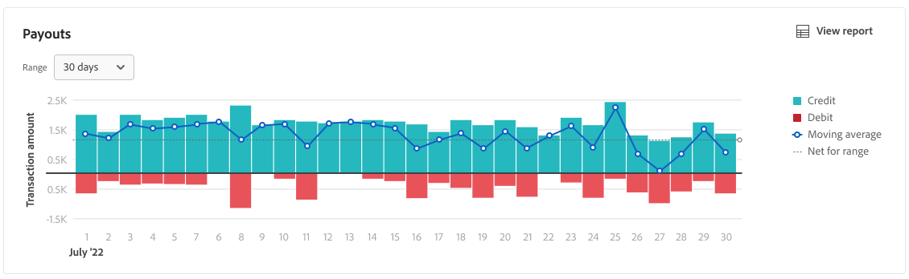
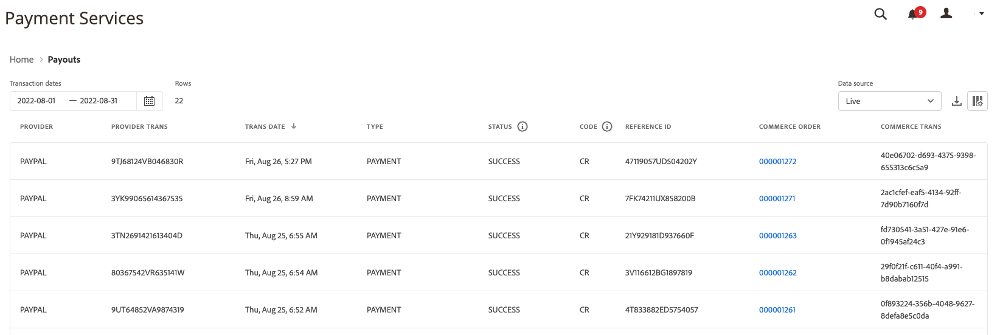

# 支払いレポート

[!DNL Adobe Commerce]と[!DNL Magento Open Source]の[!DNL Payment Services]では、ストアのトランザクション、注文、支払いを明確に把握するために、包括的なレポートが提供されます。

>[!NOTE]
>
>以下の支払いビューは、クラウドおよびオンプレミスのAdobe Commerceの[!DNL Payment Services] **[!UICONTROL Home]**&#x200B;から利用できます。 [!DNL Adobe Commerce as a Cloud Service]または[!DNL Adobe Commerce Optimizer]の[!DNL Payment Services] ダッシュボードには表示されません。[[!DNL Payment Services]  ホーム ](payments-home.md)を参照してください。

すべての支払いに関する詳細な情報を確認できる、2つの利用可能な支払いレポートビューがあります。

* **[支払いデータのビジュアライゼーションビュー](#payouts-data-visualization-view)** – 支払いサービスホームで使用できるチャート。支払いレポートビューから1日あたりの集計金額を視覚的に表示したものです
* **[支払いレポート ビュー](#payouts-report-view)** – すべてのトランザクションの詳細な支払い情報を表示する支払いレポートが支払いに利用できます

支払いビューには、支払い金額、処理済み数量、財務の調整に関するトランザクションレベルの詳細なレポートなど、包括的な支払い情報が一目でわかります。

既存の会計または注文管理ソフトウェアで使用するために、.csv ファイル形式で[支払いトランザクション ](#download-transactions)をダウンロードできます。

>[!NOTE]
>
>支払いレポートには、取り込まれた注文のみが表示されます（支払いアクションは[`Authorize and Capture`](https://experienceleague.adobe.com/docs/commerce-merchant-services/payment-services/get-started/production.html#set-payment-services-as-payment-method)に設定されています）。または[は`Invoiced`](https://experienceleague.adobe.com/en/docs/commerce-admin/stores-sales/order-management/invoices#create-an-invoice)としてマークされています。

## 支払いデータのビジュアライゼーションビュー

支払いデータのビジュアライゼーションビューは、支払いサービスホームで使用できます。 詳細な表形式の[支払いレポート ビュー](#payouts-report-view)の1日あたりの集計金額を視覚的に表したものです。

_管理者_ サイドバーで、**[!UICONTROL Sales]** > **[!UICONTROL Payment Services]**&#x200B;に移動して、クレジットとデビットのデータ視覚化チャートと、時間の経過に伴う移動平均を表示します。

{width="800" zoomable="yes"}での支払いデータのビジュアライゼーション

**[!UICONTROL View Report]**&#x200B;をクリックして、詳細な表[支払いレポート ビュー](#payouts-report-view)に移動します。

### トランザクション期間のカスタマイズ

デフォルトでは、30日間のトランザクションが表示されます。

支払データのビジュアライゼーションビューで、日付範囲を選択して、表示する支払い取引の期間をカスタマイズできます。

1. _管理者_ サイドバーで、**[!UICONTROL Sales]** > **[!UICONTROL Payment Services]**&#x200B;に移動します。 支払いデータのビジュアライゼーションビューは、「支払い」セクションに表示されます。
1. **[!UICONTROL Range]** セレクターフィルターをクリックします。
1. 該当する日付範囲（30日、15日、7日）を選択します。
1. 指定した日付の取引情報を表示します。

### 取引情報

選択した日付範囲のトランザクション金額は、支払いデータのビジュアライゼーションビューの左側に表示されます。 選択した日付範囲の日付は、ビューの下部に表示されます。 特定の日付に支払いがない場合、その日付は表示されません。

支払いデータのビジュアライゼーションビューには、次の情報が含まれます。

| データ | 説明 |
| ------------ | -------------------- |
| [!UICONTROL Transaction amount] | 指定された時間枠のトランザクションの金額範囲。Y軸のデータ（左） |
| 日付範囲 | 指定された時間枠の日付範囲。X軸のデータ（下） |
| Credit | 指定された期間の支払い |
| 借方 | 指定された時間枠のデビット（払い戻し） |
| 移動平均 | 指定された時間枠の各日付に対する平均支払いの表示 |
| 範囲のネット | 指定された期間（範囲）の純配当金額 |

## 支払いレポート ビュー

支払いレポート ビューは、支払いサービスの「支払い」ビューで使用できます。 ストアの支払いに関するすべての利用可能な情報が含まれます。

_管理者_ サイドバーで、**[!UICONTROL Sales]** > **[!UICONTROL Payment Services]** > _[!UICONTROL Payouts]_>**[!UICONTROL View Report]**に移動して、詳細な表形式の支払いレポート表示を確認します。

{width="800" zoomable="yes"}の支払いトランザクション

このトピックのセクションに従って、表示するデータを最適に表示するように、このビューを設定できます。

このレポートでは、リンクされたCommerceの注文および取引ID、取引金額、取引ごとの支払い方法などを確認できます。

既存の会計または注文管理ソフトウェアで使用するために、.csv ファイル形式で[支払いトランザクション ](#download-transactions)をダウンロードできます。

>[!NOTE]
>
>このテーブルに表示されるデータは、デフォルトで`TRANS DATE`を使用して降順（`DESC`）で並べ替えられます。 `TRANS DATE`は、トランザクションが開始された日時です。

### データソースを選択

支払いレポート ビューで、レポート結果を表示するデータソース（**[!UICONTROL Live]**&#x200B;または&#x200B;**[!UICONTROL Sandbox]**）を選択できます。

{width="300" zoomable="yes"}

_[!UICONTROL Live]_が選択したデータソースである場合、実稼動モードのストアのレポート情報を確認できます。_[!UICONTROL Sandbox]_&#x200B;が選択したデータソースの場合、レポート情報ストアはサンドボックスモードで表示されます。

データソースの選択は次のように機能します。

* ライブモードのストアがない場合、データソースの選択はデフォルトで&#x200B;_[!UICONTROL Sandbox]_になります。
* ライブモードでストア（1つまたは複数）がある場合、データソースの選択はデフォルトで&#x200B;_[!UICONTROL Live]_になります。
* レポートの書き出しは、常にデータソースの選択を尊重します。

注文支払い状況レポートのデータソースを選択するには：

1. _管理者_ サイドバーで、**[!UICONTROL Sales]** > **[!UICONTROL Payment Services]** > _[!UICONTROL Payouts]_>**[!UICONTROL View Report]**に移動します。
1. **[!UICONTROL Data source]**&#x200B;をクリックし、**[!UICONTROL Live]**&#x200B;または&#x200B;**[!UICONTROL Sandbox]**&#x200B;を選択します。

   選択したデータソースに基づいて、レポート結果が再生成されます。

### トランザクションの表示

デフォルトでは、30日間のトランザクションが表示されます。

検索で返される行数、またはデフォルトの30日間のトランザクションに表示される行数は、支払い表示グリッドの上にトランザクション日付カレンダーセレクターフィルターと共に表示されます。

左右にスクロールして、取引日、参照ID、請求書番号、支払い方法の詳細など、日次レポートの各支払い取引](#column-descriptions)に関する[情報を表示します。

#### トランザクション期間のカスタマイズ

支払いレポート表示では、特定の日付を入力するか、日付選択から日付範囲を選択することで、表示する支払い取引の期間をカスタマイズできます。

1. _管理者_ サイドバーで、**[!UICONTROL Sales]** > **[!UICONTROL Payment Services]** > _[!UICONTROL Payouts]_>**[!UICONTROL View Report]**に移動します。
1. _[!UICONTROL Transaction dates]_カレンダーセレクターフィルターをクリックします。
1. 該当する日付範囲を選択します。
1. 指定した日付の支払い状況をグリッドで表示します。

### 列の表示と非表示

支払いレポート ビューには、デフォルトで使用可能な情報の列が表示されます。 ただし、レポートに表示する列はカスタマイズできます。

1. _管理者_ サイドバーで、**[!UICONTROL Sales]** > **[!UICONTROL [!DNL Payment Services]]** > _[!UICONTROL Payouts]_>**[!UICONTROL View Report]**に移動します。
1. _列設定_ アイコン （{width="20" zoomable="yes"}）をクリックします。
1. レポートに表示する列をカスタマイズするには、リストの列をオンまたはオフにします。

   支払いレポート ビューには、列の設定メニューで行った変更がすぐに表示されます。 列の環境設定は保存され、レポートビューから移動しても有効のままになります。

### トランザクションのダウンロード

支払い表示グリッドに表示されるすべてのトランザクションを含む.csv ファイルをダウンロードできます。

1. _管理者_ サイドバーで、**[!UICONTROL Sales]** > **[!UICONTROL Payment Services]** > _[!UICONTROL Payouts]_>**[!UICONTROL View Report]**に移動します。
1. [ トランザクションの日付範囲の期間をカスタマイズ ](#customize-transactions-timeframe)。
1. _ダウンロード_ （{width="20" zoomable="yes"}）アイコンをクリックします。

支払いトランザクションは.csv形式でダウンロードされます。

### 列の説明

支払いレポートには、次の情報が含まれます。

| 列 | 説明 |
| ------------ | -------------------- |
| [!UICONTROL Provider] | 決済プロバイダー |
| [!UICONTROL Provider trans] | トランザクション ID |
| [!UICONTROL Trans date] | トランザクションが開始された日時 |
| [!UICONTROL Type] | トランザクションの種類 – *[!UICONTROL PAYMENT]*, *[!UICONTROL BONUS]*, *[!UICONTROL CHARGEBACK]*, *[!UICONTROL CORRECTION]*, *[!UICONTROL CURRENCY_CONVERSATION]*, *[!UICONTROL DEPOSIT]*, *[!UICONTROL DISBURSEMENT]*, *[!UICONTROL DISPUTE]*, *[!UICONTROL FEES]*, *[!UICONTROL HOLD]*, *[!UICONTROL HOLD_RELEASE]*, *[!UICONTROL INCENTIVES]*, *[!UICONTROL OTHERS]*, *[!UICONTROL RECOUP]*, *[!UICONTROL REFUND]*, *[!UICONTROL REVERSAL]*, *[!UICONTROL WITHDRAWAL]*   詳細については、  トランザクションの種類[を参照してください](#transaction-types)。 |
| [!UICONTROL Status] | トランザクションの現在の状態 – *[!UICONTROL SUCCESS]*、*[!UICONTROL DENIED]*、*[!UICONTROL PENDING]* |
| [!UICONTROL Code] | クレジット （*CR*）またはデビット （*DR*）を示すトランザクション コード |
| [!UICONTROL Reference ID] | このイベントに関連する元のトランザクション ID |
| [!UICONTROL Invoice] | トランザクションの請求書ID （注文ごとに1つ） |
| [!UICONTROL Commerce order] | Commerce注文ID    関連する[注文情報](https://experienceleague.adobe.com/en/docs/commerce-admin/stores-sales/order-management/orders/orders)を表示するには、IDをクリックします。 |
| [!UICONTROL Commerce trans] | Commerce トランザクション ID |
| [!UICONTROL Pay method] | クレジットカードの種類（*[!UICONTROL BANK]*、*[!UICONTROL PAYPAL]*、*[!UICONTROL CREDIT_CARD]*）および関連するカードプロバイダー（*Visa*&#x200B;または&#x200B;*MasterCard*&#x200B;など） |
| [!UICONTROL TRANS AMT] | トランザクションの金額 |
| [!UICONTROL CUR] | 取引金額の通貨単位 |
| [!UICONTROL PENDING] | 未払い金額 |
| [!UICONTROL CUR] | 保留金額の通貨単位 |
| [!UICONTROL SELLER AMT] | 顧客 との間で送金された金額  出品者アカウントから移動する資金には、ダッシュ（ – ）プレフィックスが表示されます。 |
| [!UICONTROL CUR] | 販売者金額の通貨単位 |
| [!UICONTROL PARTNER FEE] | トランザクション  に関連付けられているパートナー手数料   パートナー手数料アカウントから移動する資金には、ダッシュ（ – ）接頭辞が表示されます。 |
| [!UICONTROL CUR] | パートナー手数料の通貨単位 |
| [!UICONTROL PROV FEES] | トランザクション  に関連付けられている手数料   プロバイダーの手数料口座から引き落とされている資金には、ダッシュ（ – ）のプレフィックスが表示されます。 |
| [!UICONTROL CUR] | プロバイダー手数料の通貨単位 |
| [!UICONTROL FEE %] | 手数料として請求された取引金額の割合 |
| [!UICONTROL FIXED FEE] | 固定プロバイダー料金額 |
| [!UICONTROL CHBK FEE] | トランザクション  に関連付けられているチャージバック手数料   ダッシュ（ – ）のプレフィックスは、チャージバック手数料が取り消されたことを示します。 |
| [!UICONTROL CUR] | チャージバック手数料の通貨単位 |
| [!UICONTROL HOLD AMT] | 保留中または保留中から解放された金額    ダッシュ（ – ）プレフィックスは、保留中の資金が解放されていることを示します。 |
| [!UICONTROL CUR] | 保留金額の通貨単位 |
| [!UICONTROL RECOUP AMT] | 再計上アカウント  から回収された金額  再コープ アカウントから移動する資金に、ダッシュ （ – ）接頭辞が表示されます。 |
| [!UICONTROL CUR] | 払戻金額の通貨単位 |

### トランザクションタイプ

これらの取引タイプは、支払い取引に記載することができます。

| レポート | 説明 |
| ------------ | -------------------- |
| [!UICONTROL PAYMENT] | 注文に対して買い手と売り手の間で移動する金銭 |
| [!UICONTROL AUTH] | 認証および認証ボイド トランザクション |
| [!UICONTROL BONUS] | -- |
| [!UICONTROL CHARGEBACK] | チャージバック手数料およびチャージバック手数料のリバーサル取引 |
| [!UICONTROL CORRECTION] | -- |
| [!UICONTROL CURRENCY_CONVERSION] | -- |
| [!UICONTROL DEPOSIT] | -- |
| [!UICONTROL DISBURSEMENT] | -- |
| [!UICONTROL DISPUTE] | -- |
| [!UICONTROL FEES] | パートナー手数料、決済手数料、手数料リバーストランザクション |
| [!UICONTROL HOLD] | -- |
| [!UICONTROL HOLD_RELEASE] | -- |
| [!UICONTROL INCENTIVES] | -- |
| [!UICONTROL OTHERS] | -- |
| [!UICONTROL RECOUP] | 銀行口座または損失口座からの回収 |
| [!UICONTROL REFUND] | -- |
| [!UICONTROL REVERSAL] | -- |
| [!UICONTROL WITHDRAWAL] | -- |
