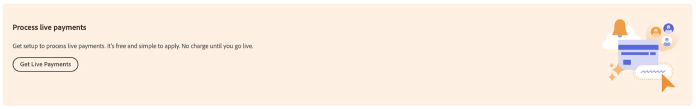

# 実稼動用に[!DNL Payment Services]を有効にする

このトピックの手順に従って、サービスを実稼動環境に入れ、[&#x200B; オンボーディングプロセス &#x200B;](onboard.md)を完了できます。次の手順を実行します。

* [!BADGE PaaSのみ]{type=Informative tooltip="Cloud プロジェクト上のAdobe Commerce（Adobeで管理されるPaaS インフラストラクチャ）にのみ適用されます。"} [決済サービス拡張機能をインストール &#x200B;](install.md)
* [!BADGE PaaSのみ]{type=Informative tooltip="Cloud プロジェクト上のAdobe Commerce（Adobeで管理されるPaaS インフラストラクチャ）にのみ適用されます。"} [&#x200B; インスタンスの設定と接続](connect.md)
* [&#x200B; サンドボックスを設定](sandbox.md)して[&#x200B; テスト &#x200B;](test-validate.md)します

## [!DNL Payment Services]を支払方法として設定

[Commerce サービス &#x200B;](connect.md#configure-commerce-services)を設定し、[&#x200B; サンドボックステスト &#x200B;](sandbox.md#sandbox-onboarding)または[&#x200B; ライブ支払い](#enable-live-payments)のいずれかを有効にした後、支払い方法として[!DNL Payment Services]を設定する必要があります。

1. _管理者_ サイドバーで、**[!UICONTROL Sales]** > **[!UICONTROL Payment Services]**&#x200B;に移動します。
1. **[!UICONTROL Enable Payment Services]**&#x200B;をクリックします。

   このオプションは、1つ以上のWeb サイトの支払い方法として[!DNL Payment Services]をまだ設定していない場合に表示されます。

   関連するオプションが展開されたホームビューの設定領域（**[!UICONTROL Sales]** > **[!UICONTROL Payment Services]** > _[!UICONTROL Settings]_）に移動します。ここで、[!DNL Payment Services] オプションを[支払い方法](https://experienceleague.adobe.com/en/docs/commerce-admin/config/sales/payment-methods/payment-methods){target="_blank"}として有効にできます。

1. _[!UICONTROL General Configuration]_&#x200B;で、**[!UICONTROL Enable]**&#x200B;を`Yes`に設定します。
1. **[!UICONTROL Payment Action]**&#x200B;と&#x200B;_[!UICONTROL Credit Card Fields]_&#x200B;の_[!UICONTROL PayPal payment buttons]_&#x200B;を次のいずれかに設定します。

   | 設定 | 説明 |
   |---|---|
   | `Authorize` | 購入を承認し、資金を保留します。 金額は、加盟店が「獲得」するまで引き落とされません。 |
   | `Authorize and Capture` | 購入を承認し、加盟店が資金を「キャプチャ」します。 |

   >[!IMPORTANT]
   >
   >[!DNL Payment Services]は部分的なキャプチャをサポートしています。 加盟店は、注文の一部を部分的に受け取ることができます。 例えば、各アイテムを個別にキャプチャすることも、現在のアイテムと後のアイテムを個別にキャプチャすることもできます。

1. **[!UICONTROL Save]**&#x200B;をクリックします。
1. **[!UICONTROL Go to Payment Services]**&#x200B;をクリックして、[!DNL Payment Services] ホームに戻ります。
1. [&#x200B; キャッシュをクリア &#x200B;](https://experienceleague.adobe.com/docs/commerce-admin/systems/tools/cache-management.html)。

   設定を変更するたびに消去を実行する必要があります。

クレジットカードのフィールドとPayPal支払いボタンの設定について詳しくは、[設定 [!DNL Payment Services]](configure-admin.md)を参照してください。

## 加盟店オンボーディングの完全実施

店舗で決済サービスを利用できるようにするための次のステップは、ライブオンボーディングを完了することです。

決済サービスでは、お客様が運営する国と希望する支払い体験に応じて、[**Advanced** （完全サポート）および&#x200B;**Standard** （Express Checkout）の支払いオプション &#x200B;](../payment-services/payments-options.md#standard-vs-advanced-payments-experience)とオンボーディングフローを提供しています。

1. _管理者_ サイドバーで、**[!UICONTROL Sales]** > **[!UICONTROL Payment Services]**&#x200B;に移動します。
1. **[!UICONTROL Live onboarding]**&#x200B;をクリックします。

   このオプションは、[!DNL Payment Services]のライブオンボーディングをまだ完了していない場合に表示されます。

1. _国を選択_ モーダルで、使用している国を選択します。

   決済サービスは、現在[5か国](compatibility.md#compatibility.md#standard-vs-advanced-payment-services-experience)のすべての支払いオプションを完全にサポートしています。 決済サービスは、国リストに表示されているその他すべての国に対して、Express Checkout機能（支払いオプションのサブセット）を提供します。

   リストから選択した国が支払いオプションを決定し、オンボーディングフロー（[Advanced](#advanced-onboarding) （完全にサポート）または[Standard](#standard-onboarding) （Express Checkout））が利用できるようになります。

>[!TIP]
>
> オンボーディングオプション（標準または詳細）を選択して続行したら、最初の選択範囲からアップグレードまたはダウングレードするために、オンボーディングを再度完了する必要があります。

### 高度なオンボーディング

このオンボーディングフローは、[完全にサポートされている国](compatibility.md#accepted-credit-cards-and-currencies)のマーチャントが利用できます。

国を選択した後：

1. 表示されるモーダルで、**詳細**&#x200B;を選択します。

   **標準** オプションの場合は、[標準オンボーディングフロー](#standard-onboarding)に進みます。

1. **続行**&#x200B;をクリックします。
1. 完全にサポートされている高度なオンボーディングのPayPal フローを続行し、新しいPayPal アカウントにサインアップするPayPal アカウントの資格情報（サンドボックスアカウントの資格情報ではありません） _または_&#x200B;を使用します。

>[!IMPORTANT]
>
>**高度なオンボーディング**&#x200B;では、ライブオンボーディングを有効にするために[支払い資格](#request-payments-entitlement-from-adobe)を要求する必要があります。

### 標準オンボーディング

この標準オンボーディングフローは、[Express チェックアウトサポート &#x200B;](compatibility.md#accepted-credit-cards-and-currencies)のみが提供されている利用可能な国のマーチャントに対して利用できます。

国を選択した後：

1. 表示される&#x200B;_支払いサービス契約_ モーダルで、**支払いサービス契約** リンクをクリックして、Adobe Commerce支払いサービス契約を表示します。
1. _支払いサービス契約_ モーダルで、**同意します**&#x200B;をクリックします。
1. Express Checkout オンボーディング用のPayPal フローを続行し、PayPal アカウントの資格情報（サンドボックス アカウントの資格情報ではなく）を使用するか、新しいPayPal アカウントにサインアップします。

>[!IMPORTANT]
>
>[Appleの支払いフィールドとクレジットカードのフィールド &#x200B;](../payment-services/payments-options.md)は、**標準オンボーディング**&#x200B;では使用できません。

## メールアドレスを確認

1. 管理者サイドバーで、**[!UICONTROL Sales]** > **[!UICONTROL Payment Services]**&#x200B;に移動します

   _[!UICONTROL Live onboarding]_&#x200B;ボタンが表示されなくなり、「[!UICONTROL Live payments pending]」テキストボックスが表示されます。

   このテキストボックスでは、オンボーディングを完了するために、PayPalでメールアドレスを確認するように求められる場合もあります。

1. メールアドレスの確認を求められた場合は、PayPalから送信された確認メッセージをメールで確認し、クリックしてメールアドレスを確認します。
1. 管理者サイドバーで、**[!UICONTROL Sales]** > **[!UICONTROL Payment Services]**&#x200B;に移動します。
1. ブラウザーウィンドウを更新します。

   PayPal加盟店のオンボーディングが承認されると、支払いシステムがサンドボックスモードであり、ライブ決済を処理していないことを示す通知が表示されます。

   >[!IMPORTANT]
   >
   >支払いを処理するための[!DNL Payment Services]および[!DNL Adobe Commerce]の[!DNL Magento Open Source]への同意を（PayPal アカウント設定で）取り消した場合、ストア内の注文は[!DNL Payment Services]によって処理できません。 支払いサービスホームに、失効した同意に関するアラートが表示されます。

## Adobeから支払い権限をリクエスト

ストアを有効にするには、Adobeから支払い資格をリクエストします（[高度なオンボーディングのみ](#advanced-onboarding)の場合）。

1. _管理者_ サイドバーで、**[!UICONTROL Sales]** > **[!UICONTROL Payment Services]**&#x200B;に移動します。
1. **[!UICONTROL Get Live Payments]** ホームで「[!DNL Payment Services]」をクリックします。

   {width="500" zoomable="yes"}

1. フォームに記入してください。
1. 営業担当者からご連絡させていただきます。

または、[business.adobe.com](https://business.adobe.com/resources/payment-services.html)でAdobeから支払い資格をリクエストすることもできます。

>[!IMPORTANT]
>
>支払い資格が承認されるまで、**ライブオンボーディング**&#x200B;にアクセスできません。

## 価格帯の設定

[!DNL Payment Services] _販売者ID_&#x200B;を取得：

1. _管理者_ サイドバーで、**[!UICONTROL Sales]** > **[!UICONTROL Payment Services]**&#x200B;に移動します。
1. ホーム ビューで、**[!UICONTROL Settings]**&#x200B;をクリックします。 詳しくは、[&#x200B; ホーム &#x200B;](payments-home.md)を参照してください。
1. 必要な&#x200B;_Merchant ID_&#x200B;を選択し、営業担当者に送信します。営業担当者は、適切な価格帯を設定します。

支払いトランザクションについて詳しくは、[&#x200B; レベル 2およびレベル 3の処理](levels-card-payment-transactions.md)を参照してください。

## ライブ決済を有効にする

_実稼動用マーチャント ID_&#x200B;が自動生成され、[設定](configure-admin.md)に入力されます。 このIDを変更または変更しないでください。

ライブ決済を有効にする：

1. _管理者_ サイドバーで、**[!UICONTROL Sales]** > **[!UICONTROL Payment Services]**&#x200B;に移動します。
1. ホームで、ページの右上にある「**[!UICONTROL Settings]**」をクリックします。 詳しくは、[&#x200B; ホーム &#x200B;](payments-home.md)を参照してください。
1. _[!UICONTROL General Configuration]_&#x200B;セクションで、**[!UICONTROL Payment mode]**&#x200B;を`Production`に設定します。
1. **[!UICONTROL Save]**&#x200B;をクリックします。
1. [&#x200B; キャッシュをクリア &#x200B;](https://experienceleague.adobe.com/en/docs/commerce-admin/systems/tools/cache-management){target="_blank"}。

   >[!IMPORTANT]
   >
   >キャッシュをクリアしないと、チェックアウト時にPayPalの支払いオプションを顧客に表示できません。

[!DNL Payment Services] ホームに戻ると、ライブ決済を処理しているため、サンドボックス決済モードのメッセージは表示されなくなります。

レガシー設定オプションについては、[Admin](configure-admin.md)での設定を参照してください。

>[!IMPORTANT]
>
>お支払いの処理に対する[!DNL Payment Services]への同意を取り消した場合（PayPal アカウントの設定で）、ストア内の注文は[!DNL Payment Services]によって処理できません。 決済処理を再度有効にする場合は、オンボーディングを再度完了する必要があります。 支払いサービスホームに、失効した同意に関するアラートが表示されます。

## 本番環境でのテスト

この機能を買い物客に公開する前に、実際のクレジットカードや銀行を使用して、実稼動環境で支払いをテストすることを強くお勧めします。

詳しくは、[&#x200B; テストと検証](test-validate.md)を参照してください。
