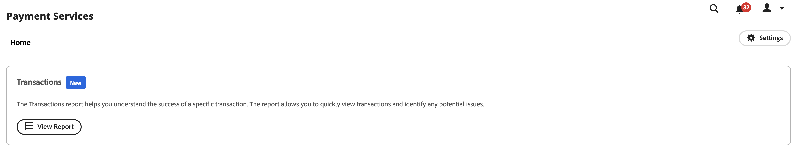
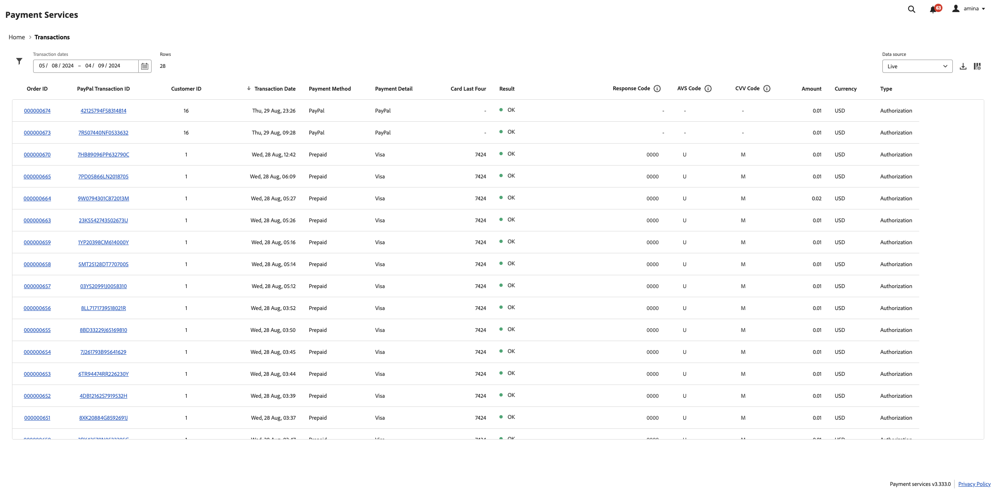
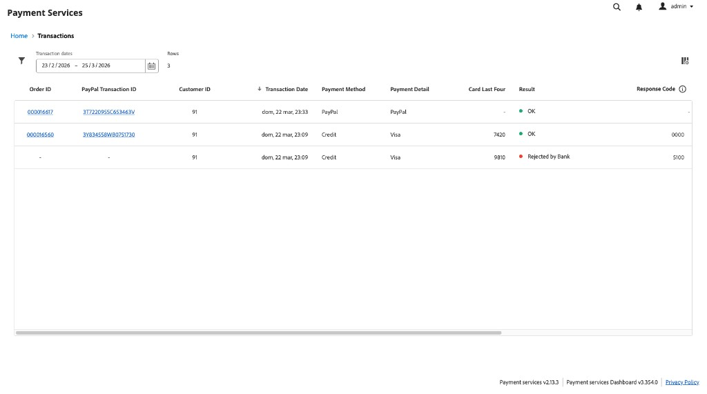
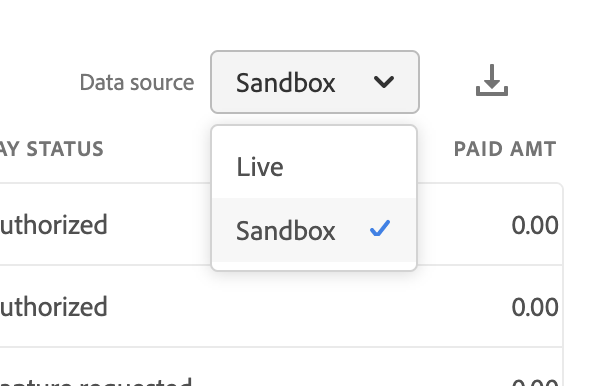

# レポート

[!DNL Payment Services]と[!DNL Adobe Commerce]の[!DNL Magento Open Source]では、ストアのトランザクション、注文、支払いを明確に把握するために、包括的なレポートが提供されます。

{width="700" zoomable="yes"}

トランザクションレポートは、トランザクションの承認率とマイナスのトランザクショントレンドを可視化します。これにより、ストアの健全性を効果的に監視し、トランザクションの問題を先見的に特定して対処できます。

ストアフロントでの注文に関する個々のトランザクションと、その支払い方法、結果、支払い応答コードなどを確認できます。

トランザクションレポートに記載されている情報は、マーチャントのみが使用できます。 この情報をお客様やその他の詐欺師と共有しないでください。 トランザクション情報を使用して、セキュリティチェックを回避したり、チャージバックにつながる注文を行ったりすることができます。

既存の会計または注文管理ソフトウェアで使用するために、.csv ファイル形式でトランザクションレポートをダウンロードできます。

>[!NOTE]
>
> [&#x200B; オンボーディングして](production.md#enable-live-payments)のライブモード [!DNL Payment Services]をアクティブ化していない場合、財務報告書を表示することはできません。

## トランザクションレポート表示

「取引」レポート・ビューは、支払サービスの「取引」ビューで使用できます。 ストアのトランザクションに関するすべての利用可能な情報が含まれます。

_管理者_ サイドバーで、**[!UICONTROL Sales]** > **[!UICONTROL [!DNL Payment Services]]** > _[!UICONTROL Transactions]_>**[!UICONTROL View Report]**&#x200B;に移動して、詳細な表形式取引レポート表示を表示します。**[!UICONTROL Home]**&#x200B;から、**[!UICONTROL View Report]**&#x200B;と&#x200B;**[!UICONTROL Transactions]**&#x200B;の[!DNL Adobe Commerce as a Cloud Service]の下の[!DNL Adobe Commerce Optimizer]を選択することもできます。

>[!BEGINTABS]

>[!TAB  クラウドおよびオンプレミスでのAdobe Commerce]

{width="800" zoomable="yes"}

>[!TAB Adobe Commerce as a Cloud ServiceとCommerce Optimizer]

同じレポート機能がSaaSのデプロイメントにも適用されます。 パンくずリストには&#x200B;**[!UICONTROL Home]** > **[!UICONTROL Transactions]**&#x200B;が表示され、グリッドには&#x200B;**[!UICONTROL Order ID]**、**[!UICONTROL PayPal Transaction ID]**、**[!UICONTROL Customer ID]**、**[!UICONTROL Transaction Date]**、**[!UICONTROL Payment Method]**、**[!UICONTROL Payment Detail]**、**[!UICONTROL Card Last Four]**、**[!UICONTROL Result]**、および&#x200B;**[!UICONTROL Response Code]**&#x200B;などの列が含まれます。

{width="800" zoomable="yes"}

>[!ENDTABS]

このトピックのセクションに従って、表示するデータを最適に表示するように、このビューを設定できます。

このレポートでは、リンクされたCommerceの注文IDおよびPayPalのトランザクション ID、トランザクションの金額、トランザクションごとの支払い方法などを確認できます。

あらゆる決済方法が同様の詳細な情報を提供するわけではありません。 例えば、クレジットカードのトランザクションでは、応答、AVS、CCV コード、およびトランザクションレポートのカードの最後の4桁が提供されます。PayPalの支払いボタンは提供されません。

既存の会計または注文管理ソフトウェアで使用するために、.csv ファイル形式で[&#x200B; トランザクション &#x200B;](#download-transactions)をダウンロードできます。

>[!WARNING]
>
> トランザクション レポートには、[!DNL Payment Services]外で行われたキャプチャは含まれません。

### データソースを選択

トランザクションレポート表示で、レポート結果を表示するデータソース（**[!UICONTROL Live]**&#x200B;または&#x200B;**[!UICONTROL Sandbox]**）を選択できます。

{width="300" zoomable="yes"}

_[!UICONTROL Live]_&#x200B;が選択したデータソースである場合は、実稼動モードで[!DNL Payment Services]を使用するストアのレポート情報を表示できます。_[!UICONTROL Sandbox]_&#x200B;が選択したデータソースの場合、サンドボックスモードのレポート情報を確認できます。

データソースの選択は次のように機能します。

* 実稼動モードで[!DNL Payment Services]を使用するストアがない場合、データソースの選択はデフォルトで&#x200B;_[!UICONTROL Sandbox]_&#x200B;になります。
* 実稼動モードで[!DNL Payment Services]を使用するストア （1つまたは複数）がある場合、データソースの選択はデフォルトで&#x200B;_[!UICONTROL Live]_&#x200B;になります。
* レポートの書き出しは、常にデータソースの選択を尊重します。

[!UICONTROL Transactions] レポートのデータソースを選択するには：

1. _管理者_ サイドバーで、**[!UICONTROL Sales]** > **[!UICONTROL [!DNL Payment Services]]** > _[!UICONTROL Transactions]_>**[!UICONTROL View Report]**&#x200B;に移動します。
1. **[!UICONTROL Data source]**&#x200B;をクリックし、**[!UICONTROL Live]**&#x200B;または&#x200B;**[!UICONTROL Sandbox]**&#x200B;を選択します。

   選択したデータソースに基づいて、レポート結果が再生成されます。

### 日付の期間をカスタマイズ

トランザクションレポート表示では、特定の日付を選択して、表示するトランザクションの期間をカスタマイズできます。 デフォルトでは、30日間のトランザクションがグリッドに表示されます。

1. _管理者_ サイドバーで、**[!UICONTROL Sales]** > **[!UICONTROL [!DNL Payment Services]]** > _[!UICONTROL Transactions]_>**[!UICONTROL View Report]**&#x200B;に移動します。
1. **[!UICONTROL Transaction dates]** カレンダーセレクターフィルターをクリックします。
1. 該当する日付範囲を選択します。
1. 指定した日付のトランザクションをグリッドで表示します。

### レポート情報をフィルター

トランザクションレポート表示で、フィルター条件を選択して、表示するステータスの結果をフィルタリングできます。

1. _管理者_ サイドバーで、**[!UICONTROL Sales]** > **[!UICONTROL [!DNL Payment Services]]** > _[!UICONTROL Transactions]_>**[!UICONTROL View Report]**&#x200B;に移動します。
1. **[!UICONTROL Filter]** セレクターをクリックします。
1. _[!UICONTROL Transaction Result]_&#x200B;オプションを切り替えて、選択した注文トランザクションのみのレポート結果を表示します。
1. _[!UICONTROL Payment Method]_&#x200B;オプションを切り替えて、トランザクションに使用される支払いの種類のレポート結果を表示します。
1. _[!UICONTROL Payment Detail]_&#x200B;オプションを切り替えて、使用可能な場合は、使用される支払いタイプの追加情報を表示します。
1. _分の最低注文額_&#x200B;または&#x200B;_最大の注文額_&#x200B;を入力すると、その注文額の範囲内のレポート結果が表示されます。
1. _[!UICONTROL Order ID]_&#x200B;を入力して、特定のトランザクションを検索します。
1. _[!UICONTROL Card Last Four]_&#x200B;を紹介して、特定のクレジットカードまたはデビットカードを検索します。
1. _[!UICONTROL Customer ID]_&#x200B;を入力して、特定の顧客のすべてのトランザクションを表示します。
1. そのメールのトランザクションをフィルタリングするには、_[!UICONTROL Customer Email]_&#x200B;を入力します。
1. **[!UICONTROL Hide filters]**&#x200B;をクリックしてフィルターを非表示にします。

### 列の表示と非表示

トランザクションレポートには、デフォルトで使用可能なすべての情報の列が表示されます。 ただし、レポートに表示する列はカスタマイズできます。

1. _管理者_ サイドバーで、**[!UICONTROL Sales]** > **[!UICONTROL [!DNL Payment Services]]** > _[!UICONTROL Transactions]_>**[!UICONTROL View Report]**&#x200B;に移動します。
1. **[!UICONTROL Column settings]** アイコン {width="20" zoomable="yes"}をクリックします。
1. レポートに表示する列をカスタマイズするには、リストの列をオンまたはオフにします。

   トランザクションレポートには、列設定メニューで行った変更がすぐに表示されます。 列の環境設定は保存され、レポートビューから移動しても有効のままになります。

### レポートデータの更新

トランザクションレポートビューには、レポート情報が最後に更新された時刻を示す&#x200B;_[!UICONTROL Last updated]_&#x200B;タイムスタンプが表示されます。 デフォルトでは、トランザクションレポートのデータは3時間ごとに自動更新されます。

また、レポートデータを手動で強制的に更新して、最新のレポート情報を表示することもできます。

1. _管理者_ サイドバーで、**[!UICONTROL Sales]** > **[!UICONTROL [!DNL Payment Services]]** > _[!UICONTROL Transactions]_>**[!UICONTROL View Report]**&#x200B;に移動します。
1. _更新_ アイコン （{width="20" zoomable="yes"}）をクリックします。

   トランザクションレポートのデータが更新され、*[!UICONTROL Update complete]*&#x200B;の確認が表示され、最新の情報がグリッドに表示されます。

### トランザクションのダウンロード

デフォルトの30日間のトランザクションを表示する場合でも、カスタマイズされた期間を表示する場合でも、トランザクションビューグリッドに表示されているすべてのトランザクションを含む.csv ファイルをダウンロードできます。

1. _管理者_ サイドバーで、**[!UICONTROL Sales]** > **[!UICONTROL [!DNL Payment Services]]** > **[!UICONTROL Transactions]**&#x200B;に移動します。
1. 過去30日以外の期間のトランザクションを表示する場合は、[&#x200B; ステータスの日付範囲の期間をカスタマイズ &#x200B;](#customize-dates-timeframe)します。
1. _ダウンロード_ {width="20" zoomable="yes"} アイコンをクリックします。

トランザクションは.csv形式でダウンロードされます。

### 列の説明

トランザクションレポートには、次の情報が含まれます。

| 列 | 説明 |
| ------------ | -------------------- |
| [!UICONTROL Order ID] | Commerce注文ID （成功したトランザクションの値のみを含み、拒否されたトランザクションの場合は空です）    関連する[注文情報](https://experienceleague.adobe.com/ja/docs/commerce-admin/stores-sales/order-management/orders/orders){target="_blank"}を表示するには、IDをクリックします。 |
| [!UICONTROL PayPal Transaction ID] | 支払いプロバイダーが提供するトランザクション ID。成功したトランザクションの値のみを含み、拒否されたトランザクションのダッシュを含みます。 このIDをクリックして、PayPal トランザクションの詳細ページにアクセスできます。 |
| [!UICONTROL Customer ID] | 注文 のCommerceのお客様ID 詳細については、 お客様の情報[&#x200B; トピック &#x200B;](https://experienceleague.adobe.com/ja/docs/commerce-admin/customers/customer-accounts/account-create){target="_blank"}を参照してください。 |
| [!UICONTROL Transaction Date] | トランザクション日のタイムスタンプ |
| [!UICONTROL Payment Method] | ブランドとカードの種類に関する情報を含むトランザクションに使用される支払いの種類。 詳しくは、[&#x200B; カードタイプ &#x200B;](https://developer.paypal.com/docs/api/orders/v2/#definition-card_type)を参照してください。Payment Services バージョン 1.6.0以降で利用可能です |
| [!UICONTROL Payment Detail] | トランザクションに使用される支払いタイプに関する追加情報を提供します（使用可能な場合）。 |
| [!UICONTROL Card Last Four] | 取引に使用されるクレジットカードまたはデビットカードの最後の4桁 |
| [!UICONTROL Result] | トランザクションの結果 – *[!UICONTROL OK]* （成功したトランザクション）、*[!UICONTROL Rejected by Payment Provider]* （PayPalによって拒否）、*[!UICONTROL Rejected by Bank]* （カードを発行した銀行によって拒否） |
| [!UICONTROL Response Code] | 支払いプロバイダーまたは銀行から拒否の理由を提供するエラーコード。考えられる応答コードのリストと、[`Rejected by Bank` ステータス &#x200B;](https://developer.paypal.com/docs/api/orders/v2/#definition-processor_response)および[`Rejected by Payment Provider` ステータス &#x200B;](https://developer.paypal.com/api/rest/reference/orders/v2/errors/)の説明を参照してください。 |
| [!UICONTROL AVS Code] | Address Verification Service コード。支払い要求の処理者応答情報です。 詳しくは、[使用可能なコードと説明のリスト &#x200B;](https://developer.paypal.com/docs/api/orders/v2/#definition-processor_response)を参照してください。 |
| [!UICONTROL CVV Code] | クレジットカードとデビットカードのカード検証値コード。詳しくは、[可能なコードと説明のリスト &#x200B;](https://developer.paypal.com/docs/api/orders/v2/#definition-processor_response)を参照してください。 |
| [!UICONTROL Amount] | トランザクションの注文金額 |
| [!UICONTROL Currency] | トランザクションでの注文に使用される通貨 |
| [!UICONTROL Type] | トランザクション [または](../payment-services/production.md#set-payment-services-as-payment-method)の`Authorize`支払いアクション `Authorize and Capture` |

### エラー応答コード

_応答コード_&#x200B;列には、トランザクションに関連する特定のエラーまたは成功コードが表示されます。 表示される一般的なエラーコードには、次のようなものがあります。

* `PAYMENT_DENIED` – 不正行為が疑われたため、PayPalによってトランザクションが拒否されました。
* `INTERNAL_SERVER_ERROR` - トランザクションがPayPalによって拒否され、PayPal サーバーエラーが発生しました。 トランザクションは再試行できます。
* `INSTRUMENT_DECLINED` – お客様は、選択した支払い方法ごとにPayPalによって拒否されました。 別の支払い方法でトランザクションを再試行できます。
* `9500` – 不正行為が疑われたため、関連する銀行によってトランザクションが拒否されました。
* `5120` – 顧客が支払いに必要な資金が不足しているため、関連する銀行によってトランザクションが拒否されました。
* `5650` – 銀行が強力な顧客認証を必要としているため、関連する銀行によってトランザクションが拒否されました（[3DS](security.md#3ds)）。

失敗したトランザクションの詳細なエラー応答コードは、2023年6月1日以降のトランザクションで使用できます。 2023年6月1日以前に発生したトランザクションの一部レポート データが表示されます。
