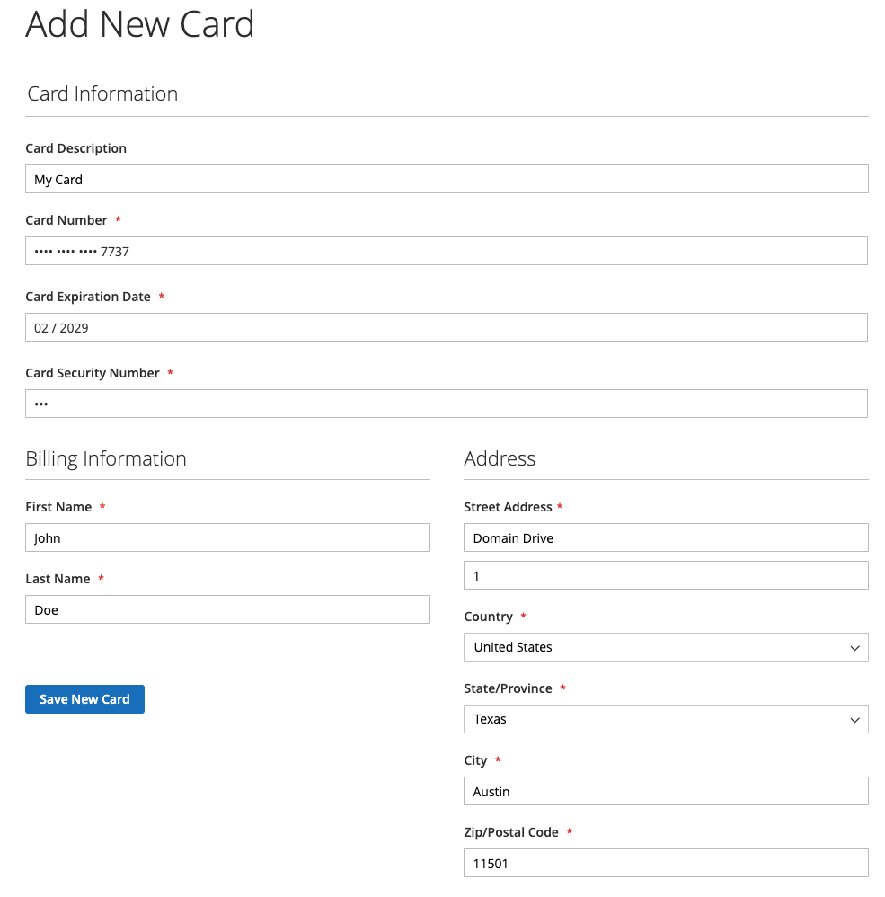
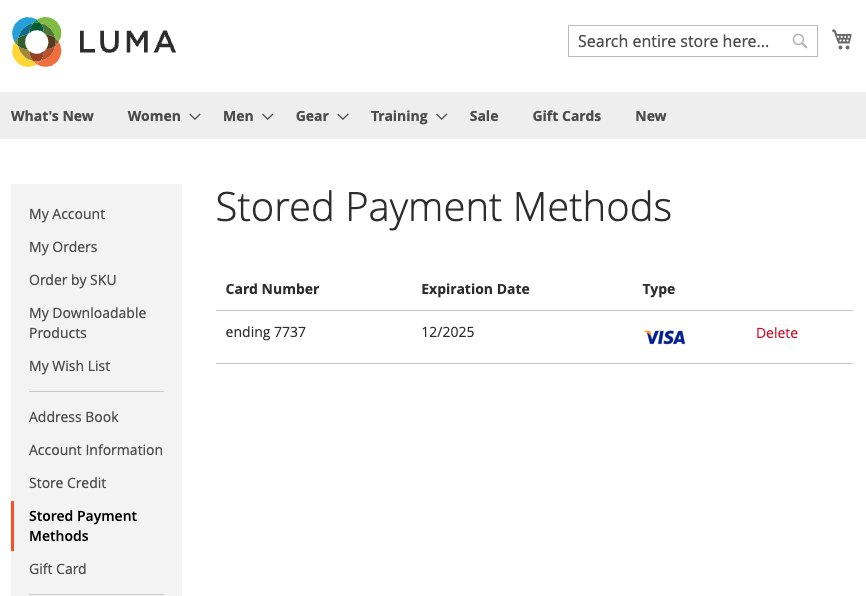
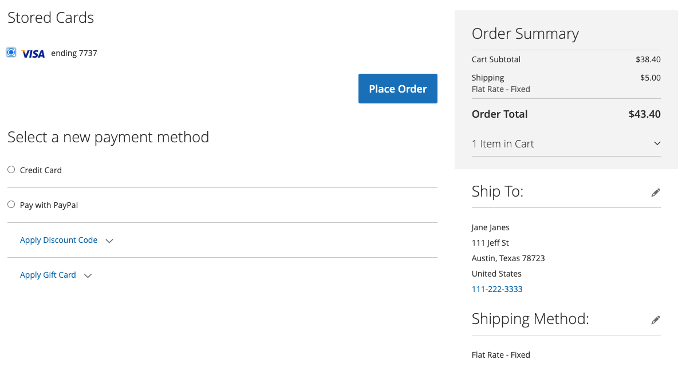
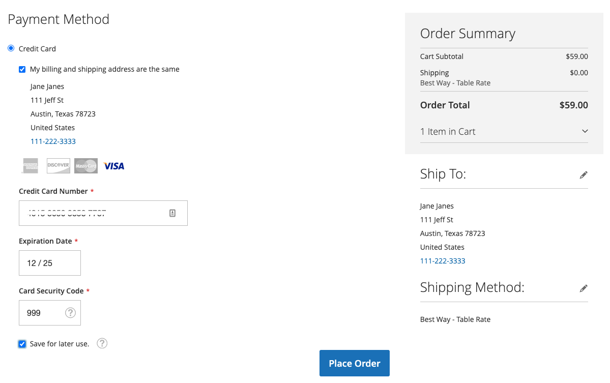
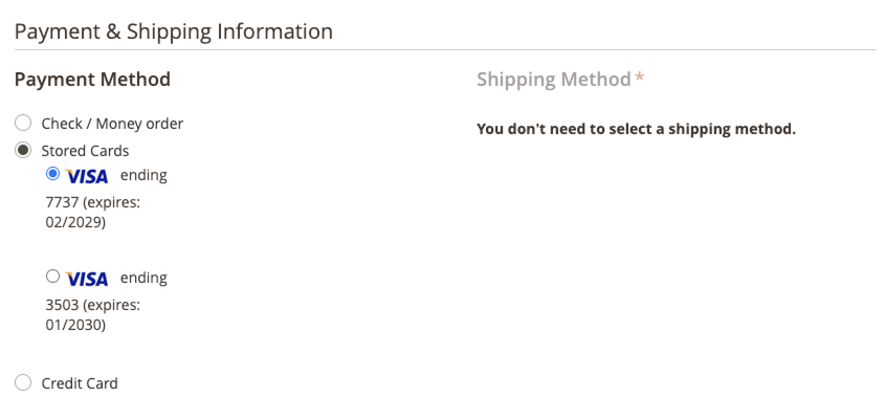

# クレジットカードのヴォールティング

クレジットカードのヴォールティングで、1回限りの買い物客をロイヤル顧客に変える。 ログインした顧客は、クレジットカードの資格情報を保存して、後で同じアカウントまたは別のアカウントで購入する際に、同じアカウント内に保存できます（または「保管」）。

## 保管を有効にする

加盟店は、[!DNL Payment Services] [設定](configure-admin.md#card-vaulting)で店舗のクレジットカードの保管を有効にできます。

1. _管理者_ サイドバーで、**[!UICONTROL Sales]** > **[!UICONTROL Payment Services]**&#x200B;に移動します。

1. **[!UICONTROL Settings]**&#x200B;をクリックします。

1. **[!UICONTROL Vault enabled]** セレクターを切り替えます。 詳しくは、[有効にする [!DNL Payment Services]](configure-admin.md#enable-payment-services)を参照してください。

## 購入せずに保管

ログインしたお客様は、次の方法で&#x200B;**マイアカウント** ダッシュボードに支払い方法を保管できます。

1. ストアフロントの&#x200B;**マイアカウント**&#x200B;にログインします。

1. 左側のナビゲーションの&#x200B;**[!UICONTROL Stored Payment Methods]**&#x200B;に移動して、保存されているすべての支払い方法を表示します。

   詳しくは、[&#x200B; ストアド支払い方法](https://experienceleague.adobe.com/ja/docs/commerce-admin/stores-sales/payments/stored-payment-methods)を参照してください。

1. お客様は&#x200B;**[!UICONTROL Add New Card]**&#x200B;をクリックして新しいカードを保存します。

   {width="400" zoomable="yes"}

   お客様は、支払い方法を保管するために、カードや請求情報など、必要なすべての詳細を提供する必要があります。
ヴォールトされたすべての支払い方法では、買い物客のPayPal アカウントにあるカードをヴォールトする際に、請求先住所セットを使用します。 Commerceに表示されている請求先住所とは異なる請求先住所が表示される場合があります。

1. **[!UICONTROL Save New Card]**&#x200B;をクリック

   {width="400" zoomable="yes"}

ストアドカードは、注文の際に使用できます。

{width="400" zoomable="yes"}

### 保存されている支払い方法の削除

お客様は、特定のカードの「**削除**」をクリックすると、**マイアカウント**&#x200B;の&#x200B;**ストアド支払い方法**&#x200B;から有料支払いカードを簡単に削除できます。

## チェックアウト時に支払い方法を検討する

ログインしたお客様は、チェックアウト時にクレジットカードを保管し、現在の店舗または同じ加盟店アカウント内の他の店舗で後で購入する際に使用できます。

{width="400" zoomable="yes"}

Commerceには、保存されたクレジットカード情報を取得することで、今後のチェックアウトを完了するのに役立つトークンが保存されています。 顧客アカウントやチェックアウト時にカードを保管すると、支払いトークンが異なります。

>[!WARNING]
>
> PayPalは現在、最大5枚のヴォールトカードを保存できます。

## 管理者でVaultingを使用する

顧客が以前にヴォールトしたクレジットカードを持っている場合、マーチャントはAdminでこれらのヴォールトした支払い方法のいずれかを使用して、その顧客の後続の注文を作成できます。

Adminでヴォールトカードを使用できるのは、お客様が既存のアカウントと、以前に完了した支払いからシステムに保存されている有効なトークンの両方を持っている場合のみです。

管理画面で、保管されているクレジットカードを使用して顧客の注文を作成するには：

1. [注文を作成して商品を追加](https://experienceleague.adobe.com/docs/commerce-admin/stores-sales/point-of-purchase/assist/customer-account-create-order.html?lang=ja)。
1. _[!UICONTROL Payment & Shipping Information]_&#x200B;で、支払い方法として&#x200B;**[!UICONTROL Stored Cards]**&#x200B;を選択します。
1. 希望するアーチ付きクレジットカードの支払い方法を選択します。
1. 注文に必要なその他の手順を完了した後、[それを送信](https://experienceleague.adobe.com/docs/commerce-admin/stores-sales/point-of-purchase/assist/customer-account-create-order.html?lang=ja#step-3%3A-submit-the-order)。

   {width="600" zoomable="yes"}

## セキュリティ

最小限のクレジットカード情報は買い物客と共有され、最後の4桁、有効期限、ヴォールトしたクレジットカードのブランドのみが表示されます。 クレジットカード情報は、決済代行会社と共に保存され、[PCI](security.md#pci-compliance)のコンプライアンス基準を満たします。
