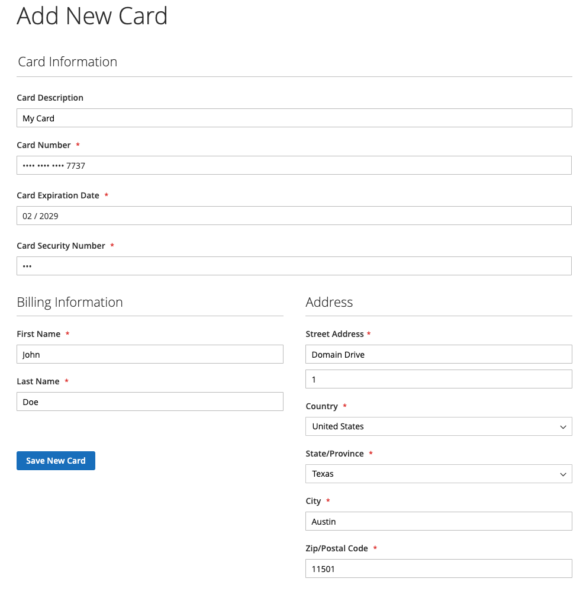
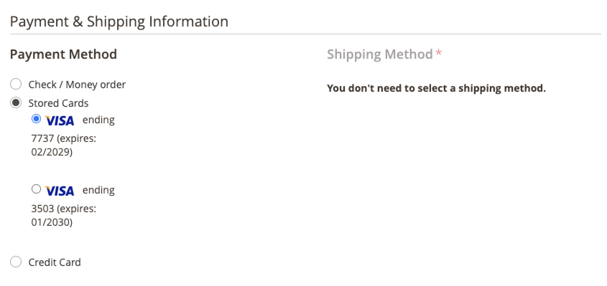

# クレジットカードの保管

クレジットカードヴォールティングを使用して、1 回限りの買い物客を常連客に変換します。 ログイン済みのお客様は、同じマーチャントアカウント内の同じ店舗または別の店舗で後で購入する際に使用するために、クレジットカード資格情報を保存（または「vault」）することができます。

## ボルトを有効にする

マーチャントは、[!DNL Payment Services] 設定 [ でストアのクレジットカードヴォールティングを有効にでき ](settings.md#card-vaulting) す。

1. _管理者_ サイドバーで、**[!UICONTROL Sales]**/**[!UICONTROL Payment Services]** に移動します。

1. 「**[!UICONTROL Settings]**」をクリックします。

1. **[!UICONTROL Vault enabled]** セレクターを切り替えます。 詳しくは、[ 有効にする  [!DNL Payment Services]](settings.md#enable-payment-services) を参照してください。

## 購入なしのヴォールティング

ログイン済みのお客様は、次の方法で **マイアカウント** ダッシュボードの支払い方法をヴォールティングできます。

1. ストアフロントで **マイアカウント** にログインします。

1. 左側のナビゲーションの **[!UICONTROL Stored Payment Methods]** に移動すると、保存されているすべての支払い方法が表示されます。

   詳しくは、[ 保管済支払方法 ](https://experienceleague.adobe.com/ja/docs/commerce-admin/stores-sales/payments/stored-payment-methods) を参照してください。

1. 顧客は、**[!UICONTROL Add New Card]** をクリックして新しいカードを保存します。

   {width="400" zoomable="yes"}

   お客様は、支払い方法をヴォールティングするために、カードや請求情報など、必要なすべての詳細を提供する必要があります。
ヴォールティングされたすべての支払い方法は、買い物客の PayPal アカウントでカードをヴォールティングする際に設定された請求先住所を使用します。 お客様には、Commerceに表示される請求先住所とは異なる請求先住所が表示される場合があります。

1. **[!UICONTROL Save New Card]** をクリック

   {width="400" zoomable="yes"}

保存されたカードは、注文する際に使用できます。

{width="400" zoomable="yes"}

### 保存されている支払方法の削除

お客様は、特定のカードに対して **削除** をクリックすることで、**マイアカウント** の **保存された支払い方法** から簡単にヴォールトされたクレジットカードを削除できます。

## チェックアウト時の支払方法のヴォールティング

ログイン済みのお客様は、チェックアウト時にクレジットカードをヴォールティングし、現在の店舗または同じマーチャントアカウント内の他の店舗での後の購入に使用できます。

{width="400" zoomable="yes"}

Commerceには、保存されたクレジットカード情報を取得して今後のチェックアウトを完了するのに役立つトークンが格納されています。 顧客アカウントから、またはチェックアウト中にカードをヴォールティングすると、異なる支払いトークンが発生します。

>[!WARNING]
>
> PayPal は現在、最大 5 枚のボルト付きカードを保存できます。

## 管理者でボルトを使用

お客様が以前にヴォールティングされたクレジットカードを持っている場合、マーチャントは、これらのヴォールティングされた支払い方法のいずれかを使用して、管理者でその顧客の後続の注文を作成できます。

管理者でボルト付きカードを使用できるのは、顧客が既存のアカウントと、以前に完了した支払いからシステムに保存された有効なトークンの両方を持っている場合のみです。

ボールトに保管されたクレジット・カードを使用して顧客の受注を管理で作成する手順は、次のとおりです。

1. [ 注文を作成して製品を追加する ](https://experienceleague.adobe.com/docs/commerce-admin/stores-sales/point-of-purchase/assist/customer-account-create-order.html?lang=ja)。
1. _[!UICONTROL Payment & Shipping Information]_&#x200B;で、支払方法として&#x200B;**[!UICONTROL Stored Cards]**&#x200B;を選択します。
1. 目的のボルト付きクレジットカードの支払方法を選択します。
1. 注文に必要なその他の手順を完了したら、[ 送信 ](https://experienceleague.adobe.com/docs/commerce-admin/stores-sales/point-of-purchase/assist/customer-account-create-order.html?lang=ja#step-3%3A-submit-the-order) します。

   {width="600" zoomable="yes"}

## セキュリティ

最小限のクレジットカード情報は、買い物客と共有され、保管されたクレジットカードの最後の 4 桁、有効期限、ブランドのみが表示されます。 クレジットカード情報は、[PCI](security.md#PCI-compliance) コンプライアンス基準を満たすために支払いプロバイダーに保存されます。
