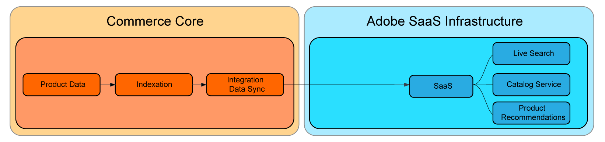

# SaaS 価格インデックス作成

SaaS の価格インデックス作成は、インデックス作成や価格計算などのリソースを大量に消費するタスクを、Commerce アプリケーションからAdobe Cloud Infrastructure にオフロードすることで、サイトのパフォーマンスを最適化します。 このアプローチにより、マーチャントはリソースを迅速に拡張して価格のインデックス化に要する時間を短縮し、ストアフロントおよび接続されたCommerce サービスに対して価格の更新をより迅速に提供できるようになります。

次の図は、Commerce アプリケーションに含まれている [&#x200B; 価格インデックス作成 &#x200B;](https://experienceleague.adobe.com/ja/docs/commerce-operations/configuration-guide/cli/manage-indexers) プロセスをCommerceが使用している場合の SaaS サービスへのインデックス作成データフローを示しています。



SaaS 価格インデックスを有効にすると、データフローが変更されます。 価格のインデックス作成は、[Commerce SaaS データのエクスポート &#x200B;](../data-export/data-synchronization.md) を使用して実行されます。


すべてのマーチャントは、SaaS 価格インデックスを使用することでメリットを得ることができますが、次のような特徴を持つプロジェクトを持つマーチャントは、最大のメリットを得ることができます。

* **一定の価格変更** 頻繁なプロモーション、季節的な割引、在庫販売などの戦略目標を達成するために、価格の繰り返しの変更を必要とする商人。
* **複数の web サイトや顧客グループ** 複数の web サイト（ドメイン/ブランド）や顧客グループで製品カタログを共有しているマーチャント。
* **Web サイトまたは顧客グループをまたいだ一意の価格が多い**-Web サイトまたは顧客グループをまたいだ一意の価格を含む広範な共有製品カタログを持つマーチャント。 例えば、事前に交渉された価格を持つ B2B マーチャントや、異なる価格戦略を持つブランドが含まれます。

## SaaS 価格インデックス作成の使用

SaaS 価格インデックス作成は、Adobe Commerce サービスのインストール時に自動的に有効になります。 すべてのビルトイン Adobe Commerce商品タイプの価格計算をサポートしています。

### 要件

* Adobe Commerce 2.4.4 以降

### 前提条件

* 次のいずれかのCommerce サービスを、最新バージョンのCommerce拡張機能と共にインストールする必要があります。

   * [カタログサービス](../catalog-service/overview.md)
   * [Live Search](../live-search/overview.md)
   * [製品レコメンデーション](../product-recommendations/guide-overview.md)


>[!NOTE]
>
>必要に応じて、Commerce アプリケーションのデフォルトの価格インデクサーを [&#x200B; カタログアダプター &#x200B;](catalog-adapter.md) を使用して無効にできます。

## 価格と SaaS 価格インデックスの同期

Adobe Commerceの SaaS 価格インデックス作成を有効にした後、新しいフィードを同期することで、ストアフロントとCommerce サービスの価格を更新します。

```bash
bin/magento saas:resync --feed=scopesCustomerGroup
bin/magento saas:resync --feed=scopesWebsite
bin/magento saas:resync --feed=prices
```

### カスタム製品タイプの価格

価格計算は、基本価格、特別価格、グループ価格、カタログルール価格などのカスタム製品タイプに対してサポートされています。

特定の数式を使用して最終価格を計算するカスタム製品タイプがある場合、製品価格フィードの動作を拡張できます。

1. `Magento\ProductPriceDataExporter\Model\Provider\ProductPrice` クラスにプラグインを作成します。

   ```xml
   <config xmlns:xsi="http://www.w3.org/2001/XMLSchema-instance"
           xsi:noNamespaceSchemaLocation="urn:magento:framework:ObjectManager/etc/config.xsd">
       <type name="Magento\ProductPriceDataExporter\Model\Provider\ProductPrice">
           <plugin name="custom_type_price_feed" type="YourModule\CustomProductType\Plugin\UpdatePriceFromFeed" />
       </type>
   </config>
   ```

1. カスタム式を使用してメソッドを作成します。

   ```php
   class UpdatePriceFromFeed
   {
       /**
       * @param ProductPrice $subject
       * @param array $result
       * @param array $values
       *
       * @return array
       */
       public function afterGet(ProductPrice $subject, array $result, array $values) : array
       {
           // Override the output $result with your data for the corresponding products (see original method for details) 
           return $result;
       }
   }
   ```

