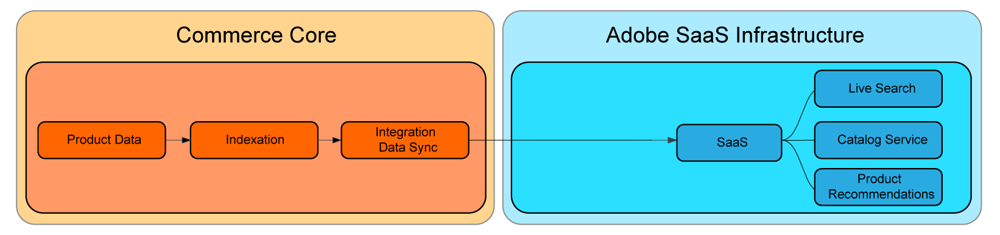

# SaaS価格インデックス

SaaS価格インデックス機能は、インデックス作成や価格計算など、リソースを必要とする作業をCommerceアプリケーションからAdobe Cloud インフラストラクチャにオフロードすることで、サイトパフォーマンスを最適化します。 このアプローチにより、マーチャントはリソースを迅速に拡張して価格インデックス時間を短縮し、ストアフロントと接続されたCommerceサービスの価格アップデートをより迅速に提供できるようになります。

次の図は、CommerceがCommerce アプリケーションに含まれる[価格インデックス &#x200B;](https://experienceleague.adobe.com/en/docs/commerce-operations/configuration-guide/cli/manage-indexers) プロセスを使用している場合のSaaS サービスへのデータフローを示しています。



SaaS価格インデックスを有効にすると、データフローが変更されます。 価格インデックス作成は、[Commerce SaaS データ書き出し](../data-export/sync-overview.md)を使用して実行されます。


SaaS価格インデックスを利用すれば、あらゆる販売者がメリットを得られます。次の特徴を持つプロジェクトを運営する販売者は、最大のメリットを享受できます。

* **一定の価格変更** – 頻繁なプロモーション、季節割引、在庫値下げなどの戦略目標を達成するために、繰り返し価格の変更を必要とする販売者。
* **複数のweb サイトや顧客グループ**&#x200B;のマーチャントが、複数のweb サイト（ドメインやブランド）や顧客グループ間で商品カタログを共有しています。
* **Web サイトまたは顧客グループ全体で多くの一意の価格**&#x200B;販売者が、Web サイトまたは顧客グループ全体で一意の価格を含む広範な共有製品カタログを使用しています。 たとえば、価格交渉をおこなうB2B企業や、価格戦略が異なる企業などがあります。

## SaaS価格インデックスの利用

Adobe Commerce サービスをインストールすると、SaaS価格インデックスが自動的に有効になります。 すべての組み込みAdobe Commerce製品タイプの価格計算をサポートしています。

### 要件定義

* Adobe Commerce 2.4.4以降

### 前提条件

* 次のいずれかのCommerce サービスを、最新バージョンのCommerce拡張機能と共にインストールする必要があります。

   * [カタログサービス](../catalog-service/overview.md)
   * [ライブサーチ](../live-search/overview.md)
   * [商品レコメンデーション](../product-recommendations/guide-overview.md)


>[!NOTE]
>
>必要に応じて、[&#x200B; カタログ アダプタ &#x200B;](catalog-adapter.md)を使用して、Commerce アプリケーションのデフォルトの価格インデクサーを無効にすることができます。

## SaaS価格インデックスによる価格の同期

Adobe CommerceのSaaS価格インデックスを有効にした後、新しいフィードを同期して、ストアフロントおよびCommerce サービスで価格を更新します。

```bash
bin/magento saas:resync --feed=scopesCustomerGroup
bin/magento saas:resync --feed=scopesWebsite
bin/magento saas:resync --feed=prices
```

## 同期の進行状況を監視

{{$include /help/_includes/data-export/verify-commerce-service-data-sync.md}}

必要に応じて手動でフィードを再同期するには、[Commerce CLI](../data-export/data-export-cli-commands.md)を使用します。 再同期オプションとその他のトラブルシューティング手順については、_SaaS データ書き出しガイド_&#x200B;の[同期の管理](../data-export/data-sync-manage.md)を参照してください。

>[!NOTE]
>
>Data Feed Sync Status ページがCommerce Admin for Commerce on Cloudまたはオンプレミスのデプロイメントで使用できない場合は、[拡張機能のインストール手順](https://experienceleague.adobe.com/en/docs/commerce-admin/systems/data-transfer/data-sync/data-feed-sync-status#install-the-extension)に従って有効にします。

## カスタム商品タイプの価格

価格計算は、基本価格、特別価格、グループ価格、カタログルール価格などのカスタム製品タイプでサポートされています。

特定の数式を使用して最終価格を計算するカスタム製品タイプがある場合は、製品価格フィードの動作を拡張できます。

1. `Magento\ProductPriceDataExporter\Model\Provider\ProductPrice` クラスにプラグインを作成します。

   ```xml
   <config xmlns:xsi="http://www.w3.org/2001/XMLSchema-instance"
           xsi:noNamespaceSchemaLocation="urn:magento:framework:ObjectManager/etc/config.xsd">
       <type name="Magento\ProductPriceDataExporter\Model\Provider\ProductPrice">
           <plugin name="custom_type_price_feed" type="YourModule\CustomProductType\Plugin\UpdatePriceFromFeed" />
       </type>
   </config>
   ```

1. カスタム式を使用してメソッドを作成します。

   ```php
   class UpdatePriceFromFeed
   {
       /**
       * @param ProductPrice $subject
       * @param array $result
       * @param array $values
       *
       * @return array
       */
       public function afterGet(ProductPrice $subject, array $result, array $values) : array
       {
           // Override the output $result with your data for the corresponding products (see original method for details)
           return $result;
       }
   }
   ```
