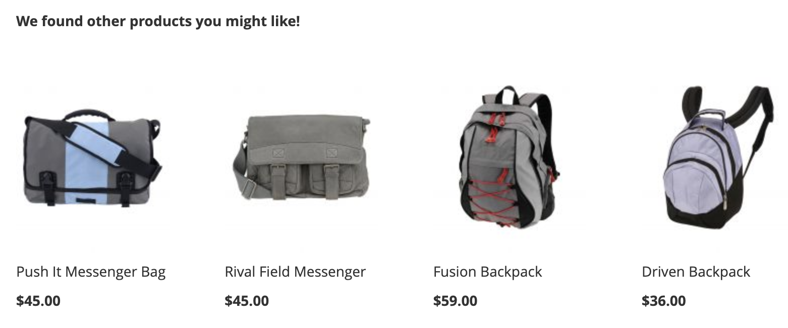
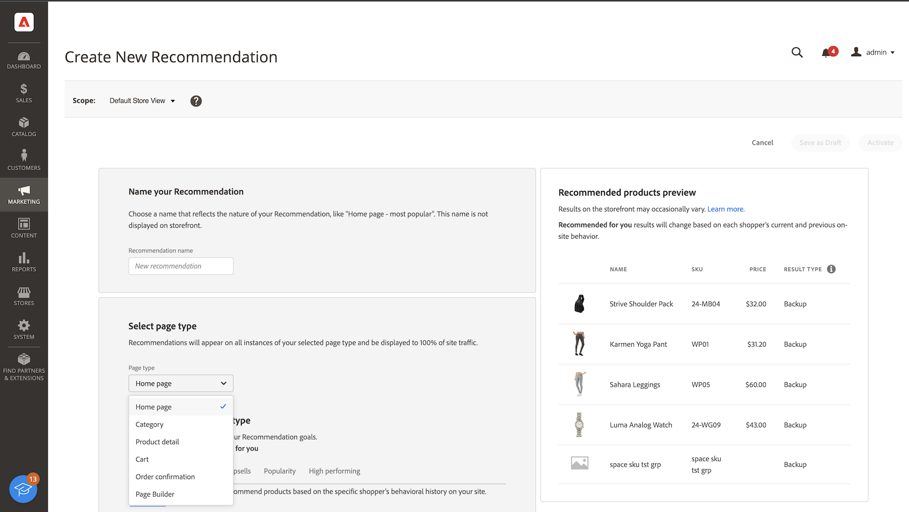
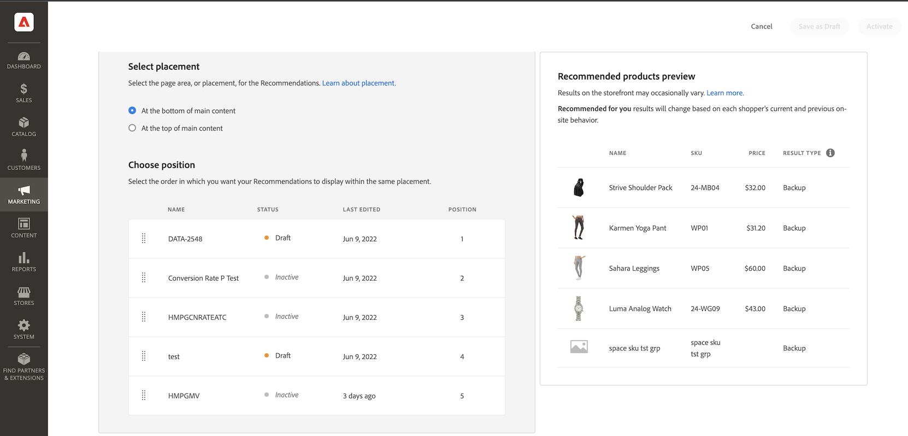
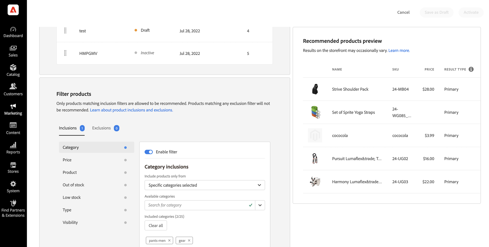
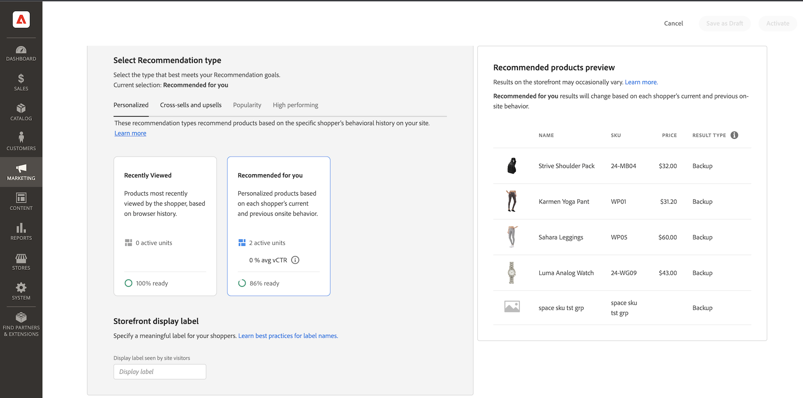

# 新しいレコメンデーションを作成

レコメンデーションを作成する場合、推奨製品&#x200B;_品目_&#x200B;を含む&#x200B;_レコメンデーションユニット_、またはウィジェットを作成します。

_レコメンデーションユニット_

レコメンデーションユニットをアクティブ化すると、Adobe Commerceはインプレッション数、閲覧数、クリック数などを測定するために[&#x200B; データの収集](workspace.md)を開始します。 [!DNL Product Recommendations] テーブルには、ビジネス上の意思決定に役立つ各レコメンデーション単位の指標が表示されます。

>[!NOTE]
>
>製品レコメンデーション指標は、Luma ストアフロント用に最適化されています。 ストアフロントがLuma ベース以外の場合、指標がデータを追跡する方法は、[&#x200B; イベントコレクションの実装方法](events.md)によって異なります。

1. _管理者_ サイドバーで、**マーケティング** > _プロモーション_ > **製品レコメンデーション**&#x200B;に移動して、_製品レコメンデーション_ ワークスペースを表示します。

1. レコメンデーションを表示する[&#x200B; ストアビュー](https://experienceleague.adobe.com/ja/docs/commerce-admin/start/setup/websites-stores-views)を指定します。

   >[!NOTE]
   >
   > ページビルダーのレコメンデーションユニットは、デフォルトのストアビューで作成する必要がありますが、任意の場所で使用できます。 ページビルダーを使用した商品レコメンデーションの作成について詳しくは、[&#x200B; コンテンツの追加 – 商品レコメンデーション &#x200B;](https://experienceleague.adobe.com/ja/docs/commerce-admin/page-builder/add-content/recommendations)を参照してください。

1. 「**レコメンデーションを作成**」をクリックします。

1. 「_推奨事項に名前を付ける_」セクションに、`Home page most popular`など、内部参照用にわかりやすい名前を入力します。

1. 「_ページの種類を選択_」セクションで、次のオプションからレコメンデーションを表示するページを選択します。

   >[!NOTE]
   >
   > ストアが[製品をカートに追加した直後にショッピングカートページを表示するように設定されている場合、製品レコメンデーションはカートページでサポートされません](https://experienceleague.adobe.com/ja/docs/commerce-admin/stores-sales/point-of-purchase/cart/cart-configuration)。

   * ホームページ
   * カテゴリ
   * 商品詳細
   * 買い物かご
   * 確認
   * [ページビルダー](https://experienceleague.adobe.com/ja/docs/commerce-admin/page-builder/add-content/recommendations)

   ページの種類ごとに最大50個のアクティブなレコメンデーションユニットを作成できます。 制限に達すると、ページタイプがグレー表示されます。

   
   _推奨事項の名前とページの配置_

1. 「_レコメンデーションタイプを選択_」セクションで、選択したページに表示するレコメンデーションの[&#x200B; タイプ &#x200B;](type.md)を指定します。 一部のページでは、レコメンデーションの[配置](placement.md)が特定の種類に制限されています。

1. _ストアフロントの表示ラベル_ セクションに、「トップセラー」など、買い物客に表示される[&#x200B; ラベル &#x200B;](placement.md#recommendation-labels)を入力します。

1. _製品数を選択_ セクションで、レコメンデーションユニットに表示する製品数をスライダーで指定します。

   デフォルトは`5`で、最大`20`です。

1. 「_プレースメントを選択_」セクションで、レコメンデーションユニットがページに表示される場所を指定します。

   * メインコンテンツの下部に
   * メインコンテンツの上部

1. （オプション）レコメンデーションの順序を変更するには、_位置を選択_ テーブルの行を選択して移動します。

   「_位置を選択_」セクションには、選択したページタイプに対して作成されたすべてのレコメンデーション（存在する場合）が表示されます。

   
   _ページの推奨指示_

1. （オプション）「_フィルター_」セクションで、[&#x200B; フィルターを適用](filters.md)して、レコメンデーションユニットに表示される製品を制御します。

   
   _おすすめ商品フィルター_

1. 完了したら、次のいずれかをクリックします。

   * **ドラフトとして保存**&#x200B;して、後でレコメンデーションユニットを編集します。 ドラフト状態のレコメンデーションユニットのページタイプまたはレコメンデーションタイプは変更できません。

   * **有効化**&#x200B;して、ストアフロントでレコメンデーションユニットを有効にします。

>[!IMPORTANT]
>
>一部のブラウザーでは、製品レコメンデーションが期待どおりに動作しない重要なスクリプトがブロックされる場合があります。

## 準備状況インジケーター

準備状況の指標は、利用可能なカタログと行動データにもとづいて、どのレコメンデーションタイプが最も優れたパフォーマンスを発揮するかを示します。 また、準備状況インジケーターを使用して、[&#x200B; イベント &#x200B;](events.md)に関する問題があるかどうか、またはレコメンデーションタイプを入力するのに十分なトラフィックがないかどうかを判断することもできます。

準備状況インジケーターは、[静的ベース &#x200B;](#static-based)または[動的ベース &#x200B;](#dynamic-based)のいずれかに分類されます。 静的ベースはカタログデータのみを使用し、動的ベースは買い物客の行動データを使用します。 その行動データを使用して、[機械学習モデルをトレーニング &#x200B;](events.md)し、パーソナライズされたレコメンデーションを作成し、その準備状況スコアを計算します。

### 準備状況インジケーターの計算方法

準備状況インジケーターは、モデルがどの程度トレーニングされているかを示します。 指標は、収集されたイベントの種類、インタラクションした製品の幅広さ、カタログのサイズに依存します。

準備状況インジケーターの割合は、レコメンデーションタイプに応じて推奨される製品数を示す計算から得られます。 統計は、カタログの全体的なサイズ、インタラクションの量（ビュー、クリック、カートへの追加など）、特定の時間枠内にそれらのイベントを登録するSKUの割合に基づいて製品に適用されます。 例えば、ホリデーシーズンのピーク時のトラフィックでは、準備状況インジケーターの値が通常のボリューム時よりも高くなる場合があります。

これらの変数の結果として、準備状況インジケーターのパーセントが変動する可能性があります。 これは、レコメンデーションタイプが「デプロイの準備が整った」状態で表示される理由を説明します。

準備状況の指標は、次のような要素にもとづいて計算されます。

* 十分な結果セットのサイズ：[&#x200B; バックアップの推奨事項](events.md#backuprecs)の使用を避けるために、ほとんどのシナリオで十分な結果が返されますか？

* 十分な結果セットの種類：返品される商品は、カタログの様々な商品を表していますか？ この要素の目標は、サイト全体で推奨される商品が少数であることを避けることです。

上記の要因に基づいて、準備状況の値が計算され、次のように表示されます。

* 75%以上とは、そのレコメンデーションタイプに提案されたレコメンデーションが非常に関連性が高いことを意味します。
* 50%以上の場合、そのレコメンデーションタイプで提案されたレコメンデーションは、関連性が低くなります。
* 50%未満とは、そのレコメンデーションタイプで提案されたレコメンデーションが関連性がない可能性があることを意味します。 この場合、[&#x200B; バックアップの推奨事項](events.md#backuprecs)が使用されます。

準備状況インジケーターが低い理由[の詳細を説明します](#what-to-do-if-the-readiness-indicator-percent-is-low)。

### 静的ベース

次のレコメンデーションタイプは、カタログデータのみを必要とするため、静的ベースです。 行動データは使用されません。

* _その他_
* _視覚的な類似性_

### ダイナミックベース

次のレコメンデーションタイプは、ストアフロントの行動データを使用するため、動的ベースです。

過去6 ヶ月間のストアフロント行動データ：

* _閲覧、閲覧_
* _閲覧、購入_
* _これを購入し、それを購入しました_
* _あなたにおすすめ_

過去7日間のストアフロント行動データ：

* _閲覧数_
* _購入回数_
* _最もカートに追加された商品_
* _トレンド_
* _購入のコンバージョンを表示_
* _カートへのコンバージョンを表示_

最新の買い物客の行動データ（ビューのみ）:

* _最近表示した_

### 進捗の可視化

各レコメンデーションタイプのトレーニングの進捗状況を視覚化するために、_レコメンデーションタイプを選択_ セクションには、各タイプの準備状況の指標が表示されます。

_レコメンデーションタイプ_

>[!NOTE]
>
>指標は100%に達することはありません。

加盟店のカタログは頻繁に変更されないため、カタログデータに依存するレコメンデーションタイプの準備状況インジケーターの割合はあまり変化しません。 しかし、買い物客の行動データにもとづくレコメンデーションタイプの準備状況インジケーターの割合は、買い物客の日々のアクティビティによって異なる場合があります。

#### 準備状況インジケーターのパーセントが低い場合の対処方法

準備率が低い場合は、このレコメンデーションタイプのレコメンデーションに含める資格のあるカタログの商品が多くないことを示します。 つまり、このレコメンデーションタイプをデプロイすると、[&#x200B; バックアップのレコメンデーション &#x200B;](events.md#backup-recommendations)が返される可能性が高くなります。

>[!IMPORTANT]
>
>_バンドル_、_グループ化_、カスタム製品タイプはサポートされていません。 カタログにこれらの製品タイプが多数含まれている場合、低い準備状況スコアが期待できます。 さらに、スペースを含むSKUは、レコメンデーションの関連性を低下させる可能性があるため、使用を避ける必要があります。

一般的な低い準備状況スコアに対して考えられる理由と解決策を次に示します。

* **静的ベース** – これらの指標の低い割合は、表示可能な製品のカタログデータが見つからないことが原因で発生する可能性があります。 想定よりも低い場合は、完全同期によってこの問題を修正できます。
* **動的ベース** – 動的ベースの指標に対する低い割合は、次の原因で発生する可能性があります。

   * それぞれのレコメンデーションタイプ（requestId、製品コンテキストなど）の必須[&#x200B; ストアフロントイベント &#x200B;](https://developer.adobe.com/commerce/services/shared-services/storefront-events/#product-recommendations)にフィールドがありません。
   * 店舗でのトラフィックが少ないため、受け取る行動イベントの量は少なくて済みます。
   * ストア内のさまざまな商品をまたいで、ストアフロントの行動イベントの種類が少ない。 例えば、製品の10%しか頻繁に閲覧または購入されない場合、それぞれの準備状況インジケーターは低くなります。

## プレビューのレコメンデーション {#preview}

_おすすめ商品プレビュー_ パネルは、ストアフロントにデプロイされたときにレコメンデーションユニットに表示される商品のサンプル選択とともに常に使用できます。

実稼動以外の環境で作業する際にレコメンデーションをテストするには、[別のソース &#x200B;](settings.md)からレコメンデーションデータを取得できます。 これにより、マーチャントは本番環境にデプロイする前に、ルールを試し、レコメンデーションをプレビューすることができます。

| フィールド | 説明 |
|---|---|
| 名前 | 製品の名前。 |
| SKU | 製品に割り当てられた在庫保管単位 |
| 価格 | 製品の価格。 |
| 結果タイプ | プライマリ- レコメンデーションを表示するのに十分なトレーニングデータが収集されていることを示します。  バックアップ – 収集されたトレーニング データが不足しているため、スロットを埋めるためにバックアップの推奨事項が使用されていることを示します。 マシンラーニングモデルとバックアップの推奨事項について詳しくは、[行動データ &#x200B;](events.md)にアクセスしてください。 |

レコメンデーションユニットを作成する際は、ページタイプ、レコメンデーションタイプ、フィルターを試し、含まれる製品に関するリアルタイムのフィードバックをすぐに得ることができます。 どの製品が表示されるかを把握し始めたら、ビジネスニーズに合わせてレコメンデーションユニットを設定できます。

1つのページに複数のレコメンデーションユニットがデプロイされている場合に、重複する商品を表示しないように、Adobe Commerce [&#x200B; フィルター](filters.md)のレコメンデーションを行います。 その結果、プレビューパネルに表示される製品とストアフロントに表示される製品が異なる場合があります。

>[!NOTE]
>
> 管理者でデータを使用できないため、`Recently viewed`のレコメンデーションタイプをプレビューできません。
