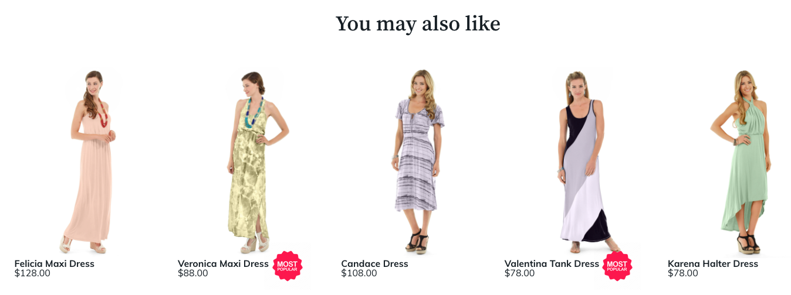

# カスタマイズ

商品レコメンデーションモジュールをインストールすると、Adobe Commerceは`ProductRecommendationsLayout` ディレクトリを作成します。 このディレクトリには、ストアフロントでのレコメンデーションの表示方法を変更するためにカスタマイズできるテンプレートファイルが含まれています。 具体的には、次のテンプレートを変更または上書きできます。

`<your theme>/Magento_ProductRecommendationsLayout/web/template/recommendations.html`

テンプレートファイルの変更について詳しくは、『フロントエンド開発者ガイド』の「[ テンプレートのカスタマイズ ](https://developer.adobe.com/commerce/frontend-core/guide/templates/walkthrough/)」を参照してください。

`recommendations.html` ファイルを変更する場合は、Adobe Commerceがストアフロントからレコメンデーション指標を収集できるように、ファイルに次のタグを保持する必要があります。

| タグ | 用途 |
|---|---|
| `<div data-bind="attr : {'data-unit-id' : unitId }"...</div>` | ビューイベントを収集します。 |
| `<a data-bind="attr : {'data-sku' : sku, 'data-unit-id'}"...</a>` | クリックイベントを収集します。 <br/>**メモ：** アンカータグを追加する場合は、これらの属性を含める必要があります。 |

`recommendations.html` ファイルに加えて、`ProductRecommendationsLayout` ディレクトリには次のサブディレクトリが含まれています。

| ディレクトリ | 目的 |
|---|---|
| `layout` | ページの種類ごとに`*.xml` ファイルが含まれます |
| `templates` | fetch スクリプトとレンダリングスクリプトを呼び出すファイルが含まれます |
| `web/js` | ストアのレコメンデーションを取得およびレンダリングするJavaScript ファイルが含まれます |
| `web/template` | `magento/product-recommendations` モジュールのテンプレートが含まれています |

## 推奨ユニットの配置

レコメンデーションを[作成](create.md)する場合は、ページ上に表示される[場所](placement.md)を指定します。 レコメンデーションユニットは、メインコンテンツコンテナの上部または下部に配置できます。 ただし、この配置はカスタマイズできます。 ページビルダーのレコメンデーションコンテンツタイプを作成する場合は、ページビルダーツールを使用して、レコメンデーションユニットをページ上に配置します。 その他のすべてのページタイプについて、レコメンデーションの作成時に生成される`*.xml` ファイルを編集します。

1. `layout` ディレクトリに変更します。

   ```bash
   cd `<your theme>/Magento_ProductRecommendationsLayout/layout`
   ```

   次の表に、このディレクトリに存在するXML ファイルを示します。

   | ファイル名 | ページ |
   |---|---|
   | `catalog_category_view.xml` | カテゴリ |
   | `catalog_product_view.xml` | 商品詳細 |
   | `checkout_cart_index.xml` | 買い物かご |
   | `checkout_onepage_success.xml` | チェックアウト |
   | `cms_index_index.xml` | ホーム |

   >[!NOTE]
   >
   >ストアでサードパーティの拡張機能を使用している場合、`layout` ディレクトリ内のファイル名が異なる可能性があります。

1. 製品詳細ページの製品画像の後にレコメンデーションユニットが表示されるように、`catalog_product_view.xml` ファイルを変更します。 このXML ファイルをカスタマイズする前に、ファイルを確認し、変更する必要があるセクションを理解します。

   ```xml
   <?xml version="1.0"?>
   <page xmlns:xsi="http://www.w3.org/2001/XMLSchema-instance" xsi:noNamespaceSchemaLocation="urn:magento:framework:View/Layout/etc/page_configuration.xsd">
       <referenceBlock name="page.wrapper">
           <block class="Magento\Framework\View\Element\Template" before="-" name="product_recommendations_fetcher" template="Magento_ProductRecommendationsStorefront::fetcher.phtml" />
       </referenceBlock>
       <body>
           <referenceBlock name="main.content">
               <block class="Magento\ProductRecommendationsStorefront\Block\Renderer" after="-" name="product_recommendations_product_below_content" template="Magento_ProductRecommendationsStorefront::renderer.phtml">
                   <arguments>
                       <argument name="pagePlacement" xsi:type="string">below-main-content</argument>
                   </arguments>
               </block>
           </referenceBlock>
       </body>
   </page>
   ```

   上記のスニペットでは、`main.content`参照ブロックは、レコメンデーションユニットがその要素に関連する任意の場所に配置されることを示します。 その`block`要素には`after="-"`属性が含まれており、これは、メインコンテンツブロックの後にレコメンデーションユニットがページに表示されることを指定します。

1. 別のコンテンツブロックを指定してこのファイルを修正してみましょう。

   参照ブロック `name`を`main.content`から`product.info.media`に変更します。

   ```xml
   <?xml version="1.0"?>
   <page xmlns:xsi="http://www.w3.org/2001/XMLSchema-instance" xsi:noNamespaceSchemaLocation="urn:magento:framework:View/Layout/etc/page_configuration.xsd">
       <referenceBlock name="page.wrapper">
           <block class="Magento\Framework\View\Element\Template" before="-" name="product_recommendations_fetcher" template="Magento_ProductRecommendationsStorefront::fetcher.phtml" />
       </referenceBlock>
       <body>
           <referenceBlock name="product.info.media">
               <block class="Magento\ProductRecommendationsStorefront\Block\Renderer" after="-" name="product_recommendations_product_below_content" template="Magento_ProductRecommendationsStorefront::renderer.phtml">
                   <arguments>
                       <argument name="pagePlacement" xsi:type="string">below-main-content</argument>
                   </arguments>
               </block>
           </referenceBlock>
       </body>
   </page>
   ```

   この変更により、商品の詳細ページで商品の画像の後にレコメンデーションユニットが表示されます。 レコメンデーションユニットを`product.info.media`の前に表示する場合は、`after="-"`属性を`before="-"`に変更します。 `pagePlacement`引数は、変更できない内部引数です。

ページ上のブロックの種類について詳しくは、[ レイアウトの概要](https://developer.adobe.com/commerce/frontend-core/guide/layouts/)を参照してください。

## カスタム製品属性

開発者は、ストアフロントのレコメンデーション単位でカスタム製品属性値にアクセスし、これらの属性にもとづいて製品に視覚的な処理を追加する必要があります。

例えば、ストアでオーガニック商品を販売している場合、これらの商品に`Organic = Yes`として指定するカスタム属性がある可能性があります。 ストアフロントでこの属性値にアクセスし、「Recommendations」に表示されたときにこれらの製品に特別な視覚的処理を行えるようにすることができます。 同様に、これらのカスタム製品属性値にアクセスすると、サイトのプレゼンテーション層で製品をバッジしたり、カスタムロジックを駆動したりできます。



レコメンデーションユニットをページ上でレンダリングするときにカスタム製品属性を使用できるようにするには、管理者の[製品属性](https://experienceleague.adobe.com/docs/commerce-admin/catalog/product-attributes/create/attribute-product-create.html) ページで`Used in Product Listing` プロパティを`Yes`に設定します。

このプロパティが設定されている場合、JSON ペイロードには、属性コードと値の配列を含む`attributes` オブジェクトが含まれます。 その後、前述のように特別な視覚的処理やバッジを追加するなど、これらの属性値に基づいてカスタムストアフロントのスタイルを適用できます。

>[!NOTE]
>
>製品属性の変更は、JSON ペイロードに表示されるまでに最大1時間かかる場合があります。
