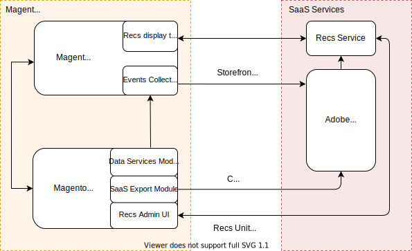

# Product Recommendations 管理者向け開発

製品レコメンデーションは、コンバージョンを増やし、売上高を増やし、買い物客のエンゲージメントを促進するために使用できる強力なマーケティングツールです。 お勧めの商品は「この商品を見た人も見た」「この商品を買った人も買った」「あなたにおすすめ」など、商品ごとに店頭に表示されます。 Adobe Commerce Product Recommendations は、人工知能と機械学習アルゴリズムを使用して集計した買い物客データのディープ分析を実行する [&#128279;](https://www.adobe.com/sensei.html)0&rbrace;Adobe Sensei&rbrace; を活用しています。 このデータをCommerce カタログと組み合わせると、買い物客にとって非常に魅力的で関連性が高く、パーソナライズされたエクスペリエンスが得られます。

>[!NOTE]
>
>ストアフロントがPWA Studioを使用して実装されている場合は、[PWA ドキュメント &#x200B;](https://developer.adobe.com/commerce/pwa-studio/integrations/product-recommendations/) を参照してください。 React や Vue JS などのカスタムフロントエンドテクノロジーを使用している場合は、ユーザーガイドを参照して、製品 Recommendations を [&#x200B; ヘッドレス &#x200B;](headless.md) 環境に統合する方法を確認してください。 ヘッドレスインスタンスでは、製品レコメンデーションワークスペースを強化するためにイベンティングを実装する必要があります。

## アーキテクチャの概要

大まかに言えば、Commerce Product Recommendations は SaaS としてデプロイされます。 Commerce側には、イベントコレクターおよび Recommendations レイアウトテンプレートを含むストアフロント、およびデータサービス、SaaS エクスポートモジュール、管理 UI を含むバックエンドが含まれます。 Adobe Senseiのインテリジェンスサービスは、SaaS 側で利用されます。

レコメンデーションモジュールがインストールされて設定されると、ストアフロントで行動データの収集が開始されます。 Adobe Senseiは、カタログデータと共にこの行動データを処理し、recommendations サービスで活用される商品の関連付けを計算します。 この時点で、マーチャントは、管理 UI から直接製品レコメンデーションユニットを作成、管理およびストアフロントにデプロイできます。

## 次の手順

製品レコメンデーションの基本を学ぶには、次のトピックを参照してください。

- [Product Recommendations の実装方法](implementation-workflow.md)

- [Product Recommendations のインストールと設定](install-configure.md)

- [製品レコメンデーションの作成](create.md)
