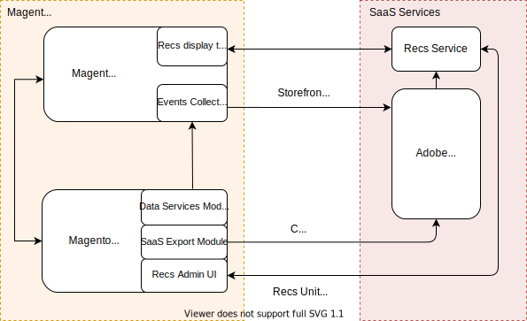

# 製品レコメンデーション管理者開発

商品レコメンデーションは、コンバージョンと売上を向上させ、買い物客のエンゲージメントを促進するための優れたマーケティングツールです。 商品レコメンデーションは、「この商品を見たお客様も見た」、「この商品を購入されたお客様も購入した」、「あなたにおすすめ」などの単位で店頭に表示されます。 Adobe Commerceの商品レコメンデーションは、[Adobe AI](https://business.adobe.com/ai.html)によって実現されます。この機能では、AI （人工知能）とマシンラーニング（機械学習）のアルゴリズムを使用して、集約された買い物客データを詳細に分析します。 このデータをCommerceカタログと組み合わせることで、買い物客にとって魅力的で関連性の高い、パーソナライズされた体験を実現できます。

>[!NOTE]
>
>ストアフロントがPWA Studioを使用して実装されている場合は、[PWA ドキュメント &#x200B;](https://developer.adobe.com/commerce/pwa-studio/integrations/product-recommendations/)を参照してください。 ReactやVue JSなどのカスタムフロントエンドテクノロジーを使用する場合は、ユーザーガイドを参照して、[&#x200B; ヘッドレス &#x200B;](headless.md)環境で商品レコメンデーションを統合する方法について説明します。 ヘッドレスインスタンスは、商品レコメンデーションワークスペースを強化するために、イベントを実装する必要があります。

## 建築の概要

Commerceの商品レコメンデーションの多くは、SaaSとして導入されています。 Commerce側には、イベントコレクターとレコメンデーションレイアウトテンプレートを含むストアフロントと、データサービス、SaaS エクスポートモジュール、管理UIを含むバックエンドが含まれます。 Adobe AIのインテリジェンスサービスは、SaaS面で活用されています。

レコメンデーションモジュールをインストールして設定すると、ストアフロントは行動データの収集を開始します。 Adobe AIでは、この行動データとカタログデータを処理し、recommendations サービスで活用される商品の関連付けを計算します。 この時点で、マーチャントは管理UIから直接、商品レコメンデーションユニットを作成、管理し、ストアフロントにデプロイできます。

## 次のステップ

商品レコメンデーションを使い始めるには、次のトピックを読んでください。

- [商品レコメンデーションの導入方法](implementation-workflow.md)

- [製品レコメンデーションのインストールと設定](install-configure.md)

- [商品レコメンデーションの作成](create.md)
