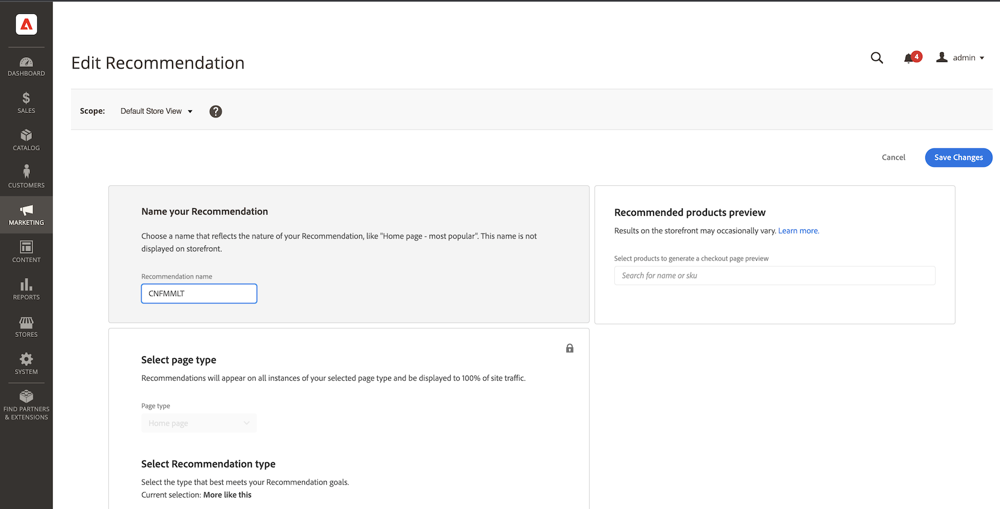
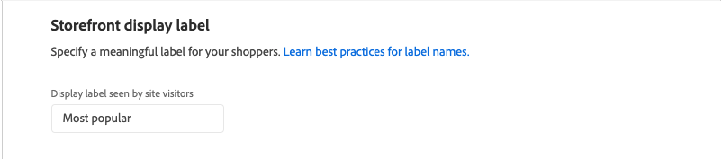
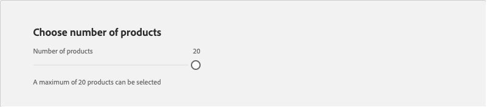
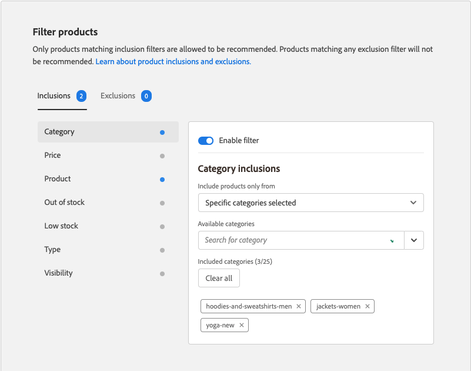

# レコメンデーションを編集

レコメンデーションを編集ページでは、レコメンデーションを構成する個々の設定を調整できます。 ページタイプとレコメンデーションタイプを除くすべての設定を編集できます。 次の設定を編集できます。

- [推奨事項の名前](#name)
- [ストアフロントラベル](#label)
- [製品数](#number)
- [配置と位置](#placement)
- [商品を絞り込む](#filters)

ページの右側のプレビューには、現在の設定を含むレコメンデーションがストアフロントにどのように表示されるかが示されます。 ページを下にスクロールしても、_おすすめ商品のプレビュー_&#x200B;は引き続き参照用に表示されます。 プレビューには、返された各製品のサムネイル製品画像、製品名、SKU、価格、結果タイプが表示されます。 結果タイプは、レコメンデーションを生成するのに十分な主要な行動データがあるかどうか、またはバックアップ行動データを使用しているかどうかを示します。

## レコメンデーションを編集

1. _管理者_ サイドバーで、**マーケティング** > _プロモーション_ > **製品レコメンデーション**&#x200B;に移動します。

1. 編集するレコメンデーションを選択します。

1. **編集**&#x200B;をクリックします。 次に、以下の手順に従って必要な変更を加えます。

1. 完了したら、**変更を保存**&#x200B;をクリックします。

### 推奨事項の名前 {#name}

レコメンデーションの目的を示すわかりやすい名前を選択します。 名前は内部参照用で、ストアフロントには表示されません。

### ストアフロントラベル {#label}

ストアフロントのレコメンデーションユニットのラベルとして使用するテキストを入力します。

### 製品数 {#number}

レコメンデーションユニットに最大20個の商品を表示するには、スライダーを調整します。

### 配置と位置 {#placement}

1. レコメンデーションユニットをストアフロントに表示するページの場所を選択します。

   - メインコンテンツの下部に
   - メインコンテンツの上部

   

1. ユニットに含まれるレコメンデーションの順序を変更するには、**移動**  コントロールを使用して、レコメンデーションを位置にドラッグします。

   

### 商品を絞り込む {#filters}

製品[&#x200B; フィルター](filters.md)に加えられた変更は、_おすすめ製品プレビュー_&#x200B;に反映されます。 インクルージョンフィルターに一致する製品のみを推奨できます。 除外フィルターに一致する製品はお勧めしません。

「_インクルージョン_」タブと「_除外_」タブには、各タイプの使用可能なフィルターが一覧表示されます。 リストでは、アクティブな各フィルターに青いドットが付いています。

- 各フィルターの詳細を表示するには、フィルター名をクリックします。
- フィルターのステータスを変更するには、**フィルターを有効にする** トグルを`on`または`off`の位置に設定します。

フィルター設定は、レコメンデーションユニットに含める製品または除外する製品を記述します。 例えば、_カテゴリ_ フィルターの包含設定では、選択したカテゴリの製品のみを含めるようにシステムに指示します。

