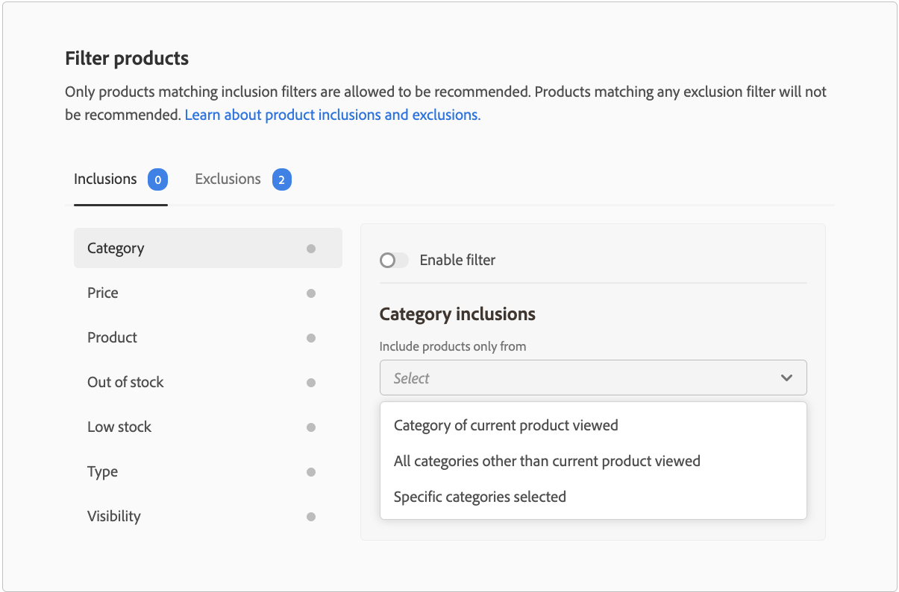

# 商品を絞り込む

Adobe Commerceは、設定不可能なデフォルトフィルターをレコメンデーション単位に自動的に適用します。 1つのページに複数のレコメンデーションユニットがデプロイされている場合、Adobe Commerceは、ユニット内で繰り返される商品をフィルタリングします。 繰り返し使用される製品に対する最初の参照のみが使用され、他の製品を推奨する余地が生まれます。 また、Adobe Commerceでは、以前に購入した商品やカートに入っている商品もフィルタリングします。

レコメンデーションユニットを[作成](create.md)する場合、どの製品をレコメンデーションに表示できるかを制御するフィルターを定義できます。 これらのフィルターは、定義した一連の包含条件または除外条件に基づいています。 すべての包含条件に一致する製品のみがレコメンデーションに表示されます。 いずれかの除外条件に一致する製品はお勧めしません。

複数のフィルターを設定し、各フィルターページの切り替えスイッチを選択して、必要なフィルターのみを有効にできます。 これにより、後で使用するフィルタのドラフトを作成できます。 有効なフィルターの数は、各タブに表示されます。

## 条件

条件は、静的または動的にすることができます。

- 静的条件では、既存の製品属性を使用して、ユニットに表示できる製品を決定します。 例えば、価格が$25を超える在庫商品のみが単位に表示されるように指定できます。 静的条件は、すべてのページタイプで使用できます。

- 動的条件は、現在表示されているカテゴリーや商品など、買い物客の現在のコンテキストを明らかにします。 例えば、製品詳細ページにデプロイする製品レコメンデーションを作成する場合、現在表示されている製品の相対的な価格範囲内にある製品のみをレコメンデーションする条件を作成できます。 動的条件は、ホームページを除くすべてのページタイプと、ページビルダーに配置されたレコメンデーションを含むページで使用できます。

### 論理演算子

論理演算子`AND`と`OR`は、複数の条件を結合するために使用されます。 包含フィルターと除外フィルターの両方を使用する場合、最初に包含を評価して、推奨できる可能性のあるすべての製品を決定し、次に除外フィルターに一致する製品をリストから削除します。

- `AND` - 2つの包含フィルター条件を結合します
- `OR` - 2つの除外フィルター条件を結合します

>[!NOTE]
>
> 包含フィルターと除外フィルターは、バージョン 3.2.2以降の`magento/product-recommendations` モジュールの従来のカテゴリの除外に置き換わります。 Adobe Commerce リリースについて詳しくは、[&#x200B; リリースノート &#x200B;](release-notes.md)を参照してください。

## フィルターの種類 {#filtertypes}

### カテゴリ

カテゴリに基づいて製品をフィルタリングします。 カテゴリフィルターでは、直接カテゴリの割り当てとそのサブカテゴリを使用します。 例えば、カテゴリ `Gear`の除外条件を有効にすると、`Gear`に割り当てられた製品と、`Gear/Bags`や`Gear/Fitness Equipment`などのすべてのサブカテゴリが除外されます。 同じことが、カテゴリの包含フィルターにも当てはまります。 例えば、カテゴリ `Gear`の包含条件を有効にすると、`Gear`に割り当てられた製品とそのすべてのサブカテゴリ（`Gear/Bags`や`Gear/Fitness Equipment`など）が含まれます。

カテゴリフィールドには、現在のストアビューに属するカテゴリが表示されます。

>[!NOTE]
>
>B2B マーチャントの場合、カテゴリーフィルターは、設定した[顧客固有の製品カテゴリ &#x200B;](https://experienceleague.adobe.com/docs/commerce-admin/catalog/categories/category-permissions.html)に準拠します。

Adobe Commerceでは、ページタイプにレコメンデーションをデプロイする際に、次のカテゴリーフィルター設定を使用することをお勧めします。

| ページ | フィルター条件 |
|---|---|
| ホーム | 商品をフィルタリングしない。 |
| カテゴリ | 特定のカテゴリの製品をフィルタリングします。 |
| 商品詳細 | 同じカテゴリの商品をフィルタリングします。 |
| 買い物かご | カート内の商品カテゴリをフィルタリングします。 |
| 注文確認 | 購入した商品のカテゴリーをフィルタリング。 |

### 製品

製品フィルターは、レコメンデーションに表示する対象となる特定の製品または対象外の製品を指定します。 無効になっている製品や個別に表示されていない製品は、レコメンデーションに表示できないため、選択できません。

>[!NOTE]
>
>設定可能な製品の子製品は、推奨単位に表示されません。これらの子製品には、_個別に表示されない_&#x200B;という表示があります。

### タイプ

製品タイプに基づくフィルターには、特定のタイプのすべての製品が含まれるか、除外されます。 サポートされているタイプは、_simple_、_configurable_、_virtual_、_downloadable_、または&#x200B;_ギフトカード_&#x200B;です。 _バンドル_、_グループ化_、カスタム製品タイプはサポートされていません。

### 表示

_カタログ_、_検索_、またはその両方など、表示に基づいて製品をフィルタリングします。

### 価格

商品価格に基づくフィルターは、最終価格を使用して比較を実行します。 最終価格には、匿名の買い物客が利用できる割引が含まれています。 B2B マーチャントの場合、表示される価格は、設定した[顧客固有のグループ価格](https://experienceleague.adobe.com/docs/commerce-admin/catalog/products/pricing/pricing-advanced.html)を反映しています。

### ストックステータス

在庫状況に基づいて商品を除外するには、次の除外フィルターを使用できます。

- 在庫切れ – （除外のみ）在庫切れの商品を除外します。
- 在庫が少ない – （除外のみ）在庫が少ない商品を除外します。 在庫状況が低い場合は、[在庫構成](https://experienceleague.adobe.com/docs/commerce-admin/config/catalog/inventory.html)の&#x200B;_左しきい値_&#x200B;のみです。
