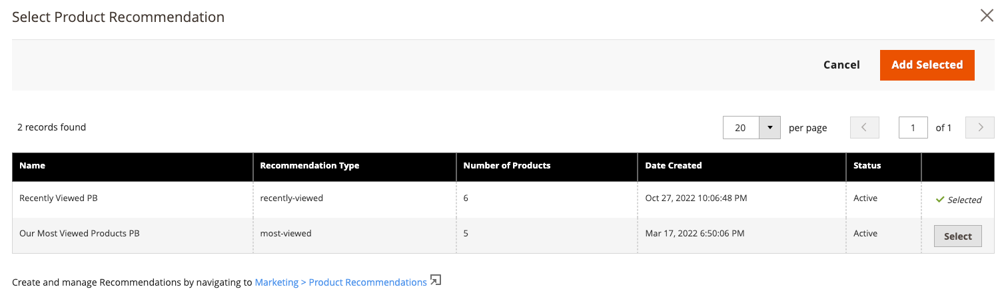

# [!DNL Page Builder]統合

商品レコメンデーションは、サイトにデプロイするあらゆるページビルダーコンテンツに統合できます。

>[!NOTE]
>
> ネイティブページビルダーページには、最大25個のレコメンデーションユニットを設定できます。 非ネイティブページビルダーページには、最大5つのレコメンデーションユニットを含めることができます。 詳しくは、[新しいレコメンデーションの作成](create.md)を参照してください。

## ページビルダーコンテンツでの商品レコメンデーションの使用

1. Web サイトのデフォルトのストアビューで、Recommendation ユニットを作成します。 異なるストアビューで使用する場合でも、デフォルトのストアビューで作成する必要があります。

   >[!NOTE]
   >
   >ページビルダーのレコメンデーションユニットの指標は、デフォルトのストアビュー[!DNL Product Recommendations] ワークスペースにのみ表示されます。 デフォルトのストアビューではないストアビューにページビルダーのレコメンデーションユニットを配置しても、それらのページビルダーのレコメンデーションユニットに関連する指標は、デフォルト以外のストアビュー[!DNL Product Recommendations] ワークスペースに表示されません。 デフォルト以外のストアビュー[!DNL Product Recommendations] ワークスペースでページビルダーの指標を表示するには、デフォルト以外のストアビューでページビルダーのレコメンデーションユニットを[編集](edit.md)して開き、[!UICONTROL **保存**]&#x200B;をクリックします。 ページビルダー指標が、デフォルト以外のストアビューの下の[!DNL Product Recommendations] ワークスペースに表示されるようになりました。

1. ページビルダーで、商品レコメンデーション コンテンツウィジェットを選択し、サイトに配置します。

1. 「**商品レコメンデーションを編集**」をクリックします
1. **選択**&#x200B;をクリック
1. 以前に作成したレコメンデーションユニットを選択し、**選択済みを追加**&#x200B;をクリックします

1. ページビルダーのコンテンツに他の編集を加え、変更を保存します。

レンダリング時に、ページビルダーコンテンツのコンテキストと範囲がRecommendation単位によって尊重されます。
