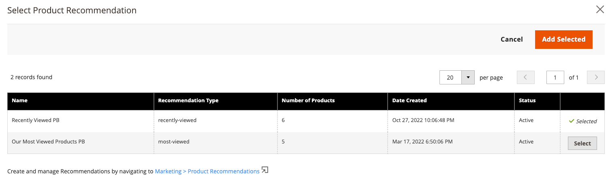

# [!DNL Page Builder] 統合

製品Recommendationsは、サイトでデプロイ任意の ページ Builder 内容内に統合できます。

>[!NOTE]
>
> ネイティブ ページ Builder ページには、最大 25 台のレコメンデーションユニットを搭載できます。 ネイティブ 以外の ページ Builder ページには、最大で 5 つのレコメンデーション単位を含めることができます。 詳細については [新規作成 Recommendations ](create.md) を参照してください。

## ページ Builder でのプロダクトRecommendationsの使用 内容

1. Web サイトのデフォルトストア表示のレコメンデーション単位作成。 異なるストアビューで使用する場合は、デフォルトのストア表示均等で作成する必要があります。

   >[!NOTE]
   >
   >ページビルダーの レコメンデーション 単位の指標は、デフォルトストア表示 [!DNL Product Recommendations] ワークスペースにのみ表示されます。 デフォルトのストア表示ではないストア表示にページビルダーレコメンデーションユニットを配置した場合でも、それらのページビルダーレコメンデーションユニットに関連する指標は、デフォルト以外のストア表示 [!DNL Product Recommendations] ワークスペースには表示されません。 デフォルト以外のストア表示 [!DNL Product Recommendations] ワークスペースでページビルダーの指標を表示するには、デフォルト以外のストア表示でページビルダーレコメンデーションユニットを開いて [編集](edit.md) し、[ [!UICONTROL **保存**]] をクリックします。 ページビルダーの指標が、 [!DNL Product Recommendations] ワークスペースのデフォルト以外のストアビューの下に表示されるようになりました。

1. ページビルダーで、製品Recommendations内容ウィジェットを選択し、サイトに配置します。

1. 「 **編集製品レコメンデーション」をクリックします。**
1. 「 **選択」をクリックします。**
1. 以前に作成したレコメンデーションユニットを選択し、「 **をクリックします追加 選択済み**

1. ページビルダー内容にその他の編集を加えて、変更を保存します。

レンダリング時には、ページビルダー内容のコンテキストと範囲がレコメンデーションユニットによって考慮されます。
