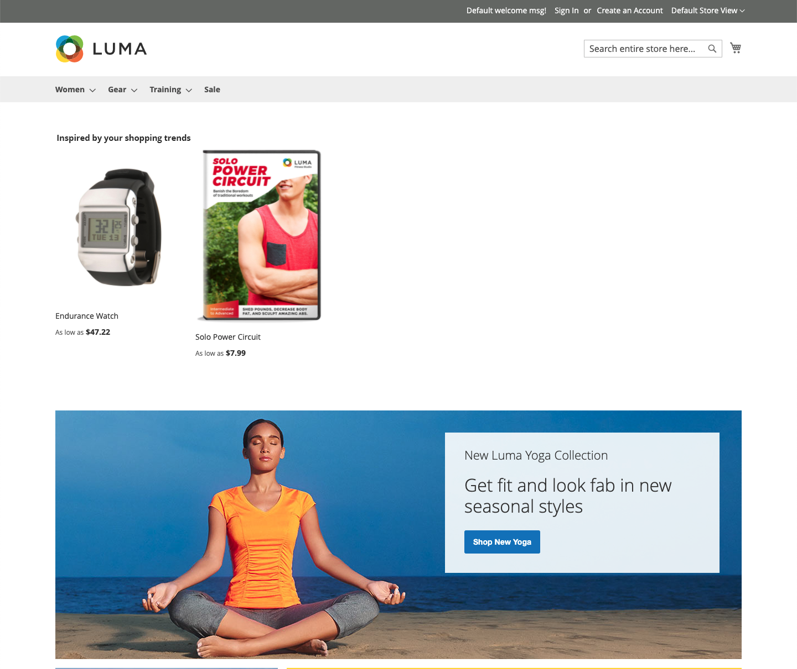

# 配置とラベル

レコメンデーションタイプは多数ありますが、どのタイプを各ページで採用すべきですか？ どこから始めればよいかわからない場合は、次のことをお試しください。

| ページ | レコメンデーションタイプ |
|---|---|
| ホームページ | `Recommended for you` |
| 製品ページ | `Viewed this, viewed that` |
| 買い物かご | `Bought this, bought that` |

[指標](workspace.md)を追跡し、必要に応じて調整できます。 ここで重要な点は、実験です。

一部のストアフロントページでは、レコメンデーションを配置する場所を制限しています。 レコメンデーションは、次のいずれかのページの場所に配置できます。 詳しくは、以下の表を参照してください。

- メインコンテンツの上部 – レコメンデーションは、上部のナビゲーションバーのすぐ下のメインコンテンツ領域の上に表示されます。
- メインコンテンツの下部（デフォルト） – レコメンデーションは、メインコンテンツ領域の下、および&#x200B;_関連製品_&#x200B;など、ページ上の他のコンテンツブロックの前に表示されます。

_ホームページ上部のレコメンデーション_

## レコメンデーションラベル

ストアフロントのレコメンデーションに割り当てられたラベルは、買い物客がそれらのレコメンデーションをどのように解釈するかに影響します。 以下のラベルは、レコメンデーションのタイプごとに頻繁に使用されます。

_検索結果の上位のレコメンデーション_

| レコメンデーションタイプ | 推奨ラベル |
|---|---|
| 最も閲覧された 最もカートに追加された商品 最も購入された商品  コンバージョン （カートに表示）   コンバージョン （購入に表示） | 最も人気のあるアイテム  人気のあるアイテム   トレンド  現在人気のあるアイテム  最近人気のあるアイテム  このアイテム（PDP）から着想を得た人気アイテム  売れ筋 興味があるかもしれません |
| あなたにおすすめ | あなただけのために あなたにおすすめ お買い物のトレンドからインスピレーションを得て |
| Viewed This, Viewed That | このアイテムを閲覧したお客様も お客様も 関連アイテムを閲覧しました |
| 「これを見て、買った」 | 最終的に購入したお客様 最終的に購入したお客様 この商品を閲覧した後、他のユーザーは何を購入しますか？ |
| 「これを買った、買った」 | 必要なものをすべて入手する これらのことを忘れないでください 頻繁に一緒に購入 |
| さらに | この のような項目が他にもあります |
| 汎用 | また、 買い物客も 同様のオプション  関連アイテムが気に入ったかもしれません |
| トレンド | トレンド   トレンド情報 最近トレンド情報 注目アイテム   トレンド関連商品（PDP） |
| 最近表示した項目 | 最近閲覧した 別のページを見る |

## サポートされているレコメンデーション （ページ別）

次の表に、レコメンデーションを配置できるストアフロントページと、各ページで許可されるレコメンデーションタイプを示します。

| ページ | 配置の推奨事項 | タイプ |
|---|---|---|
| ホームページ | メインコンテンツの上部  メインコンテンツの下部（デフォルト） | 最も閲覧された商品 最も購入された商品 最もカートに追加された商品 あなたにおすすめ  トレンド |
| カテゴリ | メインコンテンツの上部  メインコンテンツの下部（デフォルト） | 最も閲覧された商品 最も購入された商品 最もカートに追加された商品 あなたにおすすめ  トレンド |
| 商品詳細 | メインコンテンツの下部（デフォルト） | 最も閲覧された 最も購入された商品 最も購入された商品 これを閲覧した商品、 閲覧した商品、 購入した商品、 購入した商品など  トレンド  視覚的な類似性 |
| 買い物かご | メインコンテンツの下部（デフォルト） | 最も閲覧された 最も購入された商品 最も購入された商品 これを閲覧した商品、 これを閲覧した商品、 これを購入した商品、 追加商品  トレンド |
| 確認 | メインコンテンツの下部（デフォルト） | 最も閲覧された 最も購入された商品 最も購入された商品 これを閲覧した商品、 これを閲覧した商品、 これを購入した商品、 追加商品  トレンド |
| ページビルダー | [&#x200B; ドラッグ&amp;ドロップ &#x200B;](https://experienceleague.adobe.com/docs/commerce-admin/page-builder/add-content/recommendations.html)でコンテンツの種類を配置 | 最も閲覧された商品 最も購入された商品 最もカートに追加された商品 あなたにおすすめ  トレンド |
