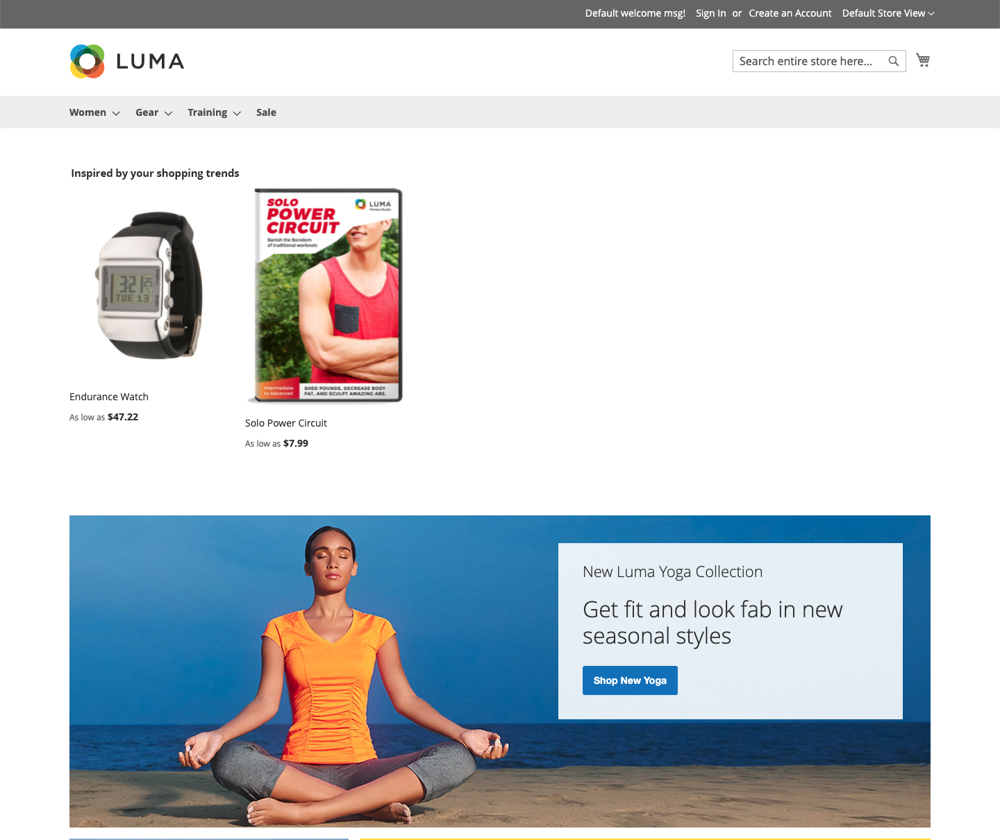

# 配置とラベル

レコメンデーションタイプの選択肢が多い中で、各ページでどちらを使用する必要がありますか？ どこから始めればよいかわからない場合は、次の手順を試してください。

| ページ | レコメンデーションタイプ |
|---|---|
| ホームページ | `Recommended for you` |
| 製品ページ | `Viewed this, viewed that` |
| カート | `Bought this, bought that` |

[ 指標 ](workspace.md) を追跡し、必要に応じて調整できます。 実験が重要であることを忘れないでください。

一部のストアフロントページでは、レコメンデーションを配置できる場所が制限されています。 レコメンデーションは、次のいずれかのページに配置できます。 詳しくは、次の表を参照してください。

- メインコンテンツの上部で – レコメンデーションは、上部のナビゲーションバーのすぐ下にあるメインコンテンツ領域の上に表示されます。
- メインコンテンツの下部（デフォルト） – レコメンデーションは、メインコンテンツ領域の下、およびページ上の他のコンテンツブロック（_関連製品_ の前に表示されます。

_ホームページ上部での推奨事項_

## 推奨ラベル

ストアフロントでレコメンデーションに割り当てられるラベルは、買い物客が自分への関連性をどのように解釈するかに影響します。 次のラベルは、レコメンデーションのタイプごとに頻繁に使用されます。

_検索結果上位のレコメンデーション_

| レコメンデーションタイプ | 推奨ラベル |
|---|---|
| 最も多く閲覧された   最も多く買い物かごに追加された   最も多く購入された   コンバージョン（買い物かごに表示）   コンバージョン（購入に表示） | 一番人気   人気アイテム   トレンド   今人気   最近人気   このアイテムからインスピレーションを得た人気アイテム（PDP）   トップセラー   興味があるかもしれません |
| あなたにお勧め | あなたのためだけに   あなたにおすすめ   あなたのショッピングトレンドに触発された |
| がこれを表示し、が表示されました | この項目を閲覧した顧客も閲覧   顧客も関連項目を閲覧   ました |
| これを表示し、それを購入 | これを最終的に閲覧した顧客   最終的に購入した顧客   このアイテムを閲覧した後、他のユーザーは何を購入しますか？ |
| これを買って、それを買った | 必要なものすべてを手に入れる   忘れないで   よく一緒に購入 |
| その他の関連リソース | このような項目がこれ   類似しているその他 |
| 汎用 | また、いいね   買い物客も   類似したオプション   関連アイテム |
| トレンド | トレンド   現在のトレンド   最近のトレンド   注目のアイテム   トレンド関連製品（PDP） |
| 最近表示された項目 | 最近表示された   もう一度見る |

## ページ別にサポートされるレコメンデーション

次の表に、各ページで許可されているレコメンデーションとレコメンデーションタイプを配置できるストアフロントページを示します。

| ページ | プレースメントの推奨事項 | タイプ |
|---|---|---|
| ホームページ | メインコンテンツの上部   メインコンテンツの下部（デフォルト） | 最も多く閲覧された   最も多く購入された   最も多く買い物かごに追加された   あなたにお勧め   トレンド |
| カテゴリ | メインコンテンツの上部   メインコンテンツの下部（デフォルト） | 最も多く閲覧された   最も多く購入された   最も多く買い物かごに追加された   あなたにお勧め   トレンド |
| 製品詳細 | メインコンテンツの下部（デフォルト） | 最も多く閲覧された   最も多く購入された   買い物かごに追加された   これを閲覧した、これを閲覧した   これを購入した、これを購入した   これを購入した、さらに   この   トレンド   視覚的類似性を購入した |
| カート | メインコンテンツの下部（デフォルト） | 最も多く閲覧された   最も多く購入された   買い物かごに追加された   これを閲覧した、これを閲覧した   これを購入した、これを購入した   これを購入した   さらに詳しくはこちらから   トレンド分析 |
| 確認 | メインコンテンツの下部（デフォルト） | 最も多く閲覧された   最も多く購入された   買い物かごに追加された   これを閲覧した、これを閲覧した   これを購入した、これを購入した   これを購入した   さらに詳しくはこちらから   トレンド分析 |
| ページビルダー | [ ドラッグ&amp;ドロップ ](https://experienceleague.adobe.com/docs/commerce-admin/page-builder/add-content/recommendations.html) してコンテンツタイプを配置します | 最も多く閲覧された   最も多く購入された   最も多く買い物かごに追加された   あなたにお勧め   トレンド |
