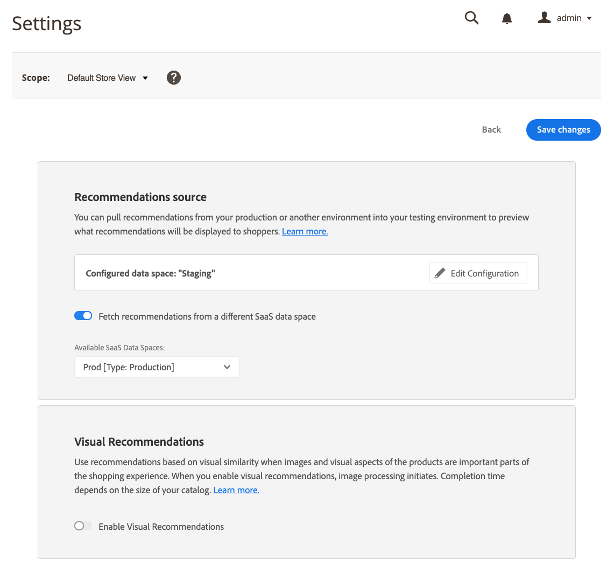

# 設定

Recommendations用に[SaaS データスペース &#x200B;](../landing/saas.md#saas-configuration)を設定すると、SaaS データスペースはカタログデータとストアフロント行動データを収集します。 [Adobe AI](https://business.adobe.com/ai.html)は、そのデータを分析し、商品レコメンデーションを提供するために使用される商品の関連付けを計算します。

テストやステージングを行う本番以外の環境では、通常、現実的な商品レコメンデーションを提供するためのストアフロントの行動データの量や品質は確保されていません。 実際の買い物客の大規模な行動は、本番環境でのみキャプチャできます。 この課題を解決するために、Adobe Commerceでは、本番環境の商品レコメンデーションを、本番以外のSaaS データスペースと組み合わせて使用することができます。 実稼動以外の環境で実際のストアフロントデータを使用すると、買い物客に表示されるレコメンデーションをプレビューし、さまざまなレコメンデーションタイプやプレースメントの場所を試すことができます。 異なるSaaS データスペースからのレコメンデーションは、買い物客がプレビューすることはできますが、クリックすることはありません。

ステージング注文は、ステージング `environmentId`を使用して記録されます。 本番データには影響しません。 実稼動データは、`alternateEnvironmentId`を使用して取得されます。

>[!NOTE]
>
>RESTを通じて製品レコメンデーションを使用する場合、`alternateEnvironmentId` パラメーターを使用して他のデータスペースを指定できます。 [GraphQL](https://developer.adobe.com/commerce/webapi/graphql/schema/product-recommendations/queries/recommendations/)を通じて商品レコメンデーションを使用する場合、このパラメーターは使用できません。

## レコメンデーションソースを選択

商品レコメンデーションデータのソースを変更するには、使用する行動データが格納されているSaaS データスペースを選択します。 始める前に、次のことを確認してください。

- ストアフロントデータの収集は、実稼動環境に対して[設定および有効化](install-configure.md)し、行動データがAdobe Commerceに送信されていることを[確認](https://developer.adobe.com/commerce/services/shared-services/storefront-events/collector/verify/)する必要があります。
- 実稼動以外の環境カタログは、実稼動カタログと基本的に同じにする必要があります。 類似のカタログを使用することで、返品された商品レコメンデーションユニットが本番環境のユニットとほぼ同じであることを確認できます。

1. 実稼動以外のAdobe Commerce環境の管理者にログインします。

1. _管理者_ サイドバーで、**マーケティング** > _プロモーション_ > **製品レコメンデーション**&#x200B;に移動します。

1. **設定**&#x200B;をクリックします。

   
   _設定_

1. 「_Recommendations ソース_」セクションで、別のSaaS データ空間&#x200B;**から** Recommendationsを取得オプションを有効にします。 _Recommendations ソース_ セクションは、実稼動以外の環境でのみ表示されます。

   使用可能な&#x200B;_SaaS データスペース_&#x200B;のリストが表示されます。

   
   _設定_

1. 買い物客データを使用するSaaS データスペースを選択します。

1. 「**変更を保存**」をクリックします。

   Adobe Commerceは、選択したデータスペースからレコメンデーションを取得するようになりました。

   >[!NOTE]
   >
   > 実稼動以外のストアフロントの別のSaaS データスペースから取得したレコメンデーションを表示することはできますが、レコメンデーションをクリックすることはできません。

### 新しいSaaS データスペースの設定

1. Recommendations ソースセクションで、**設定の編集**&#x200B;をクリックします。

1. 手順に従って、新しい[[!DNL Commerce]  サービス &#x200B;](/help/landing/saas.md)を設定します。

## 視覚的なレコメンデーションの有効化

[Visual Product Recommendations](install-configure.md) モジュールがインストールされている場合、[Visual Similarity](type.md#visualsim)のレコメンデーションタイプを使用するには、Visual Recommendationsを有効にする必要があります。

_ビジュアルレコメンデーション_ セクションで、**ビジュアルレコメンデーションを有効にする**&#x200B;をアクティブな位置に設定します。
